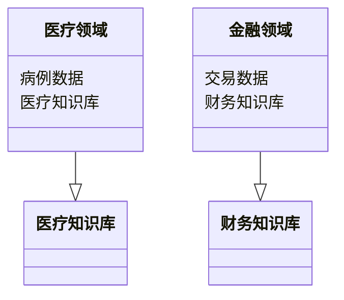
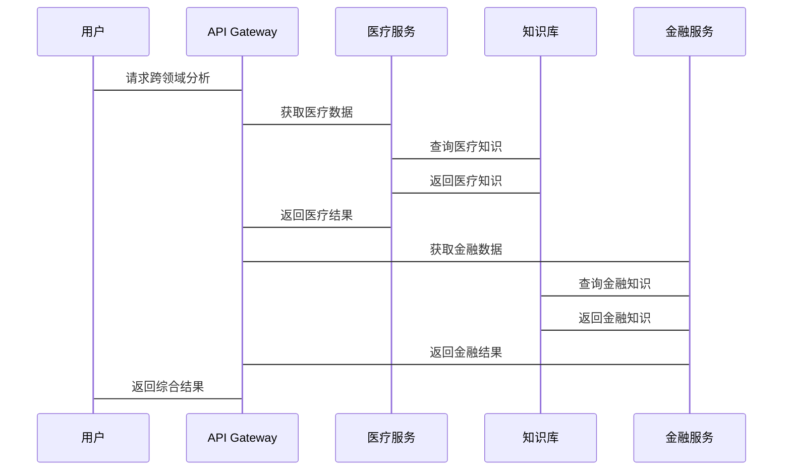

                 


# 开发具有跨领域知识迁移能力的AI Agent

## 关键词
跨领域知识迁移, AI Agent, 知识迁移算法, 对比学习, 系统架构设计, 项目实战

## 摘要
本书深入探讨了开发具有跨领域知识迁移能力的AI Agent的关键技术。从背景介绍到核心概念，从算法原理到系统架构设计，再到项目实战，全面解析了AI Agent在不同领域间有效迁移知识的方法。通过详细分析对比学习算法、知识图谱构建、跨领域推理等技术，结合实际案例，帮助读者掌握开发跨领域知识迁移AI Agent的技能。

---

# 第一部分: 背景介绍

## 第1章: 跨领域知识迁移的背景与问题

### 1.1 问题背景
#### 1.1.1 人工智能的发展现状
人工智能技术近年来取得了显著进展，但在跨领域知识迁移方面仍面临挑战。AI Agent需要在不同领域之间高效地迁移知识，以解决复杂问题。

#### 1.1.2 跨领域知识迁移的必要性
跨领域知识迁移能够使AI Agent在医疗、金融、教育等多个领域中灵活应用，提升其解决问题的能力。

#### 1.1.3 当前AI Agent的局限性
当前AI Agent通常局限于单一领域，难以应对跨领域的问题，导致其应用范围受限。

### 1.2 问题描述
#### 1.2.1 跨领域知识迁移的核心问题
AI Agent需要在不同领域之间提取和应用知识，克服领域间数据和语义差异的挑战。

#### 1.2.2 AI Agent在跨领域应用中的挑战
包括领域适配困难、知识表示多样性、跨领域推理复杂性等问题。

#### 1.2.3 知识迁移的边界与外延
明确知识迁移的适用范围和限制，避免超出实际能力的应用。

### 1.3 问题解决
#### 1.3.1 知识迁移的方法论
通过对比学习、知识图谱构建等方法实现跨领域知识迁移。

#### 1.3.2 跨领域知识迁移的实现路径
包括数据预处理、特征提取、模型训练、推理优化等步骤。

#### 1.3.3 AI Agent的设计原则
强调模块化设计、领域适配能力和通用推理能力的重要性。

### 1.4 概念结构与核心要素
#### 1.4.1 跨领域知识迁移的核心要素
包括跨领域数据、知识表示、迁移算法等关键要素。

#### 1.4.2 AI Agent的组成结构
由知识库、推理引擎、交互界面等模块组成，支持跨领域应用。

#### 1.4.3 知识迁移的实现机制
通过特征提取、对比学习等技术实现知识的跨领域迁移。

---

## 第2章: 跨领域知识迁移的核心概念

### 2.1 知识迁移的原理
#### 2.1.1 跨领域知识迁移的基本原理
通过提取通用特征和领域特定特征，实现跨领域知识的迁移。

#### 2.1.2 知识表示与推理
采用符号表示、向量表示等方法，构建跨领域的知识图谱。

#### 2.1.3 跨领域数据的特征提取
利用深度学习模型提取跨领域数据的共享特征。

### 2.2 跨领域知识迁移的实现方法
#### 2.2.1 基于特征的迁移学习
通过提取共享特征，减少领域间数据差异。

#### 2.2.2 基于模型的迁移学习
利用预训练模型，适应不同领域的任务需求。

#### 2.2.3 对比学习在知识遷移中的应用
通过对比损失函数，优化跨领域数据的表示。

### 2.3 跨领域知识迁移的数学模型
#### 2.3.1 对比学习的数学表达
$$ L_{contrast} = \frac{1}{|B|} \sum_{(x_i, x_j) \in B} \mathcal{L}(x_i, x_j) $$
其中，$B$是正样本对集合，$\mathcal{L}$是对比损失函数。

#### 2.3.2 知识图谱的构建与表示
通过图嵌入方法，将知识图谱中的实体和关系表示为低维向量。

#### 2.3.3 跨领域推理的数学模型
使用逻辑推理或概率推理方法，实现跨领域的知识推理。

---

## 第3章: 跨领域知识迁移的算法原理

### 3.1 跨领域知识迁移的算法原理
#### 3.1.1 对比学习算法
对比学习通过最大化正样本对的相似性和最小化负样本对的相似性，实现跨领域数据的对齐。

#### 3.1.2 知识图谱构建算法
基于图神经网络，构建跨领域的知识图谱，支持跨领域推理。

#### 3.1.3 跨领域推理算法
通过多任务学习或迁移学习，优化跨领域的推理模型。

### 3.2 跨领域知识迁移的对比分析
#### 3.2.1 跨领域与单一领域特征对比
| 特征类型 | 单一领域 | 跨领域 |
|----------|----------|---------|
| 特征维度 | 高       | 中       |
| 领域适应性 | 好       | 差       |

#### 3.2.2 跨领域与领域内推理对比
| 推理类型 | 领域内推理 | 跨领域推理 |
|----------|------------|-----------|
| 需求复杂度 | 低         | 高         |
| 需要领域知识 | 高         | 高         |

#### 3.2.3 跨领域知识迁移的实现机制
通过对比学习、领域适配等技术，实现跨领域的知识迁移。

### 3.3 跨领域知识迁移的数学模型
#### 3.3.1 对比学习的流程
1. 数据预处理：将不同领域的数据对齐。
2. 特征提取：使用深度学习模型提取特征。
3. 对比损失计算：优化模型参数，最小化对比损失。

---

## 第4章: 跨领域知识迁移的系统分析与架构设计

### 4.1 问题场景介绍
#### 4.1.1 背景介绍
AI Agent需要在医疗和金融领域之间迁移知识，解决跨领域问题。

#### 4.1.2 项目介绍
设计一个能够理解医疗数据并应用于金融分析的AI Agent。

### 4.2 系统功能设计
#### 4.2.1 领域模型设计
使用Mermaid绘制类图，展示医疗和金融领域的实体及其关系。



#### 4.2.2 系统架构设计
使用微服务架构，模块化设计，便于跨领域功能的扩展。


#### 4.2.3 系统接口设计
定义RESTful API接口，实现跨领域数据的交互。

#### 4.2.4 系统交互设计
使用Mermaid绘制序列图，展示用户与AI Agent的交互流程。



---

## 第5章: 跨领域知识迁移的项目实战

### 5.1 环境安装
#### 5.1.1 安装Python和相关库
```bash
pip install python3 python-dotenv scikit-learn tensorflow pandas numpy
```

#### 5.1.2 安装Mermaid和相关工具
安装Mermaid CLI用于生成图表。

### 5.2 系统核心实现
#### 5.2.1 数据预处理代码
```python
import pandas as pd
from sklearn.preprocessing import StandardScaler

def preprocess_data(data):
    # 数据清洗
    data = data.dropna()
    # 标准化处理
    scaler = StandardScaler()
    processed_data = scaler.fit_transform(data)
    return processed_data
```

#### 5.2.2 对比学习模型实现
```python
import tensorflow as tf
from tensorflow.keras import layers

def contrastive_model(input_dim):
    base_cnn = layers.Conv2D(32, (3,3), activation='relu', input_shape=(input_dim, input_dim, 1))
    base_cnn = layers.MaxPooling2D((2,2))(base_cnn)
    base_cnn = layers.Conv2D(64, (3,3), activation='relu')(base_cnn)
    base_cnn = layers.MaxPooling2D((2,2))(base_cnn)
    base_cnn = layers.Flatten()(base_cnn)
    base_cnn = layers.Dense(256, activation='relu')(base_cnn)
    base_cnn = layers.Dense(128, activation='relu')(base_cnn)
    return base_cnn

def contrastive_loss(y_true, y_pred):
    margin = 1.0
    loss = tf.reduce_mean(tf.square(y_true - y_pred))
    return loss
```

#### 5.2.3 知识图谱构建
使用图神经网络构建跨领域的知识图谱。

### 5.3 实际案例分析
#### 5.3.1 案例介绍
AI Agent在医疗和金融领域的实际应用案例。

#### 5.3.2 代码实现与解读
详细解读代码实现，分析关键部分的作用。

#### 5.3.3 案例分析与总结
总结案例的成功经验，提出改进建议。

### 5.4 项目小结
回顾项目实现的关键步骤，总结经验和教训，为后续开发提供参考。

---

## 第6章: 最佳实践与总结

### 6.1 最佳实践
#### 6.1.1 开发中的注意事项
强调数据质量、模型调优、持续学习的重要性。

#### 6.1.2 跨领域知识迁移的挑战与解决方案
总结跨领域知识迁移的难点及应对策略。

### 6.2 总结与展望
#### 6.2.1 全书总结
回顾全书内容，强调跨领域知识迁移的重要性和实现方法。

#### 6.2.2 未来展望
展望跨领域知识迁移技术的发展方向，提出未来的研究重点。

---

## 参考文献
[此处列出相关文献和参考资料]

---

通过以上目录大纲，我们可以系统地了解开发具有跨领域知识迁移能力的AI Agent所需的技术和方法。每个部分都深入分析了相关概念、算法和实现细节，结合实际案例，帮助读者全面掌握跨领域知识迁移的核心技术。

