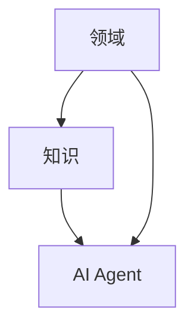
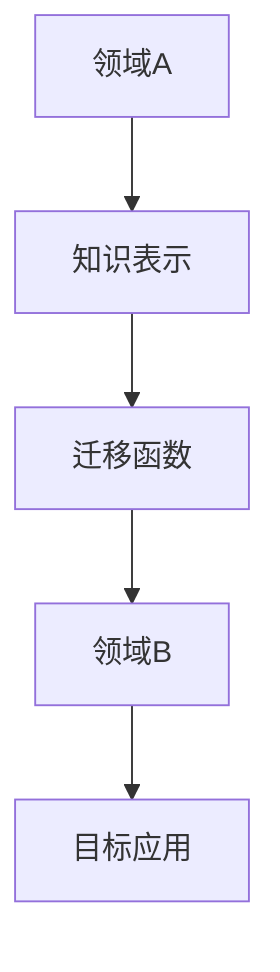
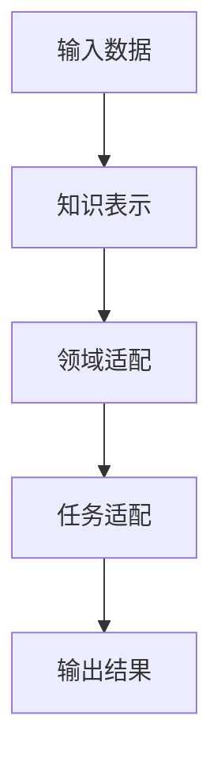
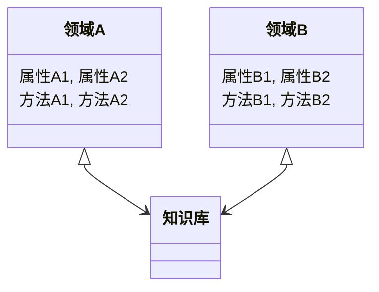
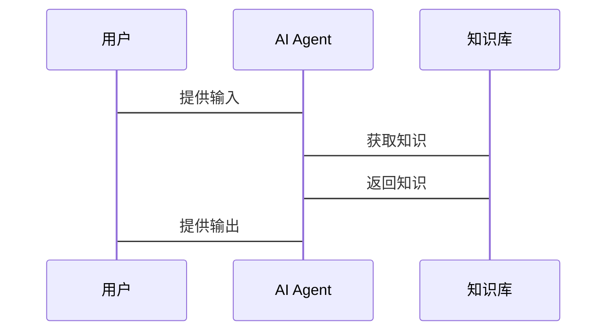

                 


# 开发具有跨领域知识迁移能力的AI Agent

## 关键词：
- AI Agent
- 跨领域知识迁移
- 多模态学习
- 迁移学习
- 知识图谱
- 多任务学习

## 摘要：
在人工智能快速发展的今天，开发具有跨领域知识迁移能力的AI Agent已成为提升智能系统综合能力的关键。本文从跨领域知识迁移的背景出发，详细探讨其核心概念、算法原理、系统架构及项目实现，通过实际案例分析，揭示如何构建能够有效迁移知识的AI Agent。文章还总结了开发中的关键点，为读者提供实践指导。

---

## 第1章: 背景介绍与核心概念

### 1.1 背景介绍

#### 1.1.1 人工智能的发展现状
人工智能（AI）技术近年来取得了显著进展，尤其是在自然语言处理、计算机视觉和机器人技术等领域。然而，现有的AI系统往往局限于单一领域，难以在不同领域之间迁移知识。跨领域知识迁移的提出，正是为了解决这一问题。

#### 1.1.2 知识迁移的必要性
知识迁移是实现更通用AI系统的关键。传统AI系统依赖大量特定领域的训练数据，而跨领域知识迁移能够减少对领域特定数据的依赖，提升模型的泛化能力。

#### 1.1.3 跨领域知识迁移的核心价值
跨领域知识迁移的核心价值在于使AI Agent能够理解并应用不同领域的知识，从而在多种应用场景中表现出色。

### 1.2 问题背景与问题描述

#### 1.2.1 AI Agent的定义与特点
AI Agent是一种智能体，能够感知环境、执行任务并做出决策。它具有自主性、反应性、目标导向性和社会性等特点。

#### 1.2.2 跨领域知识迁移的定义
跨领域知识迁移是指AI Agent能够在不同领域之间迁移知识，提升其在新领域的表现。

#### 1.2.3 问题解决的必要性与目标
现有AI系统在单一领域表现良好，但在跨领域任务中表现不佳。跨领域知识迁移的目标是提升AI Agent的通用性和适应性。

### 1.3 跨领域知识迁移的边界与外延

#### 1.3.1 知识迁移的边界
知识迁移的边界在于如何平衡源领域和目标领域的差异，避免过拟合源领域或无法适应目标领域。

#### 1.3.2 跨领域知识迁移的外延
跨领域知识迁移的外延包括多任务学习、领域适应和零样本学习等技术。

#### 1.3.3 相关概念的对比与区分
表1：相关概念的对比与区分

| 概念       | 描述                                   |
|------------|----------------------------------------|
| 跨领域知识迁移 | 在不同领域之间迁移知识               |
| 单一领域知识迁移 | 在同一领域内迁移知识                 |
| 多任务学习   | 在多个任务之间共享知识               |

### 1.4 跨领域知识迁移的概念结构与核心要素

#### 1.4.1 知识表示的基本方法
知识表示是跨领域知识迁移的基础，常用的表示方法包括符号表示、向量表示和图结构表示。

#### 1.4.2 跨领域知识迁移的结构模型
跨领域知识迁移的结构模型通常包括知识抽取、知识表示和知识应用三个阶段。

#### 1.4.3 核心概念的联系与区别
跨领域知识迁移与其他技术（如多任务学习）的联系与区别在于其强调跨领域的能力。

---

## 第2章: 跨领域知识迁移的核心概念与联系

### 2.1 知识迁移的基本原理

#### 2.1.1 知识表示的基本方法
知识表示是跨领域知识迁移的基础，常用的表示方法包括符号表示、向量表示和图结构表示。

#### 2.1.2 知识迁移的基本机制
知识迁移的基本机制包括特征提取、领域适应和任务适配。

#### 2.1.3 跨领域知识迁移的实现路径
跨领域知识迁移的实现路径包括预训练、领域适配和任务适配。

### 2.2 跨领域知识迁移的核心概念对比

#### 2.2.1 不同知识迁移方法的对比
跨领域知识迁移与其他知识迁移方法的对比，包括零样本学习、迁移学习和多任务学习。

#### 2.2.2 跨领域与领域内知识迁移的对比
跨领域知识迁移与领域内知识迁移在适用范围和实现难度上有显著差异。

#### 2.2.3 跨领域知识迁移的特征分析
跨领域知识迁移的特征包括跨领域性、通用性和适应性。

### 2.3 跨领域知识迁移的ER实体关系图



### 2.4 跨领域知识迁移的Mermaid流程图



### 2.5 本章小结

---

## 第3章: 跨领域知识迁移的算法原理

### 3.1 算法原理概述

#### 3.1.1 多任务学习
多任务学习是一种通过共享多个任务的特征来实现跨领域知识迁移的方法。

#### 3.1.2 领域适应
领域适应是通过调整模型参数，使模型能够适应不同领域。

### 3.2 算法实现细节

#### 3.2.1 知识表示的统一
知识表示的统一是跨领域知识迁移的关键，通常采用词嵌入、句嵌入或图嵌入。

#### 3.2.2 领域适配方法
领域适配方法包括对抗训练、匹配损失和领域对抗网络。

#### 3.2.3 跨领域迁移的数学模型
跨领域知识迁移的数学模型通常涉及损失函数的定义和优化。

### 3.3 算法流程图



### 3.4 数学模型与公式

#### 3.4.1 损失函数
$$ L = L_{\text{source}} + L_{\text{target}} + \lambda L_{\text{domain}} $$

#### 3.4.2 优化器
常用的优化器包括随机梯度下降（SGD）和Adam。

### 3.5 本章小结

---

## 第4章: 跨领域知识迁移的系统分析与架构设计

### 4.1 系统分析

#### 4.1.1 问题场景
跨领域知识迁移的应用场景包括医疗、教育和金融等领域。

#### 4.1.2 项目介绍
本项目旨在开发一个能够在多个领域中迁移知识的AI Agent。

### 4.2 系统功能设计

#### 4.2.1 领域模型
领域模型通过Mermaid类图展示不同领域的知识结构。



#### 4.2.2 系统架构
系统架构通过Mermaid架构图展示整体结构。

```mermaid
archiitecture
    Client --> Server
    Server --> 数据库
    Server --> 知识库
    Server --> 加工模块
```

### 4.3 系统接口设计

#### 4.3.1 接口定义
API接口包括知识表示、领域适配和任务适配。

#### 4.3.2 交互流程图
交互流程图展示用户与AI Agent的交互过程。



### 4.4 本章小结

---

## 第5章: 跨领域知识迁移的项目实战

### 5.1 环境安装

#### 5.1.1 安装Python
安装Python 3.8或更高版本。

#### 5.1.2 安装依赖库
安装TensorFlow、Keras、Scikit-learn和Mermaid。

### 5.2 系统核心实现

#### 5.2.1 知识表示实现
使用Word2Vec进行词嵌入。

#### 5.2.2 领域适配实现
采用对抗训练方法。

#### 5.2.3 任务适配实现
使用预训练模型进行迁移。

### 5.3 代码实现与解读

#### 5.3.1 核心代码
```python
def transfer_function(source_data, target_data):
    # 知识表示
    embeddings = model.encode(source_data)
    # 领域适配
    adapted_embeddings = adapter(embeddings)
    # 任务适配
    result = predictor(adapted_embeddings)
    return result
```

#### 5.3.2 代码解读
代码首先进行知识表示，然后进行领域适配，最后进行任务适配。

### 5.4 案例分析与详细讲解

#### 5.4.1 案例分析
以医疗和教育领域的知识迁移为例，展示模型的迁移能力。

#### 5.4.2 实际应用
跨领域知识迁移在智能客服中的应用。

### 5.5 本章小结

---

## 第6章: 总结与展望

### 6.1 本章总结

#### 6.1.1 核心内容回顾
回顾本文的核心内容，包括背景、概念、算法和系统设计。

#### 6.1.2 关键点总结
总结跨领域知识迁移的关键点，包括知识表示、领域适配和任务适配。

### 6.2 未来展望

#### 6.2.1 技术发展
未来技术的发展方向包括更高效的知识表示方法和更强大的领域适配算法。

#### 6.2.2 应用场景
跨领域知识迁移将在更多领域得到应用，如智能制造和智慧城市。

### 6.3 注意事项

#### 6.3.1 开发中的注意事项
在开发中需要注意领域差异和数据质量。

#### 6.3.2 使用中的注意事项
在使用中需要关注模型的可解释性和鲁棒性。

### 6.4 拓展阅读

#### 6.4.1 推荐书籍
推荐《迁移学习》和《多任务学习》。

#### 6.4.2 推荐论文
推荐几篇经典的跨领域知识迁移论文。

### 6.5 本章小结

---

# 结语

开发具有跨领域知识迁移能力的AI Agent是一项具有挑战性但又极具价值的工作。通过本文的详细探讨，我们了解了其背景、概念、算法和系统设计，并通过实际案例展示了其应用。未来，随着技术的发展，跨领域知识迁移将在更多领域发挥重要作用。

--- 

* 文章结束 *

