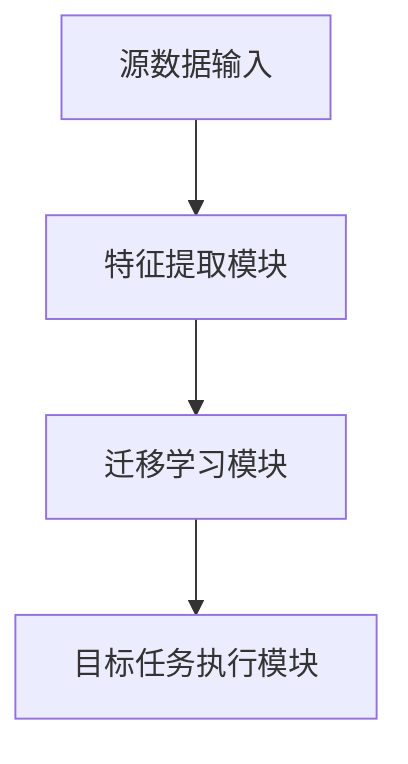
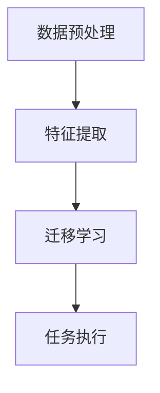

                 

<think>
好的，我将按照您的要求，分步骤、详细地撰写一篇关于《开发具有迁移学习能力的AI Agent》的技术博客文章。首先，我会从文章的标题、关键词和摘要开始，然后逐步展开各个章节的内容。

### 第一部分：文章标题和关键词
**标题：** 开发具有迁移学习能力的AI Agent  
**关键词：** 人工智能, 迁移学习, AI Agent, 机器学习, 深度学习, 系统架构  
**摘要：** 本文深入探讨了如何在AI Agent中实现迁移学习能力，从理论基础到系统架构，再到实际项目实现，全面解析迁移学习在AI Agent中的应用与优化。通过详细的技术分析和代码示例，帮助读者理解迁移学习的核心原理，并掌握如何将其应用于实际项目中。

---

### 第二部分：正文内容

#### 第1章：迁移学习与AI Agent背景介绍

##### 1.1 迁移学习的基本概念

###### 1.1.1 机器学习与迁移学习的关系
机器学习是一种通过数据训练模型，使其能够从数据中学习并做出预测的技术。而迁移学习是一种更高级的机器学习技术，旨在利用已有的知识和经验，解决新任务或适应新环境。简单来说，迁移学习是机器学习的一种扩展，旨在减少数据依赖性，提高模型的泛化能力。

###### 1.1.2 迁移学习的核心问题背景
在传统的机器学习中，模型的训练通常需要大量的标注数据。然而，在许多实际应用场景中，获取大量标注数据的成本非常高，甚至不可行。迁移学习通过利用已有的数据集进行预训练，然后将学习到的知识迁移到目标任务中，从而减少对新数据的依赖。

###### 1.1.3 迁移学习的定义与特点
迁移学习是指在两个或多个领域之间，利用一个或多个源领域中的知识来提高目标领域模型性能的学习方法。其核心特点包括：
1. **领域适应性**：模型能够在不同领域之间进行迁移。
2. **数据高效性**：减少对目标领域数据的依赖。
3. **任务多样性**：能够处理多种任务。

##### 1.2 AI Agent的基本概念

###### 1.2.1 AI Agent的定义与分类
AI Agent（人工智能代理）是一种能够感知环境、自主决策并执行任务的智能实体。根据功能和应用场景的不同，AI Agent可以分为多种类型，例如：
- **简单反射型代理**：基于规则做出决策。
- **基于模型的反射型代理**：基于内部模型和环境信息进行决策。
- **目标驱动型代理**：根据目标进行规划和执行任务。

###### 1.2.2 AI Agent的核心功能与应用场景
AI Agent的核心功能包括：
1. **感知环境**：通过传感器或接口获取环境信息。
2. **决策与规划**：基于感知信息做出决策或规划执行步骤。
3. **执行任务**：根据决策结果执行具体的任务。

应用场景包括：
- 智能助手（如 Siri、Alexa）。
- 智能客服系统。
- 自动驾驶系统。

###### 1.2.3 迁移学习在AI Agent中的作用
在AI Agent中，迁移学习主要用于：
1. **跨场景任务迁移**：将一个场景中学到的知识迁移到另一个场景中。
2. **多任务学习**：在同一代理中同时处理多个任务。
3. **数据高效利用**：在数据不足的情况下，利用迁移学习提高模型性能。

##### 1.3 本章小结
本章主要介绍了迁移学习和AI Agent的基本概念，以及迁移学习在AI Agent中的作用。通过理解这些内容，读者可以为后续章节的学习打下坚实的基础。

---

#### 第2章：迁移学习的核心概念与原理

##### 2.1 迁移学习的理论基础

###### 2.1.1 特征表示与特征空间
在迁移学习中，特征表示是将数据转换为模型能够理解的特征向量的过程。特征空间的维度和分布直接影响模型的性能。

###### 2.1.2 任务相关性与领域适应
任务相关性是指源任务和目标任务之间的相似程度。领域适应是指将源领域中的知识迁移到目标领域时需要考虑的差异性。

###### 2.1.3 迁移学习的假设与前提
迁移学习的假设主要包括：
1. **相似任务假设**：源任务和目标任务之间具有一定的相似性。
2. **共享特征假设**：源任务和目标任务之间存在共享的特征。

##### 2.2 迁移学习的核心算法原理

###### 2.2.1 基于特征的迁移学习
基于特征的迁移学习方法主要关注特征空间的对齐。通过将源特征和目标特征对齐，使得模型能够在两个领域之间迁移。

###### 2.2.2 基于参数的迁移学习
基于参数的迁移学习方法通过共享模型参数，将源任务的参数迁移到目标任务中。这种方法适用于深度学习模型。

###### 2.2.3 对抗迁移学习与自适应迁移学习
对抗迁移学习通过引入对抗网络，使模型能够适应不同的领域分布。自适应迁移学习则通过动态调整模型参数，实现领域间的自适应。

##### 2.3 迁移学习的数学模型与公式

###### 2.3.1 基于源域和目标域的数学表示
源域和目标域的数学表示通常使用概率分布来描述：
- 源域：$P_{source}(x,y)$
- 目标域：$P_{target}(x,y)$

###### 2.3.2 参数共享与迁移矩阵的定义
参数共享是指在迁移学习中，部分参数在源任务和目标任务之间共享。迁移矩阵通常用于表示源任务对目标任务的影响程度。

###### 2.3.3 迁移损失函数的构建与优化
迁移损失函数通常包括源任务和目标任务的损失，以及迁移项的损失。例如：
$$ L = L_{source} + L_{target} + \lambda L_{transfer} $$

##### 2.4 本章小结
本章详细讲解了迁移学习的理论基础和核心算法原理，为后续章节的系统设计和项目实现奠定了理论基础。

---

#### 第3章：AI Agent的系统架构与设计

##### 3.1 AI Agent的系统架构

###### 3.1.1 基于迁移学习的AI Agent架构
基于迁移学习的AI Agent架构通常包括以下模块：
- **数据预处理模块**：对源数据和目标数据进行预处理。
- **特征提取模块**：提取特征向量。
- **迁移学习模块**：实现源任务到目标任务的迁移。
- **任务执行模块**：根据迁移后的模型执行具体任务。

###### 3.1.2 数据流与模块划分
数据流通常包括：
- 源数据输入
- 特征提取
- 迁移学习
- 目标任务执行

模块划分可以参考下图：



###### 3.1.3 系统接口与交互流程
系统接口通常包括：
- 数据输入接口
- 模型训练接口
- 任务执行接口

交互流程如下：
1. 数据预处理模块接收输入数据。
2. 特征提取模块将数据转换为特征向量。
3. 迁移学习模块利用特征向量进行模型训练。
4. 任务执行模块根据训练好的模型执行具体任务。

##### 3.2 系统功能设计

###### 3.2.1 领域模型设计
领域模型设计需要考虑源域和目标域之间的差异性，通过构建领域适配器来实现迁移。

###### 3.2.2 任务分解与模块划分
任务分解需要将目标任务分解为多个子任务，并为每个子任务分配相应的模块。

###### 3.2.3 数据预处理与特征提取
数据预处理包括数据清洗、归一化等步骤。特征提取可以通过PCA、LDA等方法实现。

##### 3.3 系统架构图
系统架构图如下：



##### 3.4 本章小结
本章详细介绍了AI Agent的系统架构与设计，重点分析了基于迁移学习的系统架构和模块划分。

---

#### 第4章：迁移学习算法的实现与优化

##### 4.1 迁移学习算法的实现流程

###### 4.1.1 数据预处理与特征提取
数据预处理包括数据清洗、归一化等步骤。特征提取可以通过PCA、LDA等方法实现。

###### 4.1.2 模型初始化与参数共享
在模型初始化阶段，需要设置参数共享的策略，例如共享全连接层的参数，而最后一层不共享。

###### 4.1.3 迁移损失函数的构建与优化
迁移损失函数需要同时考虑源任务和目标任务的损失，以及迁移项的损失。

##### 4.2 基于深度学习的迁移学习算法

###### 4.2.1 基于卷积神经网络的迁移学习
在卷积神经网络中，通常共享卷积层的参数，而全连接层的参数不共享。

###### 4.2.2 基于循环神经网络的迁移学习
在循环神经网络中，通常共享循环层的参数，而输出层的参数不共享。

###### 4.2.3 对抗迁移学习的实现与优化
对抗迁移学习通过引入对抗网络，使模型能够适应不同的领域分布。

##### 4.3 迁移学习的数学模型与公式
迁移学习的数学模型通常包括源任务和目标任务的损失，以及迁移项的损失。例如：
$$ L = L_{source} + L_{target} + \lambda L_{transfer} $$

##### 4.4 本章小结
本章详细讲解了迁移学习算法的实现与优化，重点分析了基于深度学习的迁移学习算法。

---

#### 第5章：AI Agent的项目实战

##### 5.1 项目环境与工具安装

###### 5.1.1 Python环境的配置
安装Python 3.8或更高版本。

###### 5.1.2 深度学习框架的安装与配置
安装TensorFlow或Keras框架。

###### 5.1.3 数据集的下载与预处理
下载MNIST手写数字数据集，并进行预处理。

##### 5.2 项目核心代码实现

###### 5.2.1 数据预处理与特征提取
```python
import numpy as np
from tensorflow import keras

# 加载数据集
(x_train, y_train), (x_test, y_test) = keras.datasets.mnist.load_data()

# 数据预处理
x_train = x_train.reshape(-1, 784).astype('float32') / 255.0
x_test = x_test.reshape(-1, 784).astype('float32') / 255.0
```

###### 5.2.2 模型初始化与迁移学习实现
```python
import tensorflow as tf
from tensorflow import keras

# 定义模型结构
def create_model():
    model = keras.Sequential([
        keras.layers.Dense(128, activation='relu'),
        keras.layers.Dense(10, activation='softmax')
    ])
    return model

# 初始化模型
model = create_model()

# 编译模型
model.compile(optimizer='adam', loss='sparse_categorical_crossentropy', metrics=['accuracy'])
```

###### 5.2.3 模型训练与优化
```python
# 训练模型
model.fit(x_train, y_train, epochs=10, batch_size=32, validation_data=(x_test, y_test))
```

##### 5.3 项目系统架构
项目系统架构图如下：


##### 5.4 本章小结
本章通过一个实际项目展示了迁移学习在AI Agent中的实现，重点分析了数据预处理、模型训练和任务执行的流程。

---

#### 第6章：总结与展望

##### 6.1 本章总结
通过本文的介绍，读者可以全面了解迁移学习在AI Agent中的应用，从理论基础到系统设计，再到实际项目实现，掌握了迁移学习的核心原理和实现方法。

##### 6.2 未来展望
未来，迁移学习在AI Agent中的应用将更加广泛，特别是在多任务学习和跨领域适应方面，仍有许多研究方向和技术挑战需要解决。

##### 6.3 最佳实践Tips
- 在迁移学习中，选择合适的迁移策略和算法是关键。
- 数据预处理和特征提取对模型性能影响很大，需要仔细设计。
- 在实际应用中，需要根据具体任务需求调整模型结构和参数。

##### 6.4 小结
本文从迁移学习的基本概念到AI Agent的系统架构，再到实际项目的实现，全面解析了迁移学习在AI Agent中的应用。通过本文的学习，读者可以掌握迁移学习的核心原理和实现方法，并将其应用于实际项目中。

---

以上是《开发具有迁移学习能力的AI Agent》的完整目录和内容概要，涵盖了从理论到实践的各个方面，希望对您有所帮助！

