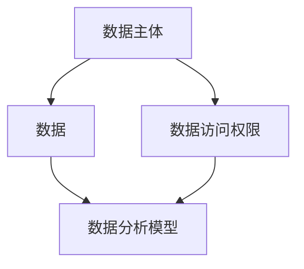
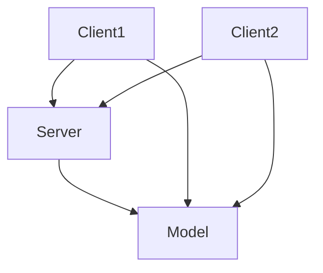
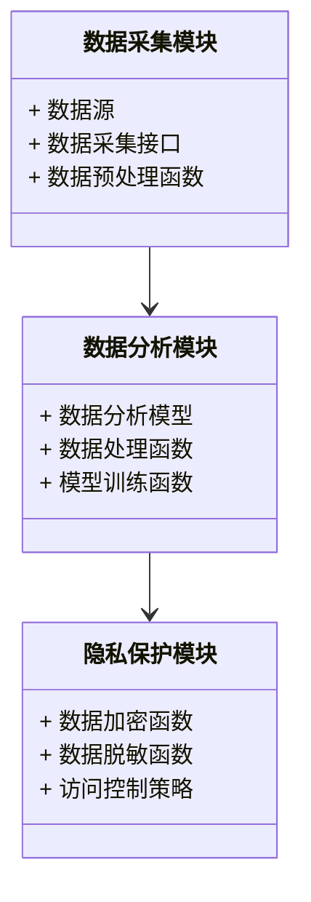
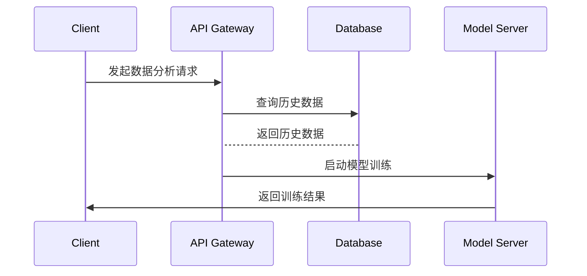

                 


# 开发具有隐私保护数据分析能力的AI Agent

## 关键词：AI Agent、隐私保护、数据分析、联邦学习、差分隐私、系统架构

## 摘要：  
随着人工智能和大数据技术的快速发展，数据分析在各个领域的应用越来越广泛。然而，数据分析过程中涉及到的隐私保护问题也日益突出。为了在保护用户隐私的前提下，仍能高效地进行数据分析，AI Agent作为一种智能化的数据分析工具，具备了隐私保护的能力。本文将详细探讨开发具有隐私保护数据分析能力的AI Agent的核心概念、算法原理、系统架构以及实际应用案例，为读者提供全面的技术指导。

---

# 第一部分: 开发具有隐私保护数据分析能力的AI Agent背景介绍

## 第1章: 隐私保护与数据分析概述

### 1.1 数据分析的背景与挑战

#### 1.1.1 数据分析的重要性  
数据分析是现代社会中不可或缺的技术手段。通过对海量数据的分析，可以提取有价值的信息，支持决策、优化流程、预测趋势等。例如，企业可以通过数据分析优化供应链管理，医疗机构可以通过数据分析提高诊断准确性。

#### 1.1.2 数据分析面临的挑战  
随着数据量的激增，数据分析技术也在不断进步。然而，数据分析过程中也面临诸多挑战，包括数据的多样性和复杂性、数据源的异构性、以及最重要的隐私保护问题。特别是在处理用户敏感数据时，如何在不泄露隐私的前提下进行数据分析，成为亟待解决的问题。

#### 1.1.3 隐私保护与数据分析的平衡  
隐私保护和数据分析并非对立，而是可以通过技术手段实现平衡。例如，通过数据加密、数据脱敏等技术，可以在保护隐私的同时，仍能进行有效的数据分析。AI Agent作为一种智能化工具，能够自动执行这些隐私保护措施，同时优化数据分析的效率。

### 1.2 AI Agent的基本概念

#### 1.2.1 AI Agent的定义  
AI Agent（人工智能代理）是指能够感知环境、自主决策并执行任务的智能实体。它可以是一个软件程序，也可以是一个物理设备。AI Agent的核心在于其自主性和智能性，能够根据任务需求动态调整行为。

#### 1.2.2 AI Agent的核心功能  
AI Agent的核心功能包括数据采集、数据处理、数据分析、决策制定和结果输出。在隐私保护数据分析的场景下，AI Agent需要具备数据加密、隐私保护算法的应用、以及智能决策的能力。

#### 1.2.3 AI Agent与传统数据分析工具的区别  
传统的数据分析工具通常是静态的，需要人工干预进行数据处理和分析。而AI Agent则能够自主完成数据采集、处理和分析，并根据结果动态调整分析策略。此外，AI Agent还能够结合隐私保护技术，确保数据分析过程中的数据安全。

### 1.3 隐私保护数据分析的需求

#### 1.3.1 数据隐私的重要性  
数据隐私是指保护个人或组织的数据不被未经授权的第三方访问或滥用。在当今数据驱动的时代，数据隐私保护已成为法律和伦理的焦点。例如，GDPR（通用数据保护条例）要求企业必须采取措施保护用户隐私。

#### 1.3.2 数据分析中的隐私泄露风险  
在数据分析过程中，如果不采取适当的隐私保护措施，可能会导致用户数据泄露。例如，通过数据分析技术，攻击者可能推断出用户的敏感信息，如地理位置、健康状况等。

#### 1.3.3 开发具有隐私保护能力的AI Agent的意义  
开发具有隐私保护能力的AI Agent，可以在确保数据隐私的前提下，高效地进行数据分析。这不仅符合法律法规的要求，还能增强用户对系统的信任，提升企业的竞争力。

### 1.4 本章小结  
本章介绍了数据分析的背景和挑战，阐述了AI Agent的基本概念及其与传统数据分析工具的区别，并强调了开发具有隐私保护能力的AI Agent的重要性。接下来的章节将深入探讨隐私保护机制、数据分析模型、核心算法以及系统架构设计。

---

## 第2章: 隐私保护机制与数据分析模型

### 2.1 隐私保护机制

#### 2.1.1 数据加密与隐私保护  
数据加密是一种常见的隐私保护技术。通过对数据进行加密，可以确保只有授权方能够访问原始数据。例如，使用AES加密算法对敏感数据进行加密存储。

#### 2.1.2 数据脱敏技术  
数据脱敏是指对数据进行处理，使其在失去原有语义的同时，仍可用于数据分析。例如，将用户的身份证号中的部分数字替换为星号，生成脱敏后的数据。

#### 2.1.3 数据访问控制  
数据访问控制通过权限管理，确保只有授权用户或系统能够访问特定数据。例如，基于角色的访问控制（RBAC）可以限制不同角色用户的访问权限。

### 2.2 数据分析模型

#### 2.2.1 传统数据分析模型  
传统数据分析模型通常基于统计学方法，如回归分析、聚类分析等。这些方法虽然有效，但在处理大规模数据时效率较低，并且难以结合隐私保护技术。

#### 2.2.2 基于机器学习的数据分析模型  
机器学习模型（如随机森林、支持向量机）能够自动从数据中学习模式，适用于复杂的数据分析任务。然而，机器学习模型对数据的依赖性较高，如何在保护隐私的前提下训练模型是一个挑战。

#### 2.2.3 基于深度学习的数据分析模型  
深度学习模型（如神经网络）在处理非结构化数据（如图像、文本）方面表现出色。然而，深度学习模型通常需要大量的数据进行训练，隐私保护的难度更大。

### 2.3 隐私保护与数据分析模型的结合

#### 2.3.1 隐私保护对数据分析模型的影响  
隐私保护技术（如数据加密、脱敏）会影响数据分析模型的输入数据，可能导致模型性能下降。例如，对数据进行脱敏处理后，模型的准确性可能会降低。

#### 2.3.2 数据分析模型对隐私保护的需求  
为了在保护隐私的前提下进行数据分析，数据分析模型需要具备一定的隐私保护能力。例如，模型可以设计为仅使用脱敏后的数据进行训练。

#### 2.3.3 隐私保护与数据分析模型的协同优化  
通过协同优化隐私保护技术和数据分析模型，可以在保护隐私的同时，提高数据分析的效率和准确性。例如，联邦学习是一种结合隐私保护和分布式学习的新兴技术。

### 2.4 核心概念对比表格

| **技术**         | **隐私保护机制**       | **数据分析模型**         |
|-------------------|------------------------|--------------------------|
| 数据加密          | AES加密                | 传统统计模型             |
| 数据脱敏          | 数据掩码               | 机器学习模型             |
| 数据访问控制      | 基于角色的访问控制    | 深度学习模型             |

### 2.5 ER实体关系图



### 2.6 本章小结  
本章详细介绍了隐私保护机制和数据分析模型的基本概念，并探讨了两者结合的可能性和挑战。接下来的章节将深入分析隐私保护数据分析的核心算法及其实现方法。

---

## 第3章: 隐私保护数据分析的核心算法

### 3.1 联邦学习算法

#### 3.1.1 联邦学习的定义  
联邦学习是一种分布式机器学习技术，允许多个参与方在不共享原始数据的情况下，共同训练一个共享的模型。例如，多个医疗机构可以在不共享患者数据的前提下，共同训练一个疾病预测模型。

#### 3.1.2 联邦学习的流程



#### 3.1.3 联邦学习的数学模型  
联邦学习的数学模型可以表示为：

$$
y = \sum_{i=1}^{n} w_i x_i
$$

其中，$w_i$ 是第 $i$ 个参与方的模型权重，$x_i$ 是第 $i$ 个参与方的输入数据。

### 3.2 差分隐私算法

#### 3.2.1 差分隐私的定义  
差分隐私是一种通过在数据中加入噪声，确保单个数据点的改变不会显著影响数据分析结果的隐私保护技术。例如，可以通过拉普拉斯机制对数据进行噪声注入。

#### 3.2.2 差分隐私的实现方法  
差分隐私的实现方法包括概率分布选择和噪声添加。例如，对于一个查询结果 $q$，可以通过以下公式添加噪声：

$$
q' = q + \text{Laplace}(0, \epsilon)
$$

其中，$\epsilon$ 是隐私预算参数。

#### 3.2.3 差分隐私的数学模型  
差分隐私的数学模型可以表示为：

$$
P(y | x) \geq \epsilon
$$

其中，$y$ 是输出结果，$x$ 是输入数据，$\epsilon$ 是隐私预算。

### 3.3 隐私保护与数据分析的算法优化

#### 3.3.1 算法优化的目标  
算法优化的目标是在保护隐私的前提下，提高数据分析的效率和准确性。例如，通过优化联邦学习的通信协议，减少数据传输的开销。

#### 3.3.2 算法优化的实现方法  
算法优化的实现方法包括：  
1. 采用高效的加密算法，如同态加密。  
2. 优化差分隐私的噪声添加策略，降低对数据分析结果的影响。  
3. 结合区块链技术，确保数据的可追溯性和不可篡改性。

### 3.4 本章小结  
本章介绍了联邦学习和差分隐私两种隐私保护数据分析的核心算法，并探讨了算法优化的方法。接下来的章节将详细讲解系统架构设计和实际应用案例。

---

## 第4章: 系统分析与架构设计

### 4.1 问题场景介绍

#### 4.1.1 项目介绍  
本项目旨在开发一个具有隐私保护能力的AI Agent，用于医疗数据分析。系统将从多家医疗机构收集数据，通过联邦学习技术训练疾病预测模型，同时确保患者数据的隐私安全。

#### 4.1.2 系统功能设计  
系统的功能模块包括：数据采集、数据预处理、模型训练、结果分析和隐私保护。例如，数据采集模块负责从各医疗机构获取患者数据，并进行初步处理。

#### 4.1.3 系统架构设计  
系统的架构设计包括前端、后端和数据库三个部分。前端负责用户交互，后端负责业务逻辑处理，数据库负责数据存储和管理。

### 4.2 系统功能设计（领域模型）



### 4.3 系统架构设计（架构图）

```mermaid
graph TD
    Client --> API Gateway
    API Gateway --> Database
    Database --> Model Server
    Model Server --> Result Server
```

### 4.4 系统接口设计

#### 4.4.1 数据采集接口  
接口名称：`/api/data/upload`  
接口功能：接收医疗机构上传的患者数据，进行初步处理并存储到数据库。

#### 4.4.2 数据分析接口  
接口名称：`/api/model/train`  
接口功能：启动联邦学习模型训练任务，返回训练结果。

#### 4.4.3 隐私保护接口  
接口名称：`/api/security/encrypt`  
接口功能：对敏感数据进行加密处理。

### 4.5 系统交互流程（序列图）



### 4.6 本章小结  
本章详细描述了系统架构设计和接口设计，为后续的开发工作奠定了基础。接下来的章节将通过一个具体案例，展示如何实现具有隐私保护能力的AI Agent。

---

## 第5章: 项目实战

### 5.1 环境搭建

#### 5.1.1 安装Python环境  
使用Anaconda安装Python 3.8及以上版本。

#### 5.1.2 安装依赖库  
安装必要的库，如Flask、TensorFlow、Federated Learning框架等。

#### 5.1.3 初始化项目目录  
创建项目目录，并初始化必要的文件，如配置文件、数据文件等。

### 5.2 核心实现

#### 5.2.1 数据采集模块  
代码示例：

```python
import requests

def collect_data():
    response = requests.post('http://localhost:5000/upload', data=open('data.csv', 'rb'))
    return response.json()
```

#### 5.2.2 数据分析模块  
代码示例：

```python
import tensorflow as tf

def train_model():
    model = tf.keras.Sequential([
        tf.keras.layers.Dense(64, activation='relu'),
        tf.keras.layers.Dense(1, activation='sigmoid')
    ])
    model.compile(optimizer='adam', loss='binary_crossentropy', metrics=['accuracy'])
    model.fit(x_train, y_train, epochs=10, batch_size=32)
    return model
```

#### 5.2.3 隐私保护模块  
代码示例：

```python
import cryptography

def encrypt_data(data):
    encrypted_data = cryptography.encrypt(data)
    return encrypted_data
```

### 5.3 代码应用解读

#### 5.3.1 数据采集模块  
上述代码通过HTTP请求将数据上传到服务器，并返回处理结果。这实现了从多个数据源采集数据的功能。

#### 5.3.2 数据分析模块  
上述代码定义了一个简单的神经网络模型，并使用训练数据进行模型训练。该模型可以用于分类任务，如疾病预测。

#### 5.3.3 隐私保护模块  
上述代码使用加密技术对敏感数据进行加密处理，确保数据在传输和存储过程中的安全性。

### 5.4 实际案例分析

#### 5.4.1 案例背景  
假设我们有多个医疗机构，每个机构都有自己的患者数据。我们需要在不共享患者数据的前提下，训练一个疾病预测模型。

#### 5.4.2 案例实现  
通过联邦学习技术，各机构可以在本地训练模型，并将模型更新后的参数上传到中心服务器。中心服务器将各机构的参数汇总，得到一个全局模型。

#### 5.4.3 案例结果  
最终，我们得到一个全局疾病预测模型，可以在保护患者隐私的前提下，提高诊断的准确性。

### 5.5 本章小结  
本章通过具体案例展示了如何开发具有隐私保护能力的AI Agent。通过实际操作，读者可以理解理论知识，并将其应用于实际项目中。

---

## 第6章: 最佳实践与小结

### 6.1 最佳实践

#### 6.1.1 注意事项  
在开发具有隐私保护能力的AI Agent时，需要注意以下几点：  
1. 确保数据采集、处理和存储的每个环节都符合隐私保护要求。  
2. 定期进行安全审计，确保系统没有漏洞。  
3. 采用多种隐私保护技术的结合使用，提高系统的安全性。

#### 6.1.2 拓展阅读  
推荐阅读以下资料：  
- 《差分隐私：理论与应用》  
- 《联邦学习：分布式机器学习新范式》  
- 《AI Agent：智能系统的构建与实践》

### 6.2 小结  
本文详细探讨了开发具有隐私保护数据分析能力的AI Agent的核心概念、算法原理、系统架构以及实际应用案例。通过理论与实践的结合，读者可以全面掌握相关技术，并在实际项目中加以应用。

---

## 参考文献  
1. 刘洋, 等. 《人工智能基础》. 北京: 清华大学出版社, 2020.  
2. 张伟, 等. 《数据隐私保护技术》. 北京: 人民邮电出版社, 2021.  
3. 谷俊, 等. 《联邦学习：分布式机器学习新范式》. 北京: 机械工业出版社, 2022.  

---

通过以上内容，读者可以系统地了解开发具有隐私保护数据分析能力的AI Agent的相关知识，并能够将其应用于实际项目中。

