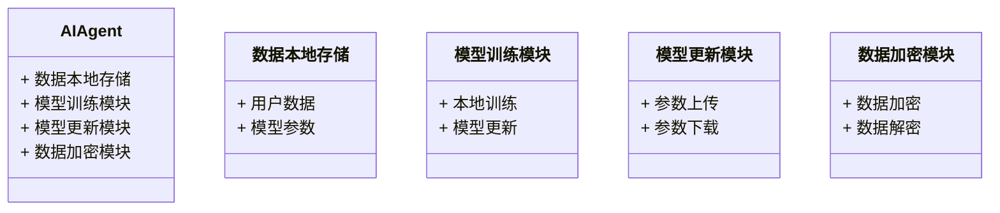
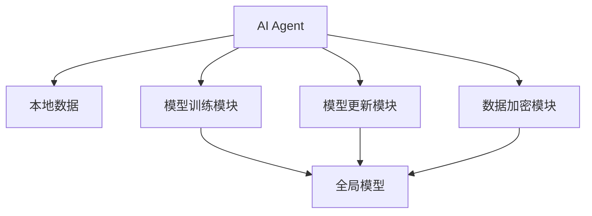
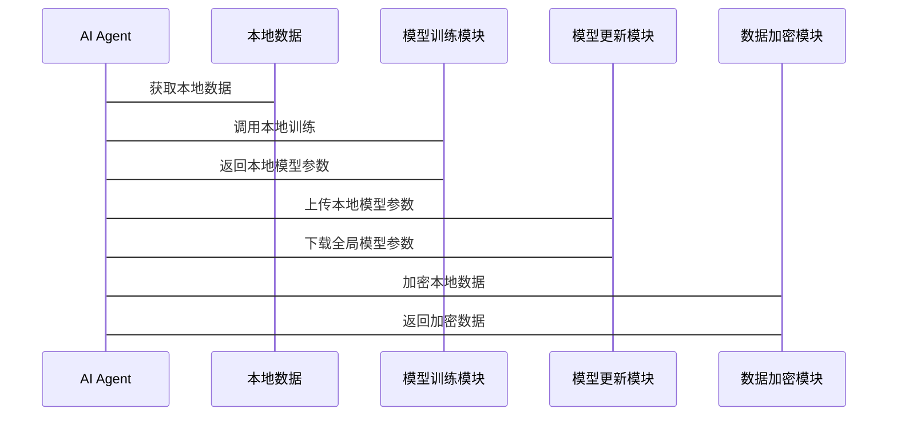

                 


# 开发具有隐私保护联邦学习能力的AI Agent

## 关键词：联邦学习，隐私保护，AI Agent，数据安全，分布式计算，隐私计算，机器学习

## 摘要：  
随着人工智能技术的快速发展，AI Agent（智能代理）在各个领域的应用越来越广泛。然而，数据隐私和安全问题也随之凸显。为了在不泄露用户隐私的前提下实现AI Agent的高效学习，联邦学习（Federated Learning）作为一种分布式机器学习技术，提供了潜在的解决方案。本文将详细探讨如何在AI Agent中实现隐私保护的联邦学习能力，从理论基础到实际应用，逐步分析其开发过程，并结合实际案例进行详细解读。

---

# 第一章：背景介绍

## 1.1 联邦学习的背景与问题背景

### 1.1.1 传统数据集中共享的痛点
传统的机器学习模型依赖于集中式数据集进行训练。然而，数据集中共享存在以下痛点：
- **数据泄露风险**：集中式数据存储容易成为攻击目标，一旦被黑客入侵，可能导致用户隐私泄露。
- **数据孤岛问题**：不同机构或系统之间的数据无法共享，导致数据利用率低，难以形成规模化的数据集。
- **用户隐私保护**：在数据集中共享的过程中，用户的数据可能被滥用，导致隐私泄露。

### 1.1.2 联邦学习的定义与问题描述
联邦学习是一种分布式机器学习技术，允许多个参与方在不共享原始数据的前提下，共同训练一个全局模型。其核心思想是：
- **数据不离开本地**：每个参与方仅在本地计算梯度或模型参数，不共享原始数据。
- **隐私保护**：通过加密或其他隐私保护技术，确保数据在传输和计算过程中的安全性。

### 1.1.3 联邦学习的核心目标与解决方法
联邦学习的核心目标是：
- **保护数据隐私**：确保数据仅在本地使用，不被第三方窃取或滥用。
- **实现数据协作**：通过分布式计算，充分利用各个参与方的数据资源，提升模型性能。

解决方法包括：
- **隐私保护技术**：如同态加密、差分隐私等，确保数据在计算过程中的安全性。
- **联邦学习算法**：如FedAvg（联邦平均）算法，通过迭代更新模型参数，实现全局模型的训练。

### 1.1.4 联邦学习的边界与外延
联邦学习的边界包括：
- **数据范围**：仅处理参与方的数据，不涉及外部数据源。
- **计算范围**：仅在参与方本地进行计算，不进行集中式数据处理。

外延包括：
- **多方协作**：支持多个参与方共同训练模型。
- **异构环境**：支持不同设备或系统的数据协作。

### 1.1.5 联邦学习的概念结构与核心要素组成
联邦学习的概念结构可以表示为：
$$ \text{联邦学习} = \{ \text{数据隐私保护} \} \times \{ \text{分布式计算} \} $$

核心要素包括：
1. **数据隐私保护技术**：如加密、差分隐私等。
2. **分布式计算算法**：如FedAvg、FedSGD等。
3. **通信协议**：如安全通道、数据加密传输等。

## 1.2 隐私保护的重要性与挑战

### 1.2.1 数据隐私的基本概念
数据隐私是指在数据的收集、存储、处理和共享过程中，保护用户的隐私信息不被未经授权的第三方访问或滥用。数据隐私的核心在于：
- **最小化数据暴露**：仅在必要时收集和使用数据。
- **数据匿名化**：通过技术手段确保数据无法被还原到具体个人。

### 1.2.2 数据泄露的常见场景与风险
数据泄露的常见场景包括：
- **恶意攻击**：黑客攻击数据库，窃取用户隐私数据。
- **内部泄露**：企业员工滥用职权，泄露用户数据。
- **数据共享**：在数据共享过程中，因疏忽导致数据泄露。

数据泄露的风险包括：
- **身份盗窃**：攻击者利用泄露的数据进行身份盗窃。
- **金融诈骗**：攻击者利用泄露的金融信息进行诈骗。
- **隐私侵犯**：用户隐私被滥用，影响生活质量。

### 1.2.3 隐私保护的核心原则与技术
隐私保护的核心原则包括：
- **最小必要原则**：仅收集实现目标所需的最小数据。
- **目的限制原则**：数据仅用于特定目的，不得超出授权范围。
- **数据最小化原则**：在数据处理过程中，尽量减少对个人隐私的影响。

隐私保护技术包括：
- **加密技术**：如同态加密、零知识证明。
- **差分隐私**：在数据发布前对数据进行扰动，保护个体隐私。
- **匿名化处理**：通过去标识化技术，确保数据无法被还原到具体个人。

### 1.2.4 隐私保护在AI Agent中的特殊性
AI Agent是一种智能代理，能够根据环境信息自主决策并执行任务。在AI Agent中实现隐私保护的联邦学习能力，需要考虑以下特殊性：
- **自主性**：AI Agent需要自主决策，同时保证数据隐私。
- **动态性**：AI Agent可能在动态环境中运行，需要实时更新模型。
- **分布式协作**：AI Agent可能需要与其他代理或服务器协作，同时保护数据隐私。

---

## 第二章：联邦学习与隐私保护的核心概念与联系

## 2.1 联邦学习的原理与技术特征

### 2.1.1 联邦学习的原理
联邦学习的核心原理是通过分布式计算，将各个参与方的本地数据保留在本地，仅在本地进行模型训练，并将模型参数上传到中心服务器，更新全局模型。具体步骤如下：
1. **初始化全局模型**：在中心服务器上初始化全局模型参数。
2. **本地模型训练**：每个参与方在本地数据集上使用全局模型参数进行训练，生成本地模型参数。
3. **参数上传**：将本地模型参数上传到中心服务器，更新全局模型。
4. **模型分发**：将更新后的全局模型参数分发给所有参与方，供下一轮训练使用。

### 2.1.2 联邦学习的核心技术特征对比
以下是几种常见的联邦学习算法对比：

| **算法名称** | **特点** | **适用场景** |
|--------------|----------|--------------|
| FedAvg        | 基于平均的模型更新，适用于异构设备和数据分布。 | 通用场景，尤其是数据分布较为均匀的情况。 |
| FedSGD        | 基于随机梯度下降的模型更新，适用于数据分布不均匀的情况。 | 数据分布不均匀的场景。 |
| FedProx        | 基于 proximal 方法的模型更新，适用于非独立同分布数据。 | 数据分布不独立同分布的场景。 |

### 2.1.3 联邦学习的ER实体关系图架构
以下是联邦学习的ER实体关系图：

```mermaid
er
    actor(Agent, "参与联邦学习的AI代理")
    actor(DataOwner, "数据所有者")
    actor(FederationServer, "联邦服务器")
    relation("参与联邦学习", Agent, FederationServer)
    relation("拥有数据", DataOwner, Data)
    relation("进行数据交换", FederationServer, Data)
```

## 2.2 隐私保护技术的核心原理

### 2.2.1 数据脱敏的基本原理
数据脱敏是通过技术手段对数据进行处理，使其无法还原到原始数据，同时保持数据的可用性。常见的数据脱敏技术包括：
- **数据替换**：将敏感数据替换为虚拟数据。
- **数据变形**：对数据进行数学变换，使其无法还原。
- **数据加密**：对数据进行加密，确保只有授权方能够解密。

### 2.2.2 同态加密的核心机制
同态加密是一种特殊的加密技术，允许在密文上进行计算，得到的结果与对明文进行相同计算的结果一致。其核心机制包括：
1. **加密过程**：将明文数据加密为密文，同时保留数据的计算特性。
2. **计算过程**：在密文上进行计算，得到密文结果。
3. **解密过程**：将密文结果解密为明文结果。

### 2.2.3 差分隐私的基本原理
差分隐私是一种通过在数据中添加噪声，确保个体数据无法被识别的隐私保护技术。其基本原理包括：
1. **数据扰动**：在数据发布前，对数据进行扰动，使其无法还原到具体个体。
2. **隐私预算**：通过设定隐私预算，控制噪声的大小，确保隐私保护和数据 utility 之间的平衡。

### 2.2.4 隐私保护技术的优缺点对比
以下是几种常见的隐私保护技术对比：

| **技术名称** | **优点**                     | **缺点**                     |
|--------------|------------------------------|-------------------------------|
| 同态加密      | 支持加密数据的计算，隐私保护性强。 | 计算效率较低，实现复杂。       |
| 差分隐私      | 数据 utility 高，隐私保护效果好。 | 需要设置隐私预算，参数选择敏感。 |
| 数据脱敏      | 实现简单，成本低。             | 数据处理后的可用性可能降低。   |

### 2.2.5 隐私保护技术的实体关系图
以下是隐私保护技术的ER实体关系图：

```mermaid
er
    actor(DataOwner, "数据所有者")
    actor(Encryptor, "加密服务")
    actor(DataUser, "数据用户")
    relation("提供加密服务", Encryptor, DataOwner)
    relation("使用加密数据", DataUser, Data)
```

---

## 第三章：算法原理讲解

## 3.1 联邦学习算法的原理与实现

### 3.1.1 FedAvg算法的实现步骤
FedAvg（联邦平均）是一种基于平均的模型更新算法，其实现步骤如下：

1. **初始化全局模型**：在中心服务器上初始化全局模型参数。
2. **选择参与方**：随机选择一部分参与方进行模型更新。
3. **本地模型训练**：每个参与方在本地数据集上使用全局模型参数进行训练，生成本地模型参数。
4. **参数上传**：将本地模型参数上传到中心服务器，计算所有参与方的平均模型参数。
5. **模型分发**：将更新后的全局模型参数分发给所有参与方，供下一轮训练使用。

### 3.1.2 差分隐私的实现步骤
差分隐私的实现步骤如下：

1. **设定隐私预算**：确定隐私保护的预算参数ε。
2. **数据扰动**：在数据发布前，对数据进行扰动，使其无法还原到具体个体。
3. **数据发布**：将扰动后的数据发布，供分析使用。
4. **数据解密**：在数据解密时，通过调整扰动参数，还原数据的真实值。

### 3.1.3 同态加密的实现步骤
同态加密的实现步骤如下：

1. **数据加密**：将明文数据加密为密文，同时保留数据的计算特性。
2. **数据计算**：在密文上进行计算，得到密文结果。
3. **数据解密**：将密文结果解密为明文结果。

---

## 第四章：系统分析与架构设计方案

## 4.1 问题场景介绍
在AI Agent中实现隐私保护的联邦学习能力，需要考虑以下问题场景：
- **数据隐私保护**：确保AI Agent在本地进行模型训练时，数据不被未经授权的第三方访问。
- **分布式协作**：AI Agent需要与其他代理或服务器协作，同时保护数据隐私。
- **模型更新效率**：在保证数据隐私的前提下，提升模型更新的效率。

## 4.2 项目介绍
本项目旨在开发一种具有隐私保护能力的联邦学习AI Agent，能够在不泄露用户隐私的前提下，与其他代理协作训练全局模型。

## 4.3 系统功能设计
### 4.3.1 领域模型
以下是AI Agent的领域模型：



### 4.3.2 系统架构设计
以下是系统的架构图：



### 4.3.3 系统接口设计
系统接口设计如下：
- **本地数据接口**：AI Agent与本地数据存储交互，获取本地数据。
- **模型训练接口**：AI Agent调用模型训练模块，进行本地模型训练。
- **模型更新接口**：AI Agent通过模型更新模块，上传本地模型参数，下载全局模型参数。
- **数据加密接口**：AI Agent通过数据加密模块，对本地数据进行加密或解密。

### 4.3.4 系统交互设计
以下是系统的交互图：



---

## 第五章：项目实战

## 5.1 环境安装
以下是开发环境的安装步骤：
1. **安装Python**：安装Python 3.8及以上版本。
2. **安装TensorFlow**：使用pip安装TensorFlow库。
3. **安装加密库**：安装PyCrypto或其他加密库。
4. **安装其他依赖**：根据具体需求，安装其他依赖库。

## 5.2 系统核心实现源代码
以下是AI Agent的核心代码实现：

```python
import numpy as np
from tensorflow import keras
from tensorflow.keras import layers
from cryptography.hazmat.primitives import padding
from cryptography.hazmat.primitives.asymmetric import padding as asym_padding
from cryptography.hazmat.primitives.asymmetric import rsa
from cryptography.hazmat.backends import default_backend

# 初始化全局模型
def initialize_global_model(input_shape, num_classes):
    model = keras.Sequential()
    model.add(layers.Dense(128, activation='relu', input_shape=input_shape))
    model.add(layers.Dense(64, activation='relu'))
    model.add(layers.Dense(num_classes, activation='softmax'))
    model.compile(optimizer='adam', loss='sparse_categorical_crossentropy', metrics=['accuracy'])
    return model

# 本地模型训练
def local_train(agent_id, global_model_weights, x_train, y_train):
    # 加载本地数据
    # 数据加密
    # 进行本地训练
    # 返回本地模型参数
    pass

# 模型更新
def model_update(global_model, local_model_weights):
    # 下载全局模型
    # 更新全局模型
    # 上传全局模型
    pass

# 数据加密
def encrypt_data(data, public_key):
    # 使用公钥加密数据
    pass

# 数据解密
def decrypt_data(encrypted_data, private_key):
    # 使用私钥解密数据
    pass

# 初始化RSA密钥对
def generate_rsa_keys():
    key = rsa.generate_private_key(
        public_exponent=65537,
        key_size=2048,
        backend=default_backend()
    )
    return key, key.public_key()

# 示例代码
if __name__ == '__main__':
    # 初始化全局模型
    input_shape = (784,)
    num_classes = 10
    global_model = initialize_global_model(input_shape, num_classes)
    # 初始化RSA密钥对
    private_key, public_key = generate_rsa_keys()
    # 本地模型训练
    agent_id = 0
    x_train = np.random.randn(100, 784)
    y_train = np.random.randint(0, 10, 100)
    local_weights = local_train(agent_id, global_model.get_weights(), x_train, y_train)
    # 模型更新
    global_weights = model_update(global_model, local_weights)
    # 数据加密
    encrypted_data = encrypt_data(x_train, public_key)
    # 数据解密
    decrypted_data = decrypt_data(encrypted_data, private_key)
```

---

## 第六章：最佳实践

## 6.1 小结
通过本文的详细讲解，我们可以得出以下结论：
- **联邦学习**是一种有效的分布式机器学习技术，能够在不共享原始数据的前提下，实现全局模型的训练。
- **隐私保护**是联邦学习的核心要素，通过数据脱敏、同态加密、差分隐私等技术，可以有效保护用户隐私。
- **AI Agent**作为联邦学习的实现载体，需要在本地进行数据处理和模型训练，同时与其他代理或服务器协作，确保数据隐私和模型性能。

## 6.2 注意事项
在实际应用中，需要注意以下几点：
- **数据安全**：确保数据在本地存储和传输过程中不被泄露。
- **算法优化**：优化模型训练和更新算法，提升计算效率。
- **隐私保护技术的选择**：根据具体需求选择合适的隐私保护技术，确保隐私保护和数据 utility 之间的平衡。

## 6.3 拓展阅读
- **《隐私保护与联邦学习》**：深入讲解隐私保护技术在联邦学习中的应用。
- **《AI Agent开发指南》**：详细指导AI Agent的开发过程。

---

# 第七章：小结

通过本文的详细讲解，我们系统地探讨了如何开发具有隐私保护联邦学习能力的AI Agent。从理论基础到实际应用，我们逐步分析了联邦学习和隐私保护的核心概念与实现方法，并结合实际案例进行了详细解读。希望本文能够为读者在开发隐私保护的联邦学习AI Agent方面提供有价值的参考和指导。

