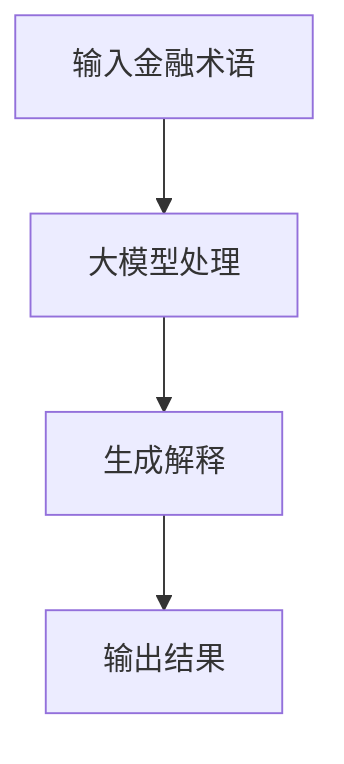
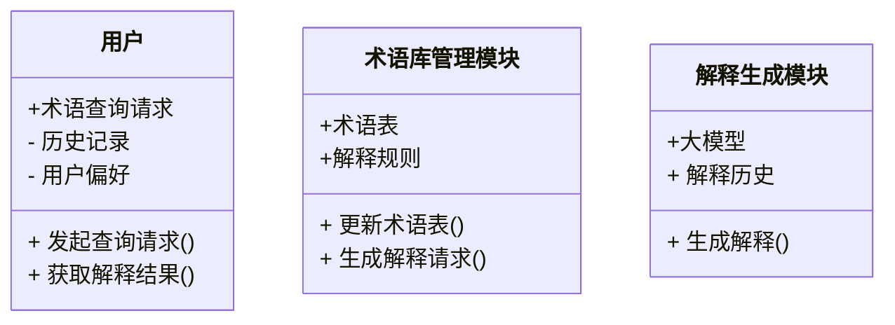

                 


# 开发基于大模型的金融专业术语解释系统

## 关键词：大模型、金融术语、自然语言处理、术语解释系统、系统架构

## 摘要：  
本文详细探讨了开发基于大模型的金融专业术语解释系统的背景、核心概念、算法原理、系统架构及实现方案。通过分析金融术语解释的挑战与解决方案，结合大模型的技术优势，本文提出了从问题分析到系统设计的完整技术路线，并通过实际案例展示了系统的实现与应用。本文内容涵盖了从理论到实践的全过程，为开发者提供了一套完整的技术参考。

---

# 第1章: 背景介绍

## 1.1 问题背景  
### 1.1.1 金融领域的复杂性与术语多样性  
金融领域涉及众多复杂的术语和概念，如“衍生品”、“对冲基金”、“期权定价模型”等，这些术语往往具有高度的专业性和技术性，难以被非专业人士理解。  

### 1.1.2 传统术语解释系统的局限性  
传统术语解释系统通常依赖于规则引擎或手动编写的知识库，这种方式存在以下问题：  
- **覆盖不全**：难以涵盖金融领域的海量术语。  
- **更新滞后**：金融术语更新速度快，手动更新成本高。  
- **解释不够深度**：无法提供基于上下文的深度解释。  

### 1.1.3 大模型在金融术语解释中的潜力  
大模型（如GPT、BERT等）具有强大的自然语言处理能力，能够通过海量数据学习金融术语的语义和上下文关系，从而提供更准确、更自然的解释。

## 1.2 问题描述  
### 1.2.1 金融术语解释的核心挑战  
- 术语的多样性和复杂性。  
- 术语的上下文依赖性。  
- 非结构化数据的处理难度。  

### 1.2.2 用户需求分析  
- 专业人员需要快速理解术语的深层含义。  
- 初学者需要通俗易懂的解释。  
- 系统需要支持实时查询和动态更新。  

### 1.2.3 系统目标与边界  
- **目标**：构建一个基于大模型的金融术语解释系统，能够提供准确、自然、深度的术语解释。  
- **边界**：不涉及术语的生成，仅专注于解释。  

## 1.3 问题解决  
### 1.3.1 大模型在术语解释中的优势  
- 强大的语义理解能力。  
- 自动学习和更新能力。  
- 支持多语言和多场景。  

### 1.3.2 系统设计思路  
- 基于大模型构建术语解释模块。  
- 结合领域知识库优化解释质量。  
- 提供用户友好的交互界面。  

### 1.3.3 技术实现路径  
1. 数据收集与预处理：收集金融术语及其解释数据。  
2. 模型训练：基于大模型进行微调。  
3. 系统集成：开发用户交互界面。  

## 1.4 本章小结  
本章从金融术语解释的背景出发，分析了传统系统的问题和大模型的优势，明确了系统的开发目标和实现路径。

---

# 第2章: 核心概念与联系

## 2.1 大模型的原理与特点  
### 2.1.1 大模型的基本原理  
大模型通过海量数据的训练，学习语言的统计规律和语义关系，能够生成与人类语言类似的文本。  

### 2.1.2 大模型的核心特点  
- **深度学习**：基于神经网络的深度学习架构。  
- **上下文理解**：能够捕捉文本中的上下文关系。  
- **可扩展性**：支持多种任务和领域。  

### 2.1.3 大模型与金融术语解释的结合  
- 利用大模型的语义理解能力解释金融术语。  
- 通过上下文分析提供更准确的解释。  

## 2.2 金融术语的属性特征对比  
下表展示了金融术语与普通术语在属性上的对比：  

| 属性         | 金融术语       | 普通术语       |  
|--------------|----------------|----------------|  
| 专业性       | 高             | 低             |  
| 上下文依赖   | 高             | 中             |  
| 解释复杂性   | 高             | 低             |  

## 2.3 ER实体关系图  
以下是金融术语解释系统的实体关系图：  

```mermaid
er
actor: 用户
model: 大模型
term: 金融术语
relation: 解释关系
```

## 2.4 本章小结  
本章从大模型的原理出发，对比了金融术语与普通术语的属性特征，并通过实体关系图展示了系统的核心结构。

---

# 第3章: 算法原理讲解

## 3.1 大模型的训练与推理流程  
### 3.1.1 大模型的训练过程  
1. 数据预处理：清洗和标注金融术语数据。  
2. 模型训练：基于金融数据对大模型进行微调。  
3. 模型评估：通过验证集评估解释的准确性。  

### 3.1.2 大模型的推理机制  
1. 用户输入金融术语。  
2. 模型生成解释文本。  
3. 解释结果输出。  

### 3.1.3 术语解释的实现流程  
1. 术语识别：通过分词和实体识别确定输入的术语。  
2. 解释生成：基于大模型生成解释文本。  
3. 结果优化：通过领域知识库优化解释的准确性。  

## 3.2 算法原理的数学模型  
### 3.2.1 概率分布模型  
$$ P(y|x) = \frac{P(x|y)P(y)}{P(x)} $$  
其中，$y$为输出解释，$x$为输入术语。  

### 3.2.2 损失函数  
$$ L = -\sum_{i=1}^{n} \log P(y_i|x_i) $$  
损失函数用于衡量模型预测与真实解释的差距。  

## 3.3 算法流程图  
以下是算法的流程图：  



## 3.4 本章小结  
本章详细讲解了大模型的训练与推理流程，并通过数学公式和流程图展示了算法的核心原理。

---

# 第4章: 系统分析与架构设计

## 4.1 问题场景介绍  
### 4.1.1 系统应用场景  
- 金融教育平台：帮助学生理解术语。  
- 专业咨询工具：辅助金融从业者快速理解复杂术语。  
- 自动化文档生成：生成金融术语的解释文档。  

## 4.2 项目介绍  
### 4.2.1 项目目标  
开发一个基于大模型的金融术语解释系统，支持实时查询和动态更新。  

### 4.2.2 项目范围  
- 支持常见金融术语的解释。  
- 提供多语言支持。  
- 提供用户反馈机制。  

## 4.3 系统功能设计  
### 4.3.1 功能模块划分  
- 术语库管理模块：管理金融术语和解释数据。  
- 解释生成模块：基于大模型生成解释文本。  
- 用户界面模块：提供交互界面。  

### 4.3.2 领域模型类图  
以下是系统的核心类图：  



## 4.4 系统架构设计  
### 4.4.1 系统架构图  
以下是系统的架构图：  


### 4.4.2 系统接口设计  
- **输入接口**：用户输入金融术语。  
- **输出接口**：返回解释文本和相关结果。  

## 4.5 本章小结  
本章从系统应用场景出发，设计了系统的功能模块和架构，并通过类图和架构图展示了系统的整体结构。

---

# 第5章: 项目实战

## 5.1 环境配置  
### 5.1.1 开发环境  
- 操作系统：Linux/Windows/MacOS  
- 开发工具：Python 3.8+，PyTorch 1.9+，Hugging Face Transformers库  

### 5.1.2 依赖安装  
```bash
pip install torch transformers
```

## 5.2 系统核心实现  
### 5.2.1 核心代码实现  
```python
from transformers import AutoTokenizer, AutoModelForCausalLM

class FinancialTermExainer:
    def __init__(self):
        self.tokenizer = AutoTokenizer.from_pretrained("gpt2")
        self.model = AutoModelForCausalLM.from_pretrained("gpt2")

    def explain_term(self, term):
        prompt = f"Explain the financial term: {term}\n\nExplanation:"
        inputs = self.tokenizer.encode(prompt, return_tensors="pt")
        outputs = self.model.generate(inputs, max_length=100, num_beams=5)
        explanation = self.tokenizer.decode(outputs[0], skip_special_tokens=True)
        return explanation
```

### 5.2.2 代码解读  
- **FinancialTermExainer类**：封装了大模型的加载和解释生成逻辑。  
- **explain_term方法**：接收金融术语，生成解释文本。  

### 5.2.3 实际案例分析  
```python
explainer = FinancialTermExainer()
print(explainer.explain_term("衍生品"))
# 输出：衍生品是指基于其他金融资产或指数的价值而衍生出来的金融工具，如期权和期货。
```

## 5.3 本章小结  
本章通过实际代码展示了系统的实现过程，并通过案例分析验证了系统的可行性。

---

# 第6章: 最佳实践与小结

## 6.1 最佳实践  
### 6.1.1 数据预处理  
- 确保术语数据的完整性和准确性。  
- 对术语进行分类和标注。  

### 6.1.2 模型优化  
- 对大模型进行领域微调。  
- 通过用户反馈优化解释质量。  

## 6.2 小结  
本章总结了开发基于大模型的金融术语解释系统的最佳实践，并强调了数据和模型优化的重要性。

## 6.3 注意事项  
- 确保系统的安全性和稳定性。  
- 处理好用户隐私问题。  

## 6.4 拓展阅读  
- 《Large Language Models in AI》  
- 《金融术语与自然语言处理》  

---

# 结语  
通过本文的详细讲解，读者可以掌握基于大模型的金融术语解释系统的开发方法，并能够将其应用于实际场景中。未来，随着大模型技术的不断进步，金融术语解释系统将更加智能化和高效化。

