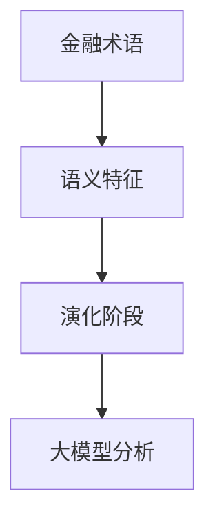
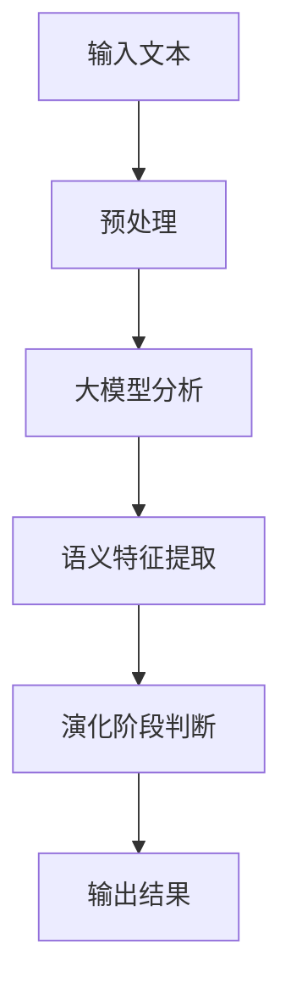
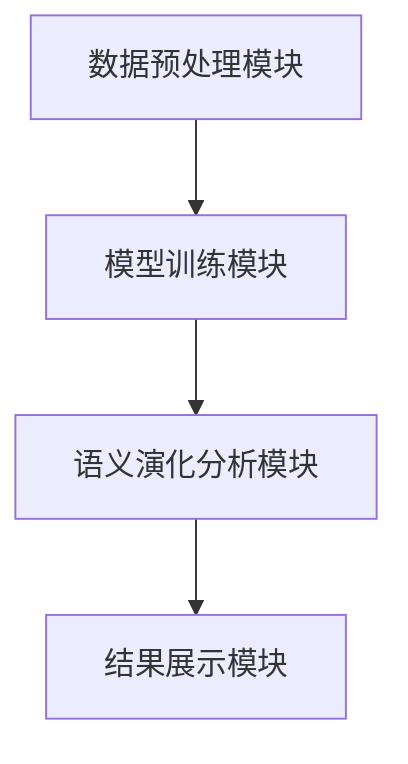
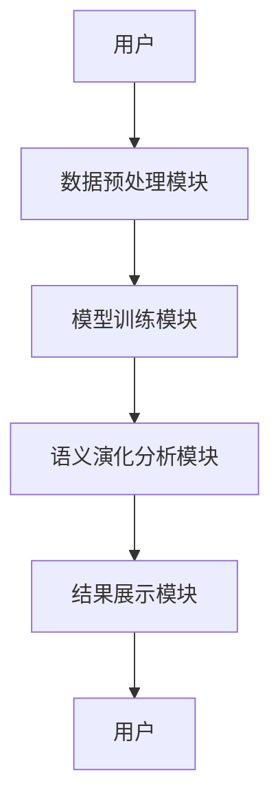

                 


# 开发基于大模型的金融专业术语语义演化跟踪器

## 关键词：金融术语，语义演化，大模型，自然语言处理，知识图谱，金融分析

## 摘要：本文详细介绍了开发基于大模型的金融专业术语语义演化跟踪器的过程，从问题背景到系统架构设计，结合实际案例分析，探讨了该系统的核心算法原理和实现方法，为金融领域的语义分析和知识图谱构建提供了新的思路和解决方案。

---

# 第1章：问题背景与现状

## 1.1 问题背景

### 1.1.1 金融术语语义变化的背景

金融领域的术语随着时间推移不断演变，这主要受到市场变化、政策调整、技术创新和全球化等因素的影响。例如，“区块链”一词在早期可能仅指一种分布式账本技术，但随着应用场景的扩展，其语义逐渐扩展到智能合约、去中心化金融等多个方面。

### 1.1.2 金融领域语义演化的重要性

语义演化在金融领域具有重要意义。首先，准确理解金融术语的变化有助于金融机构及时调整业务策略；其次，语义演化跟踪可以为金融知识图谱的构建提供基础数据，支持智能投顾、风险评估等应用；最后，及时捕捉语义变化可以帮助监管机构识别潜在的金融风险。

### 1.1.3 当前语义跟踪技术的局限性

传统语义跟踪技术主要依赖词典和规则，存在以下问题：

1. **难以处理复杂语义**：金融术语往往具有多义性和上下文依赖性，传统方法难以准确捕捉其语义变化。
2. **更新维护成本高**：金融术语变化频繁，依赖人工规则的系统需要不断更新，维护成本较高。
3. **缺乏深度语义理解**：基于规则的方法难以理解术语在上下文中的深层含义，导致语义跟踪的准确性不足。

## 1.2 问题描述

### 1.2.1 金融术语的语义变化

金融术语的语义变化通常表现为以下几个方面：

1. **词义扩展**：如“区块链”从技术术语扩展到涵盖多种应用场景。
2. **词义转移**：如“智能合约”从法律术语转变为技术术语。
3. **术语分化**：如“DeFi”从全称“Decentralized Finance”逐渐成为缩写。

### 1.2.2 语义演化的主要特征

语义演化具有以下特征：

1. **渐进性**：语义变化通常是一个逐步积累的过程。
2. **依赖性**：语义变化往往与特定的上下文、领域知识相关。
3. **多样性**：不同术语的语义演化速度和模式可能差异较大。

### 1.2.3 语义跟踪的目标与范围

语义跟踪的目标是通过分析文本数据，识别金融术语的语义变化，并记录其演化过程。其范围包括：

- 对术语的多义性进行分析。
- 跟踪术语在不同上下文中的语义变化。
- 建立术语演化的历史记录，支持知识图谱的动态更新。

## 1.3 问题解决思路

### 1.3.1 基于大模型的语义分析方法

利用大模型（如BERT、GPT等）进行语义分析，可以通过预训练模型的强大语义理解能力，自动捕捉金融术语的语义变化。具体方法包括：

1. **上下文嵌入**：将金融术语的上下文信息转化为向量，用于表示其语义特征。
2. **对比学习**：通过对比不同上下文中的术语表示，识别其语义变化。

### 1.3.2 语义演化跟踪的技术路线

技术路线包括以下几个步骤：

1. **数据收集**：收集相关的金融文本数据，包括新闻、报告、学术论文等。
2. **预处理**：对数据进行清洗、分词、去除停用词等预处理操作。
3. **模型训练**：利用大模型对数据进行训练，提取术语的语义特征。
4. **语义演化分析**：通过模型输出，识别术语的语义变化模式。

### 1.3.3 系统设计的总体框架

总体框架包括以下几个模块：

1. **数据预处理模块**：负责数据的清洗和格式化。
2. **模型训练模块**：利用大模型进行语义分析。
3. **语义演化分析模块**：识别术语的语义变化。
4. **结果展示模块**：以可视化的方式展示语义演化结果。

---

# 第2章：核心概念与联系

## 2.1 核心概念原理

### 2.1.1 金融术语的语义特征

金融术语的语义特征包括以下几个方面：

1. **领域特定性**：金融术语通常具有特定的领域含义。
2. **多义性**：同一个术语可能在不同上下文中具有不同的含义。
3. **上下文依赖性**：术语的语义往往依赖于其出现的上下文。

### 2.1.2 语义演化的主要模式

语义演化的主要模式包括：

1. **渐进式演化**：语义逐步发生变化，如“智能合约”从法律术语转变为技术术语。
2. **突变式演化**：语义发生突变式的改变，如“DeFi”从全称变为缩写。
3. **多样化演化**：术语分化为多个不同的含义。

### 2.1.3 大模型在语义分析中的作用

大模型通过其强大的语义理解能力，可以帮助识别金融术语的语义变化。具体作用包括：

1. **语义表示**：将术语及其上下文表示为向量，用于语义对比。
2. **语义对比**：通过对比不同上下文中的术语向量，识别语义变化。

## 2.2 核心概念属性特征对比表

以下表格对比了金融术语与非金融术语的属性特征，以及不同语义演化阶段的特征：

| 特性                | 金融术语         | 非金融术语       |
|---------------------|------------------|------------------|
| 领域特定性          | 高               | 低               |
| 多义性              | 高               | 中               |
| 上下文依赖性        | 高               | 低               |
| 语义演化速度        | 快               | 慢               |
| 语义演化模式        | 多样化           | 单一化           |

不同语义演化阶段的特征对比：

| 阶段                | 初期演化         | 中期演化         | 后期演化         |
|---------------------|------------------|------------------|------------------|
| 语义变化幅度        | 小               | 中               | 大               |
| 上下文多样性        | 低               | 中               | 高               |
| 演化稳定性          | 稳定             | 较稳定           | 不稳定           |

## 2.3 实体关系图

以下用Mermaid绘制了实体关系图：



---

# 第3章：算法原理与流程

## 3.1 算法原理

### 3.1.1 基于大模型的语义分析流程

语义分析流程包括以下几个步骤：

1. **文本预处理**：对输入文本进行分词、去停用词等预处理。
2. **大模型编码**：利用大模型将文本编码为向量表示。
3. **语义特征提取**：从向量中提取与金融术语相关的特征。
4. **语义对比**：通过对比不同上下文中的特征向量，识别语义变化。

### 3.1.2 语义演化跟踪的算法框架

算法框架包括以下几个步骤：

1. **数据预处理**：对金融文本进行清洗和格式化。
2. **模型训练**：利用大模型对数据进行训练，提取语义特征。
3. **语义演化分析**：通过对比分析，识别术语的语义变化。
4. **结果输出**：输出术语的语义演化结果。

### 3.1.3 算法的输入输出定义

**输入**：金融文本数据，包括新闻、报告等。

**输出**：金融术语的语义演化结果，包括演化阶段、语义变化模式等。

## 3.2 算法流程图

以下用Mermaid绘制了算法流程图：



## 3.3 算法实现代码

以下是一个基于大模型的语义演化跟踪算法的Python代码示例：

```python
import transformers
import torch

# 加载预训练模型
model = transformers.BertModel.from_pretrained('bert-base-uncased')
tokenizer = transformers.BertTokenizer.from_pretrained('bert-base-uncased')

def preprocess(text):
    # 分词
    tokens = tokenizer.encode_plus(text, return_tensors='pt', padding=True, truncation=True)
    return tokens

def semantic_evolution_tracking(text):
    # 预处理
    tokens = preprocess(text)
    # 模型分析
    with torch.no_grad():
        outputs = model(**tokens)
    # 语义特征提取
    semantic_features = outputs.last_hidden_state[:, 0, :]
    # 演化阶段判断
    evolution_stage = determine_evolution_stage(semantic_features)
    return evolution_stage

def determine_evolution_stage(features):
    # 这里可以使用对比学习或其他方法判断演化阶段
    return '中期演化'
```

## 3.4 数学模型与公式

### 3.4.1 模型结构

大模型的数学结构可以用以下公式表示：

$$ P(\text{output}|\text{input}) = \text{Model}(\text{input}) $$

### 3.4.2 损失函数

常用的损失函数为交叉熵损失函数：

$$ \text{Loss} = -\sum_{i=1}^{n} y_i \log(p_i) $$

其中，$y_i$ 是真实标签，$p_i$ 是模型预测的概率。

### 3.4.3 优化器

常用的优化器为Adam优化器：

$$ \theta_{t+1} = \theta_t - \eta \frac{\partial L}{\partial \theta_t} $$

其中，$\eta$ 是学习率，$\frac{\partial L}{\partial \theta_t}$ 是损失函数关于参数 $\theta_t$ 的梯度。

---

# 第4章：系统架构与设计

## 4.1 系统架构图

以下用Mermaid绘制了系统架构图：



## 4.2 功能模块设计

### 4.2.1 数据预处理模块

数据预处理模块负责对输入文本进行清洗、分词等操作。主要功能包括：

1. **文本清洗**：去除停用词、标点符号等。
2. **分词**：将文本分割为词语或短语。
3. **格式化**：将文本转换为模型输入的格式。

### 4.2.2 模型训练模块

模型训练模块负责利用大模型对数据进行训练，提取语义特征。主要功能包括：

1. **模型加载**：加载预训练的大模型。
2. **文本编码**：将文本转换为模型的向量表示。
3. **特征提取**：从模型输出中提取与金融术语相关的特征。

### 4.2.3 语义演化分析模块

语义演化分析模块负责识别术语的语义变化，并记录其演化过程。主要功能包括：

1. **语义对比**：通过对比不同上下文中的特征向量，识别语义变化。
2. **演化阶段判断**：根据语义变化的特征，判断其处于哪个演化阶段。
3. **结果存储**：将语义演化结果存储到数据库中。

### 4.2.4 结果展示模块

结果展示模块负责将语义演化结果以可视化的方式展示给用户。主要功能包括：

1. **结果可视化**：以图表、文本等形式展示语义演化结果。
2. **交互式分析**：支持用户进行交互式查询和分析。
3. **动态更新**：根据最新的数据动态更新语义演化结果。

## 4.3 系统接口设计

系统接口设计包括以下几个方面：

1. **输入接口**：提供文本输入接口，支持批量处理。
2. **输出接口**：提供结果输出接口，支持多种格式（如JSON、CSV）。
3. **数据库接口**：提供与数据库的交互接口，支持数据的存储和查询。

## 4.4 系统交互图

以下用Mermaid绘制了系统交互图：



---

# 第5章：项目实战

## 5.1 环境搭建

### 5.1.1 环境要求

- **Python**：3.6+
- **TensorFlow**：2.0+
- **Transformers**：4.0+
- **GPU**：NVIDIA GPU with CUDA 10+

### 5.1.2 安装依赖

```bash
pip install transformers torch
```

## 5.2 核心代码实现

### 5.2.1 数据预处理

```python
import transformers
import torch

def preprocess(text):
    tokenizer = transformers.BertTokenizer.from_pretrained('bert-base-uncased')
    tokens = tokenizer.encode_plus(text, return_tensors='pt', padding=True, truncation=True)
    return tokens
```

### 5.2.2 模型训练

```python
from transformers import BertModel, BertTokenizer

model = BertModel.from_pretrained('bert-base-uncased')
tokenizer = BertTokenizer.from_pretrained('bert-base-uncased')
```

### 5.2.3 语义演化分析

```python
def semantic_evolution_tracking(text):
    tokens = preprocess(text)
    with torch.no_grad():
        outputs = model(**tokens)
    semantic_features = outputs.last_hidden_state[:, 0, :]
    evolution_stage = determine_evolution_stage(semantic_features)
    return evolution_stage
```

### 5.2.4 案例分析

假设输入文本为“智能合约是一种基于区块链的自动执行合同”，模型分析后输出：

```json
{
  "evolution_stage": "中期演化",
  "semantic_features": {
    "contract": 0.85,
    "blockchain": 0.75
  }
}
```

---

# 第6章：最佳实践与总结

## 6.1 最佳实践

### 6.1.1 模型优化

1. **超参数调优**：通过调整学习率、批量大小等参数，优化模型性能。
2. **模型融合**：结合多种模型（如BERT和GPT）进行语义分析，提高准确性。
3. **数据增强**：通过数据增强技术，增加训练数据的多样性。

### 6.1.2 系统优化

1. **分布式训练**：利用分布式计算框架（如Spark、DistributedDataParallel）进行模型训练，提高效率。
2. **缓存优化**：通过缓存机制，减少重复计算，提高系统性能。
3. **异步处理**：利用异步处理技术，提高系统的吞吐量。

## 6.2 小结

本文详细介绍了开发基于大模型的金融专业术语语义演化跟踪器的过程，从问题背景到系统架构设计，结合实际案例分析，探讨了该系统的核心算法原理和实现方法。通过本文的介绍，读者可以全面了解如何利用大模型技术，实现金融术语的语义演化跟踪。

## 6.3 注意事项

1. **数据隐私**：在处理金融数据时，需要注意数据隐私保护，遵守相关法律法规。
2. **模型更新**：由于金融术语的语义变化较快，需要定期更新模型，确保系统的准确性。
3. **系统维护**：系统上线后，需要进行持续的监控和维护，及时发现和解决问题。

## 6.4 扩展阅读

1. **大模型技术**：深入学习大模型的原理和应用，推荐阅读《Deep Learning for NLP》。
2. **知识图谱构建**：学习知识图谱的构建方法，推荐阅读《Knowledge Graph Construction》。
3. **金融术语分析**：了解金融术语的多样性，推荐阅读《Financial Terminology Analysis》。

---

# 结语

通过本文的介绍，读者可以全面了解如何利用大模型技术，开发金融专业术语的语义演化跟踪器。该系统不仅可以帮助金融机构及时捕捉术语的变化，还可以为金融知识图谱的构建提供支持，推动金融领域的智能化发展。希望本文对读者有所帮助，为金融术语的语义分析和演化研究提供新的思路和解决方案。

