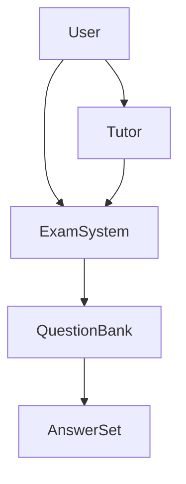
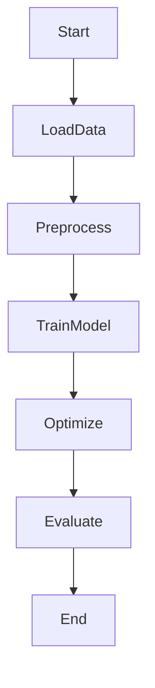
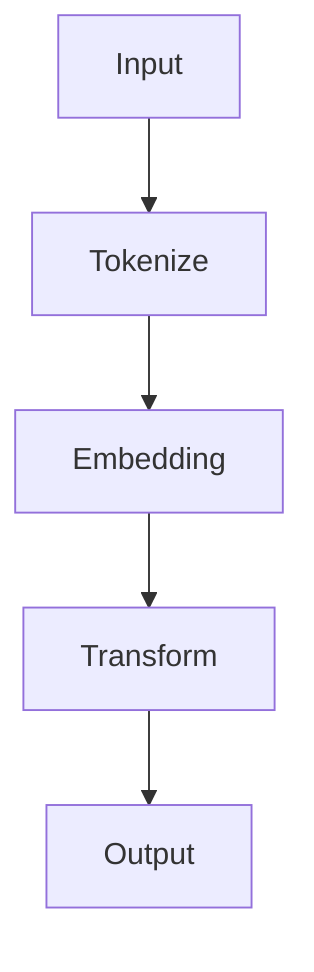
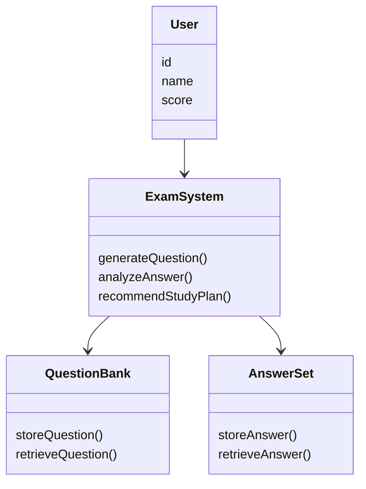

                 


# 开发基于大模型的金融专业考试辅导系统

> 关键词：大模型，金融考试，辅导系统，自然语言处理，系统架构

> 摘要：本文详细介绍了基于大模型的金融专业考试辅导系统的开发过程，从问题背景到系统架构，从算法原理到项目实战，全面分析了该系统的开发要点和技术实现。文章内容涵盖大模型的核心原理、系统设计、算法实现以及实际应用案例，帮助读者深入了解如何利用大模型技术提升金融考试辅导的智能化水平。

---

# 第一部分: 背景介绍

## 第1章: 问题背景与描述

### 1.1 问题背景

#### 1.1.1 传统金融考试辅导的痛点
传统金融考试辅导主要依赖人工讲解和固定题库，存在以下痛点：
- **效率低**：人工辅导成本高，难以覆盖大规模用户。
- **个性化不足**：难以根据学生的知识水平和学习需求提供个性化的辅导方案。
- **题库有限**：传统题库的更新速度较慢，难以覆盖最新的考试内容和趋势。

#### 1.1.2 大模型技术的兴起与应用潜力
近年来，大模型（如GPT-3、GPT-4等）在自然语言处理领域取得了突破性进展，展现出强大的文本生成和理解能力。这些模型在教育领域的应用潜力巨大，尤其是在金融考试辅导方面。

#### 1.1.3 金融考试辅导领域的智能化需求
随着金融行业的快速发展，金融考试的内容也在不断更新。考生需要更高效、更智能的辅导工具来应对复杂的考试内容。大模型技术的引入为金融考试辅导提供了新的可能性。

### 1.2 问题描述

#### 1.2.1 金融考试辅导系统的核心需求
- 提供个性化的学习计划。
- 支持多语言、多场景的题目解析。
- 实时生成高质量的解答和解析。

#### 1.2.2 大模型在金融考试辅导中的应用场景
- **智能题库**：基于大模型生成多样化的题目。
- **智能解析**：快速生成题目解析和答案。
- **个性化辅导**：根据学生的学习情况提供定制化建议。

#### 1.2.3 系统目标与预期效果
- 提供高效的金融考试辅导工具。
- 提升学生的学习效率和考试成绩。
- 实现大规模用户的同时在线使用。

---

# 第二部分: 核心概念与联系

## 第2章: 大模型的核心原理与特征

### 2.1 大模型的基本原理

#### 2.1.1 深度学习的基本原理
大模型基于深度学习技术，通过多层神经网络对数据进行特征提取和模式识别。其核心在于通过大量数据的训练，模型能够自动学习语言的规律和语义。

#### 2.1.2 大模型的训练过程
1. **数据预处理**：清洗数据，去除噪声，提取特征。
2. **模型训练**：通过反向传播算法优化模型参数，最小化预测误差。
3. **微调与优化**：在特定领域数据上进行微调，提升模型的性能。

#### 2.1.3 大模型的推理机制
大模型通过输入的上下文信息生成输出，其推理过程基于模型内部的语义理解和概率预测。

### 2.2 大模型的特征对比

#### 2.2.1 参数规模对比
- **小模型**：参数量较少，适用于简单任务。
- **大模型**：参数量巨大，适用于复杂任务。

#### 2.2.2 训练数据对比
- **小模型**：依赖少量数据，训练时间短。
- **大模型**：需要大量数据，训练时间长，但泛化能力强。

#### 2.2.3 模型性能对比
- **小模型**：性能受限，难以处理复杂任务。
- **大模型**：性能强大，能够处理复杂任务。

---

## 第3章: 系统的实体关系与架构

### 3.1 实体关系图



### 3.2 系统架构图

```mermaid
graph TD
    Client --> API Gateway
    API Gateway --> Load Balancer
    Load Balancer --> Service1
    Load Balancer --> Service2
    Service1 --> Database
    Service2 --> ModelServer
```

---

# 第三部分: 算法原理讲解

## 第4章: 大模型的训练与优化

### 4.1 大模型的训练流程



### 4.2 损失函数与优化器

#### 损失函数
$$L = -\sum_{i=1}^{n} y_i \log p(y_i|x_i)$$

#### 优化器
$$\theta_{t+1} = \theta_t - \eta \frac{\partial L}{\partial \theta}$$

---

## 第5章: 大模型的推理与应用

### 5.1 推理过程



---

# 第四部分: 系统分析与架构设计

## 第6章: 系统分析

### 6.1 项目介绍

#### 6.1.1 项目目标
开发一个基于大模型的金融考试辅导系统，提供智能题库、智能解析和个性化辅导功能。

#### 6.1.2 系统功能设计



#### 6.1.3 系统架构设计

```mermaid
graph TD
    API Gateway --> Load Balancer
    Load Balancer --> Service1
    Load Balancer --> Service2
    Service1 --> Database
    Service2 --> ModelServer
```

### 6.2 系统接口设计

#### 6.2.1 API接口

```http
POST /api/generateQuestion
POST /api/analyzeAnswer
POST /api/recommendPlan
```

---

## 第7章: 项目实战

### 7.1 环境安装

```bash
pip install transformers
pip install torch
pip install mermaid
```

### 7.2 核心代码实现

```python
from transformers import AutoTokenizer, AutoModelForCausalLM

model_name = "gpt2"
tokenizer = AutoTokenizer.from_pretrained(model_name)
model = AutoModelForCausalLM.from_pretrained(model_name)

def generate_question(prompt):
    inputs = tokenizer.encode(prompt, return_tensors="pt")
    outputs = model.generate(inputs, max_length=100, do_sample=True)
    return tokenizer.decode(outputs[0], skip_special_tokens=True)
```

### 7.3 案例分析

#### 案例1: 题目生成
```python
prompt = "请生成一道关于金融衍生品的选择题。"
print(generate_question(prompt))
```

#### 案例2: 题目解析
```python
def analyze_answer(answer):
    # 假设answer是用户输入的答案
    inputs = tokenizer.encode(answer, return_tensors="pt")
    outputs = model.generate(inputs, max_length=200, do_sample=True)
    return tokenizer.decode(outputs[0], skip_special_tokens=True)

answer = "金融衍生品是指基于基础资产的金融工具。"
print(analyze_answer(answer))
```

---

## 第8章: 最佳实践与注意事项

### 8.1 小结
- 大模型技术为金融考试辅导带来了新的可能性。
- 系统开发需要结合实际需求，选择合适的模型和架构。

### 8.2 注意事项
- 模型训练需要大量高质量的数据。
- 系统上线前需要进行充分的测试和优化。

### 8.3 拓展阅读
- [大模型在教育领域的应用](https://example.com/education-applications)
- [金融考试辅导系统的开发实践](https://example.com/financial-exam-system)

---

通过以上内容，您可以开始撰写一篇完整的技术博客文章。每个章节和小节的内容都需要进一步扩展和详细阐述，以确保文章的深度和可读性。

