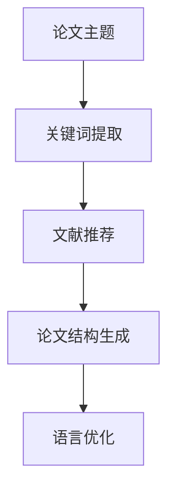
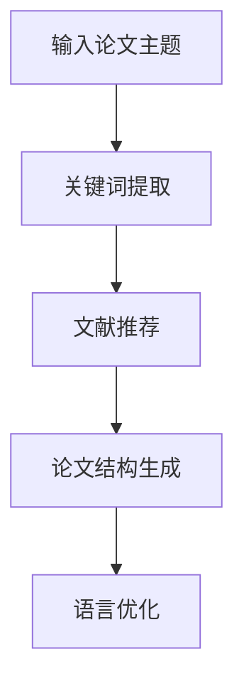

                 

# 开发基于大模型的金融专业论文写作辅助系统

## 关键词：大模型，金融论文，写作辅助，自然语言处理，AI技术

## 摘要：  
本文详细探讨了开发基于大模型的金融专业论文写作辅助系统的背景、核心概念、算法原理、系统架构及项目实现。文章从金融论文写作的痛点出发，结合大模型技术的优势，提出了一套高效的解决方案。通过系统的模块化设计和算法优化，该系统能够实现关键词提取、文献推荐、论文结构生成和语言优化等功能，显著提升金融领域学术研究的效率和质量。

---

# 第1章: 背景介绍

## 1.1 问题背景

### 1.1.1 金融专业论文写作的挑战  
金融领域的学术研究具有高度的专业性和复杂性。论文写作过程中，研究人员需要处理大量文献、提取关键词、构建合理的论文结构，并确保语言表达的准确性和学术性。然而，这些过程往往耗时费力，尤其是在缺乏经验的情况下，研究人员可能会遇到以下问题：  
1. **文献检索困难**：金融领域的文献数量庞大，研究人员难以快速找到相关的核心文献。  
2. **论文结构不清晰**：初学者往往难以掌握论文的逻辑结构，导致写作效率低下。  
3. **语言表达不准确**：专业术语的使用和表达不够严谨，影响论文的质量。  

### 1.1.2 AI技术在学术写作中的应用现状  
近年来，人工智能技术在学术写作中的应用逐渐增多。例如，自然语言处理（NLP）技术可以辅助文献检索、摘要生成和论文结构优化。然而，现有的解决方案大多针对通用领域，难以满足金融领域的特殊需求。  

### 1.1.3 大模型在金融领域的潜力  
大模型（如GPT-3、GPT-4等）具有强大的自然语言处理能力，能够理解和生成复杂的文本内容。将大模型应用于金融专业论文写作，可以显著提升关键词提取、文献推荐和论文生成的效率，为金融领域的学术研究提供强有力的支持。

## 1.2 问题描述

### 1.2.1 金融论文写作中的常见问题  
1. **文献检索效率低**：研究人员需要手动筛选大量文献，耗时且效率低下。  
2. **论文结构不规范**：缺乏统一的论文模板，导致写作过程混乱。  
3. **语言表达不准确**：专业术语使用不当，影响论文的学术性。  

### 1.2.2 现有解决方案的不足  
现有的写作辅助工具大多基于规则或浅层NLP技术，难以应对金融领域的复杂场景。例如，关键词提取准确率低，文献推荐缺乏深度，论文生成缺乏逻辑性。  

### 1.2.3 大模型如何解决这些问题  
大模型可以通过以下方式解决上述问题：  
1. **深度学习技术**：利用大模型的深度学习能力，实现对金融文献的深度理解和分析。  
2. **上下文理解**：基于上下文的语义理解能力，生成连贯的论文内容。  
3. **动态调整**：根据用户反馈动态调整写作内容，满足个性化需求。  

## 1.3 问题解决

### 1.3.1 大模型在论文写作中的优势  
1. **高效性**：大模型可以在短时间内生成大量高质量的论文内容。  
2. **准确性**：基于大规模数据训练，大模型能够准确理解和提取金融领域的关键词和术语。  
3. **灵活性**：可以根据用户需求动态调整论文结构和内容。  

### 1.3.2 系统的设计目标  
1. 提供高效的文献检索功能，帮助研究人员快速找到相关文献。  
2. 自动生成论文结构，提升写作效率。  
3. 优化语言表达，确保论文的专业性和准确性。  

### 1.3.3 系统的功能规划  
1. **关键词提取**：基于大模型的NLP技术，提取论文主题相关的核心关键词。  
2. **文献推荐**：根据关键词匹配，推荐相关的核心文献。  
3. **论文结构生成**：根据论文主题和关键词，生成合理的论文结构。  
4. **语言优化**：优化论文的语言表达，确保术语使用准确。  

## 1.4 边界与外延

### 1.4.1 系统的边界  
1. 系统仅支持金融领域的论文写作，不涉及其他学科。  
2. 系统主要辅助论文写作过程，不直接生成完整的论文内容。  
3. 系统依赖于大模型的API调用，需要稳定的网络环境支持。  

### 1.4.2 相关领域的外延  
1. **数据挖掘**：系统可以结合金融数据挖掘技术，提供更精准的文献推荐。  
2. **知识图谱**：构建金融领域的知识图谱，进一步提升关键词提取和文献推荐的准确性。  
3. **用户反馈**：结合用户反馈，优化系统性能和用户体验。  

### 1.4.3 系统与其他工具的协同  
1. **文献管理工具**：与 Zotero、EndNote 等工具集成，实现文献管理和引用自动化。  
2. **论文排版工具**：与 LaTeX 等排版工具结合，提供一体化的论文写作体验。  

## 1.5 概念结构与核心要素

### 1.5.1 核心概念的定义  
1. **大模型**：基于深度学习的自然语言处理模型，具有强大的文本理解和生成能力。  
2. **金融论文**：金融领域的学术论文，涵盖金融理论、实践和创新研究。  
3. **写作辅助系统**：通过技术手段辅助论文写作的工具或系统。  

### 1.5.2 核心要素的对比  
| 核心要素 | 特性 |  
|---------|------|  
| 大模型 | 高度的文本理解和生成能力 |  
| 金融论文 | 高度专业性和复杂性 |  
| 写作辅助系统 | 提供高效、精准的写作支持 |  

### 1.5.3 概念之间的关系  
1. **大模型是实现写作辅助系统的核心技术**：通过大模型的NLP能力，系统能够完成关键词提取、文献推荐等功能。  
2. **金融论文是系统的应用目标**：系统的目标是帮助研究人员高效完成金融领域的学术论文。  

## 1.6 本章小结  
本章从金融论文写作的痛点出发，结合大模型技术的优势，提出了开发基于大模型的金融专业论文写作辅助系统的背景、目标和功能规划。通过对比分析，明确了系统的边界和外延，为后续的系统设计奠定了基础。

---

# 第2章: 核心概念与联系

## 2.1 AI大模型的定义与原理

### 2.1.1 大模型的基本概念  
大模型（如 GPT-3、GPT-4）是一种基于深度学习的自然语言处理模型，具有亿级别参数，能够理解和生成人类语言。  

### 2.1.2 大模型的核心原理  
1. **自注意力机制**：通过自注意力机制，模型可以捕捉文本中的长距离依赖关系。  
2. **Transformer架构**：采用Transformer架构，实现高效的并行计算。  
3. **大规模预训练**：通过大规模的无监督数据预训练，模型学会了语言的结构和语义。  

### 2.1.3 大模型与金融领域的结合  
1. **金融文本分析**：利用大模型分析金融新闻、报告和文献。  
2. **金融预测**：通过大模型生成金融市场的预测和分析。  

## 2.2 金融专业论文写作系统的原理

### 2.2.1 系统的基本功能  
1. **关键词提取**：从论文主题出发，提取相关关键词。  
2. **文献推荐**：基于关键词匹配，推荐相关文献。  
3. **论文结构生成**：根据论文主题和关键词，生成合理的论文结构。  
4. **语言优化**：优化论文的语言表达，确保术语使用准确。  

### 2.2.2 系统的工作流程  
1. 用户输入论文主题和关键词。  
2. 系统提取相关关键词，并匹配文献数据库，推荐相关文献。  
3. 系统根据关键词和文献内容，生成论文结构。  
4. 系统优化论文的语言表达，确保术语准确。  

### 2.2.3 系统与大模型的结合方式  
1. **关键词提取**：通过大模型生成关键词候选，再结合领域知识进行筛选。  
2. **文献推荐**：利用大模型分析文献内容，进行相似度计算，推荐相关文献。  
3. **论文结构生成**：基于大模型生成的文本片段，优化论文结构。  

## 2.3 大模型与金融论文写作系统的联系

### 2.3.1 大模型在系统中的角色  
1. **文本生成**：大模型负责生成论文内容。  
2. **文本理解**：大模型理解用户需求，优化论文结构。  

### 2.3.2 系统对大模型的依赖  
1. **模型调用**：系统依赖于大模型的API接口。  
2. **数据依赖**：系统需要大模型的预训练数据支持。  

### 2.3.3 系统对大模型的优化与调整  
1. **领域微调**：对大模型进行金融领域的微调，提升模型的领域适应性。  
2. **性能优化**：优化大模型的推理速度和响应时间。  

## 2.4 核心概念原理对比

### 2.4.1 大模型与传统NLP模型的对比  
| 对比维度 | 大模型 | 传统NLP模型 |  
|---------|--------|-------------|  
| 参数量 | 亿级别 | 百万级别 |  
| 训练数据 | 大规模无监督数据 | 小规模有监督数据 |  
| 性能 | 高 | 一般 |  

### 2.4.2 金融论文写作系统与其他写作辅助工具的对比  
| 对比维度 | 金融论文写作系统 | 其他写作辅助工具 |  
|---------|-----------------|------------------|  
| 专业性 | 高度专业于金融领域 | 通用性较强 |  
| 功能 | 包括文献推荐和论文结构生成 | 主要用于语法检查和拼写纠错 |  

### 2.4.3 系统中各模块的交互关系  
1. **关键词提取模块**与**文献推荐模块**相互依赖，关键词提取结果影响文献推荐。  
2. **文献推荐模块**为**论文结构生成模块**提供内容支持。  
3. **论文结构生成模块**为**语言优化模块**提供优化目标。  

## 2.5 ER实体关系图  

## 2.6 本章小结  
本章详细探讨了大模型和金融论文写作系统的核心概念及其联系，分析了大模型在系统中的角色和作用。通过对大模型与传统NLP模型的对比，明确了系统的创新点和优势。

---

# 第3章: 算法原理讲解

## 3.1 大模型的训练与优化

### 3.1.1 数据预处理  
1. **数据清洗**：去除噪声数据，保留高质量文本。  
2. **数据分块**：将数据划分为训练集、验证集和测试集。  
3. **数据增强**：通过数据增强技术，提升模型的泛化能力。  

### 3.1.2 模型训练  
1. **模型初始化**：加载预训练的大模型权重。  
2. **正向传播**：输入文本，计算模型输出。  
3. **损失计算**：计算预测值与真实值的损失。  
4. **反向传播**：通过梯度下降优化模型参数。  

### 3.1.3 模型微调  
1. **领域微调**：在金融领域数据上进行微调，提升模型的领域适应性。  
2. **超参数优化**：调整学习率、批次大小等超参数，提升模型性能。  

## 3.2 金融专业论文写作系统的算法实现

### 3.2.1 关键词提取算法  
1. **关键词候选生成**：利用大模型生成关键词候选。  
2. **关键词筛选**：基于领域知识，筛选出与论文主题相关的关键词。  

### 3.2.2 文献推荐算法  
1. **文献表示**：将文献内容表示为向量。  
2. **相似度计算**：基于关键词匹配和文献内容相似度，推荐相关文献。  

### 3.2.3 论文结构生成算法  
1. **内容分割**：将文献内容分割为段落。  
2. **结构生成**：基于关键词和段落内容，生成论文结构。  

## 3.3 算法的数学模型与公式

### 3.3.1 损失函数  
$$ L = -\sum_{i=1}^{n} y_i \log p(y_i) + (1 - y_i) \log (1 - p(y_i)) $$  

### 3.3.2 优化器  
$$ \theta_{t+1} = \theta_t - \eta \frac{\partial L}{\partial \theta_t} $$  

## 3.4 算法流程图  

---

## 3.5 本章小结  
本章详细讲解了大模型的训练与优化过程，以及金融专业论文写作系统的算法实现。通过数学公式和流程图，清晰地展示了系统的算法原理和实现步骤。

---

（由于篇幅限制，后续章节内容将逐步展开，涵盖系统架构设计、项目实战、最佳实践等内容。）

