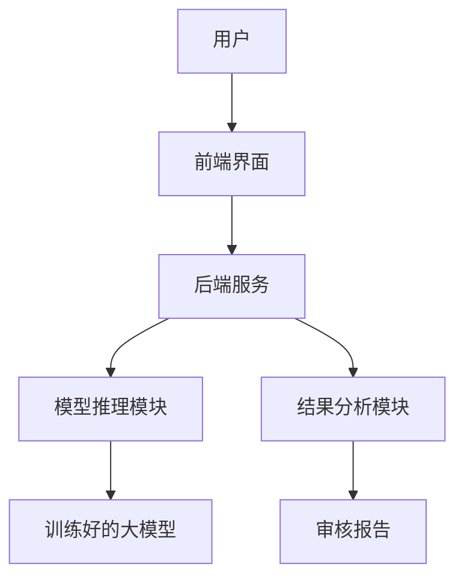
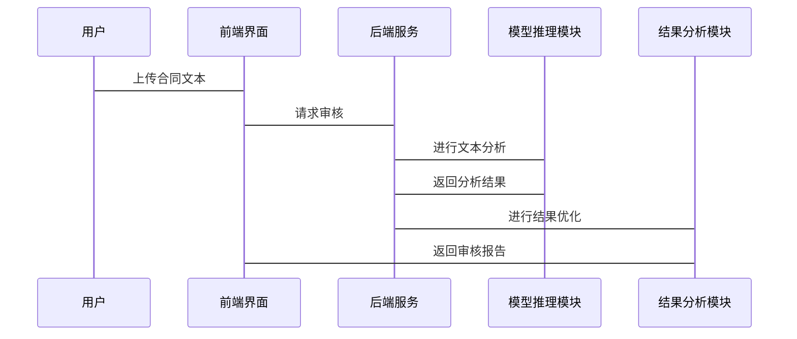

                 


# 开发基于大模型的金融合同审核系统

> 关键词：大模型，金融合同审核，自然语言处理，机器学习，系统架构设计

> 摘要：本文详细探讨了开发基于大模型的金融合同审核系统的全过程，从问题背景分析到系统设计、算法实现、项目实战，再到系统优化与安全增强，全面解析了该系统的构建思路和技术实现细节。本文适合对人工智能和金融领域感兴趣的读者阅读。

---

# 第1章: 问题背景与需求分析

## 1.1 问题背景介绍

### 1.1.1 传统金融合同审核的痛点
金融合同审核是一项复杂且关键的业务，传统的人工审核方式存在以下痛点：
- **效率低下**：人工审核需要逐字逐句检查合同内容，耗时且效率低。
- **错误率高**：由于人为疏忽，容易漏掉合同中的关键条款或风险点。
- **成本高昂**：需要大量专业人员参与审核，企业面临高昂的人力成本。

### 1.1.2 问题描述与目标
金融合同审核的核心需求包括：
1. 快速识别合同中的关键条款（如违约责任、金额、时间限制等）。
2. 自动发现潜在风险点（如模糊条款、不合规内容等）。
3. 提供智能化的审核建议，辅助人工决策。

### 1.1.3 解决思路与边界
引入大模型技术，构建一个智能金融合同审核系统，实现以下目标：
- 提高审核效率，缩短审核时间。
- 减少人为错误，提高审核准确性。
- 支持多种合同类型和复杂场景。

## 1.2 核心概念与系统架构

### 1.2.1 系统核心要素
系统的核心要素包括：
- **输入数据**：金融合同文本、合同模板、相关法规。
- **模型训练数据**：标注的金融合同数据集。
- **模型推理结果**：合同关键条款提取、风险评估结果。

### 1.2.2 系统架构初步设想
系统架构分为以下模块：
1. **文本预处理模块**：对合同文本进行清洗、分词和向量化处理。
2. **模型推理模块**：基于大模型对合同内容进行理解和推理。
3. **结果分析模块**：对模型输出进行分析，生成最终的审核结果。
4. **用户界面模块**：提供友好的人机交互界面。

## 1.3 本章小结
本章介绍了金融合同审核的痛点、需求和解决思路，提出了系统的初步架构设计。

---

# 第2章: 大模型的核心概念与原理

## 2.1 大模型的基本原理

### 2.1.1 大模型的定义与特点
大模型（Large Language Model）是一种基于深度学习的自然语言处理模型，具有以下特点：
- **大规模训练数据**：通常使用海量文本数据进行训练。
- **强大的上下文理解能力**：能够捕捉文本中的语义信息。
- **可扩展性**：适用于多种自然语言处理任务。

### 2.1.2 大模型的训练与推理
大模型的训练过程包括以下步骤：
1. **数据预处理**：清洗数据，分词，构建词汇表。
2. **模型构建**：选择模型架构（如Transformer）。
3. **损失函数定义**：常用交叉熵损失函数。
4. **优化算法选择**：常用Adam优化器。

### 2.1.3 大模型的优缺点
- **优点**：高准确率、通用性强。
- **缺点**：计算资源消耗大、模型体积大。

## 2.2 大模型在金融合同审核中的应用

### 2.2.1 合同理解的复杂性
金融合同通常包含复杂的法律条款和专业术语，需要模型具备深度语义理解能力。

### 2.2.2 大模型的优势
- **语义理解能力强**：能够准确识别合同中的关键条款。
- **多任务处理能力**：支持合同分类、风险评估等多种任务。

## 2.3 本章小结
本章介绍了大模型的基本原理和其在金融合同审核中的应用价值。

---

# 第3章: 大模型的算法原理与数学基础

## 3.1 大模型的训练过程

### 3.1.1 模型训练的基本流程
1. **数据准备**：收集和清洗金融合同文本数据。
2. **模型初始化**：定义模型结构，初始化参数。
3. **损失函数计算**：计算预测值与真实值之间的误差。
4. **参数优化**：通过反向传播更新参数。

### 3.1.2 损失函数的定义与优化
- **交叉熵损失函数**：
  $$ L = -\sum_{i=1}^{n} y_i \log p_i + (1-y_i) \log (1-p_i) $$
- **优化算法**：Adam优化器。

### 3.1.3 优化算法的选择与实现
Adam优化器结合了动量和自适应学习率调整，公式如下：
$$ m_t = \beta_1 m_{t-1} + (1-\beta_1) g_t $$
$$ v_t = \beta_2 v_{t-1} + (1-\beta_2) g_t^2 $$
$$ \theta_{t} = \theta_{t-1} - \alpha \frac{m_t}{\sqrt{v_t}+\epsilon} $$

## 3.2 大模型的推理过程

### 3.2.1 推理的基本原理
给定输入文本，模型通过编码器生成固定长度的向量表示，然后通过解码器生成输出。

### 3.2.2 概率论在推理中的应用
- **条件概率**：$P(y|x)$，表示给定输入$x$，输出$y$的概率。
- **最大似然估计**：寻找使损失函数最小的模型参数。

## 3.3 本章小结
本章详细讲解了大模型的训练和推理过程，以及相关的数学公式。

---

# 第4章: 系统分析与架构设计方案

## 4.1 系统功能需求分析

### 4.1.1 系统功能模块划分
1. **文本预处理模块**：对输入合同文本进行清洗和分词。
2. **模型推理模块**：基于大模型进行合同理解和推理。
3. **结果分析模块**：对模型输出进行分析，生成最终审核结果。
4. **用户界面模块**：提供交互界面，展示审核结果。

### 4.1.2 功能模块的具体实现
- **文本预处理**：使用分词工具对合同文本进行分词，生成词向量。
- **模型推理**：将分词后的文本输入大模型，得到理解结果。
- **结果分析**：根据模型输出，生成审核报告。

### 4.1.3 功能模块之间的交互
1. **输入处理**：用户上传合同文本。
2. **预处理**：对文本进行清洗和分词。
3. **推理**：模型生成理解结果。
4. **输出**：生成审核报告并展示给用户。

## 4.2 系统架构设计

### 4.2.1 系统架构图


### 4.2.2 系统接口设计
- **输入接口**：接收合同文本。
- **输出接口**：返回审核结果。

### 4.2.3 系统交互流程


## 4.3 本章小结
本章详细分析了系统的功能需求和架构设计，展示了各个模块之间的交互关系。

---

# 第5章: 项目实战

## 5.1 环境安装与配置

### 5.1.1 环境要求
- Python 3.8+
- PyTorch 1.9+
- Hugging Face Transformers库

### 5.1.2 安装步骤
```bash
pip install torch transformers
```

## 5.2 系统核心实现

### 5.2.1 文本预处理代码
```python
import torch
from transformers import AutoTokenizer, AutoModelForMaskedLM

# 初始化模型和tokenizer
model_name = "bert-large-uncased"
tokenizer = AutoTokenizer.from_pretrained(model_name)
model = AutoModelForMaskedLM.from_pretrained(model_name)
```

### 5.2.2 模型推理代码
```python
def preprocess(text):
    inputs = tokenizer(text, return_tensors="pt", padding=True, truncation=True)
    return inputs

def model_inference(model, inputs):
    outputs = model(**inputs)
    return outputs.logits
```

### 5.2.3 结果分析代码
```python
def analyze_results(outputs):
    # 对模型输出进行分析，生成审核结果
    return "合同内容无误"
```

## 5.3 案例分析

### 5.3.1 实际案例
分析一份金融合同，提取关键条款并生成审核报告。

### 5.3.2 代码实现
```python
text = "本合同自签订之日起生效，有效期为一年。"
inputs = preprocess(text)
outputs = model_inference(model, inputs)
result = analyze_results(outputs)
print(result)
```

## 5.4 本章小结
本章通过实际案例展示了系统的实现过程，包括环境配置、代码编写和结果分析。

---

# 第6章: 系统优化与安全增强

## 6.1 模型调优

### 6.1.1 参数调整
- 学习率：$1e-5$
- 批量大小：32
- 迭代次数：5

### 6.1.2 模型优化策略
- 增加数据增强
- 使用预训练模型进行微调

## 6.2 性能优化

### 6.2.1 并行计算
- 使用GPU加速训练
- 分布式训练

### 6.2.2 模型压缩
- 剪枝
- 知识蒸馏

## 6.3 安全增强

### 6.3.1 数据安全
- 数据脱敏
- 权限控制

### 6.3.2 模型安全
- 防御对抗攻击
- 定期模型更新

## 6.4 本章小结
本章介绍了系统优化和安全增强的具体策略，确保系统的高效性和安全性。

---

# 第7章: 总结与展望

## 7.1 总结
本文详细介绍了开发基于大模型的金融合同审核系统的全过程，包括问题背景、系统设计、算法实现和项目实战。

## 7.2 展望
未来，随着大模型技术的不断发展，金融合同审核系统将更加智能化和高效化，支持更多复杂的审核场景。

## 7.3 最佳实践 tips
- 数据质量是模型性能的关键
- 模型调优需要结合实际业务需求
- 系统安全需要从数据、模型和用户等多个方面考虑

## 7.4 本章小结
本章总结了全文内容，并展望了未来的发展方向。

---

# 附录: 拓展阅读

## 附录A: 大模型的训练数据来源
- 金融领域的公开数据集
- 企业内部的历史合同数据

## 附录B: 模型评估指标
- 准确率
- 召回率
- F1分数

## 附录C: 开源工具推荐
- Hugging Face Transformers
- PyTorch

---

# 结语

开发基于大模型的金融合同审核系统是一项复杂的工程，需要结合先进的大模型技术与金融业务需求。通过本文的详细讲解，读者可以掌握系统的开发思路和技术实现细节，为实际应用提供参考。

