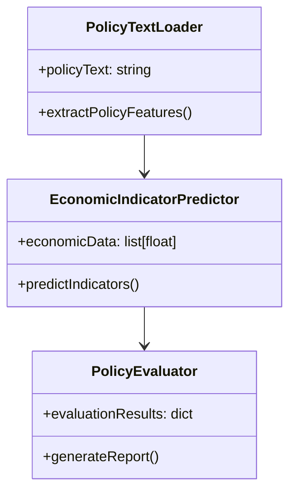
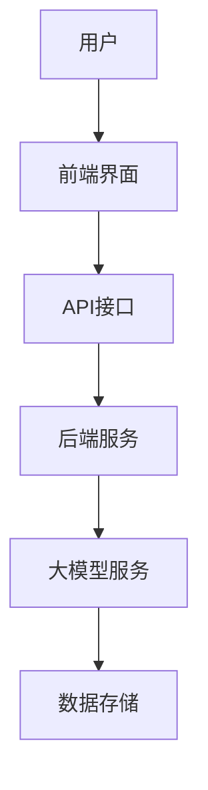

                 


# 开发基于大模型的金融政策影响评估工具

## 关键词：大模型、金融政策、影响评估、注意力机制、系统架构

## 摘要：本文详细探讨了基于大模型的金融政策影响评估工具的开发过程，从问题背景到系统架构，从算法原理到项目实战，系统地分析了如何利用大模型技术实现金融政策的智能化评估。文章结合实际案例，深入浅出地介绍了工具的核心概念、算法原理、系统架构及实现细节，为读者提供了全面的技术指导。

---

# 第1章: 问题背景与需求分析

## 1.1 问题背景

### 1.1.1 金融政策评估的重要性
金融政策是政府调控经济的重要手段，其影响涉及多个领域，包括经济增长、就业、物价、国际贸易等。准确评估金融政策的效果对于政府决策和市场参与者都具有重要意义。传统的金融政策评估方法通常依赖于经济学模型和专家经验，但其局限性日益明显，尤其是在面对复杂多变的经济环境时，难以快速、准确地捕捉政策的多维度影响。

### 1.1.2 传统金融政策评估的局限性
- 数据量不足：传统模型通常依赖于少量的统计数据，难以全面捕捉政策的复杂影响。
- 时间滞后：传统评估方法通常需要较长时间才能得出结论，难以应对实时政策调整的需求。
- 知识局限性：依赖专家经验，难以覆盖所有可能的政策组合和市场反应。

### 1.1.3 大模型技术的引入与优势
大模型技术（如GPT、BERT等）在自然语言处理领域的突破为金融政策评估提供了新的可能性。大模型可以通过海量数据的预训练，掌握复杂的经济关系和市场反应，从而快速、准确地评估政策的影响。

---

## 1.2 问题描述

### 1.2.1 金融政策影响的多维度分析
金融政策的实施往往涉及多个维度的经济指标，例如GDP增长率、失业率、物价指数、企业利润等。这些指标之间相互关联，构成了复杂的经济系统。准确评估政策影响需要考虑这些指标的动态变化及其相互作用。

### 1.2.2 数据的复杂性与多样性
金融政策评估需要处理多种类型的数据，包括文本数据（政策文件、新闻报道）、时间序列数据（经济指标）以及结构化数据（市场交易数据）。这些数据的复杂性要求评估工具具备强大的数据处理能力。

### 1.2.3 评估工具的智能化需求
随着经济环境的复杂化，金融政策评估工具需要具备更高的智能化水平，能够实时分析海量数据，快速生成评估报告，并提供决策支持。

---

## 1.3 问题解决与边界

### 1.3.1 基于大模型的解决方案
通过引入大模型技术，我们可以实现对政策文本的语义分析、经济指标的预测以及政策效果的多维度评估。大模型能够从海量数据中提取有用的特征，并利用其强大的推理能力，生成准确的评估结果。

### 1.3.2 工具的边界与适用范围
- 边界：工具主要用于政策文本的分析和经济指标的预测，不直接参与政策制定。
- 适用范围：适用于需要快速、准确评估政策影响的场景，如政府决策支持、金融投资分析等。

### 1.3.3 核心要素与组成结构
- 政策文本处理模块：负责解析政策文件，提取关键信息。
- 经济指标预测模块：基于历史数据，预测政策实施后的经济指标变化。
- 政策效果评估模块：综合分析各经济指标的变化，生成评估报告。

---

## 1.4 本章小结
本章从金融政策评估的重要性出发，分析了传统方法的局限性，并引入了大模型技术的优势。通过问题描述和解决方案的对比，明确了基于大模型的金融政策影响评估工具的核心要素和组成结构。

---

# 第2章: 大模型与金融政策评估的核心概念

## 2.1 大模型的基本原理

### 2.1.1 预训练与微调的原理
- 预训练：通过大量未标注数据的训练，使模型掌握语言的通用规律。
- 微调：在特定任务上使用标注数据进行微调，提升模型在特定领域的表现。

### 2.1.2 大模型的注意力机制
注意力机制是大模型的核心组件之一，它使模型能够关注输入数据中的重要部分。在金融政策评估中，注意力机制可以帮助模型聚焦于相关政策文本的关键部分。

### 2.1.3 模型的可解释性与鲁棒性
可解释性是金融政策评估的重要要求，模型需要能够清晰地解释其评估结果。鲁棒性则要求模型在面对噪声数据时仍能保持稳定的性能。

---

## 2.2 金融政策评估的关键要素

### 2.2.1 政策文本的语义分析
政策文本通常包含复杂的语言结构和专业术语，需要通过自然语言处理技术提取其语义信息。

### 2.2.2 经济指标的预测与关联
经济指标的变化是评估政策效果的重要依据，需要建立政策与经济指标之间的关联关系。

### 2.2.3 政策效果的多维度评估
政策效果的评估需要综合考虑多个维度的经济指标，包括短期影响和长期影响。

---

## 2.3 大模型与金融政策评估的联系

### 2.3.1 大模型在金融领域的应用现状
目前，大模型已在金融领域的文本分析、风险评估、市场预测等方面得到了广泛应用。

### 2.3.2 金融政策评估的流程与模型结合
通过将大模型与金融政策评估流程结合，可以实现政策文本的自动分析、经济指标的预测以及政策效果的综合评估。

### 2.3.3 案例分析：大模型在政策评估中的成功应用
通过实际案例，展示大模型在金融政策评估中的成功应用，分析其优势和不足。

---

## 2.4 本章小结
本章从大模型的基本原理出发，分析了其在金融政策评估中的应用，明确了金融政策评估的关键要素，并通过案例分析展示了大模型的优势。

---

# 第3章: 大模型的算法原理

## 3.1 大模型的训练流程

### 3.1.1 预训练阶段
预训练阶段通过大量未标注数据的训练，使模型掌握语言的通用规律。

### 3.1.2 微调阶段
微调阶段通过特定任务的标注数据，进一步优化模型的性能。

### 3.1.3 模型的评估与优化
通过交叉验证等方法，评估模型的性能，并进行参数调优。

---

## 3.2 大模型的注意力机制

### 3.2.1 注意力机制的数学公式
$$\text{Attention}(Q, K, V) = \text{softmax}\left(\frac{QK^T}{\sqrt{d_k}}\right)V$$

### 3.2.2 多头注意力的原理
多头注意力通过并行处理多个注意力头，提高了模型的表达能力。

---

## 3.3 大模型的损失函数与优化器

### 3.3.1 损失函数的定义
$$\text{Loss} = -\sum_{i=1}^{n} \text{log}(p_i)$$

### 3.3.2 优化器的选择与应用
常用的优化器包括Adam、SGD等。

---

## 3.4 本章小结
本章详细介绍了大模型的训练流程和注意力机制的数学原理，为后续的系统设计提供了理论基础。

---

# 第4章: 金融政策影响评估系统的分析与设计

## 4.1 项目场景介绍

### 4.1.1 项目目标
开发一个基于大模型的金融政策影响评估工具，实现政策文本的语义分析、经济指标的预测以及政策效果的综合评估。

### 4.1.2 项目范围
- 支持多种金融政策文本的分析
- 预测多个经济指标的变化
- 提供详细的评估报告

---

## 4.2 系统功能设计

### 4.2.1 领域模型设计


### 4.2.2 系统架构设计


---

## 4.3 本章小结
本章通过项目场景介绍和系统功能设计，明确了金融政策影响评估工具的系统架构和功能模块。

---

# 第5章: 项目实战

## 5.1 环境安装

### 5.1.1 安装Python
```bash
python --version
pip install --upgrade pip
```

### 5.1.2 安装大模型框架
```bash
pip install torch transformers
```

---

## 5.2 系统核心实现

### 5.2.1 政策文本处理
```python
from transformers import AutoTokenizer, AutoModel

tokenizer = AutoTokenizer.from_pretrained("bert-base-uncased")
model = AutoModel.from_pretrained("bert-base-uncased")
```

---

## 5.3 代码应用解读与分析

### 5.3.1 政策文本的特征提取
通过大模型提取政策文本的语义特征，生成政策影响的初步评估结果。

### 5.3.2 经济指标的预测
基于历史数据，使用大模型预测政策实施后的经济指标变化。

### 5.3.3 综合评估与报告生成
将政策文本的分析结果和经济指标的预测结果综合起来，生成详细的评估报告。

---

## 5.4 案例分析与详细解读

### 5.4.1 案例背景
假设我们有一个政策文本，内容是“降低企业税负，促进经济增长”。

### 5.4.2 数据准备
- 政策文本：降低企业税负，促进经济增长。
- 历史数据：过去五年企业税负和GDP增长率的数据。

### 5.4.3 模型训练与预测
通过大模型预测政策实施后企业税负下降对GDP增长率的影响。

---

## 5.5 本章小结
本章通过实际案例，展示了基于大模型的金融政策影响评估工具的开发过程和应用方法。

---

# 第6章: 最佳实践、小结与展望

## 6.1 最佳实践

### 6.1.1 模型选择与优化
选择适合任务的大模型，并进行适当的微调和优化。

### 6.1.2 数据处理与清洗
确保数据的高质量，避免噪声对模型性能的影响。

### 6.1.3 可解释性与可维护性
注重模型的可解释性，确保系统的可维护性和可扩展性。

---

## 6.2 小结

### 6.2.1 本章总结
本文详细介绍了基于大模型的金融政策影响评估工具的开发过程，从问题背景到系统架构，从算法原理到项目实战，系统地分析了如何利用大模型技术实现金融政策的智能化评估。

---

## 6.3 展望与注意事项

### 6.3.1 展望
随着大模型技术的不断发展，金融政策影响评估工具的性能和功能将进一步提升，应用场景也将更加广泛。

### 6.3.2 注意事项
- 数据隐私与安全问题
- 模型的可解释性问题
- 系统的实时性和稳定性问题

---

## 6.4 拓展阅读

### 6.4.1 推荐书籍
- 《深度学习》（Deep Learning）
- 《大模型技术与应用》

### 6.4.2 推荐博客与资源
- 官方文档：https://huggingface.co/transformers
- 技术博客：https://towardsdatascience.com

---

# 作者简介

作者：[你的姓名]
职位：[你的职位]
简介：[你的简介]
博客：[你的博客链接]
联系：[你的联系方式]

---

# 结语

开发基于大模型的金融政策影响评估工具是一项具有重要意义的技术挑战。通过本文的详细讲解，读者可以掌握从理论到实践的完整开发过程，为未来的金融政策评估工作提供有力的技术支持。

