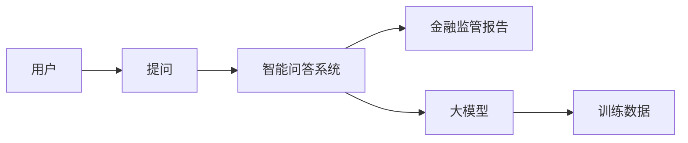
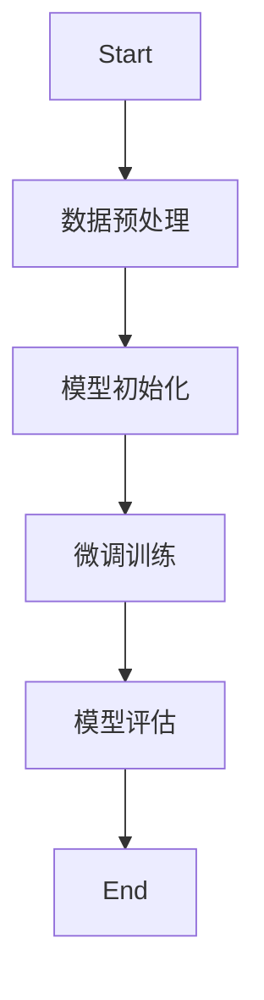
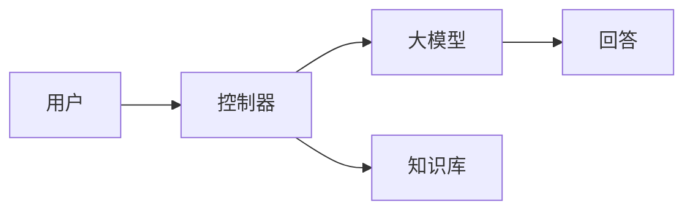
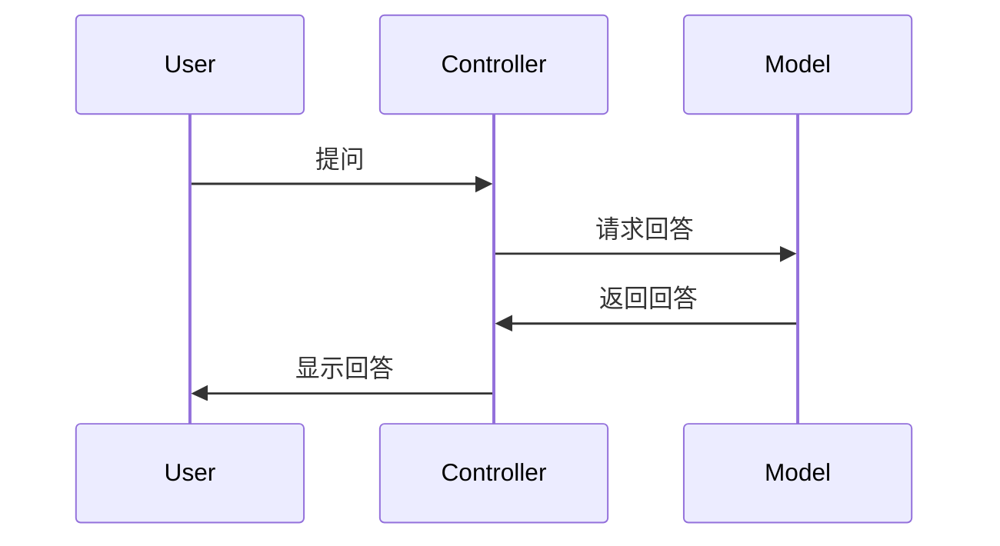

                 


# 开发基于大模型的金融监管报告智能问答助手

> 关键词：大模型、金融监管、智能问答、自然语言处理、深度学习、问答系统

> 摘要：随着人工智能技术的快速发展，大模型在金融监管领域的应用逐渐成为研究热点。本文深入探讨了如何利用大模型开发智能问答助手，解决金融监管报告中的复杂问题。通过分析核心概念、算法原理、系统架构和实际案例，本文为读者提供了从理论到实践的全面指导。

---

## 第1章: 背景介绍

### 1.1 问题背景
金融监管是维护金融市场稳定的重要手段，传统的监管方式依赖人工审核和规则匹配，效率低且难以应对复杂场景。随着金融数据的爆炸式增长，如何快速、准确地处理监管报告并回答相关问题成为亟待解决的挑战。

### 1.2 问题描述
金融监管报告通常包含大量复杂信息，如法律法规、交易数据和市场动态。用户（如监管机构、金融机构和投资者）需要快速理解报告内容并获取实时解答。传统问答系统难以应对金融领域的深度和复杂性，大模型的引入为这一问题提供了新的解决方案。

### 1.3 问题解决思路
利用大模型的自然语言处理能力，构建智能问答助手，实现对金融监管报告的自动化理解与交互式问答。通过训练大模型在金融领域的知识库，使其能够准确理解用户需求并生成精准答案。

### 1.4 边界与外延
- **边界**：智能问答助手主要专注于金融监管报告的解读，不涉及交易执行或其他操作性任务。
- **外延**：可以扩展至其他领域，如法律咨询和商业分析，但本文主要聚焦于金融监管场景。

### 1.5 概念结构与核心要素
- **核心概念**：金融监管报告、智能问答、大模型。
- **关系**：大模型作为技术手段，智能问答助手作为实现形式，金融监管报告是应用场景。

---

## 第2章: 核心概念与联系

### 2.1 AI大模型的定义与特点
AI大模型（如GPT-3、PaLM）是基于深度学习的大型语言模型，具有以下特点：
- **大规模参数**：通常包含 billions 级别的参数，能够学习复杂的语言模式。
- **上下文理解**：能够处理长文本，理解上下文关系。
- **生成能力**：能够生成自然流畅的文本，适用于多种任务。

### 2.2 金融监管的关键要素
金融监管涉及以下关键要素：
- **监管目标**：确保市场公平、透明和合规。
- **监管数据**：包括交易数据、公司财报、法规文件等。
- **监管报告**：总结监管发现和建议的正式文件。

### 2.3 大模型与金融监管的结合点
- **自然语言处理**：大模型能够理解金融报告中的复杂文本。
- **问答系统**：通过大模型实现交互式问答，辅助用户快速获取监管信息。
- **知识库构建**：利用大模型训练金融领域的知识库，提升问答准确性。

### 2.4 概念对比
以下是大模型与传统NLP技术的对比：

| **对比维度** | **传统NLP** | **大模型** |
|--------------|--------------|------------|
| **技术原理** | 基于规则或浅层学习 | 基于深度学习，参数量大 |
| **处理能力** | 适用于简单任务（如关键词提取） | 适用于复杂任务（如问答、摘要） |
| **效果** | 受限于规则的全面性 | 更接近人类语言理解能力 |

### 2.5 实体关系图


---

## 第3章: 算法原理讲解

### 3.1 大模型的训练流程
1. **数据预处理**：清洗和标注金融监管报告数据。
2. **模型初始化**：选择适合的预训练模型。
3. **微调训练**：在金融领域数据上进行微调，优化模型性能。
4. **评估与优化**：通过验证集评估模型效果，调整超参数。

### 3.2 算法流程图


### 3.3 模型数学公式
大模型的训练通常使用交叉熵损失函数：
$$ L = -\sum_{i=1}^{n} \sum_{j=1}^{m} y_{ij} \log p(y_{ij}|x_i) $$
其中，$y_{ij}$ 是真实标签，$p(y_{ij}|x_i)$ 是模型预测的概率。

优化器通常采用Adam：
$$ \theta_{t+1} = \theta_t - \eta \frac{\partial L}{\partial \theta_t} $$

---

## 第4章: 系统分析与架构设计

### 4.1 问题场景介绍
用户需要一个能够快速理解金融监管报告并回答相关问题的智能助手。

### 4.2 系统功能设计
- **用户输入**：用户输入监管报告相关问题。
- **模型处理**：智能问答系统调用大模型生成回答。
- **输出结果**：返回结构化的答案。

### 4.3 系统架构设计


### 4.4 系统交互流程


---

## 第5章: 项目实战

### 5.1 环境安装
安装必要的库：
```bash
pip install transformers
pip install torch
```

### 5.2 核心代码实现
```python
from transformers import AutoTokenizer, AutoModelForQuestionAnswering

tokenizer = AutoTokenizer.from_pretrained("facebook/roberta-large")
model = AutoModelForQuestionAnswering.from_pretrained("facebook/roberta-large")

def answer_question(question, context):
    inputs = tokenizer.encode_plus(question + " " + context, return_tensors="pt", add_special_tokens=True)
    outputs = model(**inputs)
    start_scores = outputs.start_logits[0]
    end_scores = outputs.end_logits[0]
    start_idx = torch.argmax(start_scores)
    end_idx = torch.argmax(end_scores)
    answer = tokenizer.decode(inputs.input_ids[0][start_idx:end_idx+1])
    return answer
```

### 5.3 实际案例分析
案例：用户提问“某公司2023年财报的净利润是多少？”
- 输入：问题 + 上下文（财报内容）
- 输出：净利润的具体数值

---

## 第6章: 最佳实践与总结

### 6.1 小结
通过大模型技术，我们可以显著提升金融监管报告的处理效率和准确性。

### 6.2 注意事项
- 数据隐私保护是关键，需遵守相关法律法规。
- 模型的可解释性需要进一步优化。

### 6.3 拓展阅读
建议深入学习大模型在其他领域的应用，如医疗和法律。

---

## 结语
本文系统地介绍了开发基于大模型的金融监管报告智能问答助手的背景、核心概念、算法原理、系统架构和实际案例。希望读者能够通过本文的指导，掌握相关技术并应用于实际场景中。

