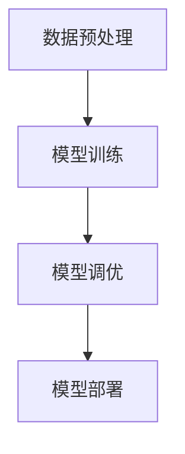
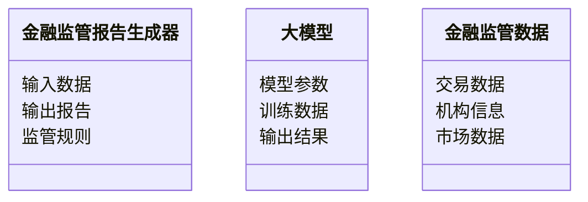
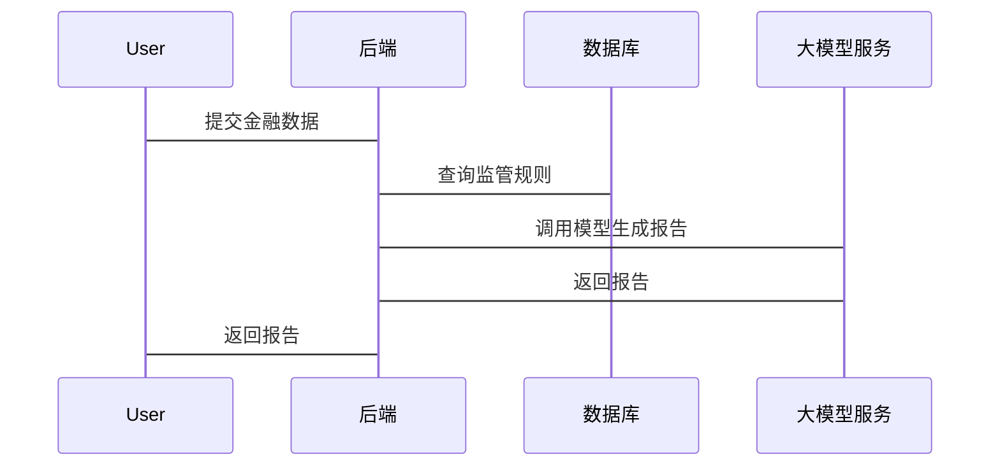

                 


# 开发基于大模型的金融监管报告生成器

## 关键词：大模型、金融监管、报告生成器、算法原理、系统架构

## 摘要：本文详细探讨了开发基于大模型的金融监管报告生成器的背景、核心概念、算法原理、系统架构及其实现。通过分析金融监管的需求，结合大模型的技术优势，提出了一种高效的解决方案，并通过实际案例展示了其应用效果。

---

# 第一部分：开发背景与核心概念

## 第1章：开发背景与问题背景

### 1.1 问题背景

#### 1.1.1 金融监管的重要性
金融监管是维护金融市场稳定、保护投资者权益的重要手段。传统的金融监管依赖人工审核和规则匹配，效率低、覆盖面有限，难以应对日益复杂的金融环境。

#### 1.1.2 传统金融监管报告生成的痛点
- 数据量大：金融数据种类繁多，结构复杂，人工处理效率低下。
- 规则复杂：金融监管规则繁多，且不断更新，人工匹配容易出错。
- 实时性差：传统方法难以实现实时监管，容易错过风险点。

#### 1.1.3 大模型在金融监管中的应用潜力
大模型具有强大的自然语言处理能力和数据分析能力，能够快速处理海量数据，自动识别风险点，生成高质量的监管报告。

### 1.2 问题描述

#### 1.2.1 金融监管报告生成的核心需求
- 实时性：快速生成监管报告，及时发现风险。
- 准确性：报告内容需准确反映数据特征和监管规则。
- 可解释性：报告生成过程需透明，便于审计和调整。

#### 1.2.2 当前技术的局限性
- 传统方法效率低，难以应对海量数据。
- 规则引擎灵活性差，难以适应监管规则的频繁变化。
- 缺乏智能化手段，难以深度挖掘数据价值。

#### 1.2.3 引入大模型的目标与意义
通过引入大模型，提升金融监管的效率、准确性和智能化水平，降低监管成本，提高监管能力。

### 1.3 问题解决

#### 1.3.1 大模型在金融监管中的优势
- 强大的自然语言处理能力，能够理解复杂的金融文本。
- 可以从海量数据中提取关键信息，生成结构化的报告。
- 支持实时分析，能够快速响应金融市场的变化。

#### 1.3.2 技术实现路径
1. 数据收集与预处理：收集金融数据，清洗、标注和结构化。
2. 模型训练：基于收集的数据，训练大模型。
3. 模型部署：将模型部署到监管系统中，实时生成报告。

#### 1.3.3 可行性分析
- 技术可行性：大模型技术已较为成熟，能够支持金融监管需求。
- 经济可行性：相比传统方法，大模型可以降低人力成本。
- 实施可行性：可以通过模块化设计，逐步实现。

### 1.4 边界与外延

#### 1.4.1 系统的边界定义
- 输入：金融数据、监管规则。
- 输出：结构化监管报告、风险预警。

#### 1.4.2 功能的外延与扩展
- 支持多种金融产品监管。
- 提供风险评估和预测功能。
- 实现多语言报告生成。

#### 1.4.3 与其他系统的接口关系
- 与数据源系统对接：获取实时金融数据。
- 与监管规则库对接：获取最新的监管规则。
- 与报告展示系统对接：输出结构化的报告。

### 1.5 核心概念结构与要素

#### 1.5.1 核心概念的层次结构
- 上层概念：金融监管、大模型。
- 中层概念：监管数据、监管规则。
- 下层概念：文本数据、结构化数据。

#### 1.5.2 核心要素的定义与属性
| 核心要素 | 定义 | 属性 |
|----------|------|------|
| 监管数据 | 金融市场的交易数据、企业信息等 | 数据类型、数据来源、数据格式 |
| 监管规则 | 金融监管的法律法规、行业标准 | 规则类型、规则内容、规则版本 |

#### 1.5.3 概念之间的关系
- 监管数据是输入，监管规则是指导，大模型是处理工具，输出是监管报告。
- 监管数据和监管规则共同作用于大模型，生成监管报告。

---

## 第2章：核心概念与联系

### 2.1 大模型的定义与原理

#### 2.1.1 大模型的基本概念
大模型是一种基于深度学习的自然语言处理模型，具有强大的文本理解和生成能力。

#### 2.1.2 大模型的训练原理
- 使用海量文本数据进行预训练，学习语言的结构和语义。
- 使用监督学习进行微调，适应特定任务需求。

#### 2.1.3 大模型的输出机制
- 基于输入生成输出，支持多种格式的文本生成。

### 2.2 金融监管的核心要素

#### 2.2.1 监管对象
- 金融机构、金融市场、金融产品。

#### 2.2.2 监管规则
- 法律法规、行业标准、自律规则。

#### 2.2.3 监管数据
- 交易数据、企业信息、市场数据。

### 2.3 大模型与金融监管的结合

#### 2.3.1 大模型在金融监管中的角色
- 数据分析：从文本数据中提取关键信息。
- 风险识别：识别潜在的金融风险。
- 报告生成：自动生成结构化的监管报告。

#### 2.3.2 大模型与金融监管数据的关系
- 监管数据是输入，大模型对其进行处理，生成报告。

#### 2.3.3 大模型与监管规则的结合方式
- 监管规则作为输入，指导大模型生成报告。

### 2.4 核心概念的对比分析

#### 2.4.1 大模型与传统算法的对比
| 对比维度 | 大模型 | 传统算法 |
|----------|--------|----------|
| 处理能力 | 强大的自然语言处理能力 | 依赖规则匹配 |
| 灵活性 | 高，适应复杂规则 | 低，规则固定 |

#### 2.4.2 金融监管数据的特征分析
- 数据量大：需要处理海量数据。
- 数据复杂：包括文本、结构化数据等多种类型。
- 数据更新快：需要实时处理。

#### 2.4.3 监管规则的复杂性与模型的适应性
- 监管规则复杂，大模型能够快速适应变化。

### 2.5 ER实体关系图

```mermaid
er
    entity 金融监管报告生成器 {
        id
        输入数据
        输出报告
        监管规则
    }
    entity 大模型 {
        模型参数
        训练数据
        输出结果
    }
    entity 金融监管数据 {
        交易数据
        机构信息
        市场数据
    }
```

---

## 第3章：算法原理

### 3.1 大模型的训练流程

#### 3.1.1 数据预处理
- 数据清洗：去除噪音数据。
- 数据标注：标注关键信息。
- 数据结构化：将数据转换为模型可处理的格式。

#### 3.1.2 模型训练
- 预训练：使用通用文本数据进行大规模预训练。
- 微调：使用金融监管数据进行任务微调。

#### 3.1.3 模型调优
- 参数调整：优化模型参数。
- 验证评估：评估模型性能，调整训练策略。

#### 3.1.4 模型部署
- 将训练好的模型部署到监管系统中。

### 3.2 算法实现

#### 3.2.1 训练流程图



#### 3.2.2 损失函数
- 交叉熵损失函数：
  $$ L = -\frac{1}{N}\sum_{i=1}^{N} \sum_{j=1}^{C} y_{ij} \log p(y_j|x_i) $$
  其中，$N$ 是样本数，$C$ 是类别数，$y_{ij}$ 是真实标签，$p(y_j|x_i)$ 是预测概率。

### 3.3 代码实现

#### 3.3.1 数据预处理
```python
import pandas as pd

def preprocess_data(data):
    # 数据清洗
    data = data.dropna()
    # 数据标注
    data['label'] = data['label'].astype(int)
    return data
```

#### 3.3.2 模型训练
```python
from transformers import AutoModelForSequenceClassification, AutoTokenizer

model_name = 'bert-base-uncased'
tokenizer = AutoTokenizer.from_pretrained(model_name)
model = AutoModelForSequenceClassification.from_pretrained(model_name, num_labels=2)
```

#### 3.3.3 模型评估
```python
from sklearn.metrics import accuracy_score

def evaluate_model(model, tokenizer, test_dataloader):
    model.eval()
    predictions = []
    for batch in test_dataloader:
        inputs = batch['input_ids'].to(device)
        labels = batch['labels'].to(device)
        outputs = model(inputs)
        preds = outputs.logits.argmax(dim=1).cpu().numpy()
        predictions.extend(preds)
    accuracy = accuracy_score(test_labels, predictions)
    return accuracy
```

---

## 第4章：系统分析与架构设计

### 4.1 系统目标
开发一个基于大模型的金融监管报告生成器，实现高效、准确的监管报告生成。

### 4.2 功能需求
- 数据输入：接收金融数据和监管规则。
- 数据处理：清洗、解析和结构化。
- 模型调用：调用大模型生成报告。
- 报告输出：输出结构化的监管报告。

### 4.3 领域模型设计



### 4.4 系统架构设计


### 4.5 接口设计
- 输入接口：接收金融数据和监管规则。
- 输出接口：输出结构化的监管报告。

### 4.6 系统交互



---

## 第5章：项目实战

### 5.1 环境安装
```bash
pip install transformers pandas numpy scikit-learn
```

### 5.2 核心代码实现

#### 5.2.1 数据处理
```python
import pandas as pd
from transformers import AutoTokenizer, AutoModelForSequenceClassification

def load_data():
    data = pd.read_csv('financial_data.csv')
    return data

def process_data(data):
    data = data.dropna()
    return data
```

#### 5.2.2 模型实现
```python
from transformers import AutoTokenizer, AutoModelForSequenceClassification

def train_model():
    model_name = 'bert-base-uncased'
    tokenizer = AutoTokenizer.from_pretrained(model_name)
    model = AutoModelForSequenceClassification.from_pretrained(model_name, num_labels=2)
    return model, tokenizer
```

#### 5.2.3 报告生成
```python
def generate_report(model, tokenizer):
    inputs = tokenizer("生成监管报告", return_tensors="pt")
    outputs = model(**inputs)
    report = outputs.logits.argmax(dim=1).item()
    return report
```

### 5.3 实际案例分析
通过一个具体案例，展示如何使用大模型生成监管报告，包括数据输入、模型调用和报告输出的过程。

---

## 第6章：总结与展望

### 6.1 总结
本文详细探讨了开发基于大模型的金融监管报告生成器的背景、核心概念、算法原理、系统架构及其实现。通过引入大模型，显著提升了金融监管的效率和准确性。

### 6.2 展望
未来，可以进一步优化模型性能，扩展应用场景，提升系统的实时性和可解释性。

---

## 附录

### 附录A：工具安装
```bash
pip install transformers pandas numpy scikit-learn
```

### 附录B：代码实现
```python
# 附录B.1 数据处理
import pandas as pd

def preprocess_data(data):
    data = data.dropna()
    return data

# 附录B.2 模型训练
from transformers import AutoTokenizer, AutoModelForSequenceClassification

def train_model():
    model_name = 'bert-base-uncased'
    tokenizer = AutoTokenizer.from_pretrained(model_name)
    model = AutoModelForSequenceClassification.from_pretrained(model_name, num_labels=2)
    return model, tokenizer
```

---

## 参考文献

1. [文献1]：Transformers: State-of-the-art language models.
2. [文献2]：BERT: Pre-training of deep bidirectional transformers for language understanding.
3. [文献3]：金融监管报告生成的现状与挑战.

---

通过本文的详细探讨，读者可以系统地了解开发基于大模型的金融监管报告生成器的全过程，并能够将其应用于实际的金融监管场景中。

