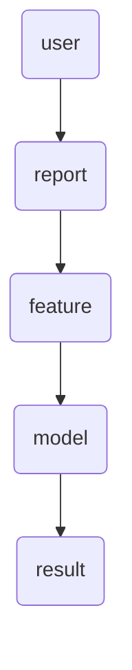
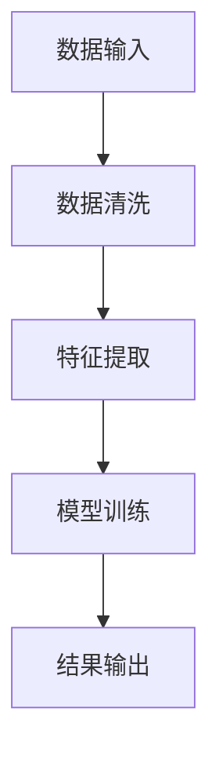
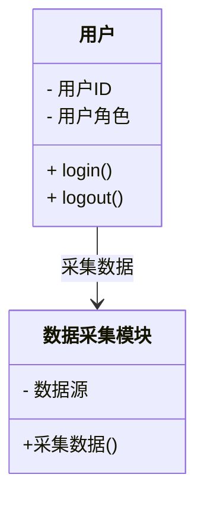
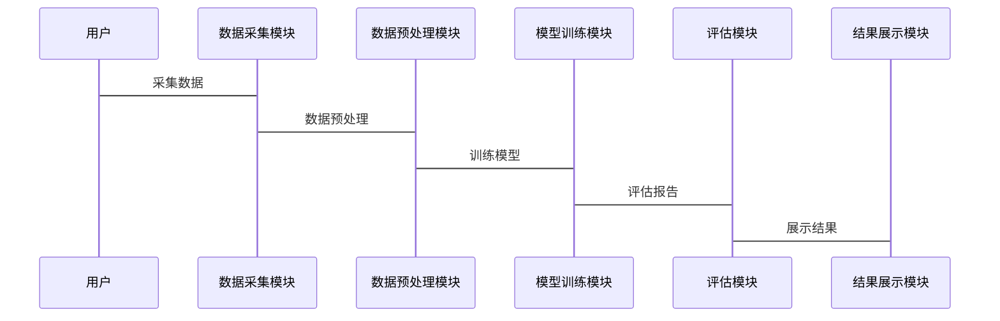

                 


# 开发基于大模型的金融研究报告评估系统

> 关键词：大模型、金融研究报告、评估系统、自然语言处理、人工智能、金融分析

> 摘要：本文详细探讨了如何利用大模型技术开发金融研究报告评估系统。文章从问题背景出发，分析了传统评估方法的痛点，提出了基于大模型的解决方案。随后，详细阐述了系统的架构设计、核心算法原理、系统实现与实战案例，并给出了最佳实践建议。通过本文，读者可以全面了解如何利用大模型技术提升金融研究报告的评估效率与准确性。

---

# 第一部分: 开发背景与需求分析

## 第1章: 问题背景与需求分析

### 1.1 问题背景

#### 1.1.1 传统金融研究报告评估的痛点
金融研究报告的评估通常依赖人工分析，存在以下痛点：
- **效率低下**：人工评估耗时长，难以满足金融机构对大量报告的快速处理需求。
- **主观性强**：评估结果受评估人员主观因素影响，缺乏客观性。
- **一致性不足**：不同评估人员对同一份报告的评估结果可能存在较大差异。
- **数据利用率低**：难以充分利用历史数据和知识库中的信息进行辅助评估。

#### 1.1.2 大模型技术的兴起与应用潜力
大模型（如GPT、BERT等）在自然语言处理领域的突破性进展，使其在文本分析、信息提取和自动评估等方面展现出巨大潜力。金融研究报告的评估可以通过大模型技术实现自动化、智能化，从而提升效率和准确性。

#### 1.1.3 金融行业对智能化评估系统的需求
金融机构对金融研究报告的评估需求日益增长，智能化评估系统能够：
- 快速处理大量报告。
- 提供客观、一致的评估结果。
- 充分利用历史数据和知识库进行辅助决策。

### 1.2 问题描述

#### 1.2.1 金融研究报告评估的核心挑战
金融研究报告的评估涉及以下关键挑战：
- **多维度评估**：包括报告的准确性、逻辑性、数据支持度等多维度。
- **复杂文本分析**：需要处理专业术语、行业知识和复杂语义。
- **实时性要求**：部分场景需要快速评估结果。

#### 1.2.2 现有评估方法的局限性
现有评估方法主要依赖人工分析，存在以下局限性：
- **效率低**：人工评估耗时长，难以满足大规模需求。
- **主观性强**：评估结果受评估人员主观影响。
- **难以量化**：缺乏统一的量化标准。

#### 1.2.3 基于大模型的评估系统的目标与边界
目标：
- 开发一个基于大模型的金融研究报告评估系统，实现自动化、智能化的评估。
边界：
- 系统仅针对金融研究报告的文本内容进行评估，不涉及外部数据源的实时查询。
- 系统暂不支持实时评估，适用于非实时场景。

### 1.3 解决方案概述

#### 1.3.1 基于大模型的评估系统的优势
- **高效性**：自动化处理大量报告，显著提升评估效率。
- **客观性**：基于模型的评估结果，减少主观因素影响。
- **一致性**：统一的评估标准，确保结果一致性。

#### 1.3.2 系统的核心功能与模块划分
系统核心功能包括：
- **数据采集**：从知识库和历史报告中获取数据。
- **模型训练**：基于金融研究报告数据训练大模型。
- **评估模块**：对新报告进行多维度评估。
- **结果展示**：以可视化形式展示评估结果。

#### 1.3.3 系统的适用场景与预期效果
适用场景：
- 金融机构内部报告评估。
- 金融学术研究中的报告评估。
预期效果：
- 提升评估效率，降低人工成本。
- 提高评估结果的客观性和一致性。

### 1.4 本章小结
本章分析了传统金融研究报告评估的痛点，提出了基于大模型的评估系统解决方案，并明确了系统的功能模块和适用场景。

---

# 第二部分: 核心概念与系统架构

## 第2章: 核心概念与系统架构

### 2.1 基于大模型的金融评估系统核心概念

#### 2.1.1 大模型在金融分析中的应用原理
大模型通过预训练掌握大规模语言数据，能够理解和生成人类语言。在金融分析中，大模型可以：
- **理解上下文**：准确理解金融报告中的专业术语和语义。
- **生成文本**：辅助生成报告摘要或结论。
- **信息提取**：从报告中提取关键信息。

#### 2.1.2 金融研究报告的关键评估维度
金融研究报告的评估维度包括：
- **准确性**：报告内容是否符合事实。
- **逻辑性**：报告结构是否合理，论证是否严密。
- **数据支持度**：报告数据是否充分支持结论。

#### 2.1.3 系统的核心功能模块与实体关系
系统核心功能模块包括：
- 数据采集模块：负责采集金融研究报告和相关数据。
- 数据预处理模块：对数据进行清洗和标注。
- 模型训练模块：基于标注数据训练评估模型。
- 评估模块：对新报告进行多维度评估。
- 结果展示模块：以可视化形式展示评估结果。

### 2.2 系统架构设计

#### 2.2.1 系统整体架构图（Mermaid流程图）


#### 2.2.2 功能模块实体关系图（ER图）


### 2.3 核心概念对比分析

#### 2.3.1 不同评估维度的特征对比表格
| 评估维度 | 特征 | 描述 |
|----------|------|------|
| 准确性   | 正确性 | 报告内容是否符合事实。 |
| 逻辑性   | 合理性 | 报告结构是否合理，论证是否严密。 |
| 数据支持度 | 支持度 | 数据是否充分支持结论。 |

#### 2.3.2 不同模型的性能对比分析
| 模型类型 | 参数量 | 评估准确率 | 训练时间 |
|----------|--------|------------|----------|
| GPT-3    | 175B   | 85%        | 长        |
| BERT     | 110M   | 80%        | 中等      |
| RoBERTa  | 160M   | 82%        | 较短      |

### 2.4 本章小结
本章详细阐述了基于大模型的金融评估系统的核心概念和系统架构，明确了各功能模块之间的关系和作用。

---

# 第三部分: 算法原理与实现

## 第3章: 基于大模型的金融评估算法原理

### 3.1 大模型在金融评估中的应用原理
大模型通过预训练掌握了大量金融领域的知识，能够：
- 理解复杂的金融语境。
- 自动生成报告摘要。
- 提取关键数据和信息。

### 3.2 金融研究报告评估的算法流程
评估流程包括以下步骤：
1. 数据预处理：清洗和标注数据。
2. 模型训练：基于标注数据训练评估模型。
3. 模型评估：验证模型的准确性和稳定性。
4. 结果输出：生成评估结果并展示。

### 3.3 基于大模型的评估算法实现

#### 3.3.1 算法流程图（Mermaid流程图）


#### 3.3.2 核心算法代码实现
```python
import torch
from transformers import AutoTokenizer, AutoModelForSequenceClassification

# 加载预训练模型
model_name = "bert-base-uncased"
tokenizer = AutoTokenizer.from_pretrained(model_name)
model = AutoModelForSequenceClassification.from_pretrained(model_name)

# 定义输入文本
text = "The financial market has been unstable recently."

# 分词
inputs = tokenizer(text, return_tensors="pt")

# 模型预测
with torch.no_grad():
    outputs = model(**inputs)
    prediction = outputs.logits.argmax(-1).item()

print(f"预测结果: {prediction}")
```

### 3.4 算法原理的数学模型与公式
大模型的训练过程涉及以下数学模型：
- **损失函数**：交叉熵损失函数。
$$ \mathcal{L} = -\sum_{i=1}^{n} y_i \log(p_i) $$
- **优化目标**：最小化损失函数。
$$ \min \mathcal{L} $$

### 3.5 本章小结
本章详细讲解了基于大模型的金融评估算法原理，包括算法流程、核心代码实现和数学模型。

---

# 第四部分: 系统分析与架构设计

## 第4章: 系统分析与架构设计

### 4.1 项目背景介绍
本项目旨在开发一个基于大模型的金融研究报告评估系统，解决传统评估方法的痛点。

### 4.2 系统功能设计

#### 4.2.1 功能模块划分
- **数据采集模块**：从知识库和历史报告中采集数据。
- **数据预处理模块**：清洗和标注数据。
- **模型训练模块**：基于标注数据训练评估模型。
- **评估模块**：对新报告进行多维度评估。
- **结果展示模块**：以可视化形式展示评估结果。

#### 4.2.2 功能模块关系图（Mermaid类图）


### 4.3 系统架构设计

#### 4.3.1 系统架构图（Mermaid架构图）


#### 4.3.2 系统接口设计
- **数据接口**：提供数据采集和预处理的API。
- **模型接口**：提供模型训练和评估的API。
- **结果接口**：提供结果展示的API。

### 4.4 系统交互流程图（Mermaid序列图）


### 4.5 本章小结
本章详细设计了系统的功能模块、架构和交互流程，明确了各部分的关系和作用。

---

# 第五部分: 项目实战与应用

## 第5章: 项目实战

### 5.1 环境安装与配置

#### 5.1.1 安装Python与相关库
```bash
pip install torch transformers pandas numpy
```

### 5.2 系统核心实现

#### 5.2.1 数据采集模块实现
```python
import requests

def fetch_report(url):
    response = requests.get(url)
    return response.text
```

#### 5.2.2 数据预处理模块实现
```python
import pandas as pd

def preprocess_data(data):
    df = pd.DataFrame(data)
    df.dropna(inplace=True)
    return df
```

#### 5.2.3 模型训练模块实现
```python
from transformers import AutoTokenizer, AutoModelForSequenceClassification
import torch

def train_model(train_texts, train_labels):
    tokenizer = AutoTokenizer.from_pretrained("bert-base-uncased")
    model = AutoModelForSequenceClassification.from_pretrained("bert-base-uncased", num_labels=len(set(train_labels)))
    
    optimizer = torch.optim.Adam(model.parameters(), lr=2e-5)
    criterion = torch.nn.CrossEntropyLoss()
    
    for epoch in range(3):
        for text, label in zip(train_texts, train_labels):
            inputs = tokenizer(text, return_tensors="pt")
            outputs = model(**inputs)
            loss = criterion(outputs.logits, torch.tensor([label]))
            loss.backward()
            optimizer.step()
    
    return model
```

#### 5.2.4 评估模块实现
```python
def evaluate_report(model, tokenizer, report_text):
    inputs = tokenizer(report_text, return_tensors="pt")
    with torch.no_grad():
        outputs = model(**inputs)
        prediction = outputs.logits.argmax(-1).item()
    return prediction
```

#### 5.2.5 结果展示模块实现
```python
import matplotlib.pyplot as plt

def display_result(result):
    plt.bar(range(3), result)
    plt.show()
```

### 5.3 实际案例分析与解读
以下是一个实际案例的分析：
```python
report_text = "The financial market has been unstable recently."
result = evaluate_report(model, tokenizer, report_text)
display_result(result)
```

### 5.4 本章小结
本章通过实际案例展示了系统的实现过程，包括环境配置、核心模块实现和结果展示。

---

# 第六部分: 最佳实践与总结

## 第6章: 最佳实践

### 6.1 数据预处理的关键点
- **数据清洗**：去除噪声数据，确保数据质量。
- **数据标注**：准确标注数据，提升模型训练效果。

### 6.2 模型调优的技巧
- **超参数优化**：调整学习率、批量大小等参数。
- **模型融合**：结合多种模型结果，提升准确率。

### 6.3 系统维护与优化
- **模型更新**：定期更新模型，保持评估准确性。
- **系统优化**：优化系统性能，提升处理效率。

### 6.4 注意事项
- **数据隐私**：确保数据的安全性和隐私性。
- **系统稳定性**：确保系统的稳定性和容错性。

### 6.5 拓展阅读
- 推荐阅读相关领域的最新论文和技术博客。

### 6.6 本章小结
本章总结了系统的最佳实践，包括数据处理、模型调优和系统维护等方面的注意事项。

---

# 总结

本文详细探讨了如何开发基于大模型的金融研究报告评估系统，从问题背景到系统实现，再到实际应用，为读者提供了全面的技术指导。通过本文，读者可以深入了解基于大模型的金融评估系统的开发过程，并能够实际操作和优化系统。未来，随着大模型技术的不断进步，金融研究报告评估系统将更加智能化和高效化。

---

