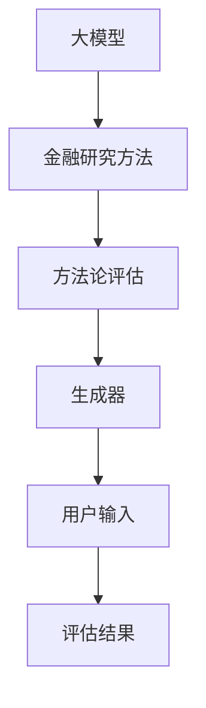
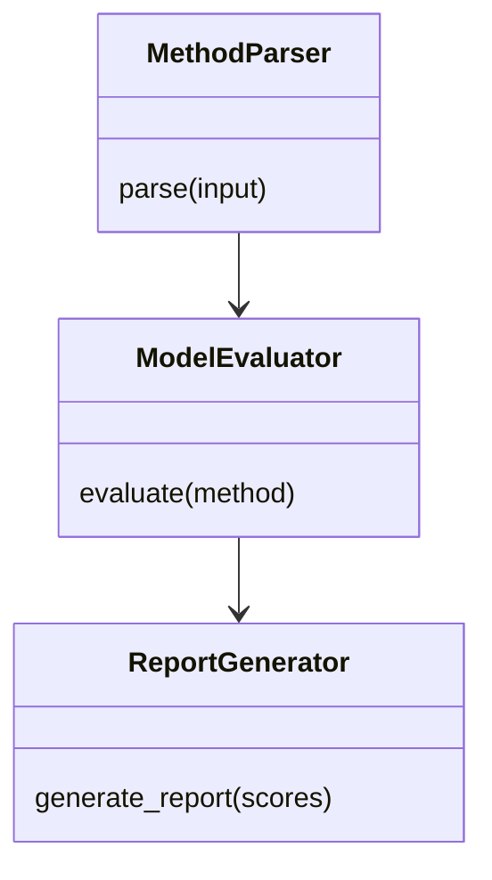
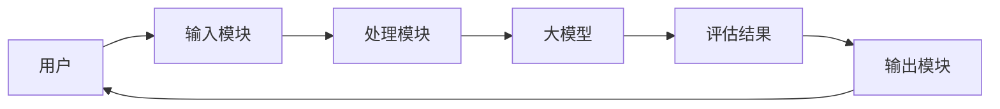
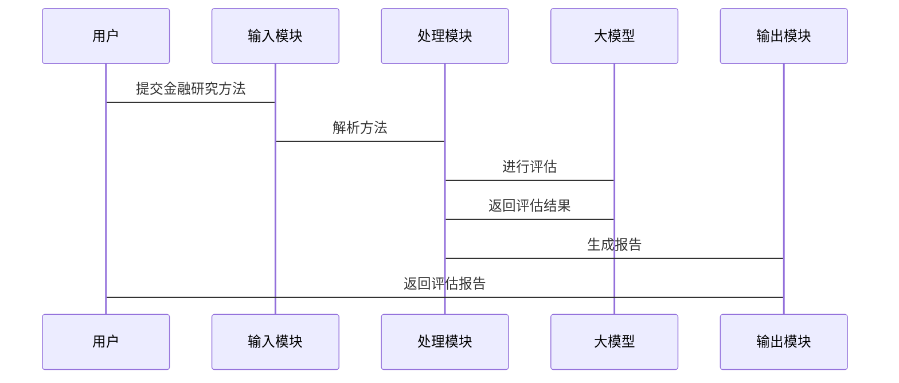

                 

<think>
好的，我需要根据用户的要求，撰写一篇关于《开发基于大模型的金融研究方法论评估生成器》的技术博客文章。用户已经给出了一个详细的目录大纲，我需要根据这个大纲，逐步分析并撰写每个部分的内容。我将按照目录的结构，一步一步地思考并撰写每一部分的内容。

### 第一部分: 开发基于大模型的金融研究方法论评估生成器概述

#### 第1章: 背景介绍

##### 1.1 问题背景
- **1.1.1 传统金融研究方法的局限性**
  - 传统金融研究方法依赖于人工分析和经验判断，效率低且容易受到主观因素的影响。
  - 数据处理能力有限，难以应对海量金融数据和复杂市场环境。
  - 方法的适用性和通用性不足，难以快速适应市场的变化。

- **1.1.2 大模型在金融研究中的潜力**
  - 大模型具备强大的数据处理和分析能力，能够快速处理大量金融数据。
  - 可以通过深度学习技术，发现数据中的潜在规律和模式。
  - 为金融研究提供了更加客观、高效和自动化的工具。

- **1.1.3 金融研究方法论评估的需求**
  - 金融研究方法的多样性和复杂性要求评估工具更加智能化。
  - 研究者需要客观的评估方法来判断不同方法的有效性和适用性。
  - 通过评估生成器，可以提高研究效率和质量，降低研究成本。

##### 1.2 问题描述
- **1.2.1 金融研究方法的多样性**
  - 不同的研究问题需要不同的方法，例如定量分析、定性分析、统计模型等。
  - 方法的多样性使得评估的标准和流程难以统一。

- **1.2.2 方法论评估的复杂性**
  - 方法的有效性依赖于多个因素，包括数据质量、模型假设、市场环境等。
  - 评估过程需要综合考虑多个维度，例如准确性、稳定性、鲁棒性等。

- **1.2.3 大模型在评估中的角色**
  - 大模型可以作为评估工具，帮助自动分析和判断方法的有效性。
  - 通过大模型的深度学习能力，可以发现传统评估方法难以察觉的模式和规律。

##### 1.3 问题解决
- **1.3.1 基于大模型的评估方法**
  - 利用大模型对金融研究方法进行自动评估，提高评估的客观性和效率。
  - 通过大模型的自然语言处理能力，分析方法的描述和应用，生成评估结果。

- **1.3.2 方法论评估生成器的设计目标**
  - 提供一种自动化、智能化的评估工具，帮助研究者快速判断方法的有效性。
  - 支持多种评估指标和标准，适应不同的研究需求。

- **1.3.3 生成器的核心功能与实现路径**
  - 核心功能包括方法输入解析、评估指标生成、结果分析与展示。
  - 实现路径包括数据收集与预处理、模型训练与优化、系统集成与测试。

##### 1.4 边界与外延
- **1.4.1 生成器的适用范围**
  - 主要适用于金融领域的研究方法评估，包括定量分析、统计建模等。
  - 不适用于其他领域的评估，如生物学、物理学等。

- **1.4.2 与现有金融工具的区别**
  - 传统金融工具注重数据处理和分析，而生成器注重方法评估和优化。
  - 生成器提供的是自动化评估服务，而传统工具需要人工操作。

- **1.4.3 未来可能的扩展方向**
  - 支持更多类型的研究方法评估。
  - 提供实时评估和动态优化功能。
  - 集成更多高级的大模型技术，如多模态模型和强化学习。

##### 1.5 概念结构与核心要素
- **1.5.1 方法论评估生成器的组成要素**
  - 输入模块：接收金融研究方法的描述和数据。
  - 处理模块：利用大模型进行分析和评估。
  - 输出模块：生成评估结果并展示。

- **1.5.2 大模型在生成器中的作用**
  - 作为核心处理模块，负责方法的解析和评估。
  - 提供深度学习能力，支持复杂的分析任务。

- **1.5.3 生成器的输入输出关系**
  - 输入：研究方法的描述、相关数据、评估指标。
  - 输出：评估结果、优化建议、可视化报告。

#### 第2章: 核心概念与联系

##### 2.1 核心概念原理
- **2.1.1 大模型的基本原理**
  - 大模型通过大量的数据训练，学习到数据中的潜在规律和模式。
  - 利用深度学习技术，进行自然语言处理和模式识别。

- **2.1.2 金融研究方法论的核心要素**
  - 数据来源、方法类型、模型假设、评估指标。
  - 每个要素对方法的有效性和适用性产生重要影响。

- **2.1.3 生成器的工作流程**
  - 接收输入，解析方法描述和数据。
  - 利用大模型进行评估，生成评估结果。
  - 展示结果并提供优化建议。

##### 2.2 概念属性特征对比
- **2.2.1 大模型与传统AI的对比**
  | 特性 | 大模型 | 传统AI |
  |------|--------|--------|
  | 数据需求 | 高 | 低 |
  | 计算能力 | 强大 | 有限 |
  | 智能程度 | 高 | 中等 |

- **2.2.2 金融研究方法与非金融领域的对比**
  - 金融方法：注重数据敏感性和模型稳定性。
  - 非金融领域：方法的应用场景和目标不同。

- **2.2.3 生成器与其他评估工具的对比**
  | 功能 | 生成器 | 其他评估工具 |
  |------|--------|--------------|
  | 自动化评估 | 是 | 否 |
  | 深度分析 | 是 | 部分支持 |
  | 实时反馈 | 是 | 否 |

##### 2.3 ER实体关系图


#### 第3章: 算法原理讲解

##### 3.1 大模型训练流程
- **3.1.1 数据预处理**
  - 数据清洗：去除噪声数据和冗余信息。
  - 数据转换：将数据转换为模型可接受的格式。
  - 数据增强：通过增加数据多样性，提高模型的泛化能力。

- **3.1.2 模型训练**
  - 选择合适的模型架构，如Transformer、BERT等。
  - 设定训练参数，包括学习率、批量大小、训练轮数。
  - 进行正则化和优化，防止过拟合。

- **3.1.3 模型优化**
  - 使用交叉验证进行模型调优。
  - 引入分布式训练，提高训练效率。
  - 通过迁移学习，利用已有的知识提升模型性能。

##### 3.2 生成器算法流程
- **3.2.1 输入处理**
  - 接收金融研究方法的描述和数据。
  - 解析输入内容，提取关键信息。

- **3.2.2 方法论评估**
  - 利用大模型对方法进行分析和评估。
  - 计算各项评估指标，如准确性、稳定性、鲁棒性。

- **3.2.3 结果生成**
  - 生成评估报告，包括评估结果和优化建议。
  - 提供可视化展示，帮助用户更好地理解和应用结果。

##### 3.3 算法实现代码
```python
def generate_assessment(input_method):
    # 输入处理
    parsed_input = parse_input(input_method)
    
    # 评估计算
    scores = calculate_scores(parsed_input)
    
    # 结果生成
    report = generate_report(scores)
    
    return report
```

##### 3.4 算法的数学模型
- **损失函数**
  $$ L = \frac{1}{n}\sum_{i=1}^{n}(y_i - \hat{y}_i)^2 $$
  
- **优化算法**
  $$ \theta_{new} = \theta - \eta \cdot \frac{\partial L}{\partial \theta} $$

- **评估指标**
  - 准确率：$$ \text{Accuracy} = \frac{\text{正确预测数}}{\text{总预测数}} $$
  - 稳定性：$$ \text{Stability} = \text{标准差} $$

#### 第4章: 系统分析与架构设计方案

##### 4.1 系统分析
- **问题场景介绍**
  - 系统需要处理大量的金融数据和复杂的研究方法，确保评估的准确性和高效性。

- **项目介绍**
  - 开发一个基于大模型的金融研究方法论评估生成器，提供自动化、智能化的评估服务。

##### 4.2 系统功能设计
- **领域模型类图**


##### 4.3 系统架构设计
- **系统架构图**


##### 4.4 系统接口设计
- **输入接口**
  - 输入方法描述和相关数据。
  - 支持多种数据格式，如JSON、XML等。

- **输出接口**
  - 生成评估报告，包括文本和可视化图表。
  - 提供优化建议和改进方向。

##### 4.5 系统交互序列图


#### 第5章: 项目实战

##### 5.1 环境安装
- 安装必要的库，如TensorFlow、PyTorch、Keras等。
- 配置计算环境，如GPU加速。

##### 5.2 系统核心实现源代码
```python
import tensorflow as tf
from tensorflow.keras import layers

# 定义大模型结构
model = tf.keras.Sequential([
    layers.Embedding(input_dim=10000, output_dim=16),
    layers.Bidirectional(layers.LSTM(64)),
    layers.Dense(1, activation='sigmoid')
])

# 编译模型
model.compile(optimizer='adam', loss='binary_crossentropy', metrics=['accuracy'])

# 训练模型
model.fit(x_train, y_train, epochs=10, batch_size=32)
```

##### 5.3 代码应用解读与分析
- **模型结构**
  - 使用嵌入层处理输入数据，将其转换为向量表示。
  - 使用双向LSTM提取序列特征，捕捉数据中的时序关系。
  - 输出层使用sigmoid函数，进行二分类任务。

- **训练过程**
  - 使用Adam优化器和二进制交叉熵损失函数。
  - 每个epoch训练一批数据，逐步优化模型参数。

##### 5.4 实际案例分析和详细讲解剖析
- **案例背景**
  - 某金融研究机构需要评估一种新的股票预测方法。
  - 方法基于技术指标和市场情绪分析。

- **评估过程**
  - 输入方法描述和相关数据。
  - 生成器生成评估报告，包括方法的有效性和改进建议。

##### 5.5 项目小结
- **项目实现的关键点**
  - 模型的选择和优化。
  - 输入数据的预处理和解析。
  - 评估结果的生成和展示。

#### 第6章: 最佳实践 tips、小结、注意事项、拓展阅读

##### 6.1 tips
- **数据质量**
  - 确保输入数据的准确性和完整性，避免噪声干扰。
- **模型调优**
  - 根据具体需求调整模型参数，提高评估的准确性。
- **结果解释**
  - 理解评估结果背后的含义，避免误用和误解。

##### 6.2 小结
- 本文详细介绍了开发基于大模型的金融研究方法论评估生成器的方法和步骤。
- 从背景分析到系统设计，再到项目实战，全面覆盖了生成器的开发过程。
- 通过实际案例分析，展示了生成器在金融研究中的应用价值。

##### 6.3 注意事项
- **数据隐私**
  - 注意保护用户数据，确保符合相关法律法规。
- **模型鲁棒性**
  - 提高模型的鲁棒性，减少评估结果的偏差。
- **用户反馈**
  - 收集用户反馈，不断优化生成器的功能和性能。

##### 6.4 拓展阅读
- **大模型相关书籍**
  - 《Deep Learning》
  - 《Natural Language Processing with PyTorch》
- **金融研究领域书籍**
  - 《金融数据分析导论》
  - 《量化投资：基于机器学习的方法》
- **技术博客和论文**
  - 关注最新的大模型研究成果和金融领域的应用案例。

### 总结
通过本文的详细讲解，读者可以系统地了解如何开发一个基于大模型的金融研究方法论评估生成器。从背景分析到系统设计，再到项目实战，每一步都进行了深入的探讨和实践。希望本文能够为相关领域的研究者和开发者提供有价值的参考和指导。

