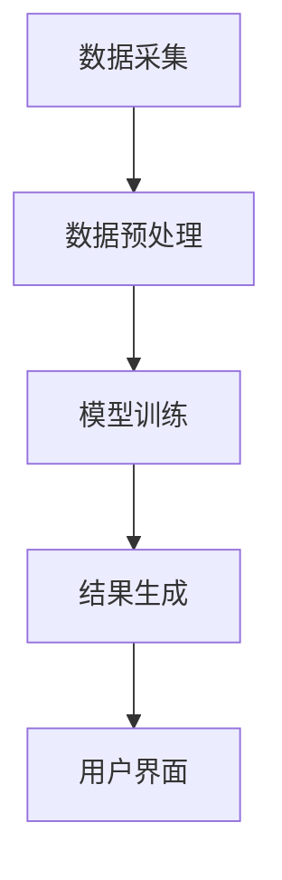
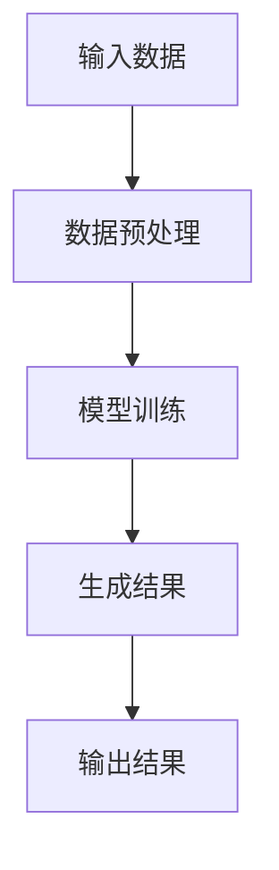

                 


# 开发基于大模型的金融研究趋势预测与主题生成器

## 关键词：大模型，金融研究，趋势预测，主题生成，系统架构

## 摘要：  
本文探讨了基于大模型的金融研究趋势预测与主题生成器的开发方法。文章从背景和目标出发，详细介绍了大模型的基本原理及其在金融研究中的应用，分析了趋势预测与主题生成的关键算法，并设计了系统的整体架构。通过实际案例分析，展示了如何通过大模型实现金融研究的智能化，并提出了系统优化和实际应用中的注意事项。

---

# 第一部分: 开发背景与目标

## 第1章: 问题背景与目标

### 1.1 问题背景
#### 1.1.1 金融研究的趋势预测需求
金融市场的数据复杂且多样化，包括股票价格、经济指标、新闻报道等。准确预测市场趋势对于投资者和机构至关重要。然而，传统的方法（如统计分析和简单的机器学习模型）难以捕捉市场中的非结构化信息，如新闻情感和市场情绪，导致预测精度有限。

#### 1.1.2 大模型在金融研究中的应用潜力
大模型（如GPT-3、BERT）在自然语言处理领域表现出色，能够处理海量的非结构化数据，并生成高质量的文本。金融研究中的许多问题（如市场情绪分析、主题生成）可以转化为大模型擅长的任务。

#### 1.1.3 当前金融研究中的痛点与挑战
- 数据量大且多为非结构化数据，难以高效处理。
- 市场趋势受多种因素影响，预测难度高。
- 缺乏智能化的工具来辅助主题生成和趋势预测。

### 1.2 问题描述
#### 1.2.1 金融研究趋势预测的定义
趋势预测是指基于历史数据和当前市场信息，预测未来市场的主要趋势或热点。预测结果可以是具体的指标（如股票价格）或主题（如行业趋势）。

#### 1.2.2 主题生成器的核心功能
主题生成器是一种能够根据输入数据生成相关主题的工具，常用于发现市场热点和潜在投资机会。

#### 1.2.3 系统边界与外延
本系统专注于基于大模型的金融研究趋势预测与主题生成，边界包括数据输入、模型训练和结果输出。外延则涉及模型优化和实际应用。

### 1.3 问题解决
#### 1.3.1 大模型在趋势预测中的优势
大模型能够处理非结构化数据，捕捉市场情绪和潜在趋势，提供更准确的预测。

#### 1.3.2 大模型在主题生成中的创新点
通过大模型生成高质量的主题，帮助研究人员快速发现市场热点。

#### 1.3.3 系统的整体解决方案
结合大模型的文本生成能力，设计一个完整的系统，实现趋势预测和主题生成。

### 1.4 本章小结
本章介绍了金融研究趋势预测与主题生成器的背景、问题和目标，为后续的系统设计奠定了基础。

---

# 第二部分: 大模型与金融研究的核心概念

## 第2章: 大模型的基本原理

### 2.1 大模型的核心概念
#### 2.1.1 大模型的定义与特点
大模型是基于深度学习的大型神经网络模型，具有参数多、训练数据量大、处理能力强等特点。

#### 2.1.2 大模型的训练目标与损失函数
训练目标是优化模型的预测能力，损失函数用于衡量预测与真实值的差距。

#### 2.1.3 大模型的输入输出机制
模型接受文本输入，通过解码器生成输出。

### 2.2 大模型与金融研究的结合
#### 2.2.1 金融数据的特征与挑战
金融数据具有复杂性、动态性和不确定性。

#### 2.2.2 大模型在金融文本处理中的应用
用于情感分析、主题提取等任务。

#### 2.2.3 大模型在金融预测中的优势
能够捕捉非结构化数据中的隐含信息，提供更精准的预测。

### 2.3 大模型的训练与优化
#### 2.3.1 大模型的训练流程
包括数据预处理、模型初始化、训练迭代等步骤。

#### 2.3.2 大模型的优化策略
使用学习率调整、模型剪枝等技术优化性能。

#### 2.3.3 大模型的评估指标
如准确率、F1分数等。

### 2.4 本章小结
本章详细介绍了大模型的基本原理及其在金融研究中的应用，为后续章节奠定了基础。

---

# 第三部分: 大模型在金融研究中的算法原理

## 第3章: 大模型的算法原理

### 3.1 大模型的数学模型
#### 3.1.1 概率论基础
包括概率分布、条件概率等。

#### 3.1.2 统计学基础
包括回归分析、聚类分析等。

#### 3.1.3 神经网络基础
包括卷积神经网络、循环神经网络等。

### 3.2 大模型的训练算法
#### 3.2.1 基于梯度的优化算法
如随机梯度下降（SGD）。

#### 3.2.2 分层训练策略
将模型分成多个层次进行训练。

#### 3.2.3 并行训练技术
利用分布式计算加速训练过程。

### 3.3 大模型的预测机制
#### 3.3.1 解码器的生成策略
如贪心搜索、随机采样等。

#### 3.3.2 注意力机制的应用
用于捕捉文本中的关键信息。

#### 3.3.3 概率生成模型
如马尔可夫链模型。

### 3.4 本章小结
本章详细讲解了大模型的数学模型和训练算法，为系统实现提供了理论支持。

---

# 第四部分: 金融研究趋势预测与主题生成器的系统架构

## 第4章: 系统分析与架构设计

### 4.1 系统功能模块划分
#### 4.1.1 数据采集模块
负责收集金融数据，如新闻、股票价格等。

#### 4.1.2 数据预处理模块
对数据进行清洗、标注等处理。

#### 4.1.3 模型训练模块
基于预处理后的数据训练大模型。

#### 4.1.4 结果生成模块
根据输入生成趋势预测结果和主题。

### 4.2 系统功能设计
#### 4.2.1 领域模型
使用Mermaid类图展示系统模块之间的关系。

#### 4.2.2 系统架构设计
使用Mermaid架构图展示整体架构。

#### 4.2.3 系统接口设计
定义模块之间的接口和交互流程。

#### 4.2.4 系统交互设计
使用Mermaid序列图展示模块之间的交互过程。

### 4.3 本章小结
本章详细设计了系统的功能模块和架构，为实现提供了指导。

---

# 第五部分: 项目实战

## 第5章: 项目实战

### 5.1 环境安装与配置
#### 5.1.1 安装Python环境
如Anaconda。

#### 5.1.2 安装必要的库
如TensorFlow、Keras等。

### 5.2 核心实现
#### 5.2.1 数据预处理代码
展示如何清洗和标注数据。

#### 5.2.2 模型训练代码
展示如何训练大模型。

#### 5.2.3 结果生成代码
展示如何根据输入生成趋势预测和主题。

### 5.3 实际案例分析
#### 5.3.1 案例背景
如某行业的趋势预测。

#### 5.3.2 数据处理与分析
展示数据的处理过程和结果。

#### 5.3.3 系统实现与结果展示
展示模型的输出结果和分析。

### 5.4 本章小结
本章通过实际案例展示了系统的实现过程和应用效果。

---

# 第六部分: 最佳实践与总结

## 第6章: 最佳实践与总结

### 6.1 小结
总结本文的主要内容和研究成果。

### 6.2 注意事项
提醒读者在实际应用中需要注意的问题。

### 6.3 拓展阅读
推荐相关的书籍和论文，供读者深入学习。

### 6.4 本章小结
重申本文的核心观点和未来研究方向。

---

# 附录

## 附录A: 相关代码示例
### 附录A.1 数据预处理代码
```python
import pandas as pd

def preprocess_data(dataframe):
    # 数据清洗
    dataframe.dropna()
    # 数据标注
    dataframe['label'] = dataframe['label'].astype(int)
    return dataframe
```

### 附录A.2 模型训练代码
```python
import tensorflow as tf

model = tf.keras.Sequential([
    tf.keras.layers.Embedding(input_dim=..., output_dim=...),
    tf.keras.layers.LSTM(units=64),
    tf.keras.layers.Dense(1, activation='sigmoid')
])

model.compile(optimizer='adam', loss='binary_crossentropy', metrics=['accuracy'])
model.fit(X_train, y_train, epochs=10, batch_size=32)
```

## 附录B: 系统架构图


## 附录C: 算法流程图


---

# 结束语

感谢您的阅读！如需进一步探讨或合作，欢迎随时联系！

