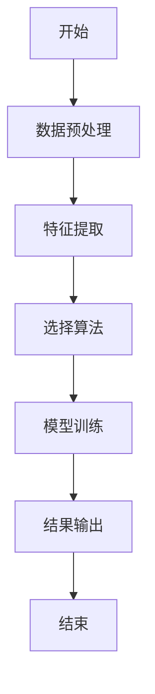
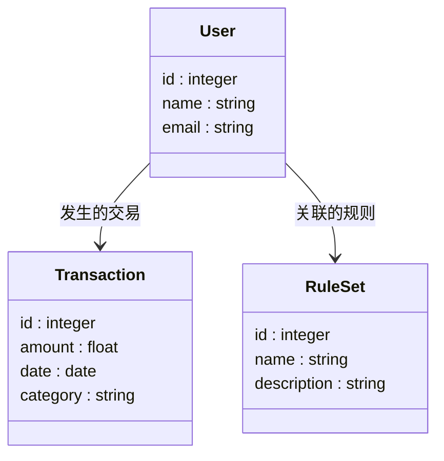
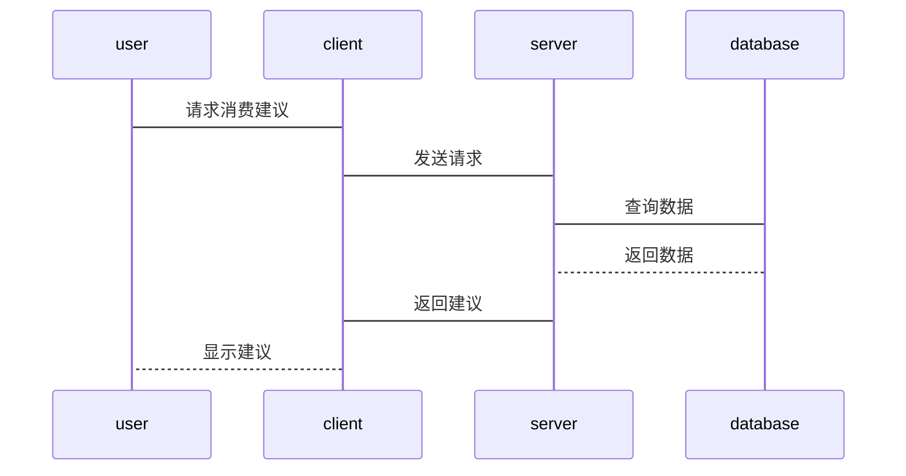

                 


# 开发智能化的个人消费习惯改善建议工具

## 关键词：人工智能、消费习惯、个性化推荐、系统架构、用户行为分析

## 摘要：  
本文探讨了开发智能化个人消费习惯改善建议工具的背景、核心概念、算法原理、系统架构及实现方法。通过分析用户行为和消费数据，结合推荐算法，构建了一个智能化的消费习惯改善工具，帮助用户优化消费行为，实现财务健康。

---

# 第一部分: 背景介绍

## 第1章: 个人消费习惯改善工具的背景与问题

### 1.1 问题背景

#### 1.1.1 当代个人消费行为的现状与挑战  
当代社会消费行为呈现多样化和复杂化趋势，许多人因缺乏有效的消费管理而导致财务压力。智能化工具的出现为改善消费习惯提供了新的可能性。

#### 1.1.2 消费习惯对个人财务健康的影响  
不良消费习惯可能导致过度消费、债务累积等问题，影响个人财务健康和生活质量。

#### 1.1.3 智能化工具在消费习惯改善中的作用  
智能化工具通过数据分析和个性化推荐，帮助用户识别不良消费习惯，提供改善建议，实现消费行为的优化。

### 1.2 问题描述

#### 1.2.1 个人消费习惯的定义与分类  
消费习惯是指个人在消费过程中形成的稳定行为模式，包括消费频率、金额、偏好等。分类包括冲动消费、计划性消费、超前消费等。

#### 1.2.2 不良消费习惯的表现形式  
- 冲动性消费：无计划购买非必需品。
- 超前消费：超出收入的消费行为。
- 高额债务：过度依赖信用卡或贷款。

#### 1.2.3 改善消费习惯的需求分析  
- 提供个性化的消费建议。
- 实时监控消费行为。
- 提供财务规划工具。

### 1.3 问题解决思路

#### 1.3.1 智能化工具的解决方案框架  
- 数据采集：收集用户的消费数据。
- 数据分析：分析消费行为，识别不良习惯。
- 个性化推荐：提供改善建议和行动计划。

#### 1.3.2 数据驱动的消费习惯分析方法  
通过数据分析，识别用户的消费模式，预测未来消费行为，提供针对性的建议。

#### 1.3.3 用户行为干预与反馈机制  
通过推送提醒、设置消费限额等方式，干预用户的消费行为，并根据反馈不断优化建议。

### 1.4 工具的边界与外延

#### 1.4.1 工具的功能边界  
- 数据采集与分析：收集和处理消费数据。
- 个性化推荐：提供消费建议。
- 行为干预：设置消费提醒和限额。

#### 1.4.2 工具的使用场景与限制  
适用场景：个人财务管理、消费习惯改善。限制：不涉及投资理财，仅限于消费行为的改善。

#### 1.4.3 工具的可扩展性与未来发展  
未来可扩展功能：加入社交功能，分享消费经验；接入更多数据源，如银行流水。

---

# 第二部分: 核心概念与联系

## 第2章: 核心概念与系统架构

### 2.1 核心概念原理

#### 2.1.1 用户行为分析模型  
用户行为分析模型用于识别用户的消费模式和习惯，常用的方法包括基于规则的分析和机器学习模型。

#### 2.1.2 消费数据建模方法  
消费数据建模方法将消费行为转化为数据模型，便于分析和预测。

#### 2.1.3 个性化推荐算法  
个性化推荐算法根据用户的消费数据，推荐适合的改善建议。

### 2.2 概念属性特征对比

| 概念 | 特征 |
|------|------|
| 消费习惯 | 冲动性、计划性、超前性 |
| 数据分析 | 描述性、预测性、诊断性 |
| 推荐算法 | 基于规则、协同过滤、基于模型 |

### 2.3 ER实体关系图

```mermaid
erDiagram
    user {
        id : integer
        name : string
        email : string
    }
    transaction {
        id : integer
        amount : float
        date : date
        category : string
    }
    rule_set {
        id : integer
        name : string
        description : string
    }
    user -> transaction : 发生的交易
    user -> rule_set : 关联的规则
    transaction -> category : 归属的类别
```

---

# 第三部分: 算法原理讲解

## 第3章: 算法原理与实现

### 3.1 算法原理

#### 3.1.1 基于规则的推荐算法  
基于预定义的规则，识别用户的消费行为，并给出改善建议。

#### 3.1.2 协同过滤推荐算法  
通过分析用户行为数据，找到相似的用户群体，推荐适合的改善建议。

### 3.2 算法实现流程



### 3.3 算法代码实现

```python
import pandas as pd
from sklearn.metrics.pairwise import cosine_similarity

# 数据预处理
def preprocess_data(data):
    # 假设 data 是 DataFrame，包含消费记录
    data['date'] = pd.to_datetime(data['date'])
    data['month'] = data['date'].dt.month
    data['year'] = data['date'].dt.year
    return data

# 特征提取
def extract_features(data):
    features = data.groupby(['user_id', 'year', 'month'])['amount'].sum().reset_index()
    return features

# 基于协同过滤的推荐算法
def collaborative_filtering(features):
    # 计算余弦相似度
    user_matrix = features.pivot(index='user_id', columns='month', values='amount')
    similarities = cosine_similarity(user_matrix)
    # 找出最相似的用户
    similar_users = {}
    for i in range(len(similarities)):
        similar_users[i] = [j for j in range(len(similarities[i])) if i != j and similar_users[i][j] > 0.5]
    return similar_users

# 数学模型和公式
$$相似度 = \frac{\sum_{k} (x_{ik} - \bar{x_i})(x_{jk} - \bar{x_j})}{\sqrt{\sum_{k} (x_{ik} - \bar{x_i})^2} \sqrt{\sum_{k} (x_{jk} - \bar{x_j})^2}}$$

### 3.4 算法实现步骤

#### 3.4.1 数据预处理  
对消费数据进行清洗和转换，确保数据格式一致。

#### 3.4.2 特征提取  
从数据中提取有用的特征，如消费金额、时间等。

#### 3.4.3 模型训练  
选择合适的算法，训练模型，生成推荐结果。

#### 3.4.4 结果输出  
将推荐结果以用户友好的形式呈现。

---

# 第四部分: 系统分析与架构设计

## 第4章: 系统分析与架构设计

### 4.1 问题场景介绍

#### 4.1.1 系统目标  
开发一个智能化的个人消费习惯改善建议工具，帮助用户优化消费行为。

#### 4.1.2 系统特点  
- 实时监控消费行为。
- 提供个性化消费建议。
- 支持多种数据源。

### 4.2 系统功能设计

#### 4.2.1 领域模型设计



#### 4.2.2 系统架构设计

```mermaid
client
    /_/
    server
    /_/
    database
```

### 4.3 系统接口设计

#### 4.3.1 数据接口  
- 数据输入接口：接收消费数据。
- 数据输出接口：输出分析结果。

#### 4.3.2 用户接口  
- 用户登录接口。
- 消费建议展示接口。

### 4.4 系统交互设计



---

# 第五部分: 项目实战

## 第5章: 项目实战

### 5.1 环境安装

```bash
pip install pandas scikit-learn mermaid
```

### 5.2 核心代码实现

```python
import pandas as pd
from sklearn.metrics.pairwise import cosine_similarity

def main():
    # 数据加载
    data = pd.read_csv('transactions.csv')
    # 数据预处理
    preprocessed_data = preprocess_data(data)
    # 特征提取
    features = extract_features(preprocessed_data)
    # 模型训练
    similar_users = collaborative_filtering(features)
    # 结果输出
    for user in similar_users:
        print(f"User {user} 的相似用户：{similar_users[user]}")

if __name__ == "__main__":
    main()
```

### 5.3 案例分析

#### 5.3.1 案例背景  
用户A在过去三个月内每月消费超过收入的80%，主要集中在娱乐和购物方面。

#### 5.3.2 数据分析  
通过协同过滤算法，发现用户A的消费模式与用户B相似，用户B通过减少娱乐消费成功改善了财务状况。

#### 5.3.3 改善建议  
- 设定每月消费限额。
- 提供替代活动建议，减少娱乐支出。

### 5.4 项目小结

---

# 第六部分: 最佳实践

## 第6章: 最佳实践

### 6.1 开发经验总结

#### 6.1.1 数据质量的重要性  
确保数据准确性和完整性，直接影响分析结果。

#### 6.1.2 算法选择的策略  
根据具体问题选择合适的算法，不同场景下表现不同的算法。

### 6.2 注意事项

#### 6.2.1 数据隐私保护  
确保用户数据的安全和隐私。

#### 6.2.2 系统性能优化  
优化算法和架构，确保系统高效运行。

### 6.3 拓展阅读

#### 6.3.1 推荐系统  
深入学习推荐算法，探索更高效的推荐方法。

#### 6.3.2 人工智能在金融领域的应用  
研究人工智能在金融领域的其他应用，拓宽知识面。

---

## 结语  
通过本文的详细讲解，读者可以全面了解开发智能化个人消费习惯改善建议工具的背景、核心概念、算法原理、系统架构及实现方法。希望本文能为相关领域的开发者提供有价值的参考和启示。

