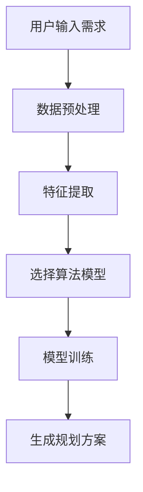
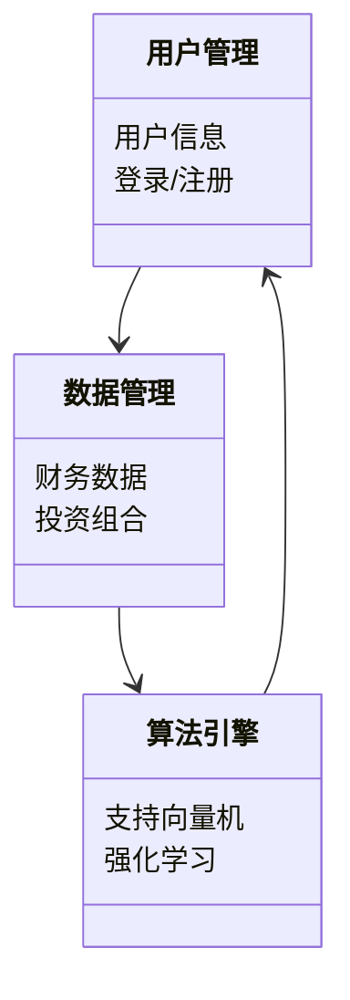

                 


# 开发智能化的个人退休规划助手

## 关键词：人工智能，退休规划，智能化助手，算法原理，系统架构

## 摘要：  
本文探讨了开发智能化个人退休规划助手的全过程，从背景分析到系统架构设计，再到算法实现和项目实战。文章首先分析了退休规划的重要性及智能化助手的必要性，接着详细阐述了助手的核心概念与算法原理，包括支持向量机和强化学习的应用。随后，文章通过系统分析与架构设计，展示了如何构建一个高效的退休规划系统。最后，通过项目实战部分，提供了具体的实现步骤和案例分析，帮助读者更好地理解和应用相关技术。

---

# 第一部分: 背景介绍与问题分析

## 第1章: 退休规划的智能化需求

### 1.1 退休规划的重要性

#### 1.1.1 退休规划的核心目标
退休规划是为了确保个人在退休后能够维持一定的生活水平，同时实现资产的保值与增值。核心目标包括：

1. 确保退休后有足够的资金来源。
2. 优化资产配置，平衡风险与收益。
3. 动态调整规划以应对经济变化和个人需求的变动。

#### 1.1.2 当前退休规划的主要挑战
传统退休规划方法依赖于人工计算和经验判断，存在以下挑战：

- **数据繁杂**：需要综合考虑收入、支出、投资收益、通货膨胀率等多个因素。
- **个性化不足**：不同人的生命周期阶段、风险承受能力和财务状况不同，统一的规划难以满足个性化需求。
- **动态调整困难**：市场环境和个人情况的变化使得定期调整规划变得复杂。

#### 1.1.3 智能化退休规划助手的必要性
智能化助手通过整合人工智能和大数据技术，能够实时分析用户数据，提供个性化建议，并根据市场变化动态调整规划。这种工具能够显著提高规划的科学性和可操作性。

---

## 第2章: 智能化退休规划助手的核心概念

### 2.1 智能化退休规划助手的定义

#### 2.1.1 助手的基本功能与目标
智能化退休规划助手是一款基于人工智能技术的工具，旨在通过分析用户的财务状况、风险偏好和生命周期阶段，提供个性化的退休规划建议。其主要功能包括：

1. **用户数据收集与分析**：通过问卷和历史数据收集用户的财务状况、收入、支出等信息。
2. **预测与模拟**：利用算法预测未来的收入、支出和投资收益，模拟不同情景下的资金状况。
3. **个性化方案生成**：根据预测结果，生成适合用户的资产配置建议和退休计划。
4. **动态调整**：根据市场变化和用户需求的变化，实时调整规划方案。

#### 2.1.2 助手的智能化特征
智能化退休规划助手的核心特征在于其能够通过机器学习算法不断优化预测模型，并根据用户反馈调整规划建议。具体特征包括：

- **自适应性**：能够根据用户反馈和市场变化自动调整规划。
- **预测准确性**：利用先进的算法提高预测的准确性。
- **个性化服务**：基于用户的具体情况提供定制化建议。

#### 2.1.3 助手与传统退休规划工具的区别
传统退休规划工具通常依赖人工计算和经验判断，而智能化助手则通过算法实现自动化、个性化的规划。主要区别如下：

| 特性               | 传统工具                          | 智能化助手                          |
|--------------------|-----------------------------------|------------------------------------|
| 数据处理能力       | 数据量有限，处理简单             | 数据量大，处理复杂                 |
| 个性化程度         | 较低，通用性较强                  | 高，基于用户具体数据               |
| 动态调整能力       | 有限，定期调整                   | 实时调整，适应性强                |

---

## 第3章: 退休规划助手的背景与现状

### 3.1 退休规划市场的现状

#### 3.1.1 传统退休规划工具的局限性
传统退休规划工具主要依赖于固定公式和经验判断，存在以下局限性：

- **缺乏个性化**：难以满足不同用户的多样化需求。
- **计算复杂**：人工计算容易出错，效率低下。
- **难以动态调整**：市场变化和用户需求变化难以及时反映。

#### 3.1.2 智能化工具在市场中的应用现状
随着人工智能技术的快速发展，智能化退休规划工具逐渐进入市场，展现出显著优势：

- **提高效率**：通过自动化计算和数据分析，显著提高规划效率。
- **增强准确性**：利用机器学习算法提高预测的准确性。
- **实时调整**：能够根据市场变化和用户反馈实时调整规划方案。

#### 3.1.3 用户对智能化退休规划的需求趋势
随着人们对退休生活的重视和对个性化服务的需求增加，智能化退休规划工具的需求呈现增长趋势。用户对工具的需求主要集中在以下几个方面：

- **个性化服务**：用户希望得到基于自身情况的定制化建议。
- **实时更新**：用户希望工具能够根据市场变化和自身状况实时调整规划。
- **易用性**：用户希望工具操作简单，结果清晰易懂。

---

# 第二部分: 核心概念与算法原理

## 第4章: 核心概念的数学模型与公式

### 4.1 退休规划中的关键公式

#### 4.1.1 资金需求预测公式
$$ \text{退休资金需求} = \text{生活支出} \times \text{退休年限} $$

**解读**：公式用于估算退休后所需的总资金，主要考虑生活支出和退休年限两个因素。

#### 4.1.2 投资收益预测公式
$$ \text{投资收益} = P \times (1 + r)^n - P $$

**解读**：公式用于预测投资的未来收益，其中$P$为初始投资金额，$r$为年化收益率，$n$为投资年数。

### 4.2 算法原理的数学模型

#### 4.2.1 支持向量机模型
$$ \text{分类函数} = \text{sign}(w \cdot x + b) $$

**解读**：支持向量机是一种监督学习算法，用于分类和回归。在退休规划中，可以用于预测投资的高风险或低风险类别。

#### 4.2.2 强化学习模型
$$ Q(s, a) = r + \gamma \max_{a'} Q(s', a') $$

**解读**：强化学习用于动态调整投资策略，通过不断试错和学习，找到最优的投资组合。

---

## 第5章: 算法原理与流程图

### 5.1 算法选择与流程



**解读**：流程图展示了从用户输入需求到生成规划方案的整个流程，包括数据预处理、特征提取、模型训练等关键步骤。

### 5.2 算法实现

```python
import numpy as np
from sklearn import svm

# 示例数据
X = np.array([[50000, 30000], [60000, 40000], [70000, 50000]])
y = np.array([1, 1, 0])

# 训练支持向量机模型
model = svm.SVC()
model.fit(X, y)

# 预测新数据
new_data = np.array([[65000, 45000]])
print(model.predict(new_data))
```

**解读**：代码示例展示了如何使用支持向量机模型进行分类预测。通过训练模型，可以预测投资组合的风险等级。

---

## 第6章: 系统分析与架构设计

### 6.1 问题场景介绍

退休规划助手需要处理以下问题：

1. 如何高效地收集和处理用户数据？
2. 如何构建准确的预测模型？
3. 如何确保系统的实时性和可扩展性？

### 6.2 系统功能设计



**解读**：类图展示了系统的主要模块及其交互关系，包括用户管理、数据管理和算法引擎。

### 6.3 系统架构设计


**解读**：架构图展示了系统的整体架构，包括客户端、服务端、数据库和AI算法模块。

---

## 第7章: 项目实战

### 7.1 环境安装

#### 7.1.1 安装Python
```bash
python --version
pip install --upgrade pip
```

#### 7.1.2 安装依赖库
```bash
pip install numpy scikit-learn matplotlib
```

### 7.2 核心代码实现

```python
import numpy as np
from sklearn import svm
import matplotlib.pyplot as plt

# 示例数据
X = np.array([[50000, 30000], [60000, 40000], [70000, 50000]])
y = np.array([1, 1, 0])

# 训练支持向量机模型
model = svm.SVC()
model.fit(X, y)

# 可视化决策边界
def visualize_svm(X, y, model):
    plt.scatter(X[:, 0], X[:, 1], c=y, cmap='blue_red')
    ax = plt.gca()
    xlim = ax.get_xlim()
    ylim = ax.get_ylim()
    
    xx = np.linspace(xlim[0], xlim[1], 100)
    yy = np.linspace(ylim[0], ylim[1], 100)
    Z = model.predict(np.array([xx, yy]).T)
    Z = Z.reshape(xx.shape)
    
    plt.contour(xx, yy, Z, colors='k', levels=[0], linestyles='--')
    plt.xlabel('收入')
    plt.ylabel('支出')
    plt.show()

visualize_svm(X, y, model)
```

### 7.3 案例分析

假设一位用户年收入为65000美元，年支出为45000美元，希望通过智能化助手进行退休规划。以下是具体步骤：

1. **数据输入**：用户输入收入和支出数据。
2. **模型预测**：算法预测投资收益和风险等级。
3. **方案生成**：生成个性化的投资组合建议。

---

## 第8章: 总结与展望

### 8.1 最佳实践 Tips

- **数据准确性**：确保输入数据的准确性和完整性。
- **模型优化**：定期更新模型参数，提高预测精度。
- **用户体验**：设计直观的用户界面，方便用户操作。

### 8.2 小结

智能化个人退休规划助手通过整合人工智能和大数据技术，能够为用户提供高效、个性化的退休规划服务。本文详细介绍了助手的核心概念、算法原理和系统架构，并通过项目实战展示了具体的实现过程。

### 8.3 注意事项

- 在实际应用中，需注意数据隐私保护。
- 确保系统的实时性和可扩展性，以应对海量用户和动态变化的市场环境。

### 8.4 拓展阅读

- 推荐阅读《机器学习实战》和《Python机器学习》等相关书籍，深入理解算法原理和实现细节。

---

通过本文的系统分析和详细讲解，读者可以全面了解智能化个人退休规划助手的开发过程，并能够实际操作相关技术，开发出高效的退休规划工具。

