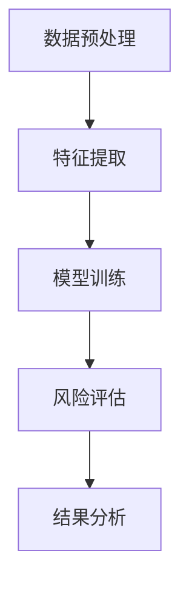
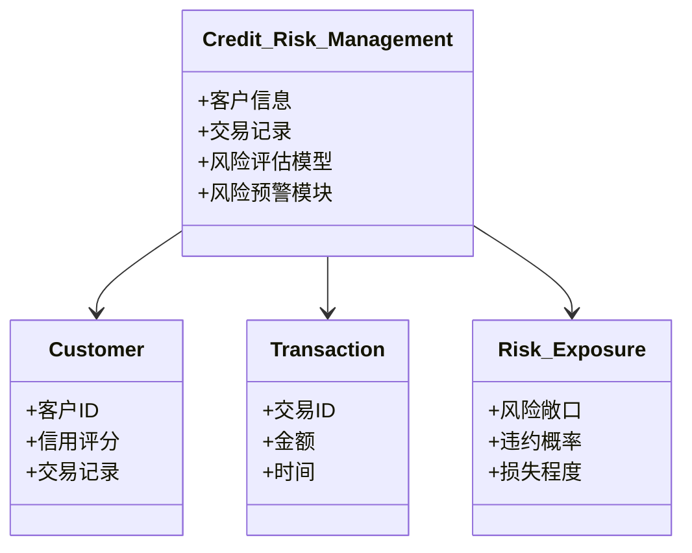
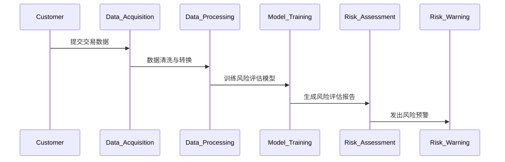

                 


# 开发智能化的企业信用风险敞口管理系统

> 关键词：企业信用风险管理，智能化系统，信用风险敞口，机器学习，系统架构设计，项目实战

> 摘要：本文详细探讨了如何开发智能化的企业信用风险敞口管理系统。从背景介绍、核心概念到算法原理、系统架构设计，再到项目实战和总结，系统性地分析了智能化信用风险管理的必要性、实现方法和未来发展趋势。文章通过丰富的案例和详细的代码实现，为读者提供了一个从理论到实践的完整指南。

---

## 第一部分: 企业信用风险敞口管理的智能化开发背景

### 第1章: 信用风险敞口管理概述

#### 1.1 信用风险敞口的基本概念

- **1.1.1 信用风险的定义与特征**
  - 信用风险是指债务人或交易对手无法履行其合同义务，导致债权人或交易对手遭受损失的风险。
  - 信用风险具有隐蔽性、传染性和系统性等特点。

- **1.1.2 信用风险敞口的定义与计算**
  - 信用风险敞口是指企业在特定时间点上对某一交易对手或资产的风险暴露程度。
  - 计算公式：$$ \text{信用风险敞口} = \text{风险暴露资产} \times \text{违约概率} \times \text{损失给定违约} $$

- **1.1.3 企业信用风险管理的重要性**
  - 保护企业资产安全，降低财务损失。
  - 提高企业信用评级，增强市场竞争力。

#### 1.2 企业信用风险管理的现状与挑战

- **1.2.1 传统信用风险管理的局限性**
  - 数据来源单一，分析维度有限。
  - 人工干预过多，效率低下。

- **1.2.2 数字化转型对企业信用风险管理的影响**
  - 数据量激增，需要更高效的处理方式。
  - 人工智能和大数据技术的应用成为趋势。

- **1.2.3 当前信用风险管理的主要挑战**
  - 数据质量参差不齐，清洗难度大。
  - 模型解释性不足，难以满足监管要求。

#### 1.3 智能化信用风险管理的必要性

- **1.3.1 人工智能在信用风险管理中的应用前景**
  - 提高风险预测的准确性。
  - 实现实时监控和预警。

- **1.3.2 智能化系统的优势与价值**
  - 提高决策效率，降低管理成本。
  - 通过智能化手段发现潜在风险点。

- **1.3.3 企业信用风险管理的未来趋势**
  - 数据驱动的决策将成为主流。
  - 智能化系统将深度融合企业业务流程。

---

### 第2章: 信用风险敞口管理的核心概念与联系

#### 2.1 信用风险敞口的核心要素

- **2.1.1 信用风险敞口的构成要素**
  - 交易对手的信用状况。
  - 交易的规模和期限。
  - 市场环境的变化。

#### 2.1.2 信用风险敞口的量化方法
- **VaR（Value at Risk）模型**
  - 计算在一定置信水平下，资产组合可能遭受的最大损失。
  - 公式：$$ \text{VaR} = \text{损失金额} \times \text{置信水平} $$

- **CVaR（Conditional Value at Risk）模型**
  - 在VaR的基础上，考虑极端情况下的损失。
  - 公式：$$ \text{CVaR} = \mathbb{E}[\text{损失} | \text{损失} \geq \text{VaR}] $$

#### 2.1.3 企业信用风险敞口与企业经营的关系
- 风险敞口直接影响企业的财务健康和市场信用评级。
- 合理管理风险敞口是企业稳健经营的重要保障。

#### 2.2 信用风险敞口与相关概念的对比分析

- **2.2.1 信用风险与市场风险的对比**
  - 信用风险：交易对手违约风险。
  - 市场风险：市场价格波动风险。

- **2.2.2 信用风险敞口与信用评分的联系**
  - 信用评分是衡量信用风险的重要指标。
  - 风险敞口是信用评分的量化表现。

- **2.2.3 信用风险敞口与企业信用评级的关系**
  - 信用评级是企业信用风险的综合体现。
  - 风险敞口是信用评级的重要输入变量。

#### 2.3 信用风险敞口的ER实体关系图

```mermaid
er
    Customer
    _credit_provider
    Credit_Risk_Exposure
    transaction
```

---

### 第3章: 信用风险敞口管理的算法原理与数学模型

#### 3.1 信用风险评估的主要算法

- **3.1.1 逻辑回归模型**
  - 适用于二分类问题。
  - 公式：$$ P(y=1|x) = \frac{1}{1 + e^{- (w x + b)}} $$

- **3.1.2 支持向量机模型**
  - 适用于非线性分类问题。
  - 使用核函数将数据映射到高维空间。

- **3.1.3 随机森林模型**
  - 通过集成学习提高模型鲁棒性。
  - 公式：$$ y = \sum_{i=1}^{n} \text{树} \times \text{权重} $$

- **3.1.4 神经网络模型**
  - 适用于复杂非线性关系。
  - 公式：$$ y = \sigma(w x + b) $$

#### 3.2 基于机器学习的信用风险评估流程



#### 3.3 信用风险评估的数学模型

- **3.3.1 逻辑回归模型公式**
  $$ P(y=1|x) = \frac{1}{1 + e^{- (w x + b)}} $$

- **3.3.2 支持向量机模型**
  $$ y = \text{sign}(\sum_{i=1}^{n} \alpha_i y_i (x_i \cdot x) + b) $$

---

## 第二部分: 系统分析与架构设计

### 第4章: 系统分析与架构设计

#### 4.1 项目背景

- 企业信用风险管理的重要性。
- 智能化系统的需求分析。

#### 4.2 系统功能设计



#### 4.3 系统架构设计


#### 4.4 系统接口设计

- 数据接口：与企业数据库对接。
- 用户接口：提供风险评估结果的可视化界面。

#### 4.5 系统交互设计



---

## 第三部分: 项目实战

### 第5章: 项目实战

#### 5.1 环境安装

- 安装Python和必要的库（如scikit-learn、pandas、numpy）。
- 安装Jupyter Notebook作为开发环境。

#### 5.2 核心代码实现

- **数据预处理代码**
  ```python
  import pandas as pd
  import numpy as np

  # 读取数据
  df = pd.read_csv('credit_data.csv')

  # 数据清洗
  df.dropna(inplace=True)
  df = pd.get_dummies(df)
  ```

- **模型训练代码**
  ```python
  from sklearn.model_selection import train_test_split
  from sklearn.linear_model import LogisticRegression

  X = df.drop('target', axis=1)
  y = df['target']

  X_train, X_test, y_train, y_test = train_test_split(X, y, test_size=0.2)
  model = LogisticRegression().fit(X_train, y_train)
  ```

- **风险评估代码**
  ```python
  from sklearn.metrics import accuracy_score

  y_pred = model.predict(X_test)
  print('准确率:', accuracy_score(y_test, y_pred))
  ```

#### 5.3 案例分析

- 某企业客户信用风险评估案例。
- 实际应用中模型的表现和效果分析。

---

## 第四部分: 总结与展望

### 第6章: 总结与展望

#### 6.1 项目总结

- 项目实现的主要成果。
- 系统的优势和不足。

#### 6.2 最佳实践 tips

- 数据质量是关键，需重视数据清洗和特征工程。
- 选择合适的模型，注重模型的可解释性。
- 系统需与企业业务流程无缝对接。

#### 6.3 未来展望

- 深化人工智能技术的应用，如使用深度学习模型。
- 探索区块链技术在信用风险管理中的应用。

---

通过以上目录大纲，文章系统性地介绍了企业信用风险敞口管理的智能化开发，从理论到实践，为读者提供了一个全面的学习和参考路径。

