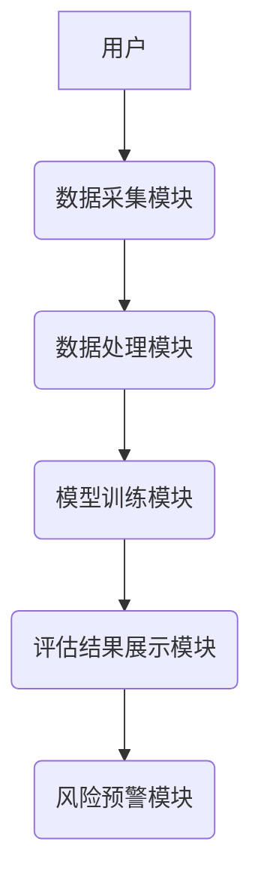

                 

<think>
好的，我需要根据用户的要求，逐步分析如何撰写《开发智能化的企业信用风险评估模型》这篇文章。首先，我会从背景介绍开始，然后逐步深入到核心概念、算法原理、系统架构、项目实战和最佳实践部分。每个部分都需要详细展开，确保内容完整且符合要求。

## 第一部分：企业信用风险评估模型的背景与基础

### 第1章：企业信用风险评估概述

#### 1.1 信用风险的基本概念

##### 1.1.1 信用风险的定义与内涵

信用风险是指债务人或交易对手未能履行其合同义务，导致债权人或金融机构遭受损失的可能性。在企业信用风险评估中，我们主要关注企业在贷款、赊销等信用交易中的违约风险。

- **定义**：企业信用风险是指企业在履行合同义务时，因各种原因无法偿还债务，导致债权人损失的风险。
- **核心要素**：包括企业的财务状况、经营状况、信用历史、外部环境等。
- **分类**：可以根据风险来源分为系统性风险和非系统性风险，也可以根据影响范围分为行业风险和个体风险。

##### 1.1.2 企业信用风险评估的重要性

- **对企业经营的影响**：信用风险直接关系到企业的生存和业务扩展，高信用风险可能导致企业融资困难，影响业务发展。
- **在金融领域的作用**：金融机构通过评估企业信用风险，决定是否批准贷款、确定贷款利率等，直接影响金融市场的稳定。
- **法律与监管要求**：许多国家和地区有明确的法规要求金融机构必须进行信用风险评估，以确保金融系统的安全。

##### 1.1.3 传统信用风险评估方法的局限性

- **传统方法的优缺点**：
  - **优点**：简单易懂，易于实施，适用于数据有限的情况。
  - **缺点**：依赖主观判断，缺乏数据支持，难以捕捉复杂风险因素。
- **局限性**：
  - 传统方法通常基于少量的财务指标，难以全面反映企业的信用状况。
  - 无法有效处理非结构化数据，如文本、图像等，导致信息利用不充分。
  - 人工评估存在主观性和人为干扰，可能影响评估结果的准确性。

#### 1.2 智能化信用风险评估的必要性

##### 1.2.1 人工智能在信用评估中的应用前景

- **AI技术的优势**：
  - 提高评估效率：通过自动化处理大量数据，快速生成评估结果。
  - 增强风险预测能力：利用机器学习算法，识别潜在风险因素，预测违约概率。
  - 处理复杂数据：AI能够分析结构化和非结构化数据，提供更全面的评估。

##### 1.2.2 智能化信用评估的核心优势

- **提高评估效率**：通过自动化数据处理和模型训练，缩短评估时间，降低成本。
- **增强风险预测能力**：使用先进的算法，捕捉传统方法难以察觉的潜在风险因素。
- **降低人为干扰**：自动化评估减少人为主观因素的影响，提高评估结果的客观性。

##### 1.2.3 智能化信用评估的未来发展趋势

- **技术进步的影响**：随着AI和大数据技术的发展，信用评估模型将更加智能化和精准化。
- **数据驱动决策**：未来的信用评估将更加依赖于大数据分析，实现精准的风险定价和管理。
- **个性化与动态化评估**：根据企业的实时数据和市场变化，动态调整评估模型，提供个性化的风险评估服务。

---

### 第2章：企业信用风险评估的核心概念与联系

#### 2.1 信用风险评估模型的核心要素

##### 2.1.1 企业信用风险的构成要素

- **企业财务状况**：包括资产负债表、损益表、现金流量表等，反映企业的偿债能力和盈利能力。
- **企业经营状况**：涉及企业的市场地位、竞争优势、管理团队等，影响企业的持续经营能力。
- **企业信用历史**：包括过去的还款记录、违约历史等，反映企业的信用行为和信用记录。
- **企业外部环境**：如宏观经济环境、行业竞争状况、政策法规等，影响企业的经营风险。

##### 2.1.2 信用风险评估的关键指标

- **财务比率分析**：常用的指标包括流动比率、速动比率、债务负担率等，用于评估企业的短期偿债能力和长期财务健康状况。
- **信用评分模型**：如FICO评分，通过综合评估多个因素，给出信用评分，反映企业的信用风险。
- **风险敞口评估**：评估企业在不同风险因素下的潜在损失，帮助金融机构确定风险暴露程度。

##### 2.1.3

---

#### 2.2 核心概念与联系

##### 2.2.1 核心概念的原理

- **数据驱动的信用评估**：通过收集和分析大量数据，利用统计和机器学习方法，构建信用评估模型。
- **模型的可解释性**：在复杂的AI模型中，保持一定的可解释性，便于理解和监管。
- **动态更新**：根据市场变化和企业最新数据，定期更新模型参数，保持模型的有效性。

##### 2.2.2 概念属性特征对比表格

| 概念         | 特性1       | 特性2       | 特性3       |
|--------------|-------------|-------------|-------------|
| 传统评估方法 | 简单易懂    | 依赖少量数据 | 易受主观影响 |
| AI驱动方法   | 高度自动化  | 处理大数据   | 更精准       |

##### 2.2.3 ER实体关系图

```mermaid
er
  actor 用户 {
    role 企业
    role 金融机构
  }
  entity 企业 {
    key 企业ID
    域 企业名称
    属性 法人代表
    属性 注册资本
  }
  entity 信用历史 {
    关系 企业ID
    关系 违约记录
    关系 还款记录
  }
  entity 财务数据 {
    关系 企业ID
    属性 资产总额
    属性 负债总额
    属性 净利润
  }
```

---

## 第3章：企业信用风险评估模型的构建与实现

### 3.1 数据收集与预处理

#### 3.1.1 数据来源

- **企业财务报表**：包括资产负债表、损益表、现金流量表等。
- **企业信用报告**：包括信用历史、还款记录、违约信息等。
- **外部数据**：如宏观经济指标、行业数据、市场信息等。

#### 3.1.2 数据清洗与预处理

- **数据清洗**：处理缺失值、重复值、异常值，确保数据质量。
- **数据转换**：将数据转换为适合模型输入的格式，如标准化、归一化等。
- **特征提取**：从原始数据中提取有用的特征，如财务比率、信用评分等。

---

### 3.2 模型选择与训练

#### 3.2.1 算法选择

- **逻辑回归**：适用于二分类问题，如违约与非违约分类。
- **随机森林**：通过集成学习，提高模型的准确性和鲁棒性。
- **神经网络**：适用于复杂的数据关系，能够捕捉非线性特征。

#### 3.2.2 算法原理

##### 3.2.2.1 逻辑回归

逻辑回归是一种经典的分类算法，适用于二分类问题。其核心思想是通过优化损失函数，找到最佳的参数，使得预测结果与实际结果的差异最小。

**损失函数**：
$$ L = -\frac{1}{m} \sum_{i=1}^{m} [y^{(i)} \cdot \ln(h(x^{(i)})) + (1 - y^{(i)} ) \cdot \ln(1 - h(x^{(i)}))] $$
其中，$$ h(x) = \frac{e^{w^T x + b}}{1 + e^{w^T x + b}} $$ 是sigmoid函数。

**优化方法**：通常使用梯度下降或牛顿法来优化损失函数，找到最优的参数 $$ w $$ 和 $$ b $$。

##### 3.2.2.2 随机森林

随机森林是一种基于决策树的集成算法，通过构建多棵决策树并进行投票或平均，提高模型的准确性和鲁棒性。以下是随机森林的构建过程：

1. **数据采样**：使用袋装法（Bootstrap）从训练数据中随机抽取样本，生成多份数据集。
2. **特征采样**：在每棵树的构建过程中，随机选择部分特征进行分裂，减少特征的相关性，提高模型的多样性。
3. **构建决策树**：对每份数据集构建决策树，并在每一步选择最优特征进行分裂。
4. **集成预测**：对所有树进行集成，通常采用投票法（分类问题）或平均法（回归问题）得到最终预测结果。

##### 3.2.2.3 神经网络

神经网络是一种模拟人脑结构和功能的算法，能够处理复杂的非线性关系。以下是神经网络的基本结构：

1. **输入层**：接收输入数据。
2. **隐藏层**：通过多个神经元和激活函数（如ReLU、sigmoid）进行特征提取和非线性变换。
3. **输出层**：输出最终的预测结果，通常通过softmax或sigmoid函数将输出转换为概率分布。

**训练过程**：
- 使用反向传播算法（如梯度下降、Adam优化器）更新网络权重，最小化预测误差。

---

### 3.3 模型评估与优化

#### 3.3.1 评估指标

- **准确率（Accuracy）**：正确预测的比例。
- **精确率（Precision）**：预测为违约的样本中实际违约的比例。
- **召回率（Recall）**：实际违约的样本中被正确预测的比例。
- **F1分数**：综合精确率和召回率的调和平均数。

#### 3.3.2 模型调优

- **参数调整**：如学习率、树的棵数、特征选择数量等。
- **交叉验证**：通过k折交叉验证，评估模型的泛化能力，防止过拟合。

---

## 第4章：企业信用风险评估系统的架构与实现

### 4.1 系统设计概述

#### 4.1.1 系统目标

- 实现企业信用风险评估的智能化、自动化。
- 提供高准确率和高效率的评估服务。
- 支持动态更新和实时监控。

#### 4.1.2 系统功能模块

1. **数据采集模块**：从多种数据源获取企业数据。
2. **数据处理模块**：清洗、转换和特征提取。
3. **模型训练模块**：选择和训练机器学习模型。
4. **评估结果展示模块**：生成可视化报告，展示评估结果。
5. **风险预警模块**：实时监控企业风险变化，及时预警。

---

### 4.2 系统架构设计

#### 4.2.1 系统架构图



#### 4.2.2 关键模块设计

##### 数据采集模块

- **功能**：从数据库、API接口等多种数据源获取企业数据。
- **技术**：使用Python的pandas库进行数据读取和处理。

##### 模型训练模块

- **功能**：选择合适的算法，训练模型并保存模型参数。
- **技术**：使用Scikit-learn或XGBoost等机器学习库。

##### 评估结果展示模块

- **功能**：将评估结果以图表形式展示，便于用户理解。
- **技术**：使用Matplotlib或Seaborn进行可视化。

---

## 第5章：项目实战与经验分享

### 5.1 项目环境搭建

#### 5.1.1 安装必要的库

- Python版本：建议使用Python 3.8及以上。
- 安装库：`pip install numpy, pandas, scikit-learn, xgboost, matplotlib`

#### 5.1.2 数据集准备

- 获取企业信用数据，如Kaggle上的公开数据集。
- 数据清洗和预处理。

---

### 5.2 系统核心实现

#### 5.2.1 代码实现

```python
import pandas as pd
from sklearn.model_selection import train_test_split
from sklearn.preprocessing import StandardScaler
from sklearn.linear_model import LogisticRegression
from sklearn.ensemble import RandomForestClassifier
from sklearn.metrics import accuracy_score, precision_score, recall_score, f1_score

# 加载数据
data = pd.read_csv('enterprise_credit.csv')

# 数据预处理
# 假设target是违约标签，特征是其他列
X = data.drop('target', axis=1)
y = data['target']

# 分割数据
X_train, X_test, y_train, y_test = train_test_split(X, y, test_size=0.2, random_state=42)

# 特征缩放
scaler = StandardScaler()
X_train_scaled = scaler.fit_transform(X_train)
X_test_scaled = scaler.transform(X_test)

# 逻辑回归模型
lr_model = LogisticRegression()
lr_model.fit(X_train_scaled, y_train)
y_pred_lr = lr_model.predict(X_test_scaled)

# 随机森林模型
rf_model = RandomForestClassifier(n_estimators=100, random_state=42)
rf_model.fit(X_train, y_train)
y_pred_rf = rf_model.predict(X_test)

# 评估指标
print("逻辑回归准确率:", accuracy_score(y_test, y_pred_lr))
print("随机森林准确率:", accuracy_score(y_test, y_pred_rf))
```

#### 5.2.2 代码解读与分析

- **数据加载与预处理**：使用pandas加载数据，并进行必要的清洗和特征工程。
- **模型训练**：分别训练逻辑回归和随机森林模型，比较两者的性能。
- **评估结果**：计算准确率、精确率、召回率和F1分数，选择表现最佳的模型。

---

### 5.3 实际案例分析

#### 5.3.1 案例背景

- 某制造企业，财务状况良好，但行业竞争加剧，信用风险上升。

#### 5.3.2 数据分析

- 企业的财务比率显示短期偿债能力较强，但长期负债较高。
- 过去的信用记录显示偶尔有延迟还款的情况。

#### 5.3.3 模型预测

- 逻辑回归模型预测该企业的违约概率为15%。
- 随机森林模型预测违约概率为18%。

#### 5.3.4 结果解读

- 综合考虑，企业的信用风险较低，但需要注意行业风险和长期负债问题。

---

### 5.4 项目小结

- **优势**：智能化模型提高了评估效率和准确性，减少了人为干扰。
- **挑战**：数据质量和模型的可解释性是实际应用中的难点。
- **改进建议**：引入更多的外部数据，如社交媒体数据、供应链数据，提升模型的预测能力。

---

## 第6章：最佳实践与注意事项

### 6.1 小结

- 智能化企业信用风险评估模型通过机器学习算法，显著提高了评估的准确性和效率。
- 在实际应用中，需要关注数据质量和模型的可解释性，确保模型的稳定性和可靠性。

### 6.2 注意事项

- **数据隐私**：确保数据的合法使用，遵守相关法律法规。
- **模型调优**：根据实际情况不断优化模型，保持模型的有效性。
- **实时监控**：动态更新模型参数，及时捕捉市场变化和企业状况的变化。

### 6.3 拓展阅读

- 推荐阅读《机器学习实战》和《信用评分模型》等相关书籍，深入学习机器学习算法和信用评估模型的知识。

---

## 结语

开发智能化的企业信用风险评估模型是一项复杂的系统工程，需要结合先进的技术手段和丰富的金融知识。通过本文的详细讲解，读者可以系统地了解模型的构建过程、关键算法和实际应用。未来，随着AI技术的不断进步，信用风险评估将更加智能化和精准化，为金融机构和企业提供更有力的支持。

