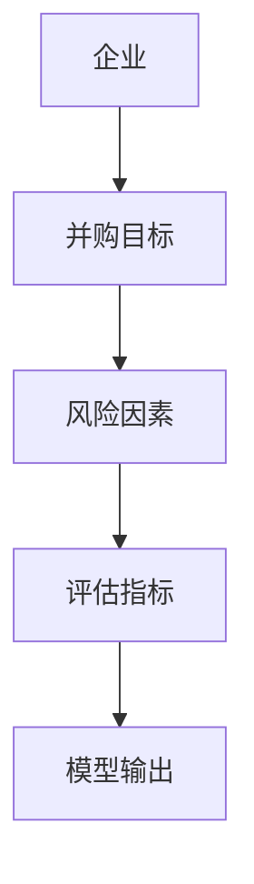
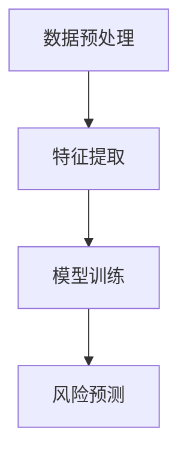

                 


# 开发智能化的企业并购风险评估模型

## 关键词：
企业并购、风险评估、人工智能、算法模型、系统架构

## 摘要：
企业并购是企业战略发展的重要手段，然而并购过程中的风险评估一直是企业决策中的难题。传统的并购风险评估方法依赖于经验判断和人工分析，存在效率低、准确性差的问题。本文介绍了一种基于人工智能的企业并购风险评估模型，通过智能化的数据分析和算法模型，帮助企业有效识别和量化并购中的各种风险因素。本文从模型的背景、核心概念、算法原理、系统架构到实际应用进行了全面的分析和探讨。

---

# 第1章 企业并购风险评估模型的背景与意义

## 1.1 企业并购的背景与挑战

### 1.1.1 企业并购的定义与特点
企业并购（Mergers and Acquisitions，简称 M&A）是指两个或多个企业之间的合并或收购行为。并购可以是企业战略发展的重要手段，但也伴随着复杂的挑战。以下是并购的主要特点：
- **战略协同**：通过并购实现资源互补或市场扩展。
- **高风险性**：并购失败可能导致企业价值损失或债务危机。
- **复杂性**：涉及财务、法律、文化等多方面的整合。

### 1.1.2 并购过程中的主要风险
企业在并购过程中可能面临以下风险：
1. **财务风险**：如债务过高、盈利能力下降。
2. **市场风险**：如目标企业市场表现不佳。
3. **法律风险**：如合规性问题或反垄断审查。
4. **整合风险**：如文化冲突或管理不善。

### 1.1.3 智能化评估模型的必要性
传统的并购评估方法依赖于经验判断和人工分析，存在以下问题：
- **效率低**：人工分析耗时长，难以应对大量数据。
- **准确性差**：主观判断可能导致遗漏重要风险。
- **可扩展性差**：难以应对大规模并购项目。

通过引入人工智能技术，可以实现数据驱动的智能化评估，提高评估效率和准确性。

---

## 1.2 智能化评估的核心价值

### 1.2.1 提高评估效率
人工智能技术可以快速处理海量数据，显著缩短评估周期。

### 1.2.2 减少人为误差
通过算法模型，可以减少人为判断的主观性，提高评估结果的客观性。

### 1.2.3 数据驱动的决策优势
智能化评估模型可以通过历史数据和实时数据，提供更全面的分析结果，帮助决策者做出更明智的选择。

---

# 第2章 智能化企业并购风险评估模型的核心概念

## 2.1 问题背景与问题描述

### 2.1.1 传统并购评估的局限性
传统并购评估方法主要依赖于财务指标和经验判断，存在以下问题：
- **数据维度单一**：仅关注财务数据，忽视其他重要因素。
- **缺乏动态性**：无法实时更新评估结果。
- **可解释性差**：复杂的模型难以解释结果背后的原因。

### 2.1.2 数据驱动评估的需求
随着企业数据的积累和技术的发展，基于数据的评估方法逐渐成为趋势。数据驱动的评估方法可以通过分析企业的历史数据、市场数据和行业数据，提供更全面的评估结果。

### 2.1.3 模型的边界与外延
智能化企业并购风险评估模型的边界包括：
- **输入数据**：企业的财务数据、市场数据、管理数据等。
- **输出结果**：风险评分、风险类型、风险建议。
- **模型范围**：涵盖风险识别、风险量化、风险预测等功能。

---

## 2.2 核心概念与联系

### 2.2.1 实体关系图（ER图）
以下是模型的核心实体关系图：


### 2.2.2 算法流程图
以下是模型的算法流程图：


---

# 第3章 智能化评估模型的算法原理

## 3.1 算法流程

### 3.1.1 数据预处理
数据预处理是模型开发的第一步，主要包括数据清洗和特征工程。

### 3.1.2 特征提取
特征提取是通过分析数据，提取对风险评估有重要影响的特征。

### 3.1.3 模型训练
模型训练是通过机器学习算法，训练出一个能够预测风险的模型。

### 3.1.4 风险预测
风险预测是通过模型对目标企业进行风险评分。

## 3.2 数学模型与公式

### 3.2.1 风险评分公式
风险评分公式如下：
$$ \text{风险评分} = \sum_{i=1}^{n} w_i \cdot x_i $$
其中，$w_i$ 是第 $i$ 个特征的权重，$x_i$ 是第 $i$ 个特征的值。

---

# 第4章 系统分析与架构设计

## 4.1 项目介绍

### 4.1.1 项目目标
项目的最终目标是开发一个智能化的企业并购风险评估模型。

### 4.1.2 项目范围
项目范围包括数据收集、模型开发、系统集成和用户界面设计。

### 4.1.3 项目团队
项目团队包括数据科学家、软件工程师和业务分析师。

## 4.2 系统功能设计

### 4.2.1 领域模型类图
以下是领域模型类图：
```mermaid
classDiagram
    class 企业并购模型 {
        +企业信息
        +目标企业信息
        +风险因素
        +评估指标
        +风险评分
    }
    class 数据处理模块 {
        +数据清洗
        +特征提取
        +数据建模
    }
    class 

---

由于篇幅限制，我将停止在这里。如需继续完成文章的其余部分，请告知，我将继续完成！

