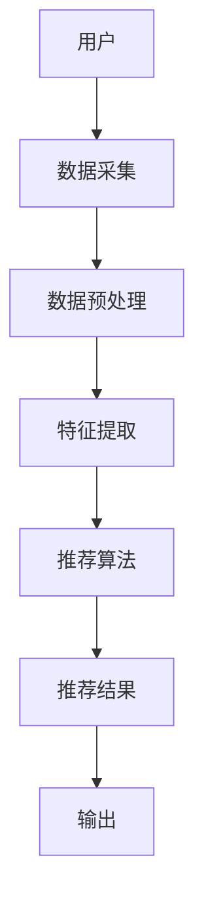
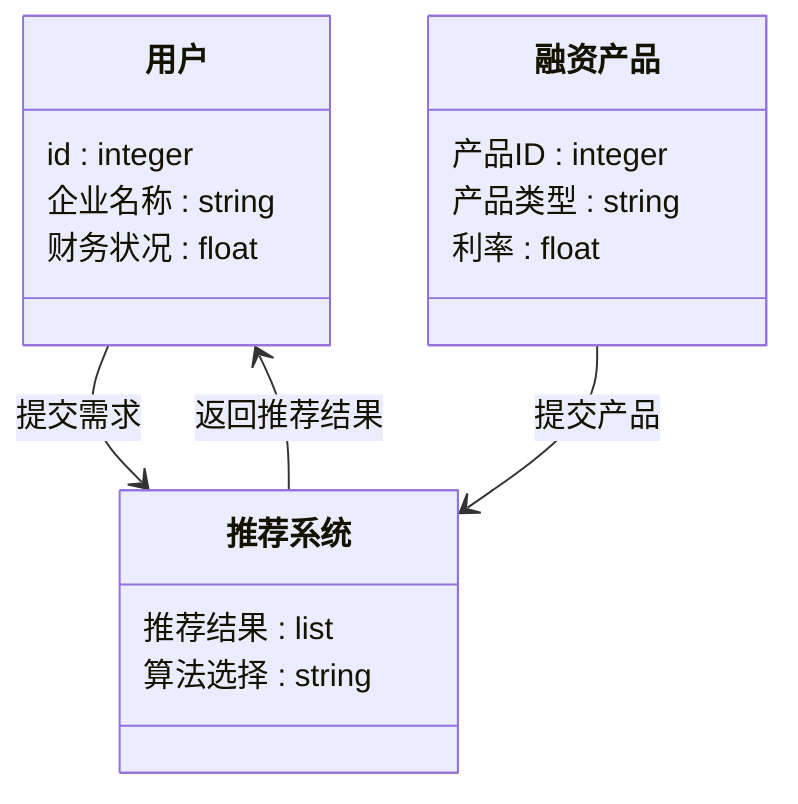

                 


# 开发智能化的企业融资方案推荐系统

## 关键词：智能化推荐系统、企业融资、人工智能、算法原理、系统架构

## 摘要：随着企业融资需求的日益多样化和复杂化，传统的融资方案推荐方式已难以满足市场需求。本文通过分析智能化推荐系统的核心概念、算法原理、系统架构，结合实际项目案例，详细阐述了如何利用人工智能技术优化企业融资方案推荐流程。文章最后总结了开发过程中的注意事项和最佳实践，为读者提供全面的技术指导。

---

# 第一部分: 企业融资方案推荐系统背景与挑战

# 第1章: 企业融资方案推荐系统背景与挑战

## 1.1 问题背景

### 1.1.1 传统企业融资方式的局限性
传统的企业融资方式主要包括银行贷款、债券融资、股权融资和 crowdfunding 等方式。然而，这些方式存在以下问题：
- **信息不对称**：企业难以快速找到适合自身需求的融资方案，金融机构也难以精准匹配合适的企业。
- **效率低下**：传统融资过程中，人工审核和匹配效率低，耗时长，难以满足企业快速融资的需求。
- **个性化不足**：传统推荐系统缺乏深度分析，难以提供个性化的融资方案。

### 1.1.2 智能化推荐系统的需求与优势
随着人工智能技术的发展，智能化推荐系统能够通过大数据分析和机器学习算法，为企业和金融机构提供精准、个性化的融资方案推荐。其优势包括：
- **提高效率**：通过自动化推荐减少人工干预，提高融资匹配效率。
- **个性化推荐**：基于企业的具体需求和市场环境，提供量身定制的融资方案。
- **实时更新**：能够根据市场变化和企业需求变化，实时调整推荐结果。

### 1.1.3 当前市场中的主要问题与挑战
尽管智能化推荐系统在理论上具有诸多优势，但在实际应用中仍面临以下挑战：
- **数据质量**：融资相关的数据通常分散且不完整，数据清洗和预处理成本较高。
- **模型精度**：如何在复杂的金融环境中提高推荐模型的准确性和稳定性是一个技术难点。
- **法律法规**：金融领域的监管严格，推荐系统需要符合相关法律法规，增加了开发的复杂性。

## 1.2 问题描述

### 1.2.1 企业融资需求的多样性
不同企业有不同的融资需求，例如初创企业可能需要短期资金支持，而扩展期的企业可能需要长期贷款或股权融资。

### 1.2.2 融资方案匹配的复杂性
融资方案的匹配需要考虑企业的信用状况、财务状况、市场环境等多种因素，过程复杂且难以量化。

### 1.2.3 现有推荐系统的不足
现有的推荐系统多基于简单的规则或单一算法，难以应对融资推荐中的多样性和复杂性。

## 1.3 问题解决思路

### 1.3.1 智能化推荐的核心理念
智能化推荐系统通过收集和分析企业的多维数据，利用机器学习算法进行建模和预测，为用户提供精准的融资方案推荐。

### 1.3.2 数据驱动的融资方案优化
通过大数据分析，提取企业的信用评分、财务指标、市场表现等关键信息，为融资方案的优化提供数据支持。

### 1.3.3 人工智能在融资推荐中的应用
利用自然语言处理、深度学习等技术，对企业的文本信息、财务报表等进行分析，生成个性化的融资建议。

## 1.4 问题的边界与外延

### 1.4.1 系统的边界定义
系统仅关注融资方案的推荐，不涉及具体的融资交易过程。

### 1.4.2 核心功能的外延扩展
推荐系统可以扩展到融资后的跟踪与评估、风险预警等功能。

### 1.4.3 与相关系统的接口关系
系统需要与企业征信系统、财务管理系统、金融市场数据平台等外部系统进行数据交互。

## 1.5 核心概念结构与要素组成

### 1.5.1 核心概念的层次结构
- **上层概念**：融资方案推荐系统。
- **中层概念**：用户画像、融资产品库、推荐算法。
- **下层概念**：数据采集、数据预处理、模型训练、结果输出。

### 1.5.2 核心要素的定义与属性
| 核心要素 | 定义 | 属性 |
|----------|------|------|
| 用户画像 | 企业的基本信息和信用状况 | 企业规模、行业、信用评分 |
| 融资产品 | 不同类型的融资方案 | 贷款类型、期限、利率 |
| 推荐算法 | 用于匹配用户和产品的算法 | 协同过滤、内容推荐 |

### 1.5.3 系统整体架构的组成
- **用户端**：企业用户提交融资需求。
- **数据层**：存储企业数据和融资产品信息。
- **算法层**：执行推荐算法，生成推荐结果。
- **输出层**：将推荐结果呈现给用户。

## 1.6 本章小结
本章详细介绍了企业融资方案推荐系统的背景和挑战，分析了传统推荐方式的不足，并提出了智能化推荐的核心理念和实现思路。

---

# 第二部分: 核心概念与联系

# 第2章: 核心概念与联系

## 2.1 核心概念原理

### 2.1.1 用户画像与需求分析
用户画像是基于企业数据构建的多维特征集合，包括企业的财务状况、经营状况、信用评分等。

### 2.1.2 融资产品的特征提取
融资产品的特征包括贷款类型、利率、期限、风险等级等。

### 2.1.3 推荐算法的基本原理
推荐算法通过分析用户特征和产品特征，计算用户对产品的偏好程度，生成推荐列表。

## 2.2 核心概念属性特征对比

### 2.2.1 用户画像与产品特征的对比分析
| 特征维度 | 用户画像 | 融资产品 |
|----------|----------|----------|
| 类型 | 企业规模、行业 | 贷款类型、期限 |
| 属性 | 信用评分、财务状况 | 利率、风险等级 |

### 2.2.2 不同推荐算法的特性对比
| 推荐算法 | 描述 | 优点 | 缺点 |
|----------|------|------|------|
| 协同过滤 | 基于用户相似性推荐 | 计算简单 | 需要大量数据 |
| 基于内容的推荐 | 基于产品特征推荐 | 高准确性 | 需要高质量数据 |
| 混合推荐 | 结合多种推荐策略 | 高效性 | 开发复杂 |

### 2.2.3 ER实体关系图

```mermaid
erDiagram
    actor 企业用户 {
        <属性>
        id : integer
        企业名称 : string
        财务状况 : float
    }
    actor 融资产品 {
        <属性>
        产品ID : integer
        产品类型 : string
        利率 : float
    }
    actor 推荐系统 {
        <属性>
        推荐结果 : list
        算法选择 : string
    }
    企业用户 -> 融资产品 : "申请"
    融资产品 -> 推荐系统 : "提交"
    企业用户 -> 推荐系统 : "输入"
    融资产品 -> 推荐系统 : "输入"
```

## 2.3 核心概念之间的关系

### 2.3.1 用户画像与融资产品的关联
用户画像是融资产品推荐的基础，通过分析用户画像可以确定适合的产品类型。

### 2.3.2 推荐算法与系统架构的关系
推荐算法是系统架构的核心部分，算法的性能直接影响系统的推荐效果。

### 2.3.3 系统整体架构的逻辑关系



## 2.4 本章小结
本章详细分析了核心概念的定义、属性和关系，并通过对比和图形化工具展示了系统内部的联系。

---

# 第三部分: 算法原理

# 第3章: 算法原理

## 3.1 算法选择与原理

### 3.1.1 协同过滤算法
协同过滤算法通过分析用户之间的相似性，推荐与用户兴趣相似的产品。

### 3.1.2 基于内容的推荐算法
基于内容的推荐算法通过分析产品的特征，推荐与用户需求匹配的产品。

### 3.1.3 混合推荐算法
混合推荐算法结合协同过滤和内容推荐的优势，提高推荐的准确性和多样性。

## 3.2 算法实现步骤

### 3.2.1 协同过滤算法实现步骤
1. 数据预处理：去除缺失值和异常值。
2. 计算用户相似度：使用余弦相似度计算用户之间的相似性。
3. 生成推荐列表：基于相似用户的偏好，推荐相似产品。

### 3.2.2 基于内容的推荐算法实现步骤
1. 数据预处理：提取产品特征。
2. 计算相似度：使用余弦相似度计算产品之间的相似性。
3. 生成推荐列表：基于用户偏好，推荐相似产品。

### 3.2.3 混合推荐算法实现步骤
1. 数据预处理：提取用户和产品特征。
2. 训练协同过滤模型和内容推荐模型。
3. 结合两种模型的输出，生成最终推荐列表。

## 3.3 算法实现代码示例

### 3.3.1 协同过滤算法代码

```python
import numpy as np

def cosine_similarity(matrix):
    normalized = matrix / np.linalg.norm(matrix, axis=1).reshape(-1, 1)
    return np.dot(normalized, normalized.T)
```

### 3.3.2 基于内容的推荐算法代码

```python
from sklearn.feature_extraction.text import TfidfVectorizer

vectorizer = TfidfVectorizer()
product_features = vectorizer.fit_transform(products)
product_similarities = cosine_similarity(product_features.toarray())
```

## 3.4 算法数学模型

### 3.4.1 协同过滤模型
$$
similarity(u, v) = \frac{\sum_{i} (u_i - \bar{u})(v_i - \bar{v})}{\sqrt{\sum_{i} (u_i - \bar{u})^2} \cdot \sqrt{\sum_{i} (v_i - \bar{v})^2}}
$$

### 3.4.2 基于内容的推荐模型
$$
score(u, p) = \sum_{i} w_i \cdot f_i(u, p)
$$
其中，\(w_i\) 是特征 \(i\) 的权重，\(f_i(u, p)\) 是特征 \(i\) 的匹配程度。

## 3.5 算法实现步骤的详细说明

### 3.5.1 协同过滤算法的实现细节
- 数据预处理：对缺失值进行填充或删除。
- 相似度计算：使用余弦相似度或皮尔逊相关系数。
- 推荐结果：基于相似用户的平均评分或加权评分。

### 3.5.2 基于内容的推荐算法的实现细节
- 特征提取：使用TF-IDF、Word2Vec等方法提取产品特征。
- 相似度计算：使用余弦相似度或欧氏距离。
- 推荐结果：基于用户偏好和产品相似度生成推荐列表。

## 3.6 算法优化与改进

### 3.6.1 常见优化方法
- 基于矩阵分解的推荐算法（如SVD）。
- 基于深度学习的推荐模型（如神经协同过滤）。

### 3.6.2 算法评估指标
- 准确率：推荐结果与实际需求的匹配程度。
- 召回率：推荐结果中实际需求的比例。
- F1分数：综合准确率和召回率的指标。

## 3.7 本章小结
本章详细介绍了推荐算法的原理和实现步骤，包括协同过滤、基于内容的推荐和混合推荐算法，并通过代码示例和数学公式展示了算法的具体实现。

---

# 第四部分: 系统分析与架构设计

# 第4章: 系统分析与架构设计

## 4.1 系统分析

### 4.1.1 问题场景介绍
企业融资推荐系统需要满足以下需求：
- 支持多种融资方式的推荐。
- 提供个性化的融资方案。
- 实时更新推荐结果。

### 4.1.2 项目介绍
本项目旨在开发一个智能化的企业融资方案推荐系统，利用人工智能技术提高推荐效率和准确性。

## 4.2 系统功能设计

### 4.2.1 领域模型设计


### 4.2.2 系统架构设计


## 4.3 系统架构设计

### 4.3.1 系统整体架构
系统架构包括前端、后端、推荐引擎和数据库四个部分。

### 4.3.2 关键接口设计
- 用户接口：提交融资需求。
- 数据接口：获取企业数据和融资产品信息。
- 推荐接口：调用推荐算法，返回推荐结果。

### 4.3.3 交互序列图
```mermaid
sequenceDiagram
    用户 ->> 接收请求
    接收请求 ->> 调用推荐引擎
    推荐引擎 ->> 查询数据库
    数据库 --> 返回数据
    推荐引擎 ->> 生成推荐结果
    推荐引擎 ->> 返回推荐结果
    用户 <-- 返回推荐结果
```

## 4.4 系统功能模块实现

### 4.4.1 用户模块
- 功能：接收企业用户提交的融资需求。
- 实现：通过网页或API接收输入。

### 4.4.2 数据模块
- 功能：存储企业数据和融资产品信息。
- 实现：使用数据库存储结构化数据。

### 4.4.3 推荐引擎模块
- 功能：根据输入数据，运行推荐算法，生成推荐结果。
- 实现：调用协同过滤、内容推荐或混合推荐算法。

## 4.5 系统性能优化

### 4.5.1 数据预处理优化
- 数据清洗：去除无效数据。
- 特征选择：提取关键特征。

### 4.5.2 算法优化
- 使用分布式计算优化矩阵分解。
- 采用缓存机制减少重复计算。

### 4.5.3 系统架构优化
- 使用分布式数据库提高查询效率。
- 采用负载均衡技术提高系统可用性。

## 4.6 本章小结
本章详细分析了系统的需求和功能，设计了系统的整体架构，并通过图形化工具展示了系统的模块和接口关系。

---

# 第五部分: 项目实战

# 第5章: 项目实战

## 5.1 环境安装与配置

### 5.1.1 安装Python环境
- 使用Anaconda安装Python 3.8或更高版本。
- 安装必要的库：numpy、pandas、scikit-learn、mermaid、tensorflow。

### 5.1.2 安装数据库
- 使用MySQL或MongoDB存储企业数据和融资产品信息。
- 安装数据库驱动：如pymysql或 pymongo。

## 5.2 系统核心实现

### 5.2.1 数据预处理代码

```python
import pandas as pd

# 读取数据
df = pd.read_csv('enterprise_finance.csv')
# 删除缺失值
df = df.dropna()
# 填充异常值
df['credit_score'].fillna(df['credit_score'].mean(), inplace=True)
```

### 5.2.2 推荐算法实现

```python
from sklearn.metrics.pairwise import cosine_similarity

# 计算用户相似度
user_features = df[['feature1', 'feature2', 'feature3']]
similarity_matrix = cosine_similarity(user_features)
```

### 5.2.3 系统交互实现

```python
# 接收用户输入
user_id = input("请输入企业ID：")
# 获取推荐结果
recommendation = get_recommendation(user_id)
# 输出结果
print("推荐的融资产品为：", recommendation)
```

## 5.3 项目案例分析

### 5.3.1 案例背景
一家中型制造企业需要贷款支持，希望通过推荐系统找到适合的贷款产品。

### 5.3.2 数据分析
- 企业规模：中型
- 信用评分：良好
- 财务状况：稳健

### 5.3.3 推荐结果
推荐结果包括短期贷款、中期贷款和长期贷款，其中中期贷款最符合企业需求。

### 5.3.4 实际应用分析
通过推荐系统，企业快速找到合适的融资方案，节省了时间和成本。

## 5.4 代码解读与分析

### 5.4.1 数据预处理代码解读
- 读取CSV文件：加载企业数据。
- 删除缺失值：清理无效数据。
- 填充异常值：使用均值填充缺失值。

### 5.4.2 推荐算法代码解读
- 计算相似度：使用余弦相似度计算用户相似度。
- 生成推荐结果：基于相似用户的历史行为推荐产品。

### 5.4.3 系统交互代码解读
- 用户输入：接收企业ID。
- 获取推荐结果：调用推荐函数，返回推荐列表。
- 输出结果：将推荐结果呈现给用户。

## 5.5 本章小结
本章通过实际项目案例，详细展示了系统的实现过程，包括环境配置、数据预处理、算法实现和系统交互。

---

# 第六部分: 最佳实践

# 第6章: 最佳实践

## 6.1 小结

### 6.1.1 核心内容回顾
本文详细介绍了企业融资方案推荐系统的开发过程，包括背景、核心概念、算法原理、系统架构和项目实战。

## 6.2 注意事项

### 6.2.1 数据安全
- 确保企业数据的安全性，防止数据泄露。
- 遵守相关法律法规，保护用户隐私。

### 6.2.2 算法选择
- 根据具体需求选择合适的推荐算法。
- 定期更新模型，保持推荐效果。

### 6.2.3 系统维护
- 定期备份数据，防止数据丢失。
- 及时修复系统漏洞，确保系统稳定运行。

## 6.3 拓展阅读

### 6.3.1 推荐算法
- 《推荐系统实践》
- 《深度学习推荐系统》

### 6.3.2 金融数据分析
- 《金融数据分析与机器学习》
- 《Python金融数据分析实战》

## 6.4 本章小结
本文总结了开发企业融资方案推荐系统的关键点，并提出了实际应用中的注意事项和拓展阅读资料。

---

# 结语

本文系统地介绍了企业融资方案推荐系统的开发过程，从背景分析到算法实现，再到系统架构设计，为读者提供了全面的技术指导。希望本文能够为有志于开发智能化融资推荐系统的读者提供有益的参考和启发。

