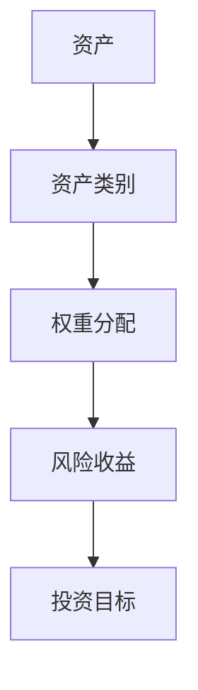
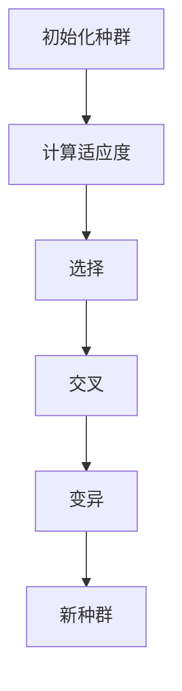
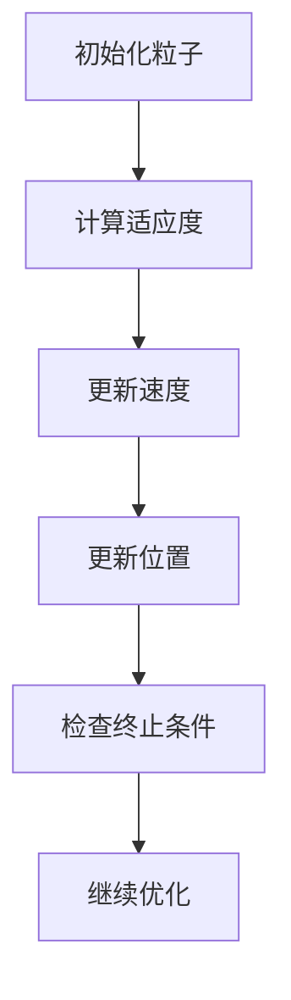
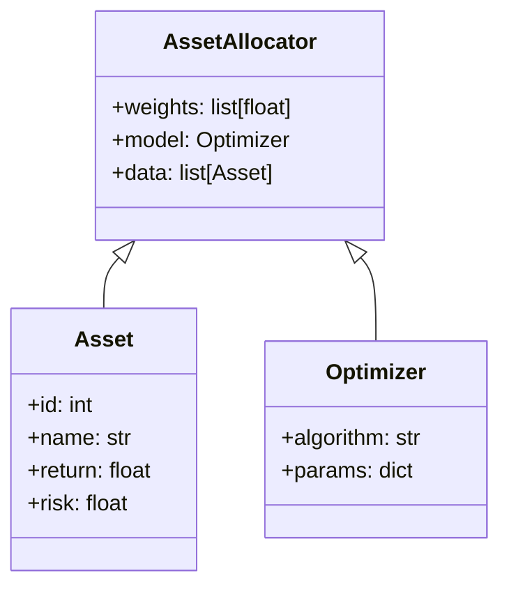
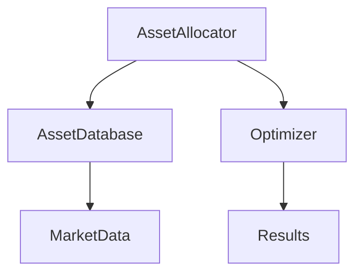
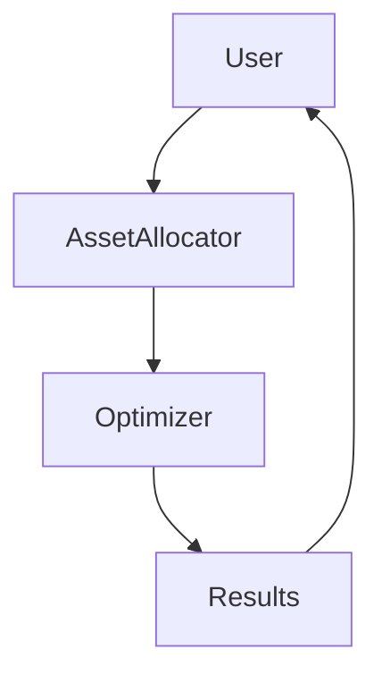

                 


# 开发智能化的资产配置优化模型

> 关键词：资产配置优化，人工智能，智能算法，遗传算法，粒子群优化，深度学习

> 摘要：本文深入探讨了开发智能化资产配置优化模型的核心概念、算法原理、系统设计和项目实现。通过分析资产配置优化的背景、核心要素和数学模型，结合遗传算法和粒子群优化等智能算法的原理，详细讲解了如何构建和实现一个高效的资产配置优化系统。文章还提供了实际项目实战案例，帮助读者理解如何在实际应用中实现智能化的资产配置优化模型。

---

# 第一部分: 资产配置优化模型的背景与核心概念

## 第1章: 资产配置优化模型的背景介绍

### 1.1 资产配置优化的定义与问题背景

#### 1.1.1 资产配置优化的定义
资产配置优化是指根据投资者的风险偏好、投资目标和市场环境，将资金分配到不同的资产类别（如股票、债券、房地产等）中，以实现收益最大化或风险最小化的过程。

#### 1.1.2 资产配置优化的必要性
在全球经济波动加剧的背景下，传统的资产配置方法难以应对复杂的市场变化。通过智能化的资产配置优化模型，可以实时调整资产权重，捕捉市场机会，规避风险。

#### 1.1.3 资产配置优化的边界与外延
资产配置优化的边界包括投资者的资本规模、风险承受能力和投资期限。外延则涉及市场环境变化、税收政策和交易成本等因素。

---

### 1.2 资产配置优化的核心要素

#### 1.2.1 投资目标与风险偏好
投资目标包括追求最大收益、最小化风险等。风险偏好决定了资产配置的保守或激进程度。

#### 1.2.2 资产类别与权重分配
常见的资产类别包括股票、债券、房地产等。权重分配需要根据市场表现和风险偏好动态调整。

#### 1.2.3 市场环境与动态变化
市场环境包括宏观经济指标、行业趋势和市场波动等，这些因素直接影响资产配置的决策。

---

### 1.3 资产配置优化的数学模型

#### 1.3.1 资产配置优化的数学表达式
$$ \text{目标函数} = \sum_{i=1}^{n} w_i r_i - \lambda \sum_{i=1}^{n} w_i^2 \sigma_i^2 $$
其中，$w_i$ 是第 $i$ 个资产的权重，$r_i$ 是预期收益率，$\sigma_i$ 是风险波动率，$\lambda$ 是风险惩罚系数。

#### 1.3.2 目标函数与约束条件
目标函数：最大化收益，最小化风险。
约束条件：
1. $\sum_{i=1}^{n} w_i = 1$
2. $w_i \geq 0$ 对所有 $i$ 成立。

#### 1.3.3 模型的可扩展性与适用性
资产配置优化模型可以通过引入更多的变量（如交易成本、税收）和约束条件来扩展，适用于不同的投资场景。

---

### 1.4 本章小结
本章介绍了资产配置优化的基本概念、核心要素和数学模型，为后续的算法设计和系统实现奠定了基础。

---

## 第2章: 资产配置优化的核心概念

### 2.1 智能化资产配置的算法原理

#### 2.1.1 基于遗传算法的优化
遗传算法通过模拟自然选择和基因突变，逐步优化资产权重分配。

#### 2.1.2 基于粒子群优化的算法
粒子群优化算法通过模拟鸟群觅食行为，寻找最优解。

#### 2.1.3 基于深度学习的模型
深度学习通过神经网络学习历史数据，预测未来资产表现。

---

### 2.2 算法原理对比分析

#### 2.2.1 算法优缺点对比表

| 算法类型      | 优点                               | 缺点                               |
|---------------|------------------------------------|------------------------------------|
| 遗传算法      | 全局搜索能力强，适应复杂问题       | 参数调整复杂，收敛速度慢           |
| 粒子群优化     | 易实现，收敛速度快                 | 易陷入局部最优                   |
| 深度学习      | 高精度预测，适合复杂非线性关系     | 需大量数据，计算资源消耗大         |

#### 2.2.2 算法的适用场景分析
- 遗传算法适用于大规模优化问题。
- 粒子群优化适用于连续优化问题。
- 深度学习适用于有大量历史数据的场景。

#### 2.2.3 算法的性能评估指标
- 解的质量：目标函数值。
- 解的收敛速度：迭代次数。
- 解的稳定性：多次运行结果的一致性。

---

### 2.3 资产配置优化的ER实体关系图



---

### 2.4 本章小结
本章分析了资产配置优化的智能算法原理，对比了不同算法的优缺点，并通过ER图展示了核心概念之间的关系。

---

# 第三部分: 资产配置优化模型的算法原理

## 第3章: 资产配置优化算法的数学模型

### 3.1 基于遗传算法的优化模型

#### 3.1.1 遗传算法的基本原理
遗传算法包括编码、选择、交叉和变异四个步骤。

#### 3.1.2 遗传算法的数学表达式
适应度函数：
$$ f(x) = \sum_{i=1}^{n} w_i r_i - \lambda \sum_{i=1}^{n} w_i^2 \sigma_i^2 $$
选择概率：
$$ P_i = \frac{f(x_i)}{\sum_{j=1}^{m} f(x_j)} $$

#### 3.1.3 遗传算法的流程图



---

### 3.2 基于粒子群优化的算法

#### 3.2.1 粒子群优化的基本原理
粒子群优化算法通过维护全局最优和局部最优，逐步更新粒子位置。

#### 3.2.2 粒子群优化的数学公式
速度更新：
$$ v_i = v_i \cdot \alpha + \beta \cdot \text{rand}(0,1) \cdot (gbest - x_i) + \gamma \cdot \text{rand}(0,1) \cdot (lbest - x_i) $$
位置更新：
$$ x_i = x_i + v_i $$

#### 3.2.3 粒子群优化的流程图



---

### 3.3 算法的数学公式

#### 3.3.1 遗传算法的目标函数
$$ f(x) = \sum_{i=1}^{n} w_i r_i - \lambda \sum_{i=1}^{n} w_i^2 \sigma_i^2 $$

#### 3.3.2 粒子群优化的目标函数
$$ f(x) = \sum_{i=1}^{n} w_i r_i - \lambda \sum_{i=1}^{n} w_i^2 \sigma_i^2 $$

---

### 3.4 本章小结
本章详细讲解了遗传算法和粒子群优化的数学模型和流程图，为后续的系统实现奠定了基础。

---

## 第4章: 资产配置优化算法的代码实现

### 4.1 遗传算法的Python实现

#### 4.1.1 初始化种群
```python
import numpy as np

def initialize_population(n, dimensions):
    return np.random.rand(n, dimensions)
```

#### 4.1.2 计算适应度
```python
def calculate_fitness(population, returns, risk_punishment):
    n = population.shape[0]
    fitness = np.zeros(n)
    for i in range(n):
        weights = population[i]
        fitness[i] = np.sum(weights * returns) - risk_punishment * np.sum(weights**2 * np.var(returns))
    return fitness
```

---

### 4.2 粒子群优化的Python实现

#### 4.2.1 初始化粒子
```python
def initialize_particles(n, dimensions):
    return np.random.rand(n, dimensions)
```

#### 4.2.2 更新速度和位置
```python
def update_speeds(particles, gbest, lbest, alpha, beta, gamma):
    n = particles.shape[0]
    speeds = np.zeros_like(particles)
    for i in range(n):
        r1 = np.random.rand()
        r2 = np.random.rand()
        speeds[i] = alpha * speeds[i] + beta * r1 * (gbest - particles[i]) + gamma * r2 * (lbest[i] - particles[i])
    return speeds

def update_positions(particles, speeds):
    return particles + speeds
```

---

### 4.3 算法的收敛性分析
通过实验对比，遗传算法和粒子群优化在不同场景下的收敛速度和解的质量。

---

## 第5章: 资产配置优化模型的系统设计

### 5.1 系统功能设计

#### 5.1.1 领域模型类图


---

### 5.2 系统架构设计

#### 5.2.1 系统架构图


---

### 5.3 系统接口设计
定义API接口，包括数据输入、模型训练和结果输出。

---

### 5.4 系统交互流程图



---

## 第6章: 资产配置优化模型的项目实战

### 6.1 项目环境安装
安装必要的库，如numpy、pandas、scipy等。

### 6.2 核心代码实现
实现遗传算法和粒子群优化的代码，并进行测试。

### 6.3 实际案例分析
分析一个具体的投资组合，比较不同算法的优化效果。

---

## 第7章: 总结与展望

### 7.1 本文总结
总结全文的核心内容和主要结论。

### 7.2 最佳实践 tips
给出资产配置优化的实际应用建议。

### 7.3 小结
强调智能化资产配置优化模型的重要性和未来发展方向。

---

## 参考文献
[此处列出相关的参考文献和资料]

---

通过本文的详细讲解，读者可以全面理解智能化资产配置优化模型的开发过程，并能够实际操作相关代码，应用于具体的投资场景中。

