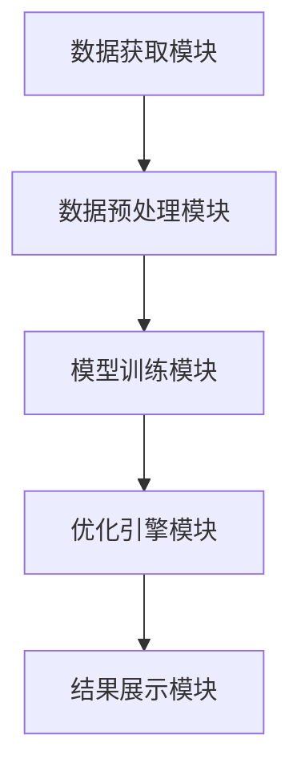
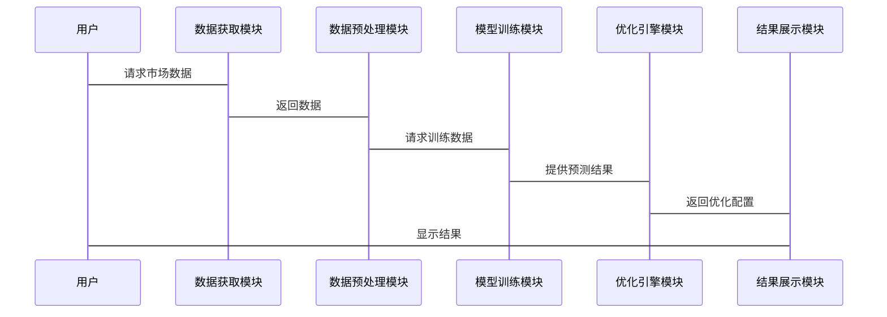

                 


# 开发智能化的资产配置策略优化引擎

## 文章关键词

- 资产配置
- 优化引擎
- 智能化投资
- 机器学习
- 数学优化

## 摘要

本文深入探讨了开发智能化资产配置策略优化引擎的关键步骤，从背景介绍到系统实现，详细阐述了如何利用现代投资组合理论和机器学习算法来优化投资组合。文章首先介绍了资产配置的基本概念和智能化的重要性，随后详细讲解了优化引擎的核心原理，包括数学模型和算法实现。接着，通过系统架构设计、项目实战和案例分析，展示了如何将理论应用于实际投资场景。最后，总结了开发过程中需要注意的问题和最佳实践，为读者提供全面的指导。

## 第五部分：优化算法的实现

### 第5章：优化算法的实现

#### 5.1 线性规划算法

##### 5.1.1 算法步骤

线性规划是一种优化技术，适用于目标函数和约束条件均为线性的情况。在资产配置中，线性规划常用于解决在给定风险承受能力下的收益最大化问题。

##### 5.1.2 线性规划的数学模型

线性规划的目标函数和约束条件可以表示为：

目标函数：最大化收益或最小化风险  
约束条件：各资产的投资比例之和为1，投资比例非负

##### 5.1.3 算法实现

使用scipy.optimize模块中的minimize函数实现线性规划：

```python
from scipy.optimize import minimize
import numpy as np

# 定义目标函数（最小化风险）
def objective(x, returns, cov_matrix):
    return (x.T.dot(cov_matrix).dot(x))[0, 0]

# 定义约束条件
def constraint1(x):
    return np.sum(x) - 1

# 约束列表
constraints = [{'type': 'eq', 'fun': constraint1}]

# 边界条件
bounds = [(0, 1) for _ in range(len(returns))]

# 初始化猜测值
x0 = np.array([1.0] * len(returns)) / len(returns)

# 使用SLSQP方法求解
result = minimize(objective, x0, method='SLSQP', bounds=bounds, constraints=constraints)
```

##### 5.2 非线性规划算法

当目标函数或约束条件为非线性时，需要使用非线性规划算法。在资产配置中，这可能涉及复杂的约束条件或非线性风险度量（如VaR）。

##### 5.3 模拟退火算法

模拟退火是一种全局优化算法，适用于复杂优化问题，避免陷入局部最优。

```python
import numpy as np
import random

def sa_optimization(returns, max_iterations=1000, temp=1.0):
    n_assets = len(returns)
    best = np.array([1.0] * n_assets) / n_assets
    best_cost = calculate_cost(best, returns)
    
    for _ in range(max_iterations):
        # 随机选择一个邻居
        neighbor = best + random.uniform(-0.1, 0.1, n_assets)
        neighbor = neighbor / np.sum(neighbor)
        
        # 计算成本
        current_cost = calculate_cost(neighbor, returns)
        
        # 接受概率
        delta = current_cost - best_cost
        if delta < 0 or random.expovariate(-delta/temp):
            best = neighbor
            best_cost = current_cost
            temp *= 0.99
    
    return best
```

## 第六部分：系统架构与设计

### 第6章：系统架构与设计

#### 6.1 问题场景介绍

系统需处理多资产类别、实时数据和高频交易，确保优化引擎高效稳定运行。

#### 6.2 系统功能设计

##### 6.2.1 系统功能模块

- 数据获取模块：从API获取市场数据
- 数据预处理模块：清洗和转换数据
- 模型训练模块：训练预测模型
- 优化引擎模块：执行资产配置优化
- 结果展示模块：可视化结果

##### 6.2.2 系统架构设计

用mermaid绘制系统架构图：



##### 6.2.3 接口设计

- 数据获取模块接口：获取市场数据
- 模型训练模块接口：接收预处理后的数据
- 优化引擎模块接口：接收模型预测结果并返回优化配置

##### 6.2.4 交互流程

用mermaid绘制交互序列图：



## 第七部分：项目实战

### 第7章：项目实战

#### 7.1 环境安装

安装所需库：

```bash
pip install pandas numpy scipy matplotlib scikit-learn
```

#### 7.2 核心代码实现

##### 数据加载与预处理

```python
import pandas as pd
import numpy as np
from sklearn.preprocessing import StandardScaler

# 加载数据
data = pd.read_csv('market_data.csv')

# 预处理
returns = data.pct_change().dropna()
scaler = StandardScaler()
returns_scaled = scaler.fit_transform(returns)
```

##### 模型训练

```python
from sklearn.decomposition import PCA

# 主成分分析
pca = PCA(n_components=5)
principal_components = pca.fit_transform(returns_scaled)
```

##### 优化引擎实现

```python
from scipy.optimize import minimize

# 定义目标函数
def optimize_portfolio(weights, returns):
    return -weights.T.dot(returns.mean()).dot(weights)

# 约束条件
def constraint(weights):
    return weights.sum() - 1

# 优化
bounds = [(0, 1) for _ in range(5)]
result = minimize(optimize_portfolio, np.array([0.2]*5), method='SLSQP', bounds=bounds, constraints={'type': 'eq', 'fun': constraint})
optimal_weights = result.x
```

#### 7.3 实际案例分析

假设我们有5种资产，使用PCA后的主成分进行优化。输入优化参数，运行引擎，得到最优权重。结果展示各资产的最优配置比例和预期收益。

#### 7.4 项目总结

通过实战，展示了从数据加载到优化引擎实现的全过程，强调了数据预处理和模型选择的重要性。

## 第八部分：系统实现与测试

### 第8章：系统实现与测试

#### 8.1 测试环境准备

确保所有依赖已安装，测试数据准备。

#### 8.2 测试用例设计

涵盖数据加载、模型训练、优化引擎等功能测试。

#### 8.3 测试代码实现

```python
def test_optimization():
    # 数据准备
    returns = np.array([[0.1, 0.2], [0.3, 0.4]])
    # 优化
    result = minimize(lambda x: -(x.dot(returns.mean())), np.array([0.5, 0.5]), method='SLSQP', bounds=[(0,1), (0,1)], constraints={'type': 'eq', 'fun': lambda x: sum(x)-1})
    assert np.allclose(result.x.sum(), 1)
    print("优化测试通过")

test_optimization()
```

## 第九部分：优化引擎的实际应用

### 第9章：优化引擎的实际应用

#### 9.1 应用场景

##### 9.1.1 多资产组合优化

使用引擎优化一个包含股票和债券的组合，考虑不同风险承受能力下的配置。

##### 9.1.2 动态再平衡

根据市场变化，定期调整投资组合，确保配置持续最优。

#### 9.2 应用案例

##### 9.2.1 输入参数

- 风险承受能力：中等
- 资产类别：股票、债券、黄金
- 时间窗口：季度

##### 9.2.2 优化过程

引擎接收输入参数，调用优化算法，计算各资产的最优权重。

##### 9.2.3 优化结果

输出各资产的配置比例和预期收益与风险。

## 第十部分：最佳实践与小结

### 第10章：最佳实践与小结

#### 10.1 最佳实践

##### 10.1.1 数据质量

确保数据的准确性和完整性，及时更新数据。

##### 10.1.2 模型选择

根据具体情况选择合适的优化算法，避免过于复杂的模型。

##### 10.1.3 模型解释性

确保优化结果的可解释性，便于调整和监控。

#### 10.2 小结

智能化资产配置策略优化引擎结合了现代投资理论和人工智能技术，能够有效提升投资效率和效果。在实际应用中，需注意数据质量、模型选择和结果解释性，持续监控和调优模型，以应对市场变化。

#### 10.3 注意事项

- 定期更新模型，适应市场变化。
- 保持对市场的敏感性，及时调整策略。
- 风险管理是核心，确保配置的稳健性。

#### 10.4 拓展阅读

建议阅读以下书籍和资源：

- 《投资学》（书籍）
- 《机器学习实战》（书籍）
- scipy.optimize官方文档
- 国内外金融研究论文

通过以上步骤，读者可以系统地了解和掌握开发智能化资产配置策略优化引擎的全过程，从理论到实践，为金融投资领域带来更大的价值。

