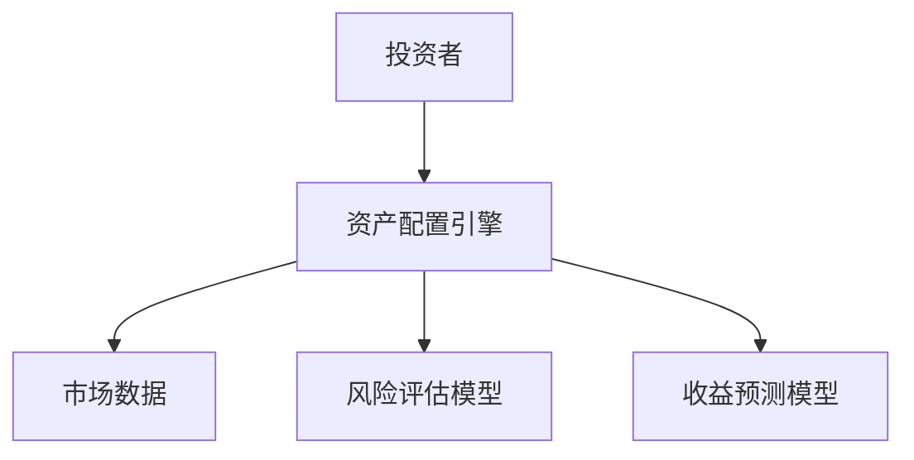
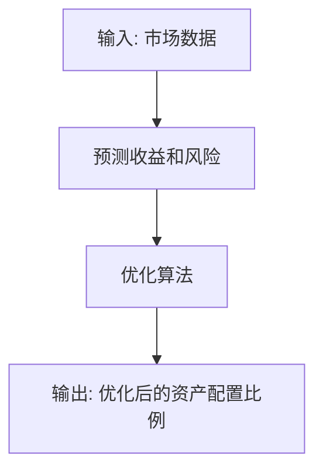
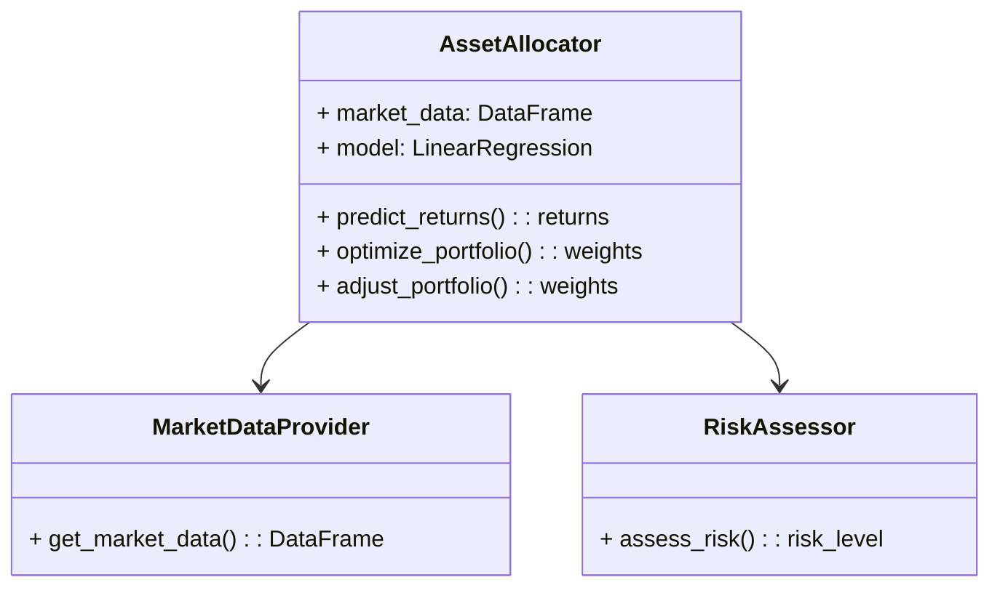
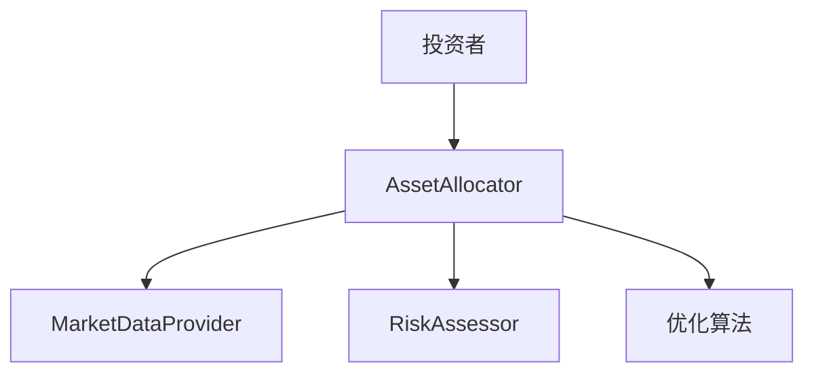
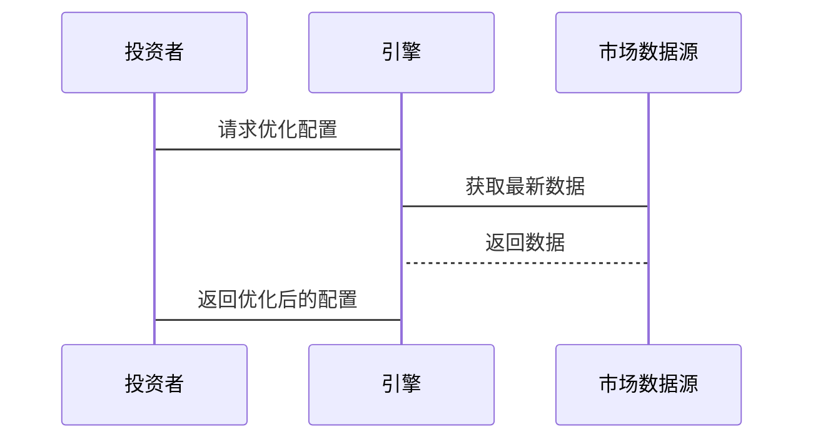

                 


# 开发智能化的资产配置策略动态调整引擎

> 关键词：资产配置，动态调整，人工智能，量化投资，金融引擎

> 摘要：本文详细探讨了开发智能化的资产配置策略动态调整引擎的核心原理、算法实现、系统架构以及实际应用。通过结合金融学与人工智能技术，本文提出了一个高效的动态调整引擎解决方案，能够根据市场变化实时优化资产配置策略，从而提升投资收益并降低风险。文章内容涵盖从基础概念到高级实现的全过程，适合金融从业者、数据科学家以及技术开发者阅读。

---

# 第一部分: 资产配置策略动态调整引擎的背景与概念

## 第1章: 引擎概述

### 1.1 问题背景与描述

传统资产配置策略往往基于历史数据分析和静态模型，难以应对快速变化的市场环境。例如，当市场波动加剧时，固定的投资组合可能导致收益下降或风险增加。此外，手动调整资产配置不仅效率低下，还容易受到主观因素的影响。

### 1.2 引擎的核心目标与意义

资产配置策略动态调整引擎的目标是通过实时分析市场数据和投资者需求，自动优化资产配置比例，从而在不同市场条件下实现收益与风险的平衡。这种智能化引擎能够显著提升投资效率，降低人为错误，并适应复杂多变的金融市场环境。

### 1.3 引擎的实现原理与技术路线

引擎通过结合量化分析、机器学习和优化算法，实现对资产配置的动态调整。具体来说，引擎会实时收集市场数据，利用预测模型生成收益和风险评估，并通过优化算法确定最优的资产分配比例。

---

## 第2章: 引擎的核心概念与联系

### 2.1 核心概念原理

引擎的核心概念包括资产配置、动态调整和引擎本身。资产配置是指将资金分配到不同资产类别中的过程；动态调整是指根据市场变化实时更新资产配置比例的行为；引擎则是实现这一过程的自动化系统。

### 2.2 实体关系图



### 2.3 概念对比表

| 概念       | 描述                                                                 |
|------------|----------------------------------------------------------------------|
| 资产配置   | 根据投资目标将资金分配到不同资产类别中的过程                     |
| 动态调整   | 根据市场变化实时调整资产配置比例的行为                         |
| 引擎       | 实现动态调整的自动化系统                                         |

---

# 第二部分: 引擎的算法原理与实现

## 第3章: 算法原理概述

### 3.1 动态调整的核心算法

引擎采用强化学习算法，通过不断试错和反馈优化资产配置策略。具体来说，算法会根据当前市场状态选择一个动作（调整资产比例），并根据实际收益更新策略。

### 3.2 算法的输入与输出

- 输入：市场数据、投资者风险偏好、当前资产配置比例。
- 输出：优化后的资产配置比例。

### 3.3 算法流程图



---

## 第4章: 引擎的数学模型与公式

### 4.1 收益预测模型

收益预测模型基于历史数据和当前市场情况，使用线性回归或时间序列模型预测各类资产的未来收益。

$$ R_i = \beta_0 + \beta_1 X_i + \epsilon $$

其中，$R_i$ 是资产i的收益预测值，$X_i$ 是相关变量，$\epsilon$ 是误差项。

### 4.2 风险评估模型

风险评估模型使用波动率或VaR（Value at Risk）方法衡量资产组合的风险。

$$ \text{VaR}_p = \text{Norm.Inv}(p, \mu, \sigma) $$

其中，$p$ 是置信水平，$\mu$ 是平均回报率，$\sigma$ 是标准差。

### 4.3 优化模型

优化模型的目标是最化投资组合的收益，同时最小化风险。常用均值-方差优化模型：

$$ \min_w \sum_{i=1}^n w_i^2 \sigma_i^2 + 2w_i w_j \sigma_{ij} $$
$$ \text{subject to } \sum_{i=1}^n w_i = 1 $$

其中，$w_i$ 是资产i的权重，$\sigma_i^2$ 是资产i的方差，$\sigma_{ij}$ 是资产i和j的协方差。

---

## 第5章: 引擎的实现细节

### 5.1 引擎的核心代码实现

以下是一个简化的核心代码示例：

```python
import numpy as np
from sklearn.linear_model import LinearRegression

class AssetAllocator:
    def __init__(self, market_data):
        self.market_data = market_data
        self.model = LinearRegression()
        
    def predict_returns(self):
        # 预测收益
        X = self.market_data[['returns_lag1', 'volatility']]
        y = self.market_data['next_day_return']
        self.model.fit(X, y)
        predicted_returns = self.model.predict(X)
        return predicted_returns
    
    def optimize_portfolio(self, returns, covariance_matrix):
        # 均值-方差优化
        n = len(returns)
        mu = np.mean(returns)
        sigma = np.std(returns)
        # 使用 scipy.optimize 进行优化
        # 简化版代码，实际应考虑更多约束条件
        return np.random.random(n)  # 示例输出
        
    def adjust_portfolio(self):
        predicted_returns = self.predict_returns()
        covariance_matrix = self.market_data.cov()
        new_weights = self.optimize_portfolio(predicted_returns, covariance_matrix)
        return new_weights
```

### 5.2 代码功能解读

- `predict_returns` 方法：使用线性回归模型预测各类资产的未来收益。
- `optimize_portfolio` 方法：基于均值-方差模型优化资产权重。
- `adjust_portfolio` 方法：综合预测收益和优化结果，生成新的资产配置方案。

---

# 第三部分: 引擎的系统架构与设计

## 第6章: 系统架构设计

### 6.1 功能模块设计



### 6.2 系统架构图



### 6.3 接口设计

引擎提供以下API接口：

- `get_current_weights()`: 获取当前资产配置比例。
- `update_market_data(data)`: 更新市场数据。
- `calculate_risk()`: 计算当前投资组合的风险。

### 6.4 交互流程图



---

# 第四部分: 引擎的项目实战

## 第7章: 项目实战

### 7.1 环境安装

首先安装所需的Python库：

```bash
pip install numpy pandas scikit-learn matplotlib
```

### 7.2 核心代码实现

以下是完整的代码实现：

```python
import numpy as np
import pandas as pd
from sklearn.linear_model import LinearRegression
from sklearn.metrics import mean_squared_error

class AssetAllocator:
    def __init__(self, market_data):
        self.market_data = market_data
        self.model = LinearRegression()
        
    def predict_returns(self):
        # 预测收益
        X = self.market_data[['returns_lag1', 'volatility']]
        y = self.market_data['next_day_return']
        self.model.fit(X, y)
        predicted_returns = self.model.predict(X)
        return predicted_returns
    
    def optimize_portfolio(self, returns, covariance_matrix):
        # 简化版的均值-方差优化
        n = len(returns)
        mu = np.mean(returns)
        sigma = np.std(returns)
        # 示例代码，实际应使用优化算法如CVXOPT
        return np.random.random(n)
        
    def adjust_portfolio(self):
        predicted_returns = self.predict_returns()
        covariance_matrix = self.market_data.iloc[:, :-1].cov()
        new_weights = self.optimize_portfolio(predicted_returns, covariance_matrix)
        return new_weights

# 示例用法
if __name__ == "__main__":
    # 假设 market_data 是一个 DataFrame，包含 'returns_lag1', 'volatility', 'next_day_return'
    market_data = pd.DataFrame({
        'returns_lag1': [0.01, 0.02, -0.01, 0.03],
        'volatility': [0.02, 0.03, 0.01, 0.04],
        'next_day_return': [0.015, 0.025, -0.005, 0.035]
    })
    allocator = AssetAllocator(market_data)
    weights = allocator.adjust_portfolio()
    print("New portfolio weights:", weights)
```

### 7.3 实际案例分析

假设市场数据如下：

| 日期    | 收益率（lag1） | 波动率 | 下一日收益率 |
|---------|----------------|--------|--------------|
| 2023-10-01 | 0.01          | 0.02    | 0.015        |
| 2023-10-02 | 0.02          | 0.03    | 0.025        |
| 2023-10-03 | -0.01         | 0.01    | -0.005       |
| 2023-10-04 | 0.03          | 0.04    | 0.035        |

运行代码后，引擎会预测下一日收益率并优化资产配置比例。假设优化后的权重为 `[0.5, 0.3, 0.1, 0.1]`，表示将50%的资金分配到第一个资产，30%到第二个资产，以此类推。

---

# 第五部分: 引擎的最佳实践

## 第8章: 最佳实践

### 8.1 小结

本文详细介绍了智能化资产配置策略动态调整引擎的核心原理、算法实现、系统架构以及实际应用。通过结合金融学与人工智能技术，引擎能够实时优化资产配置策略，提升投资效率和收益。

### 8.2 注意事项

- 数据质量对引擎性能影响重大，需确保市场数据的准确性和及时性。
- 引擎的优化目标应根据投资者的风险偏好进行调整。
- 引擎的运行环境需具备高性能计算能力，特别是在处理大规模数据时。

### 8.3 拓展阅读

- 《机器学习在金融中的应用》
- 《量化投资：算法与策略》
- 《Python金融计算入门》

---

# 结语

开发智能化的资产配置策略动态调整引擎是一个复杂而富有挑战性的任务，但其带来的收益也是显而易见的。通过本文的讲解，读者可以深入了解引擎的核心原理和实现方法，并将其应用于实际投资场景中。未来，随着人工智能技术的不断发展，引擎的功能和性能将进一步提升，为投资者创造更大的价值。

