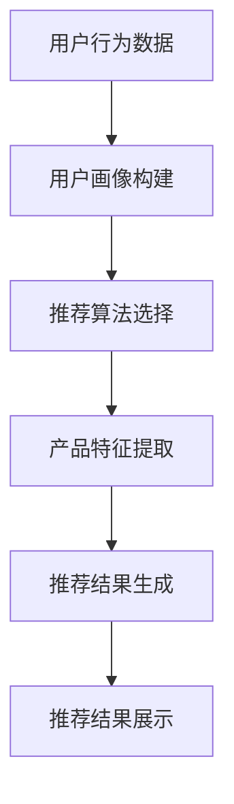

                 


# 开发智能化的金融产品推荐个性化引擎

> 关键词：金融推荐、人工智能、大模型、个性化推荐、推荐系统

> 摘要：随着金融行业的数字化转型，智能化的金融产品推荐个性化引擎变得至关重要。本文深入探讨了如何利用人工智能技术，特别是大模型，来构建高效、精准的金融推荐系统。通过分析推荐系统的核心算法、系统架构设计以及实际项目实现，本文为读者提供了从理论到实践的全面指导，帮助开发出更智能化的金融推荐引擎。

---

## 第1章 背景与问题描述

### 1.1 金融产品推荐的背景与现状

#### 1.1.1 传统金融产品推荐的局限性
传统的金融产品推荐主要依赖于人工经验或简单的规则筛选，存在以下问题：
- **信息孤岛**：难以整合多源数据，导致推荐结果不够全面。
- **推荐不精准**：基于单一维度的推荐，难以覆盖用户的多方面需求。
- **效率低下**：人工筛选耗时耗力，难以满足海量用户需求。

#### 1.1.2 智能化推荐的必要性
随着人工智能技术的发展，智能化推荐成为解决传统推荐问题的关键：
- 提高推荐效率，降低人工成本。
- 增强推荐精准度，提升用户体验。
- 实现个性化推荐，满足不同用户的需求。

#### 1.1.3 个性化推荐在金融领域的优势
个性化推荐能够根据用户的金融需求、风险偏好和投资目标，提供定制化的金融产品推荐，显著提高用户满意度和投资效率。

---

### 1.2 问题背景与目标

#### 1.2.1 金融产品推荐的核心问题
- 如何整合多源异构数据，构建统一的用户画像。
- 如何设计高效的推荐算法，提高推荐精准度。
- 如何实现个性化的推荐策略，满足用户需求。

#### 1.2.2 个性化推荐的目标与边界
- **目标**：实现基于用户行为、用户画像和产品特征的智能推荐。
- **边界**：明确推荐的范围和限制，避免过度推荐或遗漏重要产品。

#### 1.2.3 问题解决的关键技术
- 数据处理技术：清洗、整合多源数据。
- 推荐算法：协同过滤、深度学习模型。
- 个性化策略：基于用户画像的推荐规则。

---

### 1.3 核心概念与系统架构

#### 1.3.1 核心概念与属性对比表
| 概念 | 定义 | 属性 |
|------|------|------|
| 用户画像 | 用户的金融行为和偏好特征 | 风险偏好、投资目标、资产规模 |
| 产品特征 | 金融产品的属性和风险指标 | 产品类型、收益预期、风险等级 |

#### 1.3.2 系统架构的ER实体关系图
```mermaid
erDiagram
    user.User {
        +userId: int
        +userName: string
        +riskPreference: string
        +investmentTarget: string
    }
    product.FinancialProduct {
        +productId: int
        +productName: string
        +productType: string
        +riskLevel: string
        +expectedReturn: float
    }
    recommendation.Recommendation {
        +userId: int
        +productId: int
        +score: float
        +timestamp: datetime
    }
    user.User --> recommendation.Recommendation
    product.FinancialProduct --> recommendation.Recommendation
```

#### 1.3.3 系统架构的Mermaid流程图


---

## 第2章 个性化推荐的核心概念与联系

### 2.1 推荐系统的基本原理

#### 2.1.1 推荐系统的分类
- **协同过滤推荐**：基于用户行为的相似性进行推荐。
- **基于内容的推荐**：基于产品特征进行推荐。
- **混合推荐**：结合协同过滤和内容推荐的优点。

#### 2.1.2 基于协同过滤的推荐算法
协同过滤通过寻找相似用户或相似产品来进行推荐。公式如下：
$$
score(u, i) = \sum_{j} w(u, j) \cdot r(j, i)
$$
其中，$w(u, j)$ 是用户 $u$ 和用户 $j$ 的相似度，$r(j, i)$ 是用户 $j$ 对产品 $i$ 的评分。

#### 2.1.3 基于内容的推荐算法
基于内容的推荐通过分析产品特征进行推荐。公式如下：
$$
similarity(i, j) = \frac{\sum_{k} w_k \cdot (f_i(k) - \bar{f_i}) \cdot (f_j(k) - \bar{f_j})}{\sqrt{\sum_{k} w_k^2 (f_i(k) - \bar{f_i})^2} \cdot \sqrt{\sum_{k} w_k^2 (f_j(k) - \bar{f_j})^2}}
$$
其中，$w_k$ 是特征 $k$ 的权重，$f_i(k)$ 是产品 $i$ 在特征 $k$ 上的值。

---

### 2.2 个性化推荐的实现方法

#### 2.2.1 基于用户行为的推荐
分析用户的点击、浏览、购买等行为，提取用户的兴趣偏好。例如，通过分析用户的点击行为，构建用户的兴趣图谱。

#### 2.2.2 基于产品特征的推荐
根据产品的属性（如风险等级、收益预期）进行推荐。例如，将高风险偏好用户推荐高风险产品。

#### 2.2.3 混合推荐方法
结合协同过滤和内容推荐的优点，通过加权融合两种推荐结果来提高推荐效果。

---

### 2.3 大模型在推荐系统中的应用

#### 2.3.1 大模型在自然语言处理中的优势
大模型能够处理非结构化数据，如用户评论、产品描述，提取隐含特征。

#### 2.3.2 大模型在金融推荐中的创新应用
- **情感分析**：分析用户对产品的评价，提取情感特征。
- **语义理解**：理解产品描述的深层含义，生成推荐理由。

#### 2.3.3 大模型与推荐系统的结合点
通过大模型提取的产品特征和用户画像，优化推荐算法。

---

## 第3章 智能化推荐系统的算法原理

### 3.1 协同过滤算法

#### 3.1.1 基于用户的协同过滤
基于用户相似性进行推荐。公式如下：
$$
score(u, i) = \frac{\sum_{j} w(u, j) \cdot r(j, i)}{\sum_{j} w(u, j)}
$$

#### 3.1.2 基于物品的协同过滤
基于产品相似性进行推荐。公式如下：
$$
score(u, i) = \sum_{j} w(i, j) \cdot r(u, j)
$$

#### 3.1.3 深度协同过滤的数学模型
深度协同过滤通过神经网络模型学习用户和产品的嵌入表示。公式如下：
$$
h_u = \sigma(W_u \cdot u + b_u)
$$
$$
h_i = \sigma(W_i \cdot i + b_i)
$$
$$
score(u, i) = h_u \cdot h_i
$$

---

### 3.2 基于深度学习的推荐算法

#### 3.2.1 基于神经网络的推荐模型
使用神经网络模型（如DNN、CNN、RNN）进行推荐。公式如下：
$$
y = \sigma(Wx + b)
$$

#### 3.2.2 变量之间的关系分析
通过神经网络模型分析变量之间的非线性关系。

#### 3.2.3 深度学习模型的数学公式
深度学习模型的损失函数通常为交叉熵损失：
$$
L = -\frac{1}{N}\sum_{i=1}^{N} y_i \log p_i + (1 - y_i) \log (1 - p_i)
$$

---

### 3.3 大模型在推荐系统中的应用

#### 3.3.1 大模型的特征提取能力
通过大模型提取高维特征，提高推荐系统的表达能力。

#### 3.3.2 大模型的语义理解能力
通过大模型理解文本的语义，生成更个性化的推荐理由。

#### 3.3.3 大模型的推荐效果对比
通过实验对比，验证大模型在推荐效果上的优势。

---

## 第4章 推荐系统的数学模型与公式

### 4.1 协同过滤的数学模型

#### 4.1.1 基于用户的协同过滤公式
$$
score(u, i) = \frac{\sum_{j} w(u, j) \cdot r(j, i)}{\sum_{j} w(u, j)}
$$

#### 4.1.2 基于物品的协同过滤公式
$$
score(u, i) = \sum_{j} w(i, j) \cdot r(u, j)
$$

#### 4.1.3 深度协同过滤的数学表达
深度协同过滤通过神经网络模型学习用户和产品的嵌入表示：
$$
h_u = \sigma(W_u \cdot u + b_u)
$$
$$
h_i = \sigma(W_i \cdot i + b_i)
$$
$$
score(u, i) = h_u \cdot h_i
$$

---

### 4.2 基于深度学习的推荐模型

#### 4.2.1 神经网络的结构公式
神经网络模型的结构通常包括输入层、隐藏层和输出层：
$$
y = \sigma(Wx + b)
$$

#### 4.2.2 深度学习模型的损失函数
通常使用交叉熵损失函数：
$$
L = -\frac{1}{N}\sum_{i=1}^{N} y_i \log p_i + (1 - y_i) \log (1 - p_i)
$$

#### 4.2.3 模型的训练与优化公式
使用梯度下降算法优化模型参数：
$$
\theta_{new} = \theta_{old} - \eta \cdot \frac{\partial L}{\partial \theta}
$$

---

## 第5章 项目实战

### 5.1 环境搭建

#### 5.1.1 安装必要的工具和库
- Python
- TensorFlow/PyTorch
- Pandas
- Scikit-learn

#### 5.1.2 数据集准备
- 用户行为数据
- 产品特征数据
- 标签数据

---

### 5.2 系统核心实现源代码

#### 5.2.1 数据预处理代码
```python
import pandas as pd

# 读取数据
data = pd.read_csv('recommend_data.csv')

# 数据清洗
data.dropna(inplace=True)
```

#### 5.2.2 推荐算法实现代码
```python
from sklearn.metrics.pairwise import cosine_similarity

# 用户-产品评分矩阵
matrix = data.pivot('userId', 'productId', 'rating').fillna(0)

# 计算余弦相似度
similarity = cosine_similarity(matrix)
```

#### 5.2.3 个性化推荐策略实现代码
```python
def get_recommendations(user_id, similarity_matrix):
    user_index = matrix.index.get_loc(user_id)
    similar_users = [matrix.index[i] for i in range(len(similarity_matrix[user_index])) if i != user_index]
    return similar_users
```

---

### 5.3 实际案例分析与代码解读

#### 5.3.1 案例分析
- 数据来源：某银行的用户行为数据和产品特征数据。
- 实现步骤：数据清洗、特征提取、模型训练、结果展示。

#### 5.3.2 代码解读
```python
import pandas as pd
import numpy as np

# 数据加载
data = pd.read_csv('recommend_data.csv')

# 特征提取
user_features = data[['userId', 'riskPreference', 'investmentTarget']]
product_features = data[['productId', 'productType', 'riskLevel']]

# 模型训练
from sklearn.neighbors import NearestNeighbors
model = NearestNeighbors(n_neighbors=5)
model.fit(product_features)

# 推荐结果
distances, indices = model.kneighbors(product_features)
```

---

### 5.4 项目小结

#### 5.4.1 项目成果
- 成功开发了一个基于协同过滤的金融产品推荐系统。
- 实现了用户画像和产品特征的整合。
- 提高了推荐的精准度和用户体验。

#### 5.4.2 改进建议
- 引入大模型进行特征提取和语义理解。
- 增加实时推荐功能。
- 优化推荐算法，提高推荐效率。

---

## 第6章 最佳实践与总结

### 6.1 最佳实践 tips
- **数据清洗**：确保数据质量，避免噪声影响推荐结果。
- **模型选择**：根据实际需求选择合适的推荐算法。
- **实时性优化**：通过缓存和分布式计算提高推荐效率。

### 6.2 小结
智能化的金融产品推荐个性化引擎的开发需要结合传统推荐算法和大模型的优势，通过深入分析用户行为和产品特征，实现精准的个性化推荐。

### 6.3 注意事项
- 数据隐私和安全问题。
- 模型的可解释性问题。
- 系统的实时性和稳定性问题。

### 6.4 拓展阅读
- 《推荐系统实战》
- 《大模型与金融应用》
- 《深度学习在推荐系统中的应用》

---

通过本文的详细讲解，读者可以系统地了解开发智能化的金融产品推荐个性化引擎的核心技术和实现方法，为实际项目提供参考和指导。

