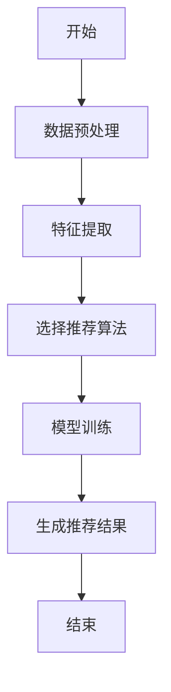
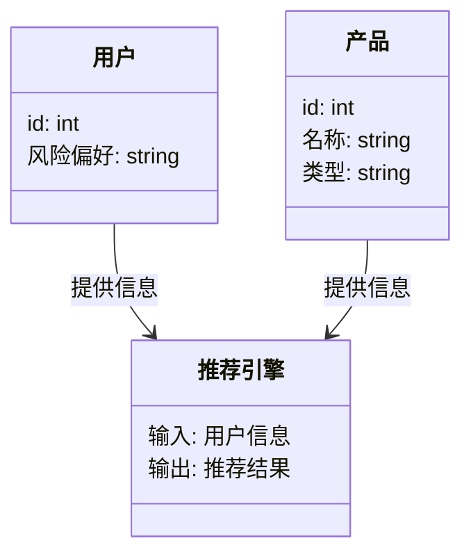

                 


# 开发智能化的金融产品推荐引擎

> 关键词：金融产品推荐、人工智能、推荐系统、机器学习、金融引擎

> 摘要：本文详细探讨了开发智能化金融产品推荐引擎的背景、核心概念、算法原理、系统架构设计以及实际应用案例。通过分析传统推荐方式的不足，提出基于人工智能的解决方案，并结合协同过滤和深度学习算法，构建高效的推荐系统。最后，通过实际案例展示了推荐引擎的应用效果，并总结了开发中的注意事项和未来发展方向。

---

## 目录

1. [开发智能化的金融产品推荐引擎背景介绍](#开发智能化的金融产品推荐引擎背景介绍)
2. [金融产品推荐引擎的背景与问题背景](#金融产品推荐引擎的背景与问题背景)
3. [推荐系统与金融产品的核心概念原理](#推荐系统与金融产品的核心概念原理)
4. [推荐算法的原理与实现](#推荐算法的原理与实现)
5. [系统架构设计](#系统架构设计)
6. [项目实战](#项目实战)
7. [总结与最佳实践](#总结与最佳实践)

---

## 第一部分: 开发智能化的金融产品推荐引擎背景介绍

### 1. 金融产品推荐引擎的背景与问题背景

#### 1.1 问题背景

在金融领域，传统的金融产品推荐方式存在诸多不足。例如，银行和金融机构通常依赖人工推荐或基于简单规则的推荐系统，难以满足用户多样化的投资需求。随着大数据和人工智能技术的快速发展，用户对个性化、智能化的金融产品推荐服务的需求日益增长。

#### 1.2 问题描述

金融产品推荐的核心问题在于如何有效地匹配用户的需求与金融产品的特性。用户可能有不同的风险偏好、投资目标和时间 horizon，而金融产品则具有复杂的产品类型、风险等级和收益率等属性。如何高效地处理这些数据，并生成个性化的推荐结果，是当前金融推荐系统面临的主要挑战。

#### 1.3 问题解决

基于人工智能的推荐引擎能够通过数据驱动的方式，分析用户行为和产品特征，构建智能化的推荐系统。通过协同过滤、深度学习等算法，推荐引擎能够准确预测用户的偏好，并生成个性化的金融产品推荐。

#### 1.4 问题的边界与外延

金融产品推荐的边界包括用户的基本信息、投资目标和风险偏好，以及金融产品的基本属性。推荐引擎的适用范围主要限于标准化金融产品，如基金、股票和债券等。与传统推荐系统相比，智能化推荐引擎能够处理更复杂的数据和提供更精准的推荐结果。

---

## 第二部分: 核心概念与联系

### 2. 推荐系统与金融产品的核心概念原理

#### 2.1 推荐系统的核心原理

推荐系统通过分析用户行为和产品特征，利用协同过滤、深度学习等算法，生成个性化的推荐结果。基于用户的协同过滤算法通过分析用户之间的相似性，推荐相似用户喜欢的产品；基于物品的协同过滤算法则通过分析产品的相似性，推荐相关产品。

#### 2.2 金融产品的属性特征对比表格

以下表格展示了金融产品的核心属性特征：

| 属性 | 特征 | 示例 |
|------|------|------|
| 类型 | 股票、基金、债券 | 股票 |
| 风险等级 | 低、中、高 | 高风险 |
| 收益率 | 低、中、高 | 高收益率 |

#### 2.3 ER实体关系图架构

以下是一个简单的ER实体关系图：

```mermaid
er
    actor 用户 {
        id: int
        风险偏好: string
    }
    entity 产品 {
        id: int
        名称: string
        类型: string
        风险等级: int
        收益率: float
    }
    用户 --> 产品: 选择
```

---

## 第三部分: 算法原理讲解

### 3. 推荐算法的原理与实现

#### 3.1 协同过滤算法

协同过滤是一种基于用户行为相似性的推荐算法。通过分析用户之间的相似性，推荐系统可以预测用户可能感兴趣的产品。以下是一个基于用户的协同过滤算法的实现示例：

```python
def compute_cosine_similarity(user_item_ratings):
    # 计算用户之间的余弦相似度
    pass

def recommend_products(user_id, similarity_matrix, top_n=5):
    # 根据相似度矩阵推荐Top N产品
    pass
```

#### 3.2 深度学习推荐算法

深度学习推荐算法通过构建神经网络模型，分析用户和产品的特征，生成推荐结果。以下是一个基于神经网络的推荐模型的流程图：



---

## 第四部分: 系统架构设计

### 4. 系统架构设计

#### 4.1 系统功能设计

推荐引擎系统主要功能包括用户信息管理、产品信息管理、推荐算法实现、结果展示等。以下是一个系统功能设计的类图：



---

## 第五部分: 项目实战

### 5. 项目实战

#### 5.1 环境配置

推荐引擎的开发需要以下环境：

- Python 3.6+
- TensorFlow 2.0+
- scikit-learn 0.20+

#### 5.2 核心代码实现

以下是一个简单的协同过滤算法实现：

```python
from sklearn.metrics.pairwise import cosine_similarity

def recommend_products(user_id, user_item_matrix, top_n=5):
    similarity = cosine_similarity(user_item_matrix[user_id], user_item_matrix)
    indices = [i for i in range(len(similarity)) if i != user_id]
    similarity_indices = sorted(zip(similarity[0][indices], indices), reverse=True)[:top_n]
    recommended_products = [indices[i] for i in range(len(similarity_indices))]
    return recommended_products
```

---

## 第六部分: 总结与最佳实践

### 6. 总结与最佳实践

#### 6.1 小结

开发智能化的金融产品推荐引擎需要结合大数据和人工智能技术，通过协同过滤、深度学习等算法，构建高效的推荐系统。通过实际案例的应用，可以验证推荐引擎的有效性和准确性。

#### 6.2 注意事项

- 数据质量对推荐结果的影响至关重要，需要确保数据的准确性和完整性。
- 在实际应用中，需要考虑用户隐私和数据安全问题。
- 推荐引擎的性能优化也是一个重要的挑战，需要通过算法调优和系统优化来提升推荐效率。

#### 6.3 未来趋势

随着人工智能技术的不断发展，金融产品推荐引擎将更加智能化和个性化。未来的推荐系统将更加注重用户行为的实时性分析和多模态数据的融合，以提供更精准的推荐服务。

---

通过本文的详细讲解，读者可以全面了解开发智能化金融产品推荐引擎的技术和方法，并能够在实际项目中应用这些技术，提升金融产品的推荐效果。

