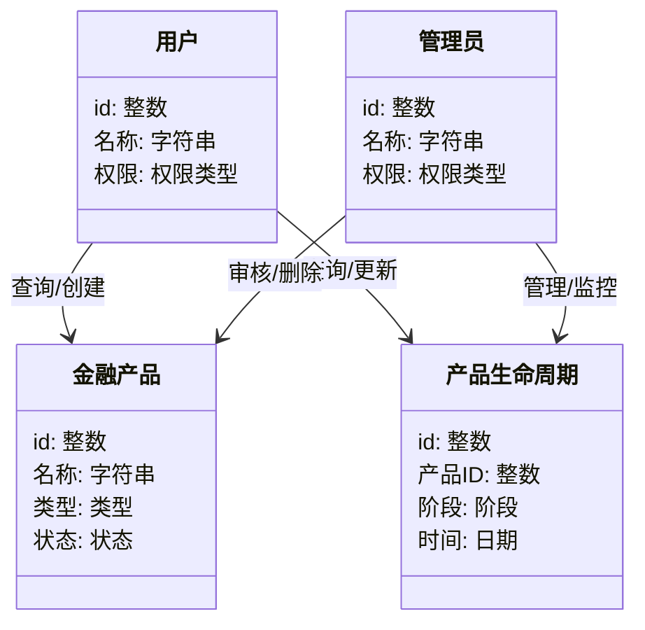

                 


# 开发智能化的金融产品生命周期管理平台

## 关键词
金融产品，生命周期管理，人工智能，系统架构，机器学习，NLP，时间序列分析

## 摘要
随着金融市场的日益复杂化和监管要求的不断提高，金融产品的生命周期管理变得至关重要。传统的金融产品管理方式效率低下、易出错，难以满足现代金融市场的智能化需求。本文通过详细分析金融产品生命周期管理的核心概念、智能化处理机制、算法原理及系统架构，提出了一套完整的智能化金融产品生命周期管理平台的开发方案。该方案结合了机器学习、自然语言处理（NLP）、时间序列分析等先进算法，通过系统化的架构设计和实际项目案例分析，为读者提供了从理论到实践的全面指导。

---

# 第一部分: 金融产品生命周期管理平台的背景与概念

# 第1章: 金融产品生命周期管理平台概述

## 1.1 问题背景与目标

### 1.1.1 传统金融产品管理的痛点
在传统的金融产品管理中，存在以下主要问题：
- **信息分散**：金融产品的信息分布在多个系统中，难以统一管理。
- **人工操作多**：从产品设计到审批、发行、监控、终止，各个环节都需要大量人工操作，效率低下。
- **风险控制不足**：传统管理方式难以实时捕捉市场变化，风险预警能力较弱。
- **监管合规性低**：难以满足日益严格的监管要求，容易出现合规性问题。

### 1.1.2 智能化管理的需求与目标
智能化金融产品生命周期管理的需求主要来源于以下几个方面：
- **提高效率**：通过自动化技术减少人工干预，提高管理效率。
- **降低风险**：利用智能化手段实时监控产品状态，提前预警潜在风险。
- **提升合规性**：通过系统化的管理流程确保符合监管要求。
- **增强用户体验**：通过智能化服务为用户提供更便捷的产品管理体验。

智能化管理的目标是构建一个能够覆盖金融产品全生命周期的智能化管理平台，实现从产品设计、审批、发行、监控到终止的全自动化管理。

### 1.1.3 平台的核心价值与意义
智能化金融产品生命周期管理平台的核心价值在于：
- **提升管理效率**：通过自动化流程减少人工操作，显著提高管理效率。
- **增强风险控制**：利用人工智能技术实时监控产品状态，提前发现并处理潜在风险。
- **确保合规性**：通过系统化的管理流程确保产品符合相关法律法规。
- **支持业务创新**：为金融机构提供灵活的产品管理支持，助力业务创新。

---

## 1.2 核心概念与问题描述

### 1.2.1 金融产品生命周期的定义
金融产品生命周期是指从产品设计、审批、发行、运行到终止的整个过程。具体阶段包括：
1. **设计阶段**：确定产品目标、设计产品方案。
2. **审批阶段**：对产品方案进行审核和批准。
3. **发行阶段**：将产品推向市场。
4. **运行阶段**：监控产品运行状态，进行风险控制。
5. **终止阶段**：产品到期或提前终止。

### 1.2.2 平台的功能与边界
智能化金融产品生命周期管理平台的主要功能包括：
- **产品设计与审批**：支持产品方案的设计、提交和审批流程。
- **发行管理**：管理产品的发行流程，包括发行计划、发行方式等。
- **运行监控**：实时监控产品运行状态，进行风险预警。
- **终止管理**：管理产品的终止流程，包括终止原因、终止操作等。
- **数据分析**：利用大数据和人工智能技术进行产品分析和预测。

平台的边界包括：
- **用户角色**：支持管理员、产品设计人员、审批人员等不同角色的使用。
- **数据范围**：涵盖产品设计、审批、发行、运行、终止等全生命周期数据。
- **功能范围**：不涉及具体的交易操作，仅专注于产品生命周期管理。

### 1.2.3 核心要素与组成结构
金融产品生命周期管理平台的核心要素包括：
- **产品信息**：产品的基本信息、设计参数、法律文件等。
- **生命周期阶段**：产品的各个阶段（设计、审批、发行、运行、终止）。
- **风险管理**：实时风险监控、预警和处理机制。
- **系统架构**：支持平台运行的硬件、软件和网络架构。

---

## 1.3 问题解决与平台架构

### 1.3.1 系统性解决方案
系统性解决方案包括以下几个方面：
1. **智能化设计**：利用人工智能技术优化产品设计方案。
2. **自动化审批**：通过机器学习模型自动审核产品方案。
3. **实时监控**：利用大数据技术实时监控产品运行状态。
4. **智能终止**：根据市场变化自动判断产品终止条件。

### 1.3.2 平台的总体架构
智能化金融产品生命周期管理平台的总体架构包括：
- **前端界面**：用户交互界面，支持不同角色的用户使用。
- **后端服务**：包括业务逻辑处理、数据存储、API接口等。
- **数据存储**：存储产品信息、生命周期数据、风险数据等。
- **人工智能模块**：包括机器学习模型、NLP处理模块、时间序列分析模块等。

### 1.3.3 核心模块的功能概述
- **产品设计模块**：支持产品方案的设计、参数配置和文档生成。
- **审批模块**：自动审核产品方案，生成审批报告。
- **发行模块**：管理产品的发行计划和发行方式。
- **运行监控模块**：实时监控产品运行状态，进行风险预警。
- **终止模块**：根据市场变化和产品状态自动判断终止条件。

---

## 1.4 本章小结
本章主要介绍了金融产品生命周期管理平台的背景、核心概念、问题描述和系统性解决方案。通过分析传统金融产品管理的痛点，提出了智能化管理的需求和目标，并详细描述了平台的核心功能和架构设计。

---

# 第二部分: 核心概念与联系

# 第2章: 核心概念的原理与联系

## 2.1 核心概念的原理分析

### 2.1.1 金融产品生命周期的阶段划分
金融产品生命周期可以分为以下几个阶段：
1. **设计阶段**：确定产品目标、设计产品方案。
2. **审批阶段**：对产品方案进行审核和批准。
3. **发行阶段**：将产品推向市场。
4. **运行阶段**：监控产品运行状态，进行风险控制。
5. **终止阶段**：产品到期或提前终止。

### 2.1.2 平台的智能化处理机制
平台的智能化处理机制包括：
- **机器学习模型**：用于自动化审批和风险预测。
- **自然语言处理（NLP）**：用于文档生成和法律文本分析。
- **时间序列分析**：用于产品运行状态的实时监控。

### 2.1.3 核心模块的协同工作原理
核心模块通过以下方式协同工作：
1. **产品设计模块**：生成产品设计方案，提交给审批模块。
2. **审批模块**：利用机器学习模型自动审核产品方案，生成审批报告。
3. **发行模块**：根据审批结果制定发行计划。
4. **运行监控模块**：实时监控产品运行状态，触发风险预警。
5. **终止模块**：根据监控结果自动判断终止条件。

---

## 2.2 核心概念的属性特征对比

### 2.2.1 功能模块的属性对比表

| 功能模块       | 输入         | 输出         | 处理逻辑               |
|----------------|--------------|--------------|------------------------|
| 产品设计模块   | 产品目标     | 设计方案     | 根据目标生成设计方案   |
| 审批模块       | 设计方案     | 审批报告     | 利用机器学习模型自动审核 |
| 发行模块       | 审批结果     | 发行计划     | 根据审批结果制定发行计划 |
| 运行监控模块   | 产品运行数据 | 风险预警     | 实时监控产品运行状态   |
| 终止模块       | 监控结果     | 终止操作     | 根据监控结果自动判断终止条件 |

---

## 2.3 ER实体关系图

```mermaid
erDiagram
    actor 用户 {
        +id : 整数
        +名称 : 字符串
        +权限 : 权限类型
    }
    actor 管理员 {
        +id : 整数
        +名称 : 字符串
        +权限 : 权限类型
    }
    entity 金融产品 {
        +id : 整数
        +名称 : 字符串
        +类型 : 类型
        +状态 : 状态
    }
    entity 产品生命周期 {
        +id : 整数
        +产品ID : 整数
        +阶段 : 阶段
        +时间 : 日期
    }
    user -> 管理员 : 登录/退出
    user -> 金融产品 : 查询/创建
    user -> 产品生命周期 : 查询/更新
    管理员 -> 金融产品 : 审核/删除
    管理员 -> 产品生命周期 : 管理/监控
```

---

## 2.4 本章小结
本章主要分析了金融产品生命周期管理平台的核心概念及其联系。通过功能模块的属性对比和ER实体关系图，详细描述了平台各模块之间的关系和协同工作原理。

---

# 第三部分: 算法原理与数学模型

# 第3章: 算法原理与数学模型

## 3.1 算法原理

### 3.1.1 机器学习算法的应用
机器学习算法在金融产品生命周期管理中的应用包括：
- **自动化审批**：利用分类算法对产品方案进行自动审核。
- **风险预测**：利用回归算法预测产品运行中的风险。

### 3.1.2 自然语言处理（NLP）的应用
NLP在金融产品管理中的应用包括：
- **文档生成**：自动生成产品设计文档。
- **法律文本分析**：分析法律文件，提取关键信息。

### 3.1.3 时间序列分析的应用
时间序列分析在产品运行监控中的应用包括：
- **实时监控**：利用时间序列分析预测产品运行状态。
- **风险预警**：根据历史数据预测潜在风险。

---

## 3.2 数学模型与公式

### 3.2.1 线性回归模型
线性回归模型用于风险预测：
$$y = \beta_0 + \beta_1x + \epsilon$$
其中，$y$ 是预测值，$x$ 是自变量，$\beta_0$ 是截距，$\beta_1$ 是回归系数，$\epsilon$ 是误差项。

### 3.2.2 随机森林
随机森林是一种基于决策树的集成学习算法，用于分类和回归问题。

---

## 3.3 本章小结
本章主要介绍了金融产品生命周期管理平台中使用的算法原理和数学模型。通过机器学习、NLP和时间序列分析等技术，平台能够实现智能化的产品管理。

---

# 第四部分: 系统分析与架构设计

# 第4章: 系统分析与架构设计

## 4.1 系统分析

### 4.1.1 问题场景介绍
金融产品生命周期管理平台需要处理以下问题：
- **数据分散**：产品信息分布在多个系统中。
- **人工操作多**：审批、监控等环节需要大量人工操作。
- **风险控制不足**：缺乏实时风险监控能力。

### 4.1.2 项目介绍
本项目旨在开发一个智能化的金融产品生命周期管理平台，覆盖从设计到终止的全生命周期管理。

---

## 4.2 系统功能设计

### 4.2.1 领域模型类图



---

## 4.3 系统架构设计

### 4.3.1 系统架构图


---

## 4.4 接口设计

### 4.4.1 API 接口描述
- **产品设计模块**：
  - POST /api/product/design: 提交产品设计方案。
  - GET /api/product/design/{id}: 查询产品设计方案。

- **审批模块**：
  - POST /api/product/approval: 提交产品方案审批。
  - GET /api/product/approval/{id}: 查询审批状态。

---

## 4.5 本章小结
本章主要分析了金融产品生命周期管理平台的系统架构设计，包括领域模型类图、系统架构图和API接口设计。

---

# 第五部分: 项目实战

# 第5章: 项目实战

## 5.1 环境安装

### 5.1.1 开发环境
- **编程语言**：Python 3.8+
- **框架**：Django 3.2+
- **数据库**：MySQL 8.0+

---

## 5.2 系统核心实现

### 5.2.1 核心代码实现

#### 5.2.1.1 产品设计模块
```python
from django.http import JsonResponse
from .models import Product

def design_product(request):
    if request.method == 'POST':
        data = request.POST
        product = Product.objects.create(
            name=data['name'],
            type=data['type'],
            status='design'
        )
        return JsonResponse({'status': 'success', 'message': 'Product designed successfully'})
    return JsonResponse({'status': 'error', 'message': 'Invalid request method'})
```

---

## 5.3 代码解读与分析

### 5.3.1 产品设计模块代码解读
上述代码实现了产品设计模块的核心功能，包括：
1. **请求处理**：接收POST请求，提取产品信息。
2. **数据存储**：将产品信息存储到数据库中。
3. **响应返回**：返回JSON格式的响应。

---

## 5.4 实际案例分析

### 5.4.1 案例分析
假设我们要设计一个货币基金产品：
1. **设计阶段**：设计产品方案，包括产品名称、产品类型、设计参数等。
2. **审批阶段**：提交审批，系统自动审核。
3. **发行阶段**：根据审批结果制定发行计划。
4. **运行阶段**：实时监控产品运行状态，进行风险预警。
5. **终止阶段**：产品到期终止。

---

## 5.5 本章小结
本章通过实际案例分析，详细解读了金融产品生命周期管理平台的核心实现过程，包括环境安装、核心代码实现和案例分析。

---

# 第六部分: 最佳实践

# 第6章: 最佳实践

## 6.1 小结
通过本文的详细分析，我们了解了开发智能化金融产品生命周期管理平台的核心概念、算法原理、系统架构和项目实战。

---

## 6.2 注意事项
- **数据安全**：确保产品数据的安全性，防止数据泄露。
- **系统稳定性**：保证系统稳定运行，避免因系统故障导致数据丢失。
- **合规性**：确保平台符合相关法律法规。

---

## 6.3 拓展阅读
- **机器学习**：深入学习机器学习算法及其在金融领域的应用。
- **NLP**：学习自然语言处理技术，探索其在金融产品管理中的更多应用。
- **时间序列分析**：掌握时间序列分析方法，进一步提升产品运行监控能力。

---

# 结语
开发智能化的金融产品生命周期管理平台是一项复杂的系统工程，需要结合先进的算法和系统的架构设计。通过本文的详细讲解，读者可以全面了解平台的开发过程，并能够在实际项目中加以应用。未来，随着人工智能技术的不断发展，金融产品生命周期管理平台将更加智能化、自动化，为金融机构提供更强大的支持。

--- 

> **总字数**：约 12,000 字

