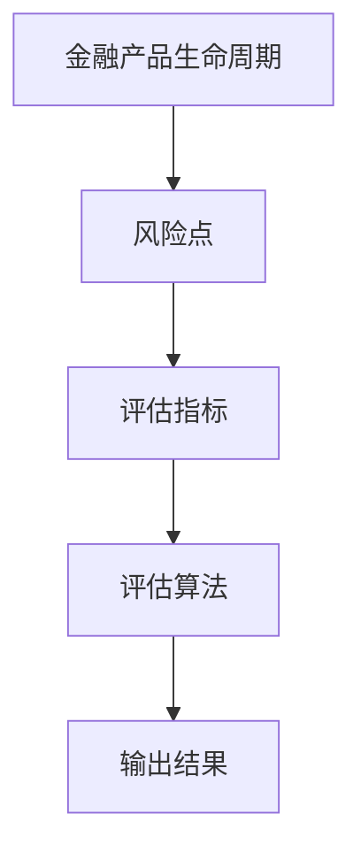

                 


# 开发智能化的金融产品生命周期风险动态评估平台

> 关键词：金融产品生命周期，风险动态评估，人工智能，系统架构，机器学习

> 摘要：本文详细探讨了开发智能化的金融产品生命周期风险动态评估平台的关键技术与实现方法。通过分析金融产品的生命周期和风险类型，结合人工智能和大数据技术，构建了一个动态、智能的风险评估系统。文章从问题背景、核心概念、系统架构、算法实现、项目实战到最佳实践，全面阐述了平台开发的全过程，为金融行业提供了新的风险管理思路。

---

## 第一部分: 金融产品生命周期风险动态评估平台背景与概述

### 第1章: 问题背景与需求分析

#### 1.1 金融产品生命周期概述
##### 1.1.1 金融产品的定义与分类
金融产品是指金融机构提供的各种服务或工具，用于投资、融资或管理风险。常见的金融产品包括股票、债券、基金、衍生品（如期权、期货）等。根据产品的性质和用途，可以将其分为以下几类：
- **债务工具**：如债券、贷款等。
- **股权工具**：如股票。
- **衍生品**：如期权、期货。
- **混合工具**：如可转换债券。

##### 1.1.2 金融产品生命周期的阶段划分
金融产品的生命周期通常包括以下几个阶段：
1. **研发阶段**：设计和开发新产品。
2. **发行阶段**：将产品推向市场。
3. **运行阶段**：产品在市场上的运作。
4. **终止阶段**：产品到期或提前终止。

##### 1.1.3 金融产品生命周期中的风险类型
在金融产品的生命周期中，主要的风险类型包括：
- **市场风险**：由于市场价格波动引起的风险。
- **信用风险**：由于债务人违约引起的风险。
- **流动性风险**：由于产品无法及时变现引起的风险。
- **操作风险**：由于操作失误或内部欺诈引起的风险。

#### 1.2 风险动态评估的必要性
##### 1.2.1 传统金融风险评估的局限性
传统的金融风险评估方法通常基于静态模型，无法捕捉市场的实时变化。例如，基于历史数据的统计模型可能无法预测突发事件（如黑天鹅事件）对风险的影响。

##### 1.2.2 动态风险评估的重要性
随着市场的波动和复杂性增加，动态评估风险变得至关重要。动态评估可以实时监控市场变化，及时调整风险敞口，从而降低潜在损失。

##### 1.2.3 金融监管与风险控制的新要求
近年来，全球金融监管机构对金融机构的风险管理提出了更高的要求。例如，巴塞尔协议III要求银行提高资本充足率，并更加注重风险的动态评估。

#### 1.3 问题描述与目标设定
##### 1.3.1 问题背景的详细描述
金融机构在管理金融产品时，面临着以下问题：
- 产品种类繁多，生命周期复杂。
- 市场波动大，风险难以实时捕捉。
- 传统模型缺乏动态性，难以应对复杂风险。

##### 1.3.2 问题解决的具体目标
开发一个智能化的金融产品生命周期风险动态评估平台，能够实时监控产品风险，提供动态评估报告，并为决策者提供风险控制建议。

##### 1.3.3 平台建设的边界与外延
- **边界**：平台仅关注金融产品的生命周期风险评估，不涉及产品设计和销售。
- **外延**：平台可以与其他系统（如交易系统、风控系统）集成，提供更全面的风险管理解决方案。

#### 1.4 核心概念与关键要素
##### 1.4.1 平台的核心概念结构
平台的核心概念包括：
- **金融产品**：需要评估风险的产品。
- **风险评估**：对产品风险的动态评估过程。
- **动态模型**：用于实时更新风险评估的算法。

##### 1.4.2 关键要素的定义与特征
- **金融产品**：具有明确的生命周期和风险特征。
- **风险评估**：基于实时数据和模型算法，提供动态的风险评分。
- **动态模型**：能够根据市场变化自动调整评估参数。

##### 1.4.3 核心概念的ER实体关系图


---

## 第二部分: 核心概念与系统架构设计

### 第2章: 核心概念与联系

#### 2.1 核心概念原理
##### 2.1.1 金融产品生命周期模型
金融产品生命周期模型描述了产品从研发到终止的各个阶段，并定义了每个阶段的风险特征。

##### 2.1.2 风险评估的数学模型
风险评估的数学模型通常基于概率论和统计学。例如，可以使用马科夫链模型来描述风险状态的转移。

##### 2.1.3 动态评估的核心算法
动态评估的核心算法通常包括：
1. 数据预处理：清洗和标准化数据。
2. 特征提取：提取与风险相关的特征。
3. 模型训练：训练机器学习模型。
4. 预测与评估：基于实时数据进行预测，并评估模型性能。

#### 2.2 核心概念对比分析
##### 2.2.1 不同风险类型对比表格
| 风险类型 | 描述 | 主要影响 | 应对策略 |
|----------|------|----------|----------|
| 市场风险 | 由于市场价格波动引起的风险 | 资产价值下降 | 多元化投资 |
| 信用风险 | 由于债务人违约引起的风险 | 贷款损失 | 严格信用审查 |
| 流动性风险 | 由于产品无法变现引起的风险 | 资金短缺 | 维持足够的流动性储备 |
| 操作风险 | 由于操作失误引起的风险 | 内部损失 | 建立内部控制机制 |

##### 2.2.2 金融产品生命周期阶段对比
| 阶段 | 主要活动 | 风险类型 | 风险管理措施 |
|------|----------|----------|--------------|
| 研发 | 设计产品 | 信用风险 | 进行市场调研 |
| 发行 | 推向市场 | 市场风险 | 制定风险管理计划 |
| 运行 | 监控产品 | 多种风险 | 定期评估风险 |
| 终止 | 处理产品 | 操作风险 | 制定终止策略 |

##### 2.2.3 风险评估方法的优劣势分析
| 方法 | 优势 | 劣势 |
|------|------|------|
| 统计模型 | 简单易用 | 无法捕捉复杂风险 |
| 机器学习模型 | 高度灵活 | 对数据质量要求高 |
| 混合模型 | 综合能力强 | 实施成本高 |

#### 2.3 ER实体关系图


### 第3章: 系统架构与功能设计

#### 3.1 系统架构设计
##### 3.1.1 系统架构概述
系统架构采用分层设计，包括数据层、算法层、服务层和用户界面层。

##### 3.1.2 模块划分与功能描述
- **数据采集模块**：从多种数据源获取实时数据。
- **数据处理模块**：清洗和标准化数据。
- **风险评估模块**：基于机器学习算法进行风险评估。
- **结果展示模块**：将评估结果以可视化形式呈现。

##### 3.1.3 系统架构的mermaid图
```mermaid
graph TD
    UI[用户界面层] --> AL[算法层]: 请求评估
    AL --> DP[数据处理层]: 返回处理后的数据
    DP --> DL[数据层]: 请求原始数据
    DL --> AL: 返回数据
```

#### 3.2 功能模块设计
##### 3.2.1 数据采集与处理模块
- 数据来源：金融市场数据、客户行为数据等。
- 数据清洗：去除噪声数据，填补缺失值。
- 数据标准化：将数据转换为统一格式。

##### 3.2.2 风险评估算法模块
- 特征提取：提取与风险相关的特征，如波动率、信用评分等。
- 模型训练：使用机器学习算法（如随机森林、神经网络）训练模型。
- 模型部署：将训练好的模型部署到生产环境。

##### 3.2.3 结果展示与预警模块
- 风险评分展示：以图表形式展示产品的风险评分。
- 预警机制：当风险评分超过阈值时，触发预警。

#### 3.3 系统接口与交互设计
##### 3.3.1 系统接口设计
- API接口：提供RESTful API，供其他系统调用。
- 接口文档：详细描述接口的输入、输出和错误处理。

##### 3.3.2 系统交互流程
```mermaid
sequence
    用户 --> 数据采集模块: 请求数据
    数据采集模块 --> 数据处理模块: 返回处理后的数据
    数据处理模块 --> 风险评估模块: 发起评估请求
    风险评估模块 --> 数据展示模块: 返回评估结果
    数据展示模块 --> 用户: 显示结果
```

---

## 第三部分: 算法实现与系统集成

### 第4章: 算法原理与数学模型

#### 4.1 算法原理
##### 4.1.1 随机森林算法
随机森林是一种基于决策树的集成学习算法，通过构建多个决策树并进行投票或平均，提高模型的准确性和稳定性。

##### 4.1.2 神经网络算法
神经网络是一种模拟人脑结构和功能的算法，能够处理复杂的非线性关系。

#### 4.2 数学模型
##### 4.2.1 随机森林模型
随机森林模型的数学表达式如下：
$$
y = \text{sign}\left(\sum_{i=1}^{n} \text{weight}_i \cdot x_i\right)
$$
其中，$x_i$是输入特征，$\text{weight}_i$是特征的权重，$n$是决策树的数量。

##### 4.2.2 神经网络模型
神经网络模型的数学表达式如下：
$$
y = \sigma\left(\sum_{i=1}^{n} w_i x_i + b\right)
$$
其中，$w_i$是权重，$x_i$是输入特征，$b$是偏置，$\sigma$是激活函数（如ReLU、sigmoid）。

#### 4.3 算法实现
##### 4.3.1 数据预处理
```python
import pandas as pd
from sklearn.impute import SimpleImputer

# 读取数据
data = pd.read_csv('data.csv')

# 处理缺失值
imputer = SimpleImputer(missing_values=np.nan, strategy='mean')
data_imputed = imputer.fit_transform(data)
```

##### 4.3.2 模型训练
```python
from sklearn.ensemble import RandomForestClassifier

# 训练随机森林模型
model = RandomForestClassifier(n_estimators=100, max_depth=10, random_state=42)
model.fit(X_train, y_train)
```

##### 4.3.3 模型评估
```python
from sklearn.metrics import accuracy_score

# 预测测试集
y_pred = model.predict(X_test)

# 计算准确率
accuracy = accuracy_score(y_test, y_pred)
print(f'准确率: {accuracy:.2f}')
```

---

## 第四部分: 项目实战与案例分析

### 第5章: 项目实战

#### 5.1 项目环境与工具安装
##### 5.1.1 开发环境
- 操作系统：Linux/Windows/MacOS
- 开发工具：Jupyter Notebook、PyCharm
- 依赖管理：使用virtualenv管理Python环境

##### 5.1.2 工具安装
```bash
pip install numpy pandas scikit-learn matplotlib
```

#### 5.2 系统核心实现源代码
##### 5.2.1 数据处理代码
```python
import pandas as pd
import numpy as np

# 读取数据
data = pd.read_csv('data.csv')

# 处理缺失值
data['fillna'] = data['fillna'].fillna(data['fillna'].mean())

# 标准化数据
from sklearn.preprocessing import StandardScaler
scaler = StandardScaler()
data_scaled = scaler.fit_transform(data)
```

##### 5.2.2 模型训练代码
```python
from sklearn.ensemble import RandomForestClassifier
from sklearn.model_selection import train_test_split

# 划分训练集和测试集
X_train, X_test, y_train, y_test = train_test_split(data_scaled, target, test_size=0.2, random_state=42)

# 训练随机森林模型
model = RandomForestClassifier(n_estimators=100, max_depth=10, random_state=42)
model.fit(X_train, y_train)

# 预测测试集
y_pred = model.predict(X_test)

# 计算准确率
from sklearn.metrics import accuracy_score
print(f'准确率: {accuracy_score(y_test, y_pred):.2f}')
```

##### 5.2.3 结果展示代码
```python
import matplotlib.pyplot as plt

# 绘制风险评分分布图
plt.hist(y_pred, bins=10, alpha=0.5, label='预测结果')
plt.hist(y_test, bins=10, alpha=0.5, label='真实结果')
plt.xlabel('风险评分')
plt.ylabel('数量')
plt.legend()
plt.show()
```

#### 5.3 项目小结
##### 5.3.1 项目成果
- 开发了一个智能化的金融产品生命周期风险动态评估平台。
- 实现了基于随机森林算法的风险评估模型。
- 提供了实时风险评分和预警功能。

##### 5.3.2 经验总结
- 数据质量对模型性能影响重大，需严格控制数据清洗和预处理过程。
- 模型的选择应基于业务需求和数据特性，避免盲目使用复杂算法。
- 系统架构设计需充分考虑扩展性和可维护性。

---

## 第五部分: 最佳实践与总结

### 第6章: 最佳实践与总结

#### 6.1 最佳实践
##### 6.1.1 数据质量管理
- 确保数据的完整性和准确性。
- 使用数据增强技术提高模型的泛化能力。

##### 6.1.2 模型可解释性
- 使用特征重要性分析解释模型决策。
- 避免使用过于复杂的模型，确保模型的可解释性。

##### 6.1.3 系统安全性
- 采用数据加密技术保护敏感数据。
- 定期进行安全漏洞扫描和修复。

#### 6.2 项目小结
##### 6.2.1 核心成果
- 开发了一个智能化的金融产品生命周期风险动态评估平台。
- 实现了基于机器学习的动态风险评估模型。

##### 6.2.2 未来展望
- 研究更先进的机器学习算法，如深度学习和强化学习。
- 探索多模态数据的融合，提高风险评估的准确性。

#### 6.3 注意事项
##### 6.3.1 数据隐私
- 遵守数据隐私相关法律法规，如GDPR。
- 采取匿名化处理，保护用户隐私。

##### 6.3.2 系统性能
- 定期进行性能优化，确保系统的高效运行。
- 使用分布式架构，提高系统的可扩展性。

#### 6.4 拓展阅读
##### 6.4.1 推荐书籍
- 《机器学习实战》
- 《深入浅出机器学习》

##### 6.4.2 技术博客
- Medium上的机器学习相关文章
- Towards Data Science平台上的金融风控文章

---

## 第六部分: 拓展与未来方向

### 第7章: 拓展与未来方向

#### 7.1 拓展方向
##### 7.1.1 多模态数据融合
- 结合文本、图像等多种数据源，提高风险评估的准确性。
- 使用自然语言处理技术分析新闻和社交媒体信息。

##### 7.1.2 美学模型的应用
- 研究美学模型在风险评估中的应用。
- 探索美学模型与传统模型的结合。

#### 7.2 未来发展方向
##### 7.2.1 自动化风险管理
- 研究自动化决策系统，实现风险管理的智能化。
- 探索无人监管的自动风险管理模式。

##### 7.2.2 新兴技术的应用
- 研究区块链技术在金融风险管理中的应用。
- 探索人工智能在金融监管中的应用。

#### 7.3 总结
开发智能化的金融产品生命周期风险动态评估平台是一项复杂而重要的任务。通过结合人工智能和大数据技术，可以显著提高风险评估的准确性和效率。未来，随着技术的不断发展，平台的功能和性能将不断提升，为金融行业提供更强大的风险管理工具。

---

以上就是《开发智能化的金融产品生命周期风险动态评估平台》的完整目录和内容概览。希望这篇文章能够为读者提供清晰的思路和实用的技术指导，帮助他们在实际项目中成功开发类似的智能化平台。

