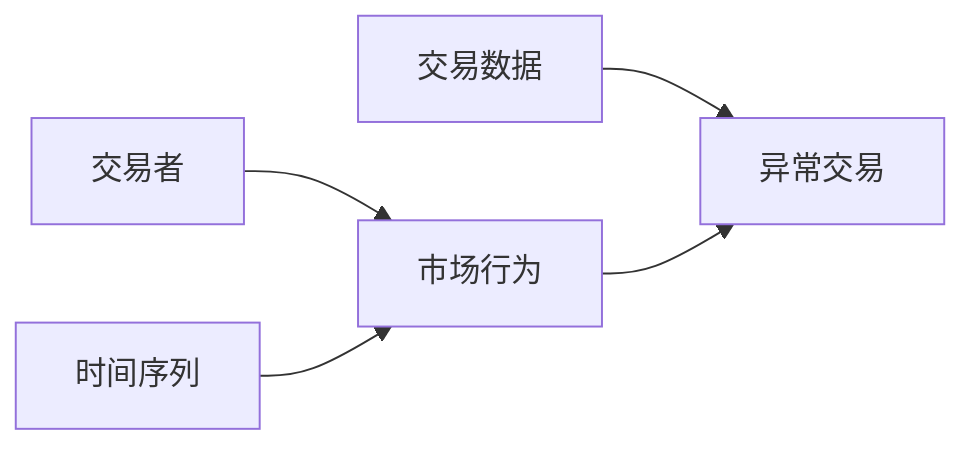
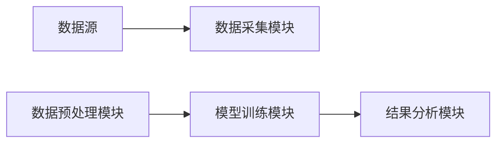

                 


# 开发智能化的金融市场异常交易检测模型

## 关键词
- 异常交易检测
- 金融市场
- 机器学习
- 时间序列分析
- 系统架构设计

## 摘要
金融市场异常交易检测是保护投资者利益和维护市场公平的重要手段。随着人工智能技术的发展，基于机器学习和深度学习的异常检测模型逐渐成为主流。本文详细介绍了异常交易检测的背景、核心概念、算法原理、系统架构设计以及项目实战，帮助读者系统地理解并掌握开发智能化异常交易检测模型的全过程。

---

# 第一部分: 金融市场异常交易检测模型背景与核心概念

## 第1章: 异常交易检测的背景与问题描述

### 1.1 异常交易的定义与特征
#### 1.1.1 什么是异常交易
异常交易是指在金融市场中，交易行为显著偏离正常市场规律或预期模式，可能对市场公平性和稳定性造成威胁的行为。

#### 1.1.2 异常交易的特征分析
异常交易通常具有以下特征：
- **突发性**：短时间内交易量急剧上升或下降。
- **异常性**：交易行为不符合市场规律，例如价格波动异常。
- **隐蔽性**：通过复杂的交易策略掩盖异常行为。

#### 1.1.3 异常交易的分类
异常交易可以分为以下几类：
- **市场操纵**：通过虚假交易操纵市场价格。
- **内幕交易**：利用未公开信息进行交易。
- **高频交易异常**：高频交易算法出现错误或恶意操作。

### 1.2 金融市场异常交易的背景
#### 1.2.1 金融市场中的异常交易现象
近年来，随着金融市场的全球化和电子化交易的普及，异常交易现象频发。例如，2010年“闪电崩盘”事件就是典型的异常交易引发的市场危机。

#### 1.2.2 异常交易对市场的影响
异常交易可能导致市场剧烈波动，损害投资者利益，削弱市场信心，甚至引发系统性金融风险。

#### 1.2.3 监管机构的视角
监管机构如证监会、美联储等，将异常交易视为市场风险的重要来源，通常会采取严格监管措施，如罚款、暂停交易等。

### 1.3 异常交易检测的必要性
#### 1.3.1 市场监管的需求
监管机构需要及时发现并阻止异常交易，维护市场秩序。

#### 1.3.2 投资者的保护
投资者需要避免因异常交易导致的损失。

#### 1.3.3 金融机构的风险控制
金融机构通过检测异常交易，可以有效控制自身风险，避免因异常交易引发的损失。

### 1.4 本章小结
本章介绍了异常交易的定义、特征、分类及其对金融市场的影响，强调了异常交易检测的必要性。

---

## 第2章: 异常交易检测的核心概念与联系

### 2.1 异常交易检测的核心概念
#### 2.1.1 数据驱动的异常检测
数据驱动的异常检测基于历史数据，通过统计分析或机器学习方法发现异常模式。

#### 2.1.2 模型驱动的异常检测
模型驱动的异常检测基于对市场机制的理解，构建数学模型预测正常交易行为，识别偏离模型的异常交易。

#### 2.1.3 统计方法与机器学习方法的对比
| 方法类型 | 统计方法 | 机器学习方法 |
|----------|----------|--------------|
| 原理     | 基于概率统计 | 基于数据模式学习 |
| 优势     | 计算简单，适合小数据 | 能处理复杂非线性关系 |
| 劣势     | 易受数据分布影响 | 对数据质量要求高 |

### 2.2 异常交易检测的核心要素
#### 2.2.1 数据特征
- 价格波动
- 交易量变化
- 时间序列模式

#### 2.2.2 时间序列分析
时间序列分析是异常交易检测的重要方法，通过分析历史价格和交易量，识别异常波动。

#### 2.2.3 市场行为模式
市场行为模式包括市场参与者的行为习惯、交易策略等，异常交易通常偏离这些模式。

### 2.3 异常交易检测的实体关系图


### 2.4 本章小结
本章介绍了异常交易检测的核心概念，包括数据驱动和模型驱动的方法，以及相关的核心要素。

---

## 第3章: 异常交易检测的算法原理

### 3.1 基于统计的异常检测算法
#### 3.1.1 马尔可夫链模型
马尔可夫链模型用于分析时间序列数据，通过状态转移概率预测下一步状态。

$$P(X_n = i | X_{n-1} = j) = \frac{P(X_{n-1} = j, X_n = i)}{P(X_{n-1} = j)}$$

#### 3.1.2 时间序列分析
时间序列分析模型如ARIMA（自回归积分滑动平均模型）用于预测未来价格走势。

$$ARIMA(p, d, q)$$

#### 3.1.3 网络异常检测
基于网络流量的异常检测方法，用于识别异常交易行为。

### 3.2 基于机器学习的异常检测算法
#### 3.2.1 随机森林
随机森林通过构建多个决策树进行投票，识别异常交易。

#### 3.2.2 支持向量机
支持向量机用于分类问题，可以识别正常交易与异常交易。

#### 3.2.3 神经网络
神经网络通过多层感知机学习复杂的非线性关系，识别异常交易模式。

### 3.3 基于深度学习的异常检测算法
#### 3.3.1 卷积神经网络
卷积神经网络（CNN）用于处理时间序列数据，提取特征。

#### 3.3.2 循环神经网络
循环神经网络（RNN）适合处理序列数据，捕捉时间依赖关系。

#### 3.3.3 图神经网络
图神经网络（GNN）用于分析交易网络中的异常行为。

### 3.4 算法实现与案例分析
#### 3.4.1 算法实现步骤
1. 数据预处理：清洗和归一化数据。
2. 模型训练：选择合适的算法进行训练。
3. 模型评估：使用测试数据评估模型性能。
4. 模型部署：将模型部署到实时交易监控系统中。

#### 3.4.2 实际案例分析
以某股票交易数据为例，使用LSTM模型检测异常交易。

### 3.5 本章小结
本章详细介绍了异常交易检测的算法原理，包括统计方法、机器学习方法和深度学习方法。

---

## 第4章: 异常交易检测的系统架构设计

### 4.1 系统功能设计
#### 4.1.1 数据采集模块
负责采集金融市场数据，包括股票价格、交易量等。

#### 4.1.2 数据预处理模块
对采集的数据进行清洗、归一化等预处理。

#### 4.1.3 模型训练模块
基于预处理后的数据，训练异常交易检测模型。

#### 4.1.4 结果分析模块
分析模型输出的异常交易信号，生成报告。

### 4.2 系统架构设计


### 4.3 系统接口设计
#### 4.3.1 数据接口
定义数据采集和存储的接口标准。

#### 4.3.2 模型接口
定义模型输入和输出的接口标准。

#### 4.3.3 结果接口
定义结果报告的生成和展示接口。

### 4.4 系统交互设计


### 4.5 本章小结
本章详细介绍了异常交易检测系统的架构设计，包括功能模块、系统架构图和交互流程图。

---

## 第5章: 异常交易检测的项目实战

### 5.1 环境安装
需要安装以下工具和库：
- Python
- TensorFlow或Keras
- Pandas
- Matplotlib

### 5.2 系统核心实现源代码
以下是异常交易检测模型的代码示例：

```python
import pandas as pd
import numpy as np
from sklearn.ensemble import IsolationForest
from sklearn.preprocessing import StandardScaler

# 数据预处理
data = pd.read_csv('交易数据.csv')
scaler = StandardScaler()
scaled_data = scaler.fit_transform(data)

# 模型训练
model = IsolationForest(n_estimators=100, contamination=0.05)
model.fit(scaled_data)

# 预测异常交易
y_pred = model.predict(scaled_data)
```

### 5.3 实际案例分析
以某股票交易数据为例，分析模型如何检测异常交易。

### 5.4 本章小结
本章通过实际案例展示了异常交易检测模型的实现过程。

---

## 第6章: 总结与最佳实践

### 6.1 最佳实践 tips
- 数据预处理是关键，确保数据质量。
- 选择合适的算法，根据数据特性进行调整。
- 模型部署后，持续监控和优化。

### 6.2 小结
异常交易检测是保护金融市场的重要手段，通过结合统计方法、机器学习和深度学习，可以有效检测异常交易。

### 6.3 注意事项
- 注意模型的泛化能力，避免过拟合。
- 定期更新模型，适应市场变化。
- 遵守相关法律法规，确保合规性。

### 6.4 拓展阅读
推荐阅读《金融数据分析与机器学习》和《深度学习在金融中的应用》。

---

# 附录

## 附录A: 常见异常交易检测算法对比表
| 算法名称 | 优缺点 | 适用场景 |
|----------|--------|----------|
| 马尔可夫链 | 计算简单，适合时间序列 | 价格波动检测 |
| Isolation Forest | 无监督，适合高维数据 | 异常点检测 |
| LSTM | 长时记忆，适合时间序列 | 异常波动检测 |

## 附录B: 数据格式与接口规范
- 数据格式：CSV或JSON。
- 数据接口：REST API。

---

## 参考文献
1. 《机器学习实战》
2. 《深度学习》
3. 《金融数据分析与机器学习》

---

通过以上内容，您可以系统地开发和部署一个智能化的金融市场异常交易检测模型，保护投资者利益，维护金融市场秩序。

