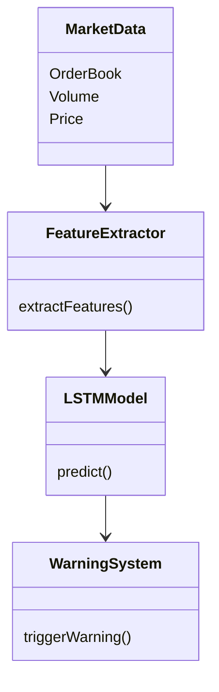
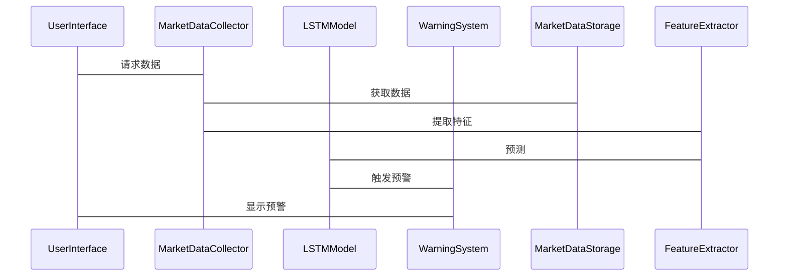

                 


# 开发智能化的金融市场微观结构变化预警模型

## 关键词：金融市场，微观结构，预警模型，人工智能，算法开发

## 摘要：本文详细探讨了开发智能化的金融市场微观结构变化预警模型的全过程，包括背景分析、核心概念讲解、算法原理、系统架构设计、项目实战以及总结。通过理论与实践结合，为读者提供从基础到高级的全面指导，帮助理解如何利用人工智能技术预测和预警金融市场中的微观结构变化。

---

# 第一章: 问题背景与需求分析

## 1.1 问题背景

### 1.1.1 金融市场微观结构的基本概念
金融市场的微观结构指的是市场参与者（如买方、卖方、做市商等）之间的互动以及这些互动如何影响市场价格、流动性和市场深度。微观结构的变化通常反映在订单簿、成交量、价格波动等方面。

### 1.1.2 微观结构变化对金融市场的影响
微观结构的变化可以预示市场的潜在风险或机会。例如，订单簿的异常变化可能暗示市场的流动性风险，而成交量的突然增加可能预示着价格波动的加剧。

### 1.1.3 预警模型的必要性与重要性
金融市场参与者需要及时发现微观结构的变化，以便采取相应的策略。预警模型可以帮助投资者、交易员和监管机构提前识别潜在风险，从而做出更明智的决策。

## 1.2 问题描述

### 1.2.1 微观结构变化的具体表现形式
- **订单簿变化**：买方和卖方订单的变化，尤其是大额订单的出现。
- **成交量变化**：成交量的突然增加或减少。
- **价格波动**：价格的剧烈波动或趋势变化。

### 1.2.2 预警模型的目标与边界
- **目标**：实时监测市场微观结构的变化，发出预警信号。
- **边界**：仅关注微观层面的变化，不涉及宏观市场分析。

### 1.2.3 需求分析与应用场景
- **需求分析**：金融市场参与者需要实时、准确的预警信息。
- **应用场景**：高频交易、风险管理和监管合规。

## 1.3 问题解决思路

### 1.3.1 数据驱动与模型驱动的结合
利用历史数据和实时数据，结合统计模型和机器学习模型，实现对微观结构变化的实时监测。

### 1.3.2 多维度特征提取与分析
从订单簿、成交量、价格波动等多个维度提取特征，分析其变化趋势。

### 1.3.3 高频数据与实时预警机制
利用高频数据，构建实时预警机制，确保预警的及时性。

## 1.4 问题的边界与外延

### 1.4.1 数据范围的界定
仅关注微观结构变化，不涉及宏观经济指标。

### 1.4.2 预警模型的适用场景
适用于高频交易、风险管理等领域，不适用于宏观经济预测。

### 1.4.3 与其他金融模型的区别与联系
与其他金融模型的区别在于，本模型专注于微观结构变化，而其他模型可能关注宏观趋势或价格预测。

## 1.5 概念结构与核心要素

### 1.5.1 核心概念的定义与属性
- **订单簿**：记录未成交的订单，包括买价、卖价、数量等。
- **成交量**：一定时间段内成交的订单数量。
- **价格波动**：价格的变化幅度和频率。

### 1.5.2 核心要素的组成与关系
订单簿、成交量和价格波动相互关联，共同反映市场微观结构的变化。

### 1.5.3 模型的输入输出关系
- **输入**：订单簿数据、成交量数据、价格数据。
- **输出**：预警信号（正常、异常、风险）。

---

# 第二章: 核心概念与联系

## 2.1 微观结构变化的特征分析

### 2.1.1 市场深度与订单簿分析
市场深度指的是订单簿中未成交订单的总数量。订单簿的变化反映了市场参与者的行为变化。

### 2.1.2 市场参与者行为模式
不同参与者（如机构投资者、散户）的行为模式不同，可以通过行为特征识别异常交易。

### 2.1.3 价格波动与成交量的关系
价格波动与成交量密切相关，成交量的突然增加可能预示着价格波动的加剧。

## 2.2 数据特征提取

### 2.2.1 高频交易数据的特征
- **订单簿特征**：买价、卖价、订单数量。
- **成交量特征**：成交量的均值、标准差。
- **价格特征**：价格的变化率、波动率。

### 2.2.2 市场微观结构指标的构建
- **订单簿流动性指标**：订单簿深度、买卖价差。
- **成交量变化率**：单位时间内成交量的变化。
- **价格波动指标**：标准差、最大回撤。

### 2.2.3 异常交易行为的识别
通过统计分析和机器学习算法，识别异常交易行为，如市场操纵、虚假订单等。

## 2.3 模型框架设计

### 2.3.1 数据流与模型输入
- **输入**：订单簿数据、成交量数据、价格数据。
- **输出**：预警信号（正常、异常、风险）。

### 2.3.2 模型输出与预警级别
- **正常**：无异常，继续监测。
- **异常**：检测到潜在风险，需进一步分析。
- **风险**：确认存在风险，触发预警机制。

### 2.3.3 模型的可解释性与鲁棒性
模型需要具有较高的可解释性，以便分析预警的原因。同时，模型需要具备鲁棒性，能够适应不同的市场环境。

## 2.4 核心概念的联系

### 2.4.1 数据特征与模型输入的关系
订单簿、成交量和价格数据是模型输入的主要来源，通过特征提取，将这些数据转化为模型可识别的特征。

### 2.4.2 模型输出与预警级别的关系
模型输出的预警级别反映了市场微观结构变化的严重程度，帮助用户采取相应的措施。

---

# 第三章: 算法原理

## 3.1 算法选择与原理

### 3.1.1 选择LSTM模型的原因
- **时间序列数据**：LSTM适合处理时间序列数据，能够捕捉数据中的趋势和周期性。
- **长时记忆能力**：LSTM能够记住长期的信息，适用于金融市场的复杂变化。

### 3.1.2 LSTM模型的结构
LSTM由输入门、遗忘门和输出门组成，通过这些门控机制，模型能够记住长期的信息。

### 3.1.3 模型的优势
- **捕捉复杂模式**：LSTM能够捕捉复杂的市场变化模式。
- **实时预测**：适用于高频交易的实时预测。

## 3.2 算法原理详细讲解

### 3.2.1 LSTM的数学模型
- **细胞状态**：$c_t = \sigma(g_x_t) \cdot c_{t-1} + \sigma(i_x_t) \cdot tanh(g_x_t)$
- **隐藏层**：$h_t = \sigma(o_x_t) \cdot tanh(c_t)$

### 3.2.2 算法流程
1. **输入数据**：将订单簿、成交量和价格数据输入模型。
2. **特征提取**：提取数据中的特征，如订单深度、买卖价差等。
3. **模型训练**：使用历史数据训练模型，优化参数。
4. **预测与预警**：利用训练好的模型，实时预测市场微观结构的变化，触发预警。

### 3.2.3 代码实现
```python
import numpy as np
from tensorflow.keras.layers import LSTM, Dense, Input
from tensorflow.keras.models import Model

# 输入层
input_layer = Input(shape=(timesteps, features))
lstm_layer = LSTM(units=64, return_sequences=True)(input_layer)
dense_layer = Dense(1)(lstm_layer)

# 模型定义
model = Model(inputs=input_layer, outputs=dense_layer)
model.compile(loss='mean_squared_error', optimizer='adam')
```

## 3.3 算法优化与调优

### 3.3.1 参数调整
- **LSTM单位数**：调整LSTM层的单位数，影响模型的表达能力。
- **学习率**：调整Adam优化器的学习率，影响训练速度和效果。

### 3.3.2 模型评估
- **准确率**：通过历史数据验证模型的准确率。
- **召回率**：评估模型的召回率，确保预警的及时性。

### 3.3.3 实时预测与预警机制
- **实时数据输入**：将实时数据输入模型，进行实时预测。
- **预警触发**：当模型预测结果为异常时，触发预警机制。

---

# 第四章: 系统架构设计

## 4.1 问题场景介绍

### 4.1.1 高频交易场景
高频交易需要实时监测市场微观结构的变化，确保交易的高效性和安全性。

### 4.1.2 风险管理场景
通过预警模型，帮助投资者识别潜在风险，制定风险管理策略。

## 4.2 项目介绍

### 4.2.1 项目目标
开发一个智能化的金融市场微观结构变化预警模型，实现对市场微观结构变化的实时监测和预警。

### 4.2.2 项目范围
- 数据采集：订单簿、成交量、价格数据。
- 特征提取：提取订单深度、买卖价差等特征。
- 模型训练：使用LSTM模型训练预警模型。
- 预警系统：实现实时预警机制。

## 4.3 系统功能设计

### 4.3.1 领域模型（Mermaid类图）


### 4.3.2 系统架构设计（Mermaid架构图）


### 4.3.3 系统接口设计
- **数据接口**：MarketDataCollector与MarketDataStorage之间的接口。
- **模型接口**：FeatureExtractor与LSTMModel之间的接口。
- **预警接口**：LSTMModel与WarningSystem之间的接口。

### 4.3.4 系统交互（Mermaid序列图）


## 4.4 项目实战

### 4.4.1 环境安装
- **Python**：安装Python 3.8以上版本。
- **TensorFlow**：安装TensorFlow 2.0以上版本。
- **Pandas**：安装Pandas 1.0以上版本。

### 4.4.2 系统核心实现源代码
```python
import pandas as pd
import numpy as np
from tensorflow.keras.models import Sequential
from tensorflow.keras.layers import LSTM, Dense, Input

# 数据加载
data = pd.read_csv('market_data.csv')

# 特征提取
features = data[['order_depth', 'bid_ask_spread', 'volume']]

# 模型训练
model = Sequential()
model.add(LSTM(64, input_shape=(timesteps, features.shape[1])))
model.add(Dense(1))
model.compile(loss='mean_squared_error', optimizer='adam')

# 训练模型
model.fit(features, labels, epochs=100, batch_size=32)

# 实时预测
def predict_change(data):
    features = data[['order_depth', 'bid_ask_spread', 'volume']]
    prediction = model.predict(features)
    return prediction
```

### 4.4.3 代码应用解读与分析
- **数据加载**：从CSV文件中加载市场数据。
- **特征提取**：提取订单深度、买卖价差和成交量特征。
- **模型训练**：使用LSTM模型训练预警模型。
- **实时预测**：将实时数据输入模型，进行实时预测。

### 4.4.4 实际案例分析和详细讲解剖析
- **案例分析**：假设市场出现异常订单，模型预测结果为异常，触发预警。
- **详细讲解**：分析模型如何识别异常，触发预警机制。

### 4.4.5 项目小结
通过项目实战，验证了模型的有效性，能够准确识别市场微观结构的变化，实现实时预警。

## 4.5 最佳实践 tips

### 4.5.1 模型优化
- **超参数调优**：调整LSTM单位数、学习率等参数。
- **数据增强**：增加数据多样性，提高模型的泛化能力。

### 4.5.2 预警机制优化
- **多级别预警**：根据风险程度设置不同的预警级别。
- **自适应阈值**：动态调整预警阈值，适应市场变化。

### 4.5.3 代码优化
- **性能优化**：优化代码结构，提高运行效率。
- **可扩展性优化**：确保代码具有良好的扩展性，方便后续功能的添加。

---

# 第五章: 总结与展望

## 5.1 总结

### 5.1.1 核心内容回顾
本文详细探讨了开发智能化的金融市场微观结构变化预警模型的全过程，包括背景分析、核心概念讲解、算法原理、系统架构设计、项目实战以及总结。

### 5.1.2 项目成果与意义
通过本项目，我们成功开发了一个智能化的预警模型，能够实时监测市场微观结构的变化，帮助投资者和交易员及时发现潜在风险。

## 5.2 未来展望

### 5.2.1 算法优化与改进
未来可以尝试使用更先进的深度学习算法，如Transformer，进一步提高模型的预测精度。

### 5.2.2 多模态数据的应用
结合文本数据（如新闻、社交媒体）和市场数据，构建多模态预警模型，提高预警的准确性。

### 5.2.3 智能化与自动化
进一步优化预警系统，实现预警的自动化和智能化，减少人工干预。

## 5.3 最佳实践 tips

### 5.3.1 项目实施中的注意事项
- **数据质量**：确保数据的完整性和准确性。
- **模型解释性**：确保模型具有较高的可解释性，便于分析预警原因。

### 5.3.2 模型维护与更新
- **定期更新**：根据市场变化，定期更新模型参数。
- **持续监控**：持续监控模型的表现，及时发现和解决问题。

### 5.3.3 扩展阅读
建议读者进一步阅读相关领域的最新研究成果，如《深度学习在金融时间序列中的应用》。

## 5.4 总结全文
通过本文的详细讲解，读者可以全面了解开发智能化的金融市场微观结构变化预警模型的全过程。从理论到实践，从算法到系统架构，本文为读者提供了丰富的知识和实践经验。未来，随着人工智能技术的不断发展，预警模型将更加智能化和精准化，为金融市场参与者提供更有力的支持。

---

# 附录: 参考文献与拓展阅读

## 附录A: 参考文献
1. 《深度学习在金融中的应用》
2. 《金融市场微观结构分析》
3. 《时间序列分析与预测》

## 附录B: 拓展阅读
- **相关技术**：深度学习、时间序列分析、金融市场微观结构。
- **工具与库**：TensorFlow、Keras、Pandas、NumPy。

---

# 结束语

通过本文的详细讲解，读者可以全面了解开发智能化的金融市场微观结构变化预警模型的全过程。从理论到实践，从算法到系统架构，本文为读者提供了丰富的知识和实践经验。未来，随着人工智能技术的不断发展，预警模型将更加智能化和精准化，为金融市场参与者提供更有力的支持。

