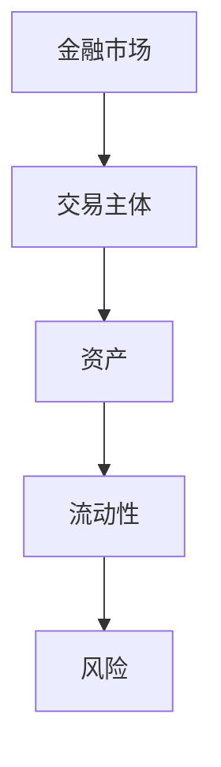
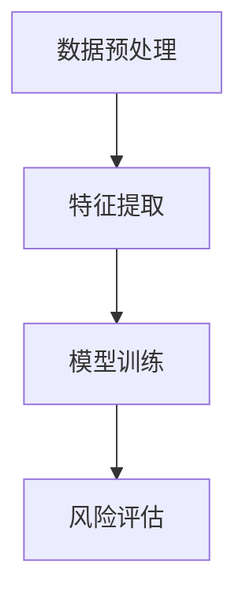
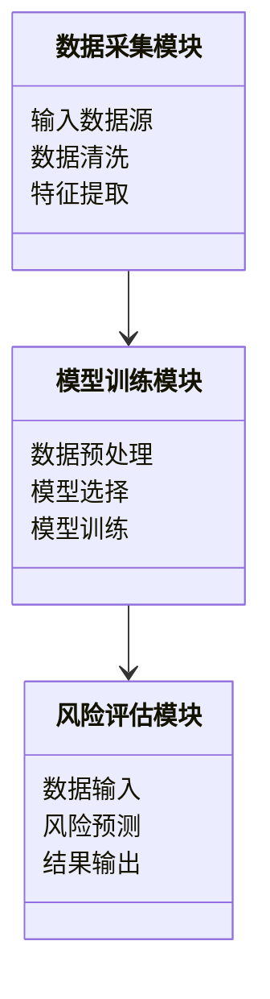
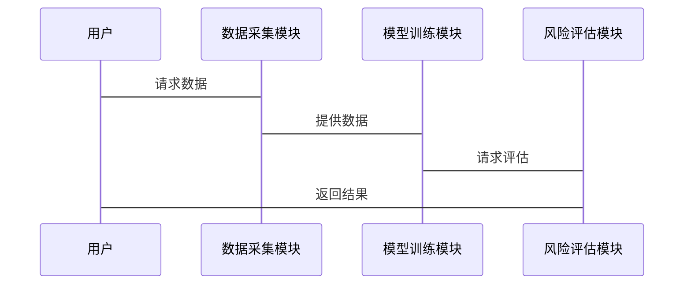

                 


```markdown
# 开发智能化的金融市场流动性风险评估模型

> 关键词：金融市场，流动性风险，智能化模型，机器学习，深度学习

> 摘要：本文旨在探讨如何利用智能化技术，特别是机器学习和深度学习，来开发有效的金融市场流动性风险评估模型。文章从流动性风险的基本概念入手，逐步分析智能化模型的核心原理、算法实现、系统架构设计，并通过实际案例展示模型的应用。最后，本文将提供一些最佳实践和未来研究方向的建议。

---

## 第1章：金融市场与流动性风险概述

### 1.1 金融市场基本概念

#### 1.1.1 金融市场的定义与分类
金融市场是资金流动和资产交易的场所，主要分为一级市场和二级市场。一级市场涉及新证券的发行，而二级市场则是已发行证券的交易市场。金融市场通过提供流动性和价格发现机制，支持经济活动的顺利进行。

#### 1.1.2 流动性风险的定义与特征
流动性风险是指资产在不损失价值的情况下迅速转换为现金的能力。其主要特征包括：交易成本高、市场深度不足、资产流动性差等。

#### 1.1.3 流动性风险管理的重要性
有效的流动性风险管理有助于保障金融机构的稳定性，避免系统性风险，并确保市场参与者能够在需要时及时调整资产配置。

### 1.2 智能化风险评估的必要性

#### 1.2.1 传统风险评估方法的局限性
传统方法依赖于简单的统计模型，难以捕捉复杂市场动态，且在实时性和准确性上有局限。

#### 1.2.2 智能化技术在金融领域的应用前景
智能化技术如机器学习和深度学习能够处理海量数据，发现非线性关系，提升风险评估的准确性和实时性。

#### 1.2.3 智能化流动性风险评估的优势
智能化模型能够快速适应市场变化，提供精准的预测，帮助金融机构做出更明智的决策。

### 1.3 本书内容与目标

#### 1.3.1 本书的核心目标
通过系统介绍智能化流动性风险评估模型的开发过程，帮助读者掌握相关技术和方法。

#### 1.3.2 本书的主要内容框架
从基本概念、算法原理、系统架构到实际案例，全面覆盖流动性风险评估的各个方面。

#### 1.3.3 本书的适用读者
适合金融从业者、数据科学家、技术开发者及相关领域的研究人员阅读。

---

## 第2章：流动性风险评估的核心概念与联系

### 2.1 核心概念原理

#### 2.1.1 流动性风险的主要影响因素
包括市场深度、交易成本、资产流动性、市场情绪等。

#### 2.1.2 智能化模型的关键组成部分
涉及数据收集、特征工程、模型训练、风险预测等模块。

#### 2.1.3 数据驱动与模型驱动的结合
利用数据驱动方法提取特征，并结合模型驱动方法进行预测。

### 2.2 核心概念属性特征对比

#### 2.2.1 流动性风险与市场风险的对比
| 特性           | 流动性风险         | 市场风险         |
|----------------|------------------|-----------------|
| 定义           | 资产变现能力       | 资产价值波动     |
| 主要因素       | 交易成本、市场深度 | 资产价格波动     |
| 应对策略       | 提高流动性         | 多样化投资组合   |

#### 2.2.2 不同模型的性能特征分析
| 模型           | 优势             | 劣势             |
|----------------|------------------|-----------------|
| 随机森林       | 解释性强           | 对特征工程依赖大 |
| 神经网络       | 高准确性           | 黑箱问题         |

#### 2.2.3 数据特征与模型选择的关系
数据特征（如时间序列特征、市场指标）直接影响模型的选择和性能。

### 2.3 ER实体关系图架构



---

## 第3章：智能化流动性风险评估算法原理

### 3.1 算法原理概述

#### 3.1.1 机器学习在流动性风险评估中的应用
机器学习算法能够从历史数据中学习模式，预测未来的流动性风险。

#### 3.1.2 常见算法的优缺点对比
随机森林适合中小规模数据，而神经网络适用于处理复杂非线性关系。

#### 3.1.3 深度学习的优势与挑战
深度学习能够捕捉复杂特征，但需要大量数据和计算资源。

### 3.2 算法流程图



### 3.3 算法实现代码

```python
import pandas as pd
from sklearn.ensemble import RandomForestClassifier
from sklearn.metrics import accuracy_score

# 示例数据加载
data = pd.read_csv('流动性风险数据.csv')
X = data.drop('风险标签', axis=1)
y = data['风险标签']

# 模型训练
model = RandomForestClassifier()
model.fit(X, y)

# 预测与评估
y_pred = model.predict(X)
print("模型准确率:", accuracy_score(y, y_pred))
```

### 3.4 数学模型与公式

#### 3.4.1 Value at Risk (VaR)
$$ VaR_{\alpha}(X) = \inf\{x | P(X \leq x) \geq \alpha\} $$

#### 3.4.2 Conditional Value at Risk (CVaR)
$$ CVaR_{\alpha}(X) = \frac{1}{\alpha} \int_{-\infty}^{VaR_{\alpha}(X)} x dF(x) $$

---

## 第4章：系统分析与架构设计方案

### 4.1 问题场景介绍
流动性风险评估需要实时监控市场动态，及时预警潜在风险。

### 4.2 系统功能设计



### 4.3 系统架构设计


### 4.4 系统接口设计
系统通过API提供数据接口和模型调用接口，方便集成到现有系统中。

### 4.5 系统交互流程设计



---

## 第5章：项目实战

### 5.1 环境安装
安装必要的Python库：
```bash
pip install pandas scikit-learn matplotlib
```

### 5.2 核心代码实现

```python
import pandas as pd
from sklearn.ensemble import RandomForestClassifier
from sklearn.metrics import accuracy_score

# 数据加载与预处理
data = pd.read_csv('流动性风险数据.csv')
X = data.drop('风险标签', axis=1)
y = data['风险标签']

# 模型训练
model = RandomForestClassifier()
model.fit(X, y)

# 模型预测与评估
y_pred = model.predict(X)
print("模型准确率:", accuracy_score(y, y_pred))
```

### 5.3 案例分析与解读
以某股票市场为例，分析模型预测结果，讨论其准确性和适用性。

### 5.4 项目小结
总结项目实施过程，提出改进建议，如引入更复杂模型或增加实时数据源。

---

## 第6章：最佳实践与总结

### 6.1 最佳实践Tips
- 数据清洗和特征工程是关键，需投入足够时间。
- 模型选择应基于数据特征和实际需求。
- 定期更新模型，以适应市场变化。

### 6.2 项目小结
本文通过系统的方法，详细介绍了智能化流动性风险评估模型的开发过程，从理论到实践，为读者提供了全面的指导。

### 6.3 注意事项
- 数据隐私和安全需严格遵守相关法规。
- 模型需定期验证和更新，避免过时。
- 结合业务知识，优化模型表现。

### 6.4 拓展阅读
推荐相关书籍和论文，如《Python机器学习》、《深度学习实战》等。

---

## 总结

通过本文的学习，读者将能够掌握开发智能化的金融市场流动性风险评估模型的关键技术和方法，为实际应用提供有力支持。
```

