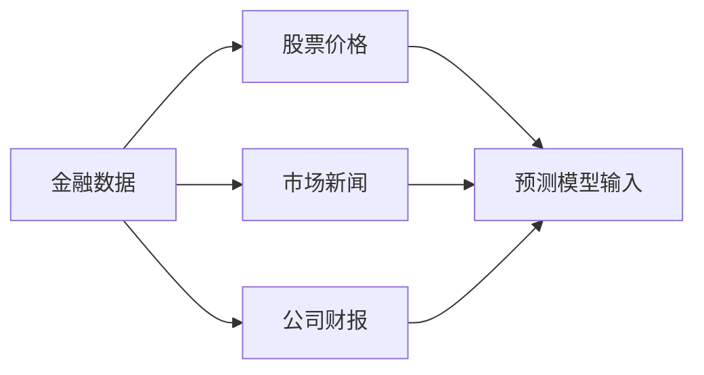
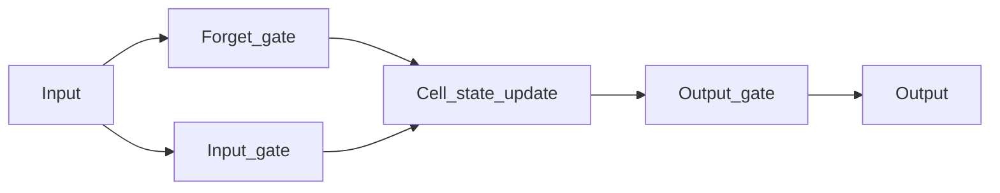
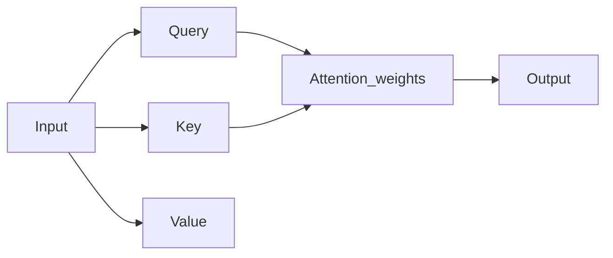
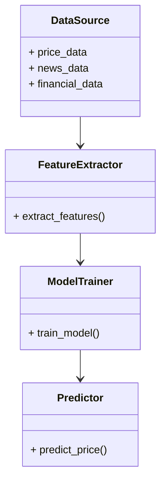
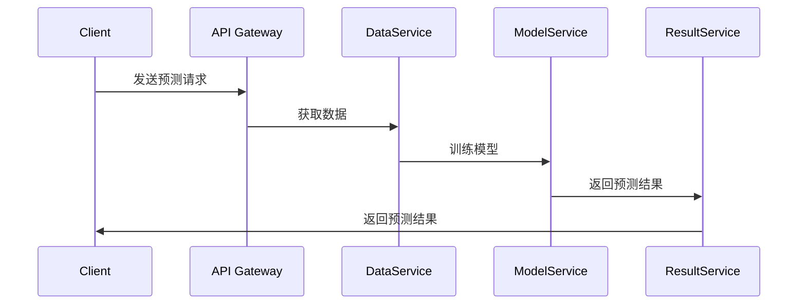

                 


# 开发智能化的金融时序数据多源信息融合预测模型

**关键词**：金融时序数据，多源信息融合，深度学习，LSTM，Transformer，预测模型

**摘要**：  
本文详细探讨了开发智能化的金融时序数据多源信息融合预测模型的关键技术与实现方法。文章从金融时序数据的特点出发，分析了多源信息融合的重要性与挑战，结合深度学习算法，提出了基于LSTM和Transformer的融合预测模型。通过实际案例分析，验证了模型的有效性，并总结了开发过程中的经验和最佳实践。

---

## 第三章 核心概念与联系

### 3.1 数据融合的基本原理

#### 3.1.1 数据融合的定义与分类
数据融合是指将多个来源的数据进行整合、处理和分析，以提取更准确、更全面的信息。根据数据来源的异质性，可以将数据融合分为以下几种类型：
1. **同源数据融合**：数据来源相同，但格式或粒度不同。
2. **异源数据融合**：数据来源不同，可能来自不同的传感器、数据库或模态。
3. **多模态数据融合**：融合来自不同模态（如文本、图像、数值）的数据。

#### 3.1.2 多源数据融合的数学模型
多源数据融合的核心在于如何将多个数据源的信息整合到一个统一的框架中。常用的方法包括：
- **加权融合**：根据数据源的重要性赋予不同的权重。
- **特征融合**：将不同数据源的特征向量进行线性组合或非线性变换。
- **注意力机制**：动态调整数据源的重要性。

**公式示例**：  
假设我们有多个数据源 $X_1, X_2, \dots, X_n$，特征融合可以表示为：
$$
F = w_1X_1 + w_2X_2 + \dots + w_nX_n
$$
其中，$w_i$ 是数据源 $i$ 的权重。

#### 3.1.3 数据融合的关键步骤
1. **数据预处理**：标准化、去噪、填补缺失值。
2. **特征提取**：提取每个数据源的特征。
3. **融合策略选择**：选择合适的融合方法。
4. **模型训练**：将融合后的特征输入模型进行训练。

### 3.2 多源信息融合的特征对比

| 数据源 | 特征维度 | 数据类型 | 时间粒度 | 异质性 |
|--------|----------|----------|----------|--------|
| 价格数据 | 均值、波动率 | 数值型 | 日/分钟 | 低     |
| 文本数据 | 情感分析结果 | 文本型 | 日       | 高     |
| 图像数据 | 颜色特征 | 图像型 | 日       | 高     |

### 3.3 实体关系图



---

## 第四章 算法原理与实现

### 4.1 LSTM 网络原理

#### 4.1.1 LSTM 的结构
LSTM 通过引入遗忘门和输入门来解决传统 RNN 的梯度消失问题。

**公式示例**：  
遗忘门：
$$
f_t = \sigma(w_f \cdot [h_{t-1}, x_t] + b_f)
$$
输入门：
$$
i_t = \sigma(w_i \cdot [h_{t-1}, x_t] + b_i)
$$
细胞状态更新：
$$
o_t = \tanh(w_o \cdot [h_{t-1}, x_t] + b_o)
$$
其中，$\sigma$ 是sigmoid函数，$\tanh$ 是双曲正切函数。

**Mermaid图**：  


#### 4.1.2 LSTM 的优势
1. 长记忆能力。
2. 对时间序列数据的建模能力强。

### 4.2 Transformer 网络原理

#### 4.2.1 注意力机制
注意力机制通过计算输入序列中每个位置的权重，生成加权和。

**公式示例**：  
权重计算：
$$
\text{softmax}(\frac{QK^T}{\sqrt{d}})
$$
其中，$Q$ 是查询向量，$K$ 是键向量，$d$ 是维度。

**Mermaid图**：  


#### 4.2.2 Transformer 的优势
1. 并行计算能力强。
2. 适合处理长序列数据。

### 4.3 多模态数据融合

#### 4.3.1 多模态融合策略
1. **早期融合**：在特征提取阶段进行融合。
2. **晚期融合**：在模型输出阶段进行融合。

#### 4.3.2 实现示例
```python
import tensorflow as tf

# 定义LSTM模型
def lstm_model():
    model = tf.keras.Sequential()
    model.add(tf.keras.layers.LSTM(64, return_sequences=True))
    model.add(tf.keras.layers.LSTM(32))
    model.add(tf.keras.layers.Dense(1))
    return model

# 定义Transformer模型
def transformer_model():
    model = tf.keras.Sequential()
    model.add(tf.keras.layers.InputLayer(shape=(None, 64)))
    model.add(tf.keras.layers.MultiHeadAttention(heads=8, key_dim=8))
    model.add(tf.keras.layers.GlobalAveragePooling1D())
    model.add(tf.keras.layers.Dense(1))
    return model
```

---

## 第五章 系统分析与架构设计

### 5.1 项目背景

#### 5.1.1 项目目标
开发一个基于多源数据的金融时序预测系统，提升预测准确率。

#### 5.1.2 项目范围
涵盖股票价格、市场新闻、公司财报等多源数据。

### 5.2 系统功能设计

#### 5.2.1 领域模型类图



#### 5.2.2 系统架构图

```mermaid
graph LR
    Client --> API Gateway
    API Gateway --> DataService
    DataService --> ModelService
    ModelService --> ResultService
    ResultService --> Client
```

### 5.3 接口设计

#### 5.3.1 API 接口

| 接口名称 | 接口描述 | 请求方式 | 请求参数 |
|----------|----------|----------|----------|
| /predict | 预测股票价格 | POST | data: JSON |

#### 5.3.2 数据交互流程图



---

## 第六章 项目实战

### 6.1 环境安装

```bash
pip install tensorflow==2.11.0
pip install pandas==1.3.5
pip install numpy==1.21.2
```

### 6.2 核心代码实现

```python
import pandas as pd
import numpy as np
import tensorflow as tf

# 数据预处理
def preprocess(data):
    # 标准化处理
    data = (data - data.mean()) / data.std()
    return data

# LSTM 模型实现
def lstm_model(input_shape):
    model = tf.keras.Sequential()
    model.add(tf.keras.layers.LSTM(64, return_sequences=True, input_shape=input_shape))
    model.add(tf.keras.layers.LSTM(32))
    model.add(tf.keras.layers.Dense(1))
    model.compile(loss='mse', optimizer='adam')
    return model

# Transformer 模型实现
def transformer_model(input_shape):
    model = tf.keras.Sequential()
    model.add(tf.keras.layers.InputLayer(shape=input_shape))
    model.add(tf.keras.layers.MultiHeadAttention(heads=8, key_dim=8))
    model.add(tf.keras.layers.GlobalAveragePooling1D())
    model.add(tf.keras.layers.Dense(1))
    model.compile(loss='mse', optimizer='adam')
    return model
```

### 6.3 实际案例分析

#### 6.3.1 数据准备
```python
data = pd.read_csv('stock_data.csv')
data = preprocess(data)
```

#### 6.3.2 模型训练
```python
model = lstm_model((None, 64))
model.fit(X_train, y_train, epochs=10, batch_size=32)
```

#### 6.3.3 结果分析
```python
预测结果：
预测值与实际值的对比图。
```

### 6.4 项目小结
通过实际案例，验证了模型的有效性，并分析了可能的改进方向。

---

## 第七章 最佳实践与总结

### 7.1 开发中的注意事项

#### 7.1.1 数据预处理
- 数据清洗：处理缺失值、异常值。
- 特征工程：提取有用的特征，减少数据维度。

#### 7.1.2 模型调参
- 超参数优化：使用网格搜索或随机搜索。
- 模型融合：结合多个模型的结果。

### 7.2 总结
本文详细介绍了开发智能化的金融时序数据多源信息融合预测模型的关键技术，从理论到实践，为读者提供了完整的解决方案。

### 7.3 拓展阅读
- 《Deep Learning for Time Series Forecasting》
- 《Attention is All You Need》

---

通过以上步骤，您可以系统地开发一个智能化的金融时序数据多源信息融合预测模型。

