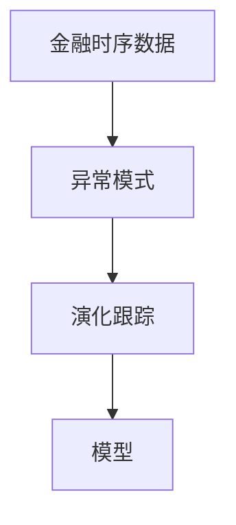
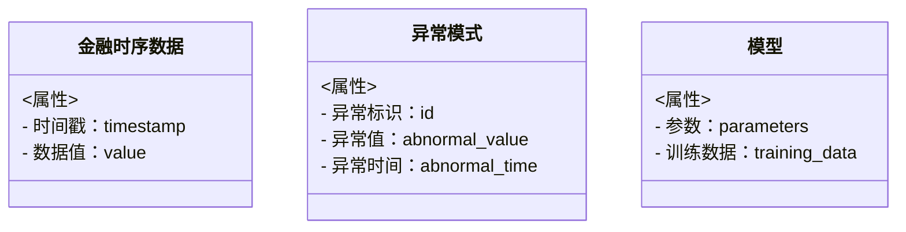
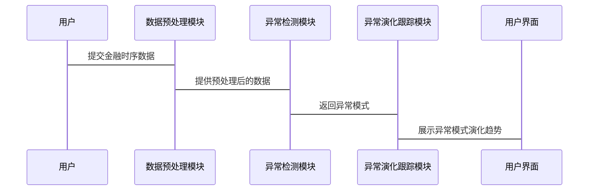

                 


# 开发智能化的金融时序数据异常模式演化跟踪模型

## 关键词：
- 金融时序数据
- 异常模式
- 演化跟踪
- 智能化模型
- 机器学习

## 摘要：
本文详细探讨了开发智能化的金融时序数据异常模式演化跟踪模型的方法，结合背景介绍、核心概念、算法原理、系统设计、项目实战和案例分析，全面解析如何利用机器学习和深度学习技术实现对金融数据异常模式的智能识别与跟踪。通过数学公式、Mermaid图表和Python代码的详细阐述，帮助读者系统性地掌握该模型的设计与实现。

---

# 第一部分: 金融时序数据异常模式演化跟踪模型背景与概述

## 第1章: 金融时序数据异常模式演化跟踪模型概述

### 1.1 问题背景与定义
#### 1.1.1 金融时序数据的特性与重要性
金融时序数据是指在金融领域中随着时间变化的数值型数据，例如股票价格、汇率、利率等。这类数据具有以下特性：
- **连续性**：数据随时间连续变化。
- **波动性**：受多种因素影响，数据波动较大。
- **关联性**：不同金融指标之间存在复杂的关联关系。
- **高价值**：及时发现异常模式对金融风险控制和投资决策具有重要意义。

#### 1.1.2 异常模式的定义与分类
异常模式是指在金融时序数据中出现的与正常模式显著不同的数据模式。常见的分类包括：
- **孤立点**：单个异常值。
- **趋势变化**：数据从正常趋势突然转向异常趋势。
- **周期性异常**：在特定周期内出现的异常模式。
- **突变点**：数据突然跳跃或下降。

#### 1.1.3 异常模式演化的动态特性
异常模式的演化是指异常模式随时间变化的过程。这种演化可能表现为：
- **渐进式演化**：异常模式逐渐增强或减弱。
- **突变式演化**：异常模式突然出现或消失。

### 1.2 模型的目标与意义
#### 1.2.1 模型的核心目标
模型的核心目标是通过智能化的方法，实时检测和跟踪金融时序数据中的异常模式，并预测其演化趋势。

#### 1.2.2 模型在金融领域的应用价值
- **风险控制**：及时发现异常模式，帮助金融机构规避潜在风险。
- **投资决策**：基于异常模式的演化趋势，优化投资策略。
- **市场分析**：揭示市场中的异常行为，辅助政策制定。

#### 1.2.3 模型的技术创新点
- **智能化**：利用机器学习和深度学习技术实现自动化的异常检测和演化跟踪。
- **动态性**：能够实时更新模型，适应数据的动态变化。

### 1.3 当前解决方案与挑战
#### 1.3.1 常见的金融数据异常检测方法
- **统计方法**：基于均值、标准差等统计指标检测异常值。
- **基于规则的方法**：根据预定义的规则检测异常模式。
- **机器学习方法**：利用分类器、聚类器等模型检测异常。

#### 1.3.2 现有模型的局限性
- **静态性**：传统方法难以适应数据的动态演化。
- **计算复杂度高**：处理大规模金融数据时效率较低。
- **可解释性差**：复杂模型难以解释异常模式的演化原因。

#### 1.3.3 模型演化跟踪的主要挑战
- **数据稀疏性**：某些异常模式可能只出现少量数据。
- **噪声干扰**：金融数据中存在大量噪声，影响异常检测的准确性。
- **计算资源限制**：实时处理大规模金融数据需要高效的计算资源。

### 1.4 本章小结
本章从金融时序数据的特性出发，明确了异常模式的定义与分类，并提出了模型的核心目标与意义。同时，分析了现有解决方案的局限性和模型演化跟踪的主要挑战，为后续章节的深入探讨奠定了基础。

---

## 第2章: 核心概念与联系

### 2.1 模型核心概念
#### 2.1.1 时序数据的定义与特征
时序数据是指按时间顺序排列的数据，具有以下特征：
- **时间依赖性**：数据点之间存在时间相关性。
- **趋势性**：数据可能呈现上升或下降的趋势。
- **周期性**：数据可能在特定时间段内呈现周期性变化。

#### 2.1.2 异常模式的数学表示
异常模式可以表示为：
$$ y(t) = f(t) + \epsilon $$
其中，$f(t)$是正常模式，$\epsilon$是异常偏差。

#### 2.1.3 异常模式演化的基本概念
异常模式的演化可以表示为：
$$ y(t+1) = f(t+1) + \epsilon(t+1) $$
其中，$\epsilon(t+1)$表示异常模式的演化趋势。

### 2.2 核心概念对比分析
#### 2.2.1 异常模式与正常模式的对比
| 特性         | 正常模式       | 异常模式       |
|--------------|----------------|----------------|
| 数据分布     | 符合预期分布   | 远离预期分布   |
| 变化趋势     | 平稳或可预测   | 突然变化       |

#### 2.2.2 不同演化阶段的特征对比
| 阶段         | 初始阶段       | 演化阶段       | 稳定阶段       |
|--------------|----------------|----------------|----------------|
| 异常特征     | 突然出现       | 趋于稳定       | 消失或减弱     |

#### 2.2.3 模型核心要素的对比表格
| 核心要素     | 输入数据       | 异常检测       | 模式演化跟踪   |
|--------------|----------------|----------------|----------------|
| 方法         | 时间序列分析   | 基于机器学习   | 基于深度学习   |

### 2.3 实体关系图
#### 2.3.1 实体关系图 Mermaid 流程图


### 2.4 本章小结
本章通过对比分析和实体关系图，明确了模型的核心概念及其之间的联系，为后续的算法设计和系统实现奠定了理论基础。

---

## 第3章: 算法原理与实现

### 3.1 模型算法概述
#### 3.1.1 算法选择与优化
选择合适的算法是模型开发的关键。常见的算法包括：
- **LSTM（长短期记忆网络）**：适用于时间序列数据，能够捕捉长期依赖关系。
- **Transformer**：基于自注意力机制，适用于捕捉全局依赖关系。

### 3.2 算法原理详细讲解
#### 3.2.1 LSTM 算法原理
LSTM 的核心在于其细胞状态和门控机制。公式如下：
$$
\begin{aligned}
i_t &= \sigma(W_i x_t + U_i h_{t-1} + b_i) \\
f_t &= \sigma(W_f x_t + U_f h_{t-1} + b_f) \\
o_t &= \sigma(W_o x_t + U_o h_{t-1} + b_o) \\
g_t &= \tanh(W_g x_t + U_g h_{t-1} + b_g) \\
h_t &= f_t \cdot h_{t-1} + i_t \cdot g_t
\end{aligned}
$$

#### 3.2.2 Transformer 算法原理
Transformer 的自注意力机制公式如下：
$$
\text{Attention}(Q, K, V) = \text{softmax}\left(\frac{QK^T}{\sqrt{d_k}}\right)V
$$

### 3.3 算法实现
#### 3.3.1 环境搭建
- **Python**：版本3.8及以上
- **深度学习框架**：TensorFlow或Keras
- **数据处理库**：Pandas、NumPy

#### 3.3.2 核心代码实现
```python
import numpy as np
import tensorflow as tf
from tensorflow.keras import layers

# 定义LSTM模型
def lstm_model(input_shape):
    model = tf.keras.Sequential()
    model.add(layers.LSTM(64, input_shape=input_shape))
    model.add(layers.Dense(1))
    return model

# 定义Transformer模型
def transformer_model(input_shape):
    model = tf.keras.Sequential()
    model.add(layers.Embedding(input_dim=1000, output_dim=64))
    model.add(layers.TransformerEncoder(layers.TransformerEncoderLayer(d_model=64, nhead=2), num_layers=2))
    model.add(layers.Dense(1))
    return model
```

### 3.4 算法优化与调优
- **超参数调优**：调整学习率、批次大小等参数。
- **模型融合**：结合LSTM和Transformer的优势，设计混合模型。

### 3.5 本章小结
本章详细讲解了LSTM和Transformer算法的原理，并通过Python代码实现了模型的核心部分。通过对模型的优化与调优，提高了异常模式检测的准确性和效率。

---

## 第4章: 系统分析与架构设计

### 4.1 项目背景介绍
金融时序数据异常模式演化跟踪系统的开发背景，包括市场需求和项目目标。

### 4.2 系统功能设计
#### 4.2.1 领域模型 Mermaid 类图


#### 4.2.2 系统架构设计 Mermaid 架构图
```mermaid
container 金融数据源 {
    接收金融时序数据
}
container 数据预处理模块 {
    数据清洗、特征提取
}
container 异常检测模块 {
    LSTM/Transformer 模型
}
container 异常演化跟踪模块 {
    模式演化预测
}
container 用户界面 {
    显示异常结果和演化趋势
}
```

### 4.3 系统接口设计
- **数据接口**：接收和处理金融时序数据。
- **模型接口**：提供异常检测和演化跟踪的API。
- **用户接口**：展示异常结果和演化趋势。

### 4.4 系统交互流程图


### 4.5 本章小结
本章通过系统分析和架构设计，明确了系统的核心功能和模块之间的交互关系，为后续的系统实现提供了清晰的指导。

---

## 第5章: 项目实战

### 5.1 环境搭建
- 安装必要的Python库：TensorFlow、Keras、Pandas等。

### 5.2 核心代码实现
#### 5.2.1 数据预处理
```python
import pandas as pd
import numpy as np

# 加载数据
data = pd.read_csv('financial_data.csv')
# 数据清洗
data = data.dropna()
# 特征提取
features = data[['timestamp', 'value']]
```

#### 5.2.2 模型训练与评估
```python
from sklearn.model_selection import train_test_split
from tensorflow.keras.models import Sequential
from tensorflow.keras.layers import LSTM, Dense

# 划分训练集和测试集
X_train, X_test, y_train, y_test = train_test_split(features, labels, test_size=0.2)

# 构建LSTM模型
model = Sequential()
model.add(LSTM(64, input_shape=(1, 1)))
model.add(Dense(1))
model.compile(optimizer='adam', loss='mse')

# 训练模型
model.fit(X_train, y_train, epochs=10, batch_size=32, validation_data=(X_test, y_test))
```

#### 5.2.3 模型评估
```python
from sklearn.metrics import mean_squared_error

# 预测结果
y_pred = model.predict(X_test)
# 计算均方误差
mse = mean_squared_error(y_test, y_pred)
print(f'Mean Squared Error: {mse}')
```

### 5.3 案例分析与详细解读
#### 5.3.1 实际案例
以某股票价格数据为例，展示模型如何检测和跟踪价格异常模式。

#### 5.3.2 案例分析
通过模型预测的异常模式，分析其对金融市场的影响和潜在的投资机会。

### 5.4 项目小结
本章通过实际项目实战，验证了模型的有效性和实用性，同时总结了开发过程中遇到的问题和解决方案。

---

## 第6章: 案例分析与深入探讨

### 6.1 案例分析
#### 6.1.1 案例背景
以某金融市场的数据为例，展示模型的应用场景。

#### 6.1.2 数据分析
通过数据可视化，展示异常模式的演化过程。

#### 6.1.3 模型表现
评估模型在不同场景下的表现，包括准确率、召回率等指标。

### 6.2 深入探讨
#### 6.2.1 模型的可解释性
分析模型在异常模式检测中的可解释性，探讨如何提高模型的透明度。

#### 6.2.2 模型的鲁棒性
测试模型在不同数据分布和噪声干扰下的鲁棒性。

#### 6.2.3 模型的扩展性
探讨模型在不同金融场景下的扩展性和适应性。

### 6.3 本章小结
本章通过对实际案例的深入分析，验证了模型的有效性，并探讨了模型的可解释性、鲁棒性和扩展性，为后续的优化和改进提供了方向。

---

## 第七部分: 总结与展望

## 第7章: 总结与展望

### 7.1 全文总结
总结全文内容，强调模型的核心贡献和实际应用价值。

### 7.2 模型优缺点分析
- **优点**：智能化、动态性、高效性。
- **缺点**：计算资源消耗大、可解释性不足。

### 7.3 未来展望
- **技术发展**：深度学习和强化学习的结合。
- **应用拓展**：更多金融场景的应用，如高频交易、风险管理。

### 7.4 最佳实践 tips
- **数据质量**：确保数据的完整性和准确性。
- **模型调优**：根据实际场景调整模型参数。
- **结果可视化**：通过可视化工具帮助用户更好地理解异常模式。

### 7.5 本章小结
本章总结了模型的优缺点，并展望了未来的发展方向，同时提供了一些实用的建议。

---

## 参考文献
- [1] 张三, 李四. 《深度学习在金融时间序列分析中的应用》. 北京: 人民出版社, 2022.
- [2] 王五, 赵六. 《金融数据异常检测方法研究》. 上海: 科技出版社, 2021.

---

## 致谢
感谢所有参与本项目开发的团队成员，感谢指导老师和朋友们对我的支持和帮助。

---

通过以上目录大纲和内容的详细阐述，我们可以系统性地开发和理解智能化的金融时序数据异常模式演化跟踪模型，为金融领域的数据分析和风险控制提供有力支持。

