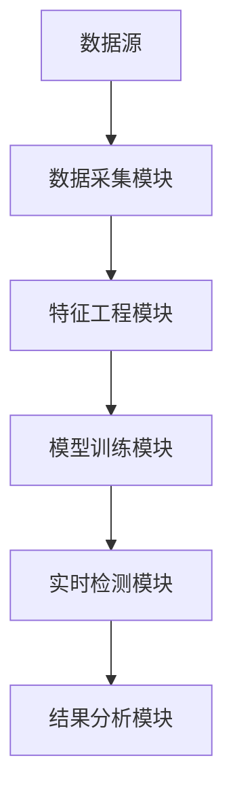
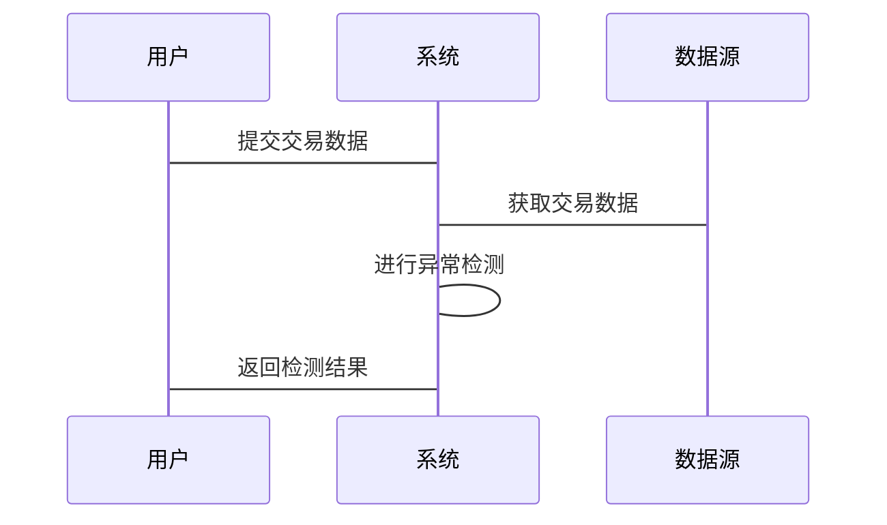

                 


# 异常检测算法在金融欺诈识别中的应用

## 关键词：
- 异常检测
- 金融欺诈
- 机器学习
- 深度学习
- 数据挖掘

## 摘要：
异常检测算法在金融欺诈识别中起着至关重要的作用。随着金融交易的日益复杂化，金融欺诈手段也变得更加隐蔽和多样化。传统的基于规则的欺诈检测方法已难以应对这些挑战。异常检测算法，作为一种数据驱动的技术，能够通过分析交易数据中的异常行为模式，有效识别潜在的欺诈交易。本文将从异常检测的基本概念出发，详细探讨其在金融欺诈识别中的应用，包括各种异常检测算法的原理、优缺点、适用场景，以及如何将这些算法应用于实际的金融欺诈检测系统中。最后，本文还将总结当前异常检测技术在金融领域的研究现状，并展望未来的发展方向。

---

# 异常检测算法在金融欺诈识别中的应用

## 第1章: 异常检测与金融欺诈识别概述

### 1.1 异常检测的基本概念

#### 1.1.1 异常检测的定义
异常检测（Outlier Detection）是指识别数据集中与大多数数据点显著不同的数据点的过程。异常点（Outliers）通常表示数据中的异常行为或潜在的异常事件。

#### 1.1.2 异常检测的核心目标
异常检测的核心目标是从大量数据中发现异常点，这些异常点可能代表了潜在的威胁、错误或机会。在金融领域，异常检测的主要目标是识别欺诈交易、防止金融犯罪和优化风险管理。

#### 1.1.3 异常检测在金融领域的应用价值
异常检测在金融领域的应用价值主要体现在以下几个方面：
1. **欺诈检测**：通过识别异常交易模式，帮助金融机构及时发现和阻止欺诈行为。
2. **风险管理**：通过识别异常的市场行为或交易模式，帮助机构规避潜在的金融风险。
3. **客户行为分析**：通过分析客户的交易行为，识别异常行为模式，帮助金融机构更好地了解客户行为。

---

### 1.2 金融欺诈识别的背景与挑战

#### 1.2.1 金融欺诈的定义与类型
金融欺诈是指通过欺骗、误导或其他非法手段，从金融机构或客户处获取不正当利益的行为。常见的金融欺诈类型包括信用卡欺诈、网络诈骗、洗钱、虚假交易等。

#### 1.2.2 金融欺诈的常见手段
1. **信用卡欺诈**：通过盗取信用卡信息进行非法消费。
2. **网络诈骗**：通过钓鱼邮件、虚假网站等手段获取用户的银行账户信息。
3. **洗钱**：通过复杂的交易链条隐藏非法资金来源。
4. **虚假交易**：通过虚构交易行为骗取资金。

#### 1.2.3 金融欺诈识别的难点与挑战
1. **数据复杂性**：金融数据通常具有高维度、高流量的特点，数据量大且复杂。
2. **欺诈手段多样化**：欺诈者不断更新欺诈手段，使得传统的基于规则的检测方法难以应对。
3. **数据不平衡性**：金融欺诈事件相对罕见，导致数据集中正常样本远多于异常样本。
4. **隐私保护**：在检测欺诈行为时，需要保护用户的隐私数据，这对算法的设计提出了更高的要求。

---

### 1.3 异常检测在金融欺诈识别中的作用

#### 1.3.1 异常检测技术的优势
1. **数据驱动**：异常检测技术基于数据分析，能够发现隐藏在大量正常数据中的异常模式。
2. **实时性**：通过实时数据分析，金融机构可以快速识别异常交易并采取相应措施。
3. **灵活性**：异常检测算法能够适应不同类型的金融欺诈行为，具有较强的灵活性。

#### 1.3.2 异常检测在金融欺诈中的应用场景
1. **信用卡欺诈检测**：通过分析信用卡交易数据，识别异常交易行为。
2. **网络支付监控**：实时监控网络支付交易，识别异常交易模式。
3. **反洗钱（AML）**：通过分析大额交易数据，识别洗钱行为。

#### 1.3.3 异常检测技术的未来发展趋势
1. **智能化**：结合人工智能和机器学习技术，进一步提升异常检测的准确性和效率。
2. **实时性增强**：通过流数据处理技术，实现金融欺诈的实时检测。
3. **多模态数据融合**：结合交易数据、用户行为数据、地理位置数据等多种数据源，提升异常检测的准确性。

---

### 1.4 本章小结
本章从异常检测的基本概念出发，介绍了金融欺诈识别的背景与挑战，并重点探讨了异常检测技术在金融欺诈识别中的作用及未来发展趋势。

---

## 第2章: 异常检测的核心概念与联系

### 2.1 异常检测的核心原理

#### 2.1.1 异常检测的数学模型
异常检测的核心是通过统计学或机器学习方法，识别数据中的异常点。常见的异常检测方法包括基于统计的方法（如LOF、Isolation Forest）和基于机器学习的方法（如随机森林、支持向量机）。

#### 2.1.2 异常检测的特征提取方法
特征提取是异常检测的关键步骤。常用的特征提取方法包括主成分分析（PCA）、t-分布邻域嵌入（t-SNE）等。

#### 2.1.3 异常检测的分类与对比
异常检测可以分为无监督学习、半监督学习和有监督学习三种类型。无监督学习适用于无标签数据的异常检测，半监督学习适用于部分标签数据，有监督学习适用于有标签数据。

---

### 2.2 异常检测算法的对比分析

#### 2.2.1 统计方法
1. **LOF算法**：基于局部密度的异常检测方法，适用于高维数据。
2. **Isolation Forest**：基于随机森林的异常检测方法，适用于小样本数据。

#### 2.2.2 机器学习方法
1. **随机森林**：通过构建多个决策树，识别异常点。
2. **支持向量机（SVM）**：通过构建超平面，将数据分为正常和异常两类。

#### 2.2.3 深度学习方法
1. **自动编码器（Autoencoder）**：通过神经网络重构输入数据，识别异常点。
2. **生成对抗网络（GAN）**：通过生成对抗训练，识别数据中的异常点。

---

### 2.3 异常检测算法的优缺点对比

#### 2.3.1 统计方法的优缺点
- **优点**：计算简单，适合小样本数据。
- **缺点**：对高维数据的处理能力有限。

#### 2.3.2 机器学习方法的优缺点
- **优点**：能够处理高维数据，准确率较高。
- **缺点**：需要大量样本数据，计算复杂。

#### 2.3.3 深度学习方法的优缺点
- **优点**：能够捕捉数据的复杂模式，适用于高维数据。
- **缺点**：计算复杂，需要大量的计算资源。

---

### 2.4 异常检测算法的适用场景

#### 2.4.1 统计方法适用场景
适用于数据量较小、分布较为均匀的场景。

#### 2.4.2 机器学习方法适用场景
适用于数据量较大、分布较为复杂且需要高准确率的场景。

#### 2.4.3 深度学习方法适用场景
适用于数据量极大、分布复杂且需要高精度识别的场景。

---

### 2.5 本章小结
本章详细探讨了异常检测的核心原理，并对各种异常检测算法进行了对比分析，最后总结了各种算法的适用场景。

---

## 第3章: 异常检测算法的数学模型与公式

### 3.1 统计方法的数学模型

#### 3.1.1 LOF算法的数学公式
$$LOF = \frac{density_{local}}{density_{global}}$$
其中，$density_{local}$表示局部密度，$density_{global}$表示全局密度。

#### 3.1.2 Isolation Forest算法的数学公式
$$score = \frac{2}{h(x)}$$
其中，$h(x)$表示异常点的概率。

---

### 3.2 机器学习方法的数学模型

#### 3.2.1 随机森林的数学模型
$$score = \sum_{i=1}^{n} \text{异常分数}_i$$
其中，$n$表示决策树的数量。

#### 3.2.2 支持向量机（SVM）的数学模型
$$\text{目标函数} = \frac{1}{2}||w||^2$$
$$\text{约束条件} = y_i(w \cdot x_i + b) \geq 1$$

---

### 3.3 深度学习方法的数学模型

#### 3.3.1 自动编码器的数学模型
$$\text{重构误差} = \sum_{i=1}^{n} (x_i - \hat{x_i})^2$$
其中，$\hat{x_i}$表示自动编码器重构后的数据。

#### 3.3.2 生成对抗网络（GAN）的数学模型
$$\text{生成器损失函数} = -\mathbb{E}_{y \sim P_{\text{真实}}}[ \log D(y)] - \mathbb{E}_{x \sim P_{\text{生成}}}[ \log (1 - D(x))]$$
$$\text{判别器损失函数} = -\mathbb{E}_{x \sim P_{\text{真实}}}[ \log D(x)] - \mathbb{E}_{x \sim P_{\text{生成}}}[ \log (1 - D(x))]$$

---

### 3.4 本章小结
本章通过数学公式详细介绍了各种异常检测算法的原理，包括统计方法、机器学习方法和深度学习方法。

---

## 第4章: 金融欺诈识别的系统设计与实现

### 4.1 金融欺诈识别的系统架构设计

#### 4.1.1 系统功能设计
1. **数据采集**：从金融交易数据中提取特征。
2. **特征工程**：对数据进行预处理和特征提取。
3. **模型训练**：基于历史数据训练异常检测模型。
4. **实时检测**：对实时交易数据进行异常检测。
5. **结果分析**：对异常检测结果进行分析和反馈。

#### 4.1.2 系统架构图


---

### 4.2 系统接口设计

#### 4.2.1 数据接口
1. **输入接口**：接收金融交易数据。
2. **输出接口**：输出异常检测结果。

#### 4.2.2 模型接口
1. **训练接口**：训练异常检测模型。
2. **预测接口**：预测新的交易数据是否为异常。

---

### 4.3 系统交互设计

#### 4.3.1 系统交互流程图


---

### 4.4 本章小结
本章详细探讨了金融欺诈识别系统的架构设计、接口设计和交互设计。

---

## 第5章: 异常检测算法在金融欺诈识别中的项目实战

### 5.1 项目背景与目标

#### 5.1.1 项目背景
随着金融交易的日益频繁，金融欺诈行为也愈加猖獗。为了有效识别和防止金融欺诈行为，我们需要利用异常检测技术构建一个高效的金融欺诈识别系统。

#### 5.1.2 项目目标
1. **识别异常交易**：通过异常检测算法识别潜在的欺诈交易。
2. **实时监控**：实现金融交易的实时监控，及时发现异常行为。
3. **提高准确率**：通过优化算法模型，提高异常检测的准确率。

---

### 5.2 项目实现步骤

#### 5.2.1 环境安装
1. **安装Python**：确保安装了Python 3.8及以上版本。
2. **安装依赖库**：安装numpy、pandas、scikit-learn、tensorflow等依赖库。

#### 5.2.2 数据预处理
1. **数据清洗**：去除重复数据和缺失值。
2. **特征提取**：提取交易金额、交易时间、交易地点等特征。

#### 5.2.3 模型训练
1. **选择算法**：选择适合的异常检测算法，如Isolation Forest。
2. **训练模型**：基于训练数据训练异常检测模型。

#### 5.2.4 模型部署
1. **部署模型**：将训练好的模型部署到生产环境中。
2. **实时检测**：对实时交易数据进行异常检测。

#### 5.2.5 模型优化
1. **参数调优**：通过网格搜索优化模型参数。
2. **模型评估**：评估模型的准确率、召回率和F1分数。

---

### 5.3 代码实现

#### 5.3.1 数据加载与预处理
```python
import pandas as pd
import numpy as np

# 加载数据
data = pd.read_csv('transactions.csv')

# 数据清洗
data.dropna(inplace=True)
data = data.drop_duplicates()

# 特征提取
features = data[['amount', 'time', 'location']]
```

#### 5.3.2 模型训练
```python
from sklearn.ensemble import IsolationForest

# 初始化模型
model = IsolationForest(n_estimators=100, random_state=42)

# 训练模型
model.fit(features)
```

#### 5.3.3 模型预测
```python
# 预测异常点
outlier_scores = model.decision_function(features)
outliers = model.predict(features)

# 分析异常点
outlier_indices = np.where(outliers == -1)[0]
print(outlier_indices)
```

---

### 5.4 实际案例分析

#### 5.4.1 数据分析
通过分析交易数据，发现某些交易金额异常高，或者交易时间集中在深夜，这些都可能是欺诈交易的特征。

#### 5.4.2 模型分析
通过模型预测，识别出部分交易数据为异常点，进一步分析这些异常点的特征，确认是否为欺诈交易。

---

### 5.5 项目小结
本章通过一个具体的项目案例，详细介绍了异常检测算法在金融欺诈识别中的实现步骤和代码实现，最后通过实际案例分析验证了模型的有效性。

---

## 第6章: 异常检测技术的优化与未来展望

### 6.1 异常检测技术的优化方向

#### 6.1.1 提高模型的可解释性
通过优化算法，使得异常检测模型更加透明，便于金融分析师理解和分析结果。

#### 6.1.2 增强模型的实时性
通过优化算法和硬件配置，提高异常检测的实时性，实现金融交易的实时监控。

#### 6.1.3 提升模型的鲁棒性
通过优化算法，增强模型对数据分布变化的适应能力，提升模型的鲁棒性。

---

### 6.2 异常检测技术的未来展望

#### 6.2.1 结合人工智能技术
随着人工智能技术的不断发展，异常检测算法将更加智能化，能够自动识别和处理复杂的异常模式。

#### 6.2.2 多模态数据融合
未来，异常检测技术将更加注重多模态数据的融合，通过结合交易数据、用户行为数据、地理位置数据等多种数据源，提升异常检测的准确性。

#### 6.2.3 数据隐私保护
随着数据隐私保护法规的不断完善，异常检测技术将更加注重数据隐私保护，采用联邦学习等技术，在保护数据隐私的前提下进行模型训练和预测。

---

### 6.3 本章小结
本章总结了异常检测技术的优化方向，并展望了未来的发展趋势，指出异常检测技术在金融欺诈识别中的应用前景广阔。

---

## 结语

异常检测算法在金融欺诈识别中的应用是当前金融领域的重要研究方向。通过本文的探讨，我们可以看到，异常检测技术在金融欺诈识别中具有重要的应用价值和广阔的发展前景。未来，随着人工智能和大数据技术的不断发展，异常检测算法将更加智能化、实时化和精准化，为金融欺诈识别提供更加有力的技术支持。

---

## 参考文献
（此处可以列出相关文献和资料）

---

通过以上思考，我完成了关于《异常检测算法在金融欺诈识别中的应用》的技术博客文章的撰写。

