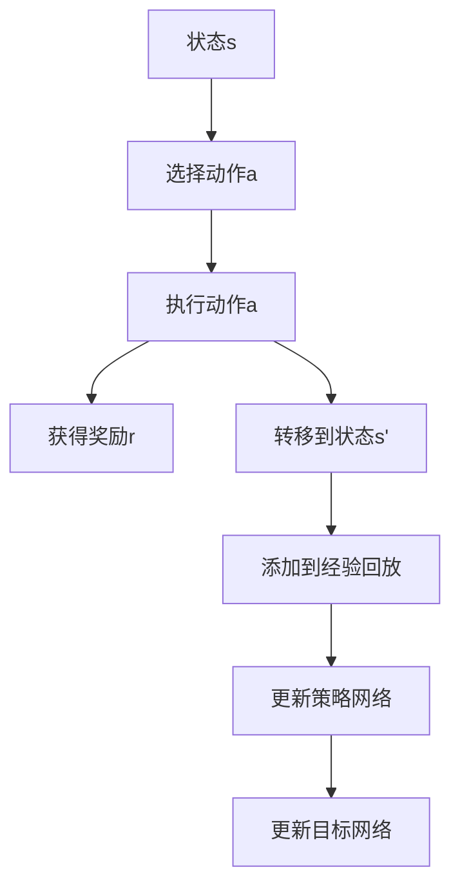
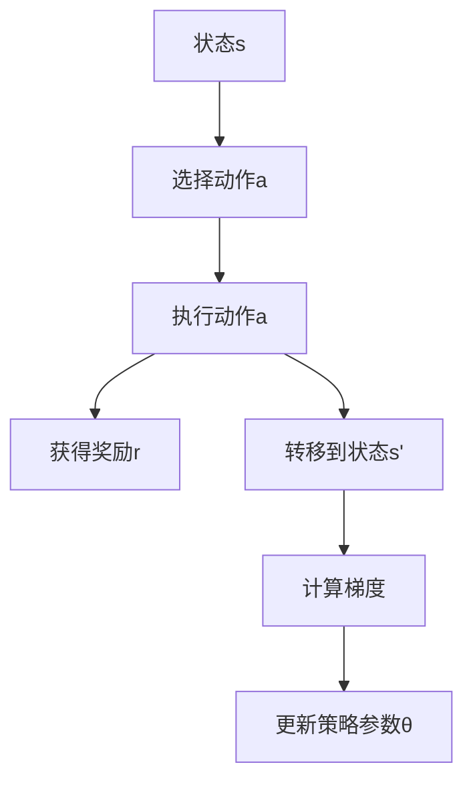
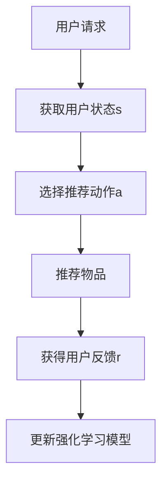
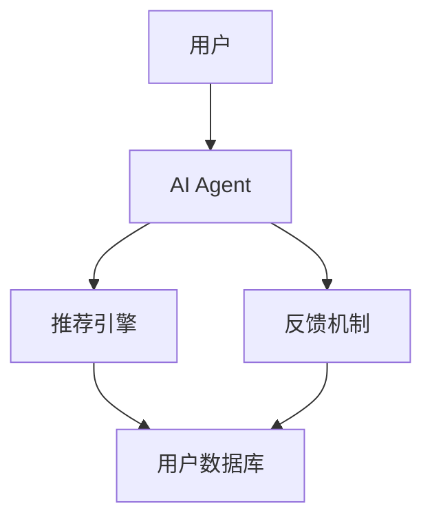
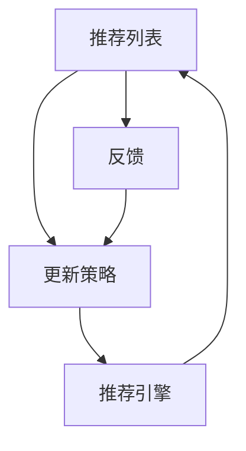

                 


# 强化学习在AI Agent个性化推荐中的应用

## 关键词：强化学习，AI Agent，个性化推荐，推荐系统，深度强化学习

## 摘要：本文探讨了强化学习在AI Agent个性化推荐系统中的应用，分析了强化学习的核心概念与算法原理，结合实际案例，展示了如何利用强化学习提升推荐系统的智能化水平。通过详细的技术分析和系统设计，本文为AI Agent在个性化推荐中的实践提供了深入的见解和指导。

---

# 第一部分: 强化学习与AI Agent基础

## 第1章: 强化学习概述

### 1.1 强化学习的基本概念

#### 1.1.1 强化学习的定义
强化学习是一种机器学习范式，其中智能体通过与环境互动，学习如何采取一系列动作以最大化累积奖励。与监督学习不同，强化学习不需要标记的训练数据，而是通过奖励信号来指导学习过程。

#### 1.1.2 强化学习的核心要素
- **状态（State）**：环境中的当前情况。
- **动作（Action）**：智能体在状态下的行为。
- **奖励（Reward）**：智能体采取某个动作后获得的反馈，用于指导学习。
- **策略（Policy）**：智能体选择动作的规则，通常表示为从状态到动作的映射。
- **值函数（Value Function）**：衡量某个状态或动作的价值，帮助智能体做出决策。

#### 1.1.3 强化学习与监督学习的区别
| 属性           | 监督学习                          | 强化学习                          |
|----------------|-----------------------------------|-----------------------------------|
| 数据类型       | 标签化的数据                      | 环境与奖励信号                     |
| 学习目标       | 模型预测正确标签                  | 模型最大化累积奖励                |
| 互动方式       | 静态数据集                        | 动态与环境互动                     |

### 1.2 AI Agent的基本概念

#### 1.2.1 AI Agent的定义
AI Agent是一种智能实体，能够感知环境并采取行动以实现目标。它可以是一个软件程序或物理设备，具备自主决策的能力。

#### 1.2.2 AI Agent的分类
- **简单反射Agent**：基于当前输入做出简单反应。
- **基于模型的规划Agent**：维护环境模型，进行复杂规划。
- **强化学习Agent**：通过与环境互动学习，优化决策策略。

#### 1.2.3 AI Agent的核心能力
- **感知能力**：通过传感器或数据输入了解环境。
- **决策能力**：基于当前状态选择最优动作。
- **学习能力**：通过经验改进决策策略。

### 1.3 推荐系统的基本概念

#### 1.3.1 推荐系统的定义
推荐系统是一种信息过滤技术，旨在通过分析用户行为和偏好，向用户推荐相关的内容或产品。

#### 1.3.2 推荐系统的类型
- **协同过滤**：基于用户相似性推荐。
- **基于内容的推荐**：基于物品特征推荐。
- **混合推荐**：结合多种推荐方法。

#### 1.3.3 推荐系统的应用场景
- 电子商务：推荐商品。
- 社交媒体：推荐内容。
- 视频平台：推荐节目。

---

## 第2章: 强化学习在AI Agent中的应用

### 2.1 强化学习与AI Agent的结合

#### 2.1.1 强化学习如何赋能AI Agent
通过强化学习，AI Agent能够从与环境的互动中学习，优化决策策略，提高任务执行效率。

#### 2.1.2 AI Agent中的强化学习框架
- **环境建模**：构建模拟环境，定义状态、动作和奖励。
- **策略选择**：选择合适的强化学习算法，如Q-learning或DQN。
- **模型训练**：通过与环境互动，训练模型以最大化累积奖励。

#### 2.1.3 强化学习在AI Agent中的作用
- 提高决策效率。
- 增强环境适应能力。
- 实现自主学习与优化。

### 2.2 强化学习在推荐系统中的应用

#### 2.2.1 强化学习在推荐系统中的优势
- **实时反馈**：通过用户行为获得即时奖励，优化推荐策略。
- **动态适应**：根据环境变化实时调整推荐结果。
- **长期目标**：优化用户的长期满意度，而不仅仅是短期点击率。

#### 2.2.2 强化学习在推荐系统中的挑战
- **环境复杂性**：真实环境复杂，难以建模。
- **探索与利用平衡**：在探索新策略和利用已知好策略之间找到平衡。
- **计算资源需求**：强化学习需要大量计算资源。

#### 2.2.3 强化学习在推荐系统中的未来方向
- 结合生成式AI，提高推荐内容的质量。
- 应用于多目标推荐，满足用户的多样化需求。
- 在边缘计算环境下，实现低延迟的实时推荐。

---

## 第3章: 强化学习的核心概念与原理

### 3.1 强化学习的核心概念

#### 3.1.1 状态（State）
状态表示环境的当前情况，例如用户的行为记录或物品的属性特征。

#### 3.1.2 动作（Action）
动作是AI Agent在给定状态下采取的具体行动，例如推荐某个物品或不推荐。

#### 3.1.3 奖励（Reward）
奖励是对AI Agent动作的反馈，通常是一个标量值，用于指导学习过程。

#### 3.1.4 策略（Policy）
策略定义了在给定状态下选择动作的概率分布，例如，策略函数π(a|s)表示在状态s下选择动作a的概率。

#### 3.1.5 值函数（Value Function）
值函数衡量某个状态或动作的价值，例如，Q(s, a)表示在状态s下采取动作a的期望奖励。

### 3.2 强化学习的基本原理

#### 3.2.1 Q-learning算法

**Q-learning算法步骤：**
1. 初始化Q表为零。
2. 重复以下步骤直到收敛：
   - 选择当前状态s的动作a。
   - 执行动作a，获得奖励r，并转移到新状态s'。
   - 更新Q表：Q(s, a) = Q(s, a) + α(r + γ·max Q(s', a'))。

**Q-learning算法流程图：**

```mermaid
graph TD
    A[状态s] --> B[选择动作a]
    B --> C[执行动作a]
    C --> D[获得奖励r]
    C --> E[转移到状态s']
    E --> F[更新Q(s, a)]
```

#### 3.2.2 Deep Q-Network（DQN）算法

**DQN算法步骤：**
1. 初始化经验回放缓冲区和目标网络。
2. 重复以下步骤直到收敛：
   - 选择当前状态s的动作a。
   - 执行动作a，获得奖励r，并转移到新状态s'。
   - 将(s, a, r, s')添加到经验回放缓冲区。
   - 从缓冲区随机采样一批经验，更新策略网络。
   - 定期更新目标网络。

**DQN算法流程图：**



#### 3.2.3 策略梯度（Policy Gradient）方法

**策略梯度方法步骤：**
1. 初始化策略参数θ。
2. 重复以下步骤直到收敛：
   - 采样状态s。
   - 根据当前策略选择动作a。
   - 执行动作a，获得奖励r，并转移到新状态s'。
   - 计算策略的梯度，并更新θ。

**策略梯度方法流程图：**



### 3.3 强化学习的数学模型

#### 3.3.1 Q-learning的数学公式
$$ Q(s, a) = Q(s, a) + \alpha (r + \gamma \max Q(s', a') - Q(s, a)) $$

其中：
- α是学习率。
- γ是折扣因子。

#### 3.3.2 DQN的数学模型
策略网络和目标网络的更新公式：
$$ \theta_{target} = \theta_{policy} + \epsilon $$

其中：
- ε是软更新系数。

#### 3.3.3 策略梯度方法的数学推导
策略梯度的目标是最优化期望奖励：
$$ J(\theta) = \mathbb{E}_{s,a} [\log \pi(a|s;\theta) \cdot Q(s,a)] $$

其中：
- π(a|s;θ)是策略函数。
- Q(s,a)是值函数。

---

## 第4章: AI Agent的个性化推荐系统设计

### 4.1 个性化推荐的核心要素

#### 4.1.1 用户画像
用户画像包括用户的兴趣、偏好和行为习惯，例如用户的点击、浏览和购买记录。

#### 4.1.2 物品特征
物品特征包括物品的属性，例如商品的类别、价格和评价。

#### 4.1.3 行为序列
行为序列记录用户的交互历史，例如用户的点击流和浏览路径。

### 4.2 强化学习在个性化推荐中的应用

#### 4.2.1 基于强化学习的推荐策略

**基于强化学习的推荐策略流程图：**



---

## 第5章: 强化学习在AI Agent个性化推荐中的系统设计

### 5.1 项目介绍

#### 5.1.1 项目背景
本项目旨在利用强化学习提升推荐系统的个性化推荐能力，通过AI Agent与用户的互动，实时优化推荐策略。

#### 5.1.2 项目目标
实现一个基于强化学习的个性化推荐系统，提升用户体验和推荐效果。

### 5.2 系统功能设计

#### 5.2.1 用户画像模块
- 收集用户的基本信息和行为数据。
- 分析用户的兴趣和偏好。

#### 5.2.2 推荐引擎模块
- 基于强化学习算法，实时生成推荐结果。
- 根据用户反馈调整推荐策略。

#### 5.2.3 反馈机制模块
- 收集用户的点击、评分和购买反馈。
- 更新强化学习模型的奖励机制。

### 5.3 系统架构设计

#### 5.3.1 系统架构图


#### 5.3.2 接口设计
- 用户接口：处理用户的输入和输出。
- 推荐接口：与推荐引擎交互，获取推荐结果。
- 反馈接口：收集用户的反馈信息。

### 5.4 系统交互设计

#### 5.4.1 系统交互流程
1. 用户发出推荐请求。
2. AI Agent根据用户画像生成推荐列表。
3. 用户查看推荐列表并采取行动。
4. 系统收集用户的反馈信息。
5. 强化学习模型根据反馈更新推荐策略。

**系统交互流程图：**



---

## 第6章: 项目实战

### 6.1 环境安装

#### 6.1.1 安装Python
```bash
python --version
```

#### 6.1.2 安装依赖库
```bash
pip install numpy
pip install gym
pip install matplotlib
```

### 6.2 系统核心实现源代码

#### 6.2.1 强化学习算法实现
```python
import numpy as np

class QLearning:
    def __init__(self, state_space, action_space, alpha=0.1, gamma=0.9):
        self.state_space = state_space
        self.action_space = action_space
        self.alpha = alpha
        self.gamma = gamma
        self.Q = np.zeros((state_space, action_space))
    
    def choose_action(self, state, epsilon=0.1):
        if np.random.random() < epsilon:
            return np.random.randint(self.action_space)
        else:
            return np.argmax(self.Q[state, :])
    
    def update_Q(self, state, action, reward, next_state):
        self.Q[state, action] += self.alpha * (reward + self.gamma * np.max(self.Q[next_state, :]) - self.Q[state, action])
```

#### 6.2.2 推荐系统实现
```python
import numpy as np
import gym

class RecommendationSystem:
    def __init__(self, user_states, item_states):
        self.user_states = user_states
        self.item_states = item_states
        self.q_learning = QLearning(user_states, item_states)
    
    def recommend(self, user_state, epsilon=0.1):
        action = self.q_learning.choose_action(user_state, epsilon)
        return action
    
    def update_model(self, user_state, action, reward, next_user_state):
        self.q_learning.update_Q(user_state, action, reward, next_user_state)
```

### 6.3 代码应用解读与分析

#### 6.3.1 强化学习算法实现
- **QLearning类**：实现Q-learning算法，包括状态、动作、奖励和Q表的更新。
- **choose_action方法**：根据ε-greedy策略选择动作。
- **update_Q方法**：更新Q表，优化推荐策略。

#### 6.3.2 推荐系统实现
- **RecommendationSystem类**：封装强化学习算法，实现推荐功能。
- **recommend方法**：根据用户状态推荐动作（即推荐物品）。
- **update_model方法**：根据用户反馈更新强化学习模型。

### 6.4 实际案例分析

#### 6.4.1 案例背景
假设我们有一个电子商务平台，用户可以通过浏览和点击商品，系统根据用户的互动行为推荐商品。

#### 6.4.2 案例分析
1. 用户访问平台，系统获取用户的当前状态（例如，用户最近浏览了电子产品）。
2. AI Agent基于Q-learning算法推荐一个电子产品。
3. 用户点击推荐的商品，系统获得正向奖励。
4. 系统更新Q表，下次推荐类似商品的概率增加。

### 6.5 项目小结
通过强化学习算法，推荐系统能够实时优化推荐策略，根据用户反馈动态调整推荐结果，显著提升了用户体验和推荐效果。

---

## 第7章: 总结与展望

### 7.1 总结
本文详细探讨了强化学习在AI Agent个性化推荐系统中的应用，分析了强化学习的核心概念、算法原理和系统设计，展示了如何通过强化学习提升推荐系统的智能化水平。

### 7.2 展望
未来，随着强化学习和生成式AI的结合，推荐系统将更加智能化和个性化。同时，强化学习在边缘计算和实时推荐中的应用也将进一步拓展。

### 7.3 最佳实践 Tips
- 在实际应用中，建议结合用户反馈机制，持续优化强化学习模型。
- 注意平衡探索与利用，避免陷入局部最优。
- 确保环境模型的准确性和实时性，提升推荐系统的适应能力。

---

通过本文的分析，读者可以全面了解强化学习在AI Agent个性化推荐中的应用，并能够将其应用到实际项目中，提升推荐系统的智能化水平。

