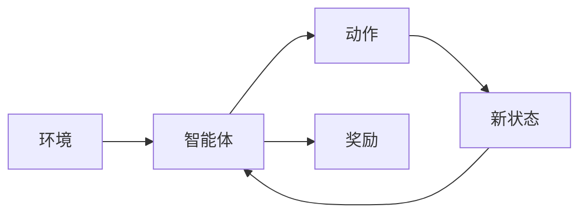
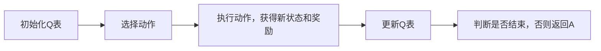
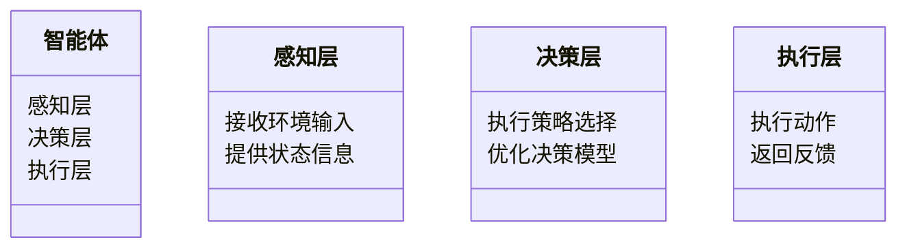

                 


# 强化学习在AI Agent决策中的运用

---

## 关键词：强化学习、AI Agent、决策、马尔可夫决策过程、Q-learning、策略梯度、深度强化学习

---

## 摘要

强化学习是一种通过智能体与环境交互来优化决策策略的机器学习方法。本文深入探讨了强化学习在AI Agent决策中的应用，从基本概念到算法原理，再到实际项目实现，全面解析强化学习如何帮助AI Agent做出最优决策。文章首先介绍了强化学习的核心概念，包括状态、动作、奖励等，然后详细讲解了马尔可夫决策过程（MDP）和主流算法如Q-learning、策略梯度等的数学模型。接着，文章从系统架构角度分析了AI Agent的设计，并通过一个游戏AI的实战案例，展示强化学习的实际应用。最后，文章总结了强化学习的挑战与未来方向，为读者提供了全面的视角和深入的分析。

---

## 第1章：强化学习与AI Agent概述

### 1.1 强化学习的基本概念

#### 1.1.1 什么是强化学习？

强化学习（Reinforcement Learning，RL）是一种机器学习范式，通过智能体（Agent）与环境的交互，智能体通过试错的方式学习策略，以最大化累积奖励。与监督学习和无监督学习不同，强化学习强调实时决策和长期目标的优化。

**图1.1：强化学习的基本流程**



#### 1.1.2 AI Agent的定义与类型

AI Agent是指能够感知环境并采取行动以实现目标的智能实体。根据智能体的智能水平，可以分为简单反射Agent、基于模型的规划Agent和基于学习的Agent。

**表1.1：AI Agent的类型对比**

| 类型                | 特点                                      | 示例场景                          |
|---------------------|-----------------------------------------|----------------------------------|
| 简单反射Agent      | 基于当前状态直接采取行动，无学习能力    | 自动门锁系统                      |
| 基于模型的规划Agent | 基于环境模型进行规划，但不依赖学习       | 工厂自动化控制系统                |
| 基于学习的Agent    | 通过与环境交互学习优化决策策略          | 游戏AI、自动驾驶系统              |

---

### 1.2 强化学习的核心概念

#### 1.2.1 状态、动作、奖励的定义

- **状态（State）**：环境在某一时刻的信息表示，如游戏中的角色位置和生命值。
- **动作（Action）**：智能体在给定状态下选择的行为，如向左移动或攻击。
- **奖励（Reward）**：智能体采取动作后获得的反馈，用于指导学习方向，如得分或扣分。

#### 1.2.2 策略与价值函数的解释

- **策略（Policy）**：智能体在给定状态下选择动作的概率分布，表示为$\pi(a|s)$。
- **价值函数（Value Function）**：评估某个状态或状态-动作对的长期收益，如V(s)和Q(s,a)。

---

## 第2章：强化学习的数学模型

### 2.1 马尔可夫决策过程（MDP）

马尔可夫决策过程是强化学习的核心模型，描述了智能体与环境的交互过程。

#### 2.1.1 MDP的定义

MDP由元组$(S, A, P, R, \gamma)$表示：
- $S$：状态空间
- $A$：动作空间
- $P$：状态转移概率矩阵
- $R$：奖励函数
- $\gamma$：折扣因子，$0 \leq \gamma \leq 1$

#### 2.1.2 Bellman方程

Bellman方程描述了状态的价值函数与其后续状态的关系：

$$
V(s) = \max_{a} \left[ R(s,a) + \gamma \sum_{s'} P(s'|s,a) V(s') \right]
$$

---

### 2.2 Q-learning算法

Q-learning是一种值迭代算法，适用于离线学习。

#### 2.2.1 Q-learing的更新公式

Q-learning通过以下公式更新Q表：

$$
Q(s,a) = Q(s,a) + \alpha \left[ r + \gamma \max Q(s',a') - Q(s,a) \right]
$$

**图2.1：Q-learning算法流程图**



---

## 第3章：强化学习算法实现

### 3.1 值函数方法

值函数方法通过估计状态或状态-动作对的价值来优化策略。

#### 3.1.1 策略评估

策略评估是通过动态规划方法计算当前策略的价值函数：

$$
V_{\pi}(s) = \mathbb{E}[R_t | s_t = s, \pi]
$$

#### 3.1.2 策略迭代

策略迭代通过交替执行策略评估和策略改进来优化策略：

1. 评估当前策略的价值函数。
2. 根据价值函数改进策略，选择最大价值的动作。

---

## 第4章：AI Agent的系统架构设计

### 4.1 系统功能设计

AI Agent系统通常包括感知层、决策层和执行层。

**图4.1：AI Agent系统架构**



---

## 第5章：强化学习项目实战

### 5.1 环境配置与安装

以OpenAI Gym为例，安装并配置强化学习环境：

```bash
pip install gym
```

### 5.2 代码实现

实现一个简单的Q-learning算法，应用于迷宫导航问题。

**代码示例：**

```python
import gym
import numpy as np

# 初始化环境
env = gym.make('Maze-v0')
n_states = env.observation_space.shape[0]
n_actions = env.action_space.n

# 初始化Q表
Q = np.zeros((n_states, n_actions))
alpha = 0.1
gamma = 0.95

# Q-learning算法
for episode in range(1000):
    state = env.reset()
    for _ in range(1000):
        action = np.argmax(Q[state])
        new_state, reward, done, _ = env.step(action)
        Q[state][action] += alpha * (reward + gamma * np.max(Q[new_state]) - Q[state][action])
        state = new_state
        if done:
            break
```

---

## 第6章：强化学习的应用挑战与解决方案

### 6.1 计算资源需求

强化学习通常需要大量计算资源，解决方案包括分布式计算和云加速。

### 6.2 样本效率问题

通过策略重放和目标网络等方法提高样本效率。

---

## 第7章：总结与展望

### 7.1 最佳实践

- 合理选择算法和超参数
- 充分利用现有的框架（如TensorFlow、PyTorch）
- 定期验证和优化模型

### 7.2 未来方向

- 多智能体协同学习
- 强化学习的安全性和伦理问题
- 跨领域应用的深度结合

---

## 附录

### 附录A：强化学习常用工具与框架

- OpenAI Gym
- TensorFlow
- PyTorch
- Gymnasium

### 附录B：推荐学习资源

- 《Hands-On Machine Learning with Scikit-Learn, Keras, and TensorFlow》
- Fast.ai强化学习课程

---

通过本文的详细讲解，读者可以全面了解强化学习在AI Agent决策中的运用，从理论到实践，为深入学习和应用提供坚实的基础。

