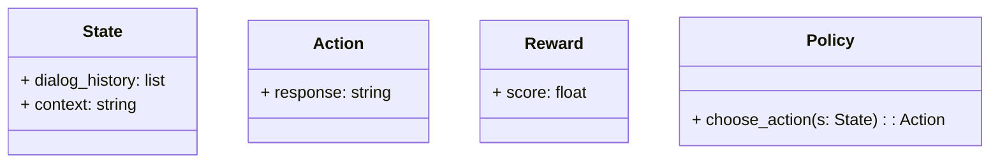

                 


# 强化学习在AI Agent对话生成中的应用

> **关键词**: 强化学习, AI Agent, 对话生成, Q-learning, 深度强化学习, 多轮对话

> **摘要**: 本文深入探讨了强化学习在AI Agent对话生成中的应用，从基础概念到高级算法，详细分析了强化学习如何提升对话生成的智能性和自然性。文章首先介绍了强化学习和AI Agent的基本概念，接着分析了对话生成中的挑战与强化学习的优势。然后，重点讲解了强化学习的核心算法及其在对话生成中的应用，包括Q-learning、深度强化学习等。通过实际案例分析，展示了如何构建基于强化学习的对话生成系统，并探讨了未来的研究方向。

---

# 强化学习在AI Agent对话生成中的应用

## 第1章 强化学习与AI Agent基础

### 1.1 强化学习的定义与核心概念

#### 1.1.1 强化学习的定义
强化学习（Reinforcement Learning, RL）是一种机器学习范式，通过智能体在环境中与环境交互，学习如何采取一系列行动以最大化累计奖励。智能体通过试错机制，逐步优化自己的策略，以达到目标。

#### 1.1.2 强化学习的核心要素
- **状态（State）**: 智能体所处的环境信息。
- **动作（Action）**: 智能体在某一状态下采取的行动。
- **奖励（Reward）**: 系统对智能体行动的反馈，用于评估行动的好坏。
- **策略（Policy）**: 智能体选择动作的概率分布，表示在某一状态下选择动作的策略。
- **值函数（Value Function）**: 表示在某一状态下采取某种策略的期望累积奖励。

#### 1.1.3 AI Agent的基本概念
AI Agent（智能体）是指能够感知环境、做出决策并执行动作的实体。它可以是一个软件程序，也可以是一个物理设备。AI Agent的核心目标是通过与环境交互，完成特定任务。

---

### 1.2 对话生成的背景与挑战

#### 1.2.1 对话生成的定义与应用场景
对话生成是自然语言处理（NLP）中的一个重要任务，旨在让计算机生成自然、连贯且符合上下文的对话内容。应用场景包括智能客服、虚拟助手、聊天机器人等。

#### 1.2.2 对话生成中的主要挑战
- **上下文理解**: 如何理解对话的历史信息并生成连贯的回复。
- **语义多样性**: 如何生成多种可能的回复，避免单一和重复。
- **策略选择**: 如何选择合适的回复策略，以满足用户需求。

#### 1.2.3 强化学习在对话生成中的优势
强化学习通过与环境交互，逐步优化对话生成策略，能够在复杂场景中实现更自然的对话。

---

## 第2章 强化学习的核心概念与数学模型

### 2.1 马尔可夫决策过程（MDP）

#### 2.1.1 状态、动作、奖励的定义
- **状态（s）**: 智能体当前所处的环境信息，如对话历史。
- **动作（a）**: 智能体在某一状态下采取的行动，如生成一句话。
- **奖励（r）**: 系统对智能体动作的反馈，如用户对回复的满意度评分。

#### 2.1.2 策略与值函数的数学表达
- **策略（π）**: 在状态s下选择动作a的概率分布，π(a|s)。
- **值函数（V）**: 表示在状态s下，遵循策略π的期望累积奖励。

#### 2.1.3 动态规划与策略评估
动态规划通过迭代更新值函数，逐步逼近最优策略。策略评估是通过与环境交互，评估当前策略的值函数。

---

### 2.2 强化学习中的策略与奖励机制

#### 2.2.1 策略的分类与比较
- **策略性策略**: 策略是确定性的，如贪心策略。
- **随机性策略**: 策略是概率性的，如基于深度神经网络的策略。

#### 2.2.2 奖励函数的设计原则
- **明确性**: 奖励应明确反映智能体行为的好坏。
- **及时性**: 奖励应及时反馈，以便智能体快速调整策略。
- **一致性**: 奖励应在相同条件下保持一致。

#### 2.2.3 奖励机制对对话生成的影响
奖励机制直接影响智能体的策略优化方向，合理的奖励设计可以提升对话生成的自然性和智能性。

---

### 2.3 值函数与Q-learning算法

#### 2.3.1 Q值的定义与更新公式
Q值表示在状态s下采取动作a后的期望累积奖励。Q-learning算法通过迭代更新Q值，逐步逼近最优策略。

$$ Q(s, a) = Q(s, a) + \alpha [r + \gamma \max Q(s', a') - Q(s, a)] $$

其中，α是学习率，γ是折扣因子。

#### 2.3.2 Q-learning算法的步骤
1. 初始化Q表为零。
2. 在当前状态下选择一个动作。
3. 执行动作，观察奖励和下一个状态。
4. 更新Q表中的对应值。

#### 2.3.3 Q值在对话生成中的应用
Q-learning算法可以用于对话生成中的策略选择，例如选择最合适的回复。

---

## 第3章 强化学习算法的原理与实现

### 3.1 Q-learning算法的实现

#### 3.1.1 算法步骤与伪代码
```python
Initialize Q(s, a) = 0 for all s, a
while True:
    s = get_current_state()
    a = choose_action(s)  # ε-greedy策略
    r = get_reward(s, a)
    s_next = get_next_state(s, a)
    Q(s, a) = Q(s, a) + α * (r + γ * max Q(s_next, a') - Q(s, a))
```

#### 3.1.2 Q值更新的数学公式
$$ Q(s, a) = Q(s, a) + \alpha (r + \gamma \max Q(s', a') - Q(s, a)) $$

#### 3.1.3 Q-learning在对话生成中的应用案例
通过Q-learning算法，智能体可以学习如何在对话中选择最优的回复。

---

### 3.2 Deep Q-Network（DQN）算法

#### 3.2.1 DQN算法的原理
DQN通过深度神经网络近似Q值函数，解决高维状态空间的问题。

#### 3.2.2 DQN的网络结构与训练
- **动作值网络**: 输入状态，输出动作值。
- **目标网络**: 用于稳定训练。

#### 3.2.3 DQN在对话生成中的应用
DQN可以用于复杂的对话生成任务，如多轮对话。

---

### 3.3 Actor-Critic算法

#### 3.3.1 Actor-Critic算法的原理
Actor-Critic算法同时优化策略和价值函数，通过Actor网络选择动作，Critic网络评估策略。

#### 3.3.2 Actor与Critic的网络结构
- **Actor网络**: 输入状态，输出动作的概率分布。
- **Critic网络**: 输入状态，输出Q值。

#### 3.3.3 Actor-Critic在对话生成中的应用
Actor-Critic算法适用于复杂的对话生成场景，能够实现更高效的策略优化。

---

## 第4章 强化学习在对话生成中的应用

### 4.1 对话生成的强化学习模型

#### 4.1.1 端到端对话生成模型
- **Seq2Seq模型**: 通过编码器-解码器结构生成回复。
- **增强的Seq2Seq模型**: 结合强化学习优化回复。

#### 4.1.2 基于策略的对话生成模型
- **策略网络**: 直接生成回复，无需Q值函数。

#### 4.1.3 多轮对话中的记忆机制
- **记忆网络**: 通过记忆模块记录对话历史。

---

## 第5章 系统设计与架构

### 5.1 系统功能设计

#### 5.1.1 领域模型


#### 5.1.2 系统架构
```mermaid
graph TD
    A[AI Agent] -> B[对话生成模块]
    B -> C[强化学习模块]
    C -> D[奖励机制]
    C -> E[记忆模块]
```

---

## 第6章 项目实战

### 6.1 环境搭建

#### 6.1.1 安装依赖
```bash
pip install numpy tensorflow matplotlib
```

#### 6.1.2 定义对话环境
```python
class DialogueEnvironment:
    def __init__(self):
        self.dialog_history = []
```

---

## 第7章 总结与展望

### 7.1 本章小结
本文详细探讨了强化学习在AI Agent对话生成中的应用，从算法原理到系统实现，全面分析了强化学习的优势与挑战。

### 7.2 未来研究方向
- **多模态对话**: 结合视觉、听觉等多模态信息。
- **个性化生成**: 根据用户偏好定制回复。

### 7.3 最佳实践 tips
- 合理设计奖励机制，提升对话生成质量。
- 选择合适的算法框架，优化系统性能。

---

以上是一个详细的技术博客文章目录大纲，涵盖了强化学习在AI Agent对话生成中的各个方面。

