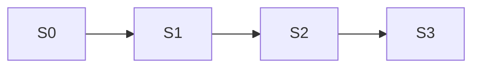
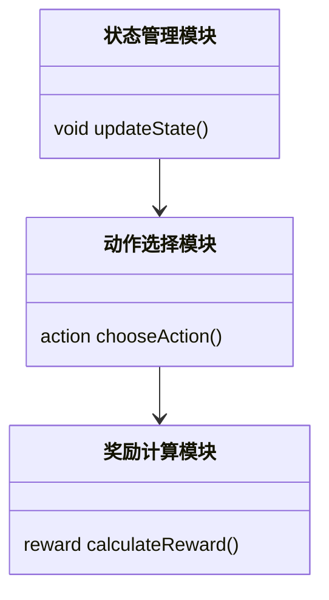

                 

# 强化学习在AI Agent对话策略中的应用

> 关键词：强化学习，AI Agent，对话策略，马尔可夫决策过程，策略梯度，对话树

> 摘要：本文深入探讨了强化学习在AI Agent对话策略中的应用，从理论基础到实际实现，系统地分析了如何利用强化学习优化对话策略。文章首先介绍了强化学习和对话策略的基本概念，然后详细阐述了强化学习的核心算法及其在对话策略中的应用。接着，通过具体案例分析，展示了如何将强化学习应用于实际对话系统设计中。最后，总结了当前的研究成果，并展望了未来的发展方向。

---

## 第1章: 强化学习与AI Agent对话策略概述

### 1.1 强化学习的基本概念

#### 1.1.1 强化学习的定义
强化学习（Reinforcement Learning，RL）是一种机器学习范式，通过智能体与环境的交互，逐步优化策略以最大化累计奖励。与监督学习不同，强化学习不依赖于标注数据，而是通过试错机制学习最优行为。

$$
\text{奖励} = f(\text{智能体动作}, \text{环境状态})
$$

#### 1.1.2 AI Agent的基本概念
AI Agent（智能体）是能够感知环境并采取行动以实现目标的实体。在对话系统中，AI Agent通常表现为对话机器人，能够理解用户输入并生成适当的回复。

#### 1.1.3 强化学习在对话策略中的应用背景
对话策略是AI Agent的核心，决定了其在对话中的行为选择。传统的基于规则或统计的对话策略存在局限性，而强化学习通过试错优化，能够处理复杂多变的对话场景。

### 1.2 对话策略的核心问题

#### 1.2.1 对话策略的定义与分类
对话策略是指AI Agent在对话过程中选择回复的规则或模型。常见分类包括基于规则、统计和深度学习的策略。

#### 1.2.2 强化学习在对话策略中的作用
强化学习能够动态优化对话策略，适应不同用户需求和对话情境。

#### 1.2.3 对话策略的挑战与解决方案
对话策略的挑战包括多轮对话中的状态跟踪和不确定性处理。强化学习通过建模状态和奖励，有效解决这些问题。

### 1.3 本章小结
本章介绍了强化学习和AI Agent的基本概念，以及强化学习在对话策略中的应用背景，为后续章节奠定了基础。

---

## 第2章: 强化学习的理论基础

### 2.1 马尔可夫决策过程

#### 2.1.1 状态空间的定义
状态空间描述了环境的所有可能状态。在对话系统中，状态可能包括对话历史和当前意图。

$$
s \in S
$$

#### 2.1.2 动作空间的定义
动作空间是智能体在状态$s$下可执行的所有动作。

$$
a \in A(s)
$$

#### 2.1.3 奖励函数的设计
奖励函数定义了智能体在状态$s$下执行动作$a$后获得的奖励$r$。

$$
r = R(s, a)
$$

#### 2.1.4 状态转移概率的计算
状态转移概率$P(s' | s, a)$描述了从状态$s$执行动作$a$后转移到状态$s'$的概率。

### 2.2 策略与价值函数

#### 2.2.1 策略的定义与分类
策略$\pi(a|s)$定义了智能体在状态$s$下选择动作$a$的概率。策略可以是随机或确定的。

#### 2.2.2 价值函数的定义与计算
价值函数$V(s)$表示从状态$s$开始的期望累计奖励。

$$
V(s) = \max_a Q(s, a)
$$

#### 2.2.3 策略梯度的概念
策略梯度方法通过优化策略的参数，直接最大化奖励函数。

$$
\nabla J(\theta) = \mathbb{E}[ \nabla \log \pi(a|s, \theta) \cdot Q(s, a)]
$$

### 2.3 强化学习算法的分类

#### 2.3.1 Q-learning算法
Q-learning通过更新Q值表学习最优策略。

$$
Q(s, a) \leftarrow Q(s, a) + \alpha [r + \gamma \max Q(s', a') - Q(s, a)]
$$

#### 2.3.2 Deep Q-Networks (DQN)算法
DQN使用深度神经网络近似Q值函数。

#### 2.3.3 Policy Gradient方法
策略梯度通过优化策略的参数，直接更新策略。

#### 2.3.4 Actor-Critic方法
Actor-Critic结合了策略和价值函数的更新。

### 2.4 本章小结
本章详细介绍了强化学习的理论基础，包括马尔可夫决策过程、策略和价值函数，以及常见强化学习算法的分类。

---

## 第3章: 对话策略的建模与强化学习结合

### 3.1 对话策略的分类

#### 3.1.1 基于规则的对话策略
基于预定义的规则生成回复，适用于简单对话场景。

#### 3.1.2 基于统计的对话策略
基于历史数据统计生成回复，如语言模型。

#### 3.1.3 基于深度学习的对话策略
利用深度神经网络建模对话过程，如循环神经网络（RNN）和Transformer。

### 3.2 对话策略的数学建模

#### 3.2.1 对话树的构建
对话树将对话过程表示为一棵树，节点表示状态，边表示动作。

#### 3.2.2 对话状态的表示
状态可以表示为向量或符号，如词袋模型或词嵌入。

#### 3.2.3 对话动作的选择
动作是生成回复，基于当前状态和策略。

### 3.3 强化学习在对话策略中的应用

#### 3.3.1 强化学习与对话策略的结合点
强化学习通过试错优化回复策略。

#### 3.3.2 对话策略的优化目标
最大化累计奖励，如用户满意度和对话流畅度。

#### 3.3.3 对话策略的评估指标
包括回复准确率、用户满意度和对话成功率。

### 3.4 本章小结
本章探讨了对话策略的分类和建模方法，以及强化学习在对话策略中的应用。

---

## 第4章: 强化学习算法在对话策略中的实现

### 4.1 状态-动作-奖励的建模

#### 4.1.1 状态空间的构建
将对话历史和用户意图转化为状态向量。

#### 4.1.2 动作空间的定义
定义可能的回复动作。

#### 4.1.3 奖励函数的设计
根据对话结果设计奖励函数，如用户反馈和对话长度。

### 4.2 强化学习算法的实现

#### 4.2.1 Q-learning算法实现
使用Q值表记录状态-动作对的奖励。

#### 4.2.2 DQN算法实现
使用深度神经网络近似Q值函数，避免经验重放。

#### 4.2.3 策略梯度算法实现
优化策略参数，直接更新策略。

### 4.3 对话策略的优化

#### 4.3.1 动态策略更新
根据对话反馈实时更新策略。

#### 4.3.2 奖励机制设计
设计合理的奖励函数，引导策略优化。

#### 4.3.3 状态表示优化
改进状态表示，提高策略学习效率。

### 4.4 本章小结
本章详细讲解了强化学习算法在对话策略中的实现，包括状态-动作-奖励建模和算法实现。

---

## 第5章: 对话系统设计与强化学习结合

### 5.1 对话系统的架构设计

#### 5.1.1 对话系统的模块划分
包括输入处理、策略选择和输出生成模块。

#### 5.1.2 对话系统的工作流程
用户输入 -> 状态管理 -> 动作选择 -> 输出回复 -> 奖励计算。

### 5.2 对话系统的实现

#### 5.2.1 环境搭建
安装必要的库，如TensorFlow和Keras。

#### 5.2.2 对话策略实现
定义策略函数，如Q函数或策略网络。

#### 5.2.3 模型训练
使用强化学习算法训练模型，优化对话策略。

### 5.3 对话系统的优化

#### 5.3.1 策略优化
通过经验回放和策略迭代优化策略。

#### 5.3.2 系统性能优化
改进算法效率和系统架构，提升对话速度。

### 5.4 本章小结
本章探讨了对话系统的架构设计和强化学习的结合，展示了如何实现高效的对话系统。

---

## 第6章: 强化学习在对话策略中的项目实战

### 6.1 项目背景与目标
设计一个基于强化学习的对话系统，优化对话策略。

### 6.2 项目环境安装
安装必要的库，如TensorFlow和Keras。

### 6.3 项目核心实现

#### 6.3.1 环境定义
定义对话环境，包括状态、动作和奖励。

#### 6.3.2 策略网络实现
使用深度神经网络实现策略函数。

#### 6.3.3 训练过程
通过强化学习算法训练模型，优化策略。

### 6.4 项目小结
本章通过实际项目展示了强化学习在对话策略中的应用，提供了从环境搭建到模型训练的详细步骤。

---

## 第7章: 强化学习在对话策略中的未来研究方向

### 7.1 当前研究成果总结
总结强化学习在对话策略中的应用现状。

### 7.2 未来研究方向
包括多模态对话、跨领域对话和自适应对话策略的研究。

### 7.3 注意事项与最佳实践
在实际应用中，注意数据多样性和算法效率。

### 7.4 本章小结
本章展望了强化学习在对话策略中的未来发展方向，提供了研究和实践的参考。

---

## 参考文献

（此处列出相关的学术论文、技术报告和书籍）

---

通过以上思考步骤，我们系统地构建了一篇关于强化学习在AI Agent对话策略中的应用的技术博客文章。文章从理论基础到实际应用，详细讲解了强化学习在对话策略中的各个方面，为读者提供了全面的知识体系。

