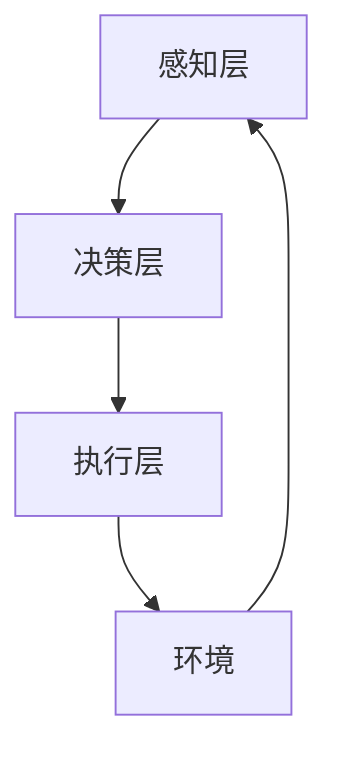

                 


# 强化学习在AI Agent开发中的应用

> 关键词：强化学习, AI Agent, 算法原理, 系统架构, 项目实战

> 摘要：本文系统地探讨了强化学习在AI Agent开发中的应用，从基础概念到高级算法，再到实际项目，全面解析强化学习如何助力AI Agent的智能化发展。通过详细分析Q-learning和DQN算法，结合实际案例，展示如何在复杂环境中设计和实现高效的AI Agent系统。

---

## 第一部分: 强化学习与AI Agent开发基础

### 第1章: 强化学习概述

#### 1.1 强化学习的定义与核心概念

**1.1.1 什么是强化学习**

强化学习（Reinforcement Learning, RL）是一种机器学习范式，通过智能体与环境交互，学习如何采取一系列行动以最大化累计奖励。与监督学习和无监督学习不同，强化学习依赖于智能体与环境的动态交互，通过试错机制优化策略。

$$
\text{强化学习的目标：} \quad \max_{\pi} \mathbb{E}[R_t]
$$

**1.1.2 强化学习的核心要素**

- **状态（State）**：环境在某一时刻的观测。
- **动作（Action）**：智能体采取的行为。
- **奖励（Reward）**：环境对智能体行为的反馈，指导智能体学习目标。
- **策略（Policy）**：智能体选择动作的概率分布函数。
- **值函数（Value Function）**：衡量某状态下采取某动作的价值。

**1.1.3 强化学习与监督学习、无监督学习的对比**

| 对比维度       | 监督学习                     | 无监督学习                   | 强化学习                   |
|----------------|-----------------------------|-------------------------------|---------------------------|
| 数据类型       | 标签数据                   | 未标记数据                 | 环境反馈（奖励）           |
| 任务目标       | 分类或回归                  | 聚类或降维                   | 最大化累计奖励             |
| 交互方式       | 静态数据                   | 静态数据                   | 动态交互                   |

#### 1.2 强化学习的发展历程

**1.2.1 强化学习的起源**

强化学习的概念可以追溯到20世纪50年代，马尔可夫决策过程（MDP）的提出奠定了强化学习的理论基础。

**1.2.2 强化学习的演进与应用**

从简单的策略梯度算法到深度强化学习（Deep RL），强化学习在游戏、机器人控制、自然语言处理等领域取得了显著进展。

**1.2.3 当前强化学习的研究热点**

- 多智能体协作
- 离线强化学习
- 强化学习的安全性

#### 1.3 AI Agent的基本概念

**1.3.1 什么是AI Agent**

AI Agent是一种智能实体，能够感知环境、做出决策并执行动作，以实现特定目标。

**1.3.2 AI Agent的分类与特点**

| 分类         | 特点                       |
|--------------|----------------------------|
| 反应式Agent  | 基于当前感知做出反应         |
| 计划式Agent  | 基于规划和推理进行决策       |
| 学习式Agent  | 通过学习优化行为             |

**1.3.3 AI Agent与强化学习的关系**

强化学习为AI Agent提供了一种通过试错优化行为的机制，使得Agent能够在复杂环境中自主决策。

---

## 第2章: 强化学习的核心算法

### 2.1 Q-learning算法

**2.1.1 Q-learning的基本原理**

Q-learning是一种经典的值函数方法，通过更新Q表（Q-value table）来学习最优策略。

$$
Q(s, a) \leftarrow Q(s, a) + \alpha \left( r + \max_{a'} Q(s', a') - Q(s, a) \right)
$$

**2.1.2 Q-learning的数学模型**

- 状态转移：$s' = P(s, a)$
- 奖励：$r = R(s, a, s')$
- Q值更新：$Q(s, a) = Q(s, a) + \alpha (r + \gamma \max Q(s', a') - Q(s, a))$

**2.1.3 Q-learning的优缺点**

- 优点：简单易实现，适合离线学习。
- 缺点：依赖于状态空间的离散化，难以处理高维连续状态。

**2.2 Deep Q-Network (DQN)算法**

**2.2.1 DQN算法的提出**

为了解决高维状态空间的问题，DQN引入深度神经网络近似Q值函数。

**2.2.2 DQN算法的工作流程**

1. 环境返回当前状态$s$。
2. 神经网络输出Q值$Q(s, a)$。
3. 选择动作$a$，执行并得到奖励$r$和新状态$s'$。
4. 更新记忆库：将$(s, a, r, s')$存入经验回放池。
5. 采样经验回放池中的样本，更新神经网络参数。

**2.2.3 DQN算法的数学公式**

- 状态值预测：$\hat{Q}(s, a) = y_t = r + \gamma \max Q(s', a')$
- 损失函数：$\mathcal{L} = \mathbb{E}[(y_t - Q(s, a))^2]$

**2.3 算法对比与选择**

| 算法   | 适用场景           | 优缺点                     |
|--------|--------------------|---------------------------|
| Q-learning | 离散状态空间       | 简单但不适用于高维问题     |
| DQN     | 连续状态空间       | 复杂但适用于复杂环境       |

---

## 第3章: AI Agent的设计与实现

### 3.1 AI Agent的任务建模

**3.1.1 任务建模的基本原则**

任务建模需要明确目标、状态、动作和奖励机制。

**3.1.2 任务建模的步骤与方法**

1. 明确任务目标。
2. 确定状态和动作空间。
3. 设计奖励函数。
4. 建立环境模型。

**3.1.3 任务建模的案例分析**

以智能客服为例，设计状态、动作和奖励函数。

### 3.2 状态表示与动作空间

**3.2.1 状态表示的定义**

状态表示需要简洁且包含足够信息。

**3.2.2 动作空间的设计**

动作空间的设计需要考虑可行性和多样性。

**3.2.3 状态与动作的转换关系**

通过状态转移矩阵描述状态与动作的映射关系。

### 3.3 奖励机制的设计

**3.3.1 奖励机制的基本原理**

奖励机制指导智能体的学习方向。

**3.3.2 奖励机制的设计原则**

- 明确性：奖励应清晰指导行为。
- 可行性：奖励应可实现。
- 一致性：奖励应与任务目标一致。

**3.3.3 奖励机制的案例分析**

以游戏AI为例，设计多层次奖励机制。

---

## 第4章: 系统架构设计与实现

### 4.1 系统架构设计

**4.1.1 系统架构概述**

AI Agent系统通常包括感知层、决策层和执行层。

**4.1.2 系统架构的模块划分**

- 感知层：负责环境感知。
- 决策层：负责策略选择。
- 执行层：负责动作执行。

**4.1.3 系统架构的流程图**



---

## 第5章: 项目实战与实现

### 5.1 项目背景与需求分析

**5.1.1 项目背景**

选择智能客服系统作为案例。

**5.1.2 项目需求**

设计一个能够处理客户咨询的智能客服系统。

### 5.2 项目核心实现

**5.2.1 环境搭建**

- 安装Python和相关库（如TensorFlow、OpenAI Gym）。
- 配置开发环境。

**5.2.2 核心代码实现**

```python
import gym
from gym import spaces
from gym.utils import seeding

class AI-Agent(gym.Env):
    def __init__(self):
        # 初始化环境
        self.env = gym.make('CartPole-v0')
        self.done = False

    def reset(self):
        return self.env.reset()

    def step(self, action):
        state, reward, done, info = self.env.step(action)
        return state, reward, done, info
```

**5.2.3 系统测试**

- 测试动作空间和状态空间。
- 验证奖励机制。

### 5.3 项目小结

总结项目实现的关键点和经验教训。

---

## 第6章: 强化学习的高级主题

### 6.1 多智能体协作

**6.1.1 多智能体协作的定义**

多个智能体协同完成任务。

**6.1.2 多智能体协作的挑战**

- 协作机制设计。
- 状态空间爆炸。

### 6.2 离线强化学习

**6.2.1 离线强化学习的定义**

基于历史数据进行学习。

**6.2.2 离线强化学习的优势**

- 数据利用充分。
- 避免在线交互风险。

### 6.3 强化学习的研究热点

- 元强化学习（Meta-RL）。
- 强化学习的安全性。

---

## 第7章: 强化学习的未来展望

### 7.1 强化学习在AI Agent中的潜力

**7.1.1 新兴技术的推动**

如大语言模型（LLM）与强化学习的结合。

**7.1.2 应用场景的扩展**

从游戏到机器人、自动驾驶等。

### 7.2 强化学习的发展趋势

- 更高效的学习算法。
- 更强的泛化能力。

---

## 参考文献

- Sutton, R. S., & Barto, A. G. (2018). Introduction to reinforcement learning.
- Mnih, V., et al. (2015). Human-level control through deep reinforcement learning.

---

通过以上章节的详细分析，本文系统地探讨了强化学习在AI Agent开发中的应用，从基础概念到高级算法，再到实际项目，全面解析强化学习如何助力AI Agent的智能化发展。通过详细分析Q-learning和DQN算法，结合实际案例，展示如何在复杂环境中设计和实现高效的AI Agent系统。

