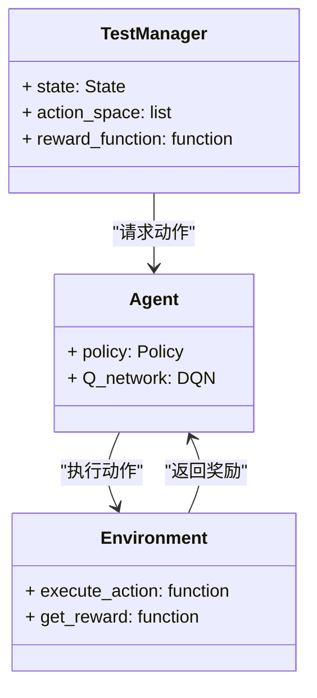
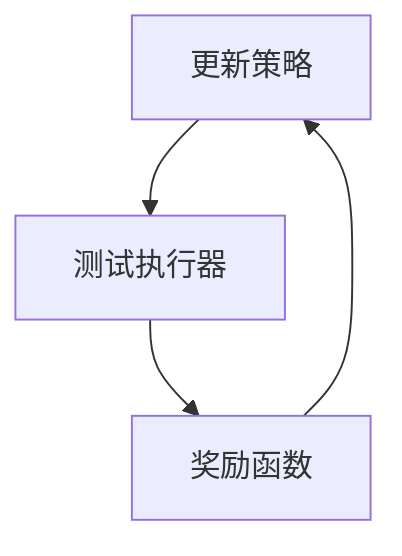

                 


# 强化学习在AI Agent自动化测试中的应用

> 关键词：强化学习、AI Agent、自动化测试、机器学习、测试优化

> 摘要：本文探讨了强化学习在AI Agent自动化测试中的应用，涵盖强化学习的基本概念、AI Agent的原理、强化学习算法在测试中的具体应用，以及实际项目中的实现细节和案例分析。通过理论与实践的结合，本文展示了如何利用强化学习提升自动化测试的效率和效果。

---

# 第1章 强化学习与AI Agent的基本概念

## 1.1 强化学习的定义与特点

### 1.1.1 强化学习的定义
强化学习（Reinforcement Learning，RL）是一种机器学习范式，通过智能体与环境的交互，学习最优策略以最大化累积奖励。与监督学习不同，强化学习不需要明确的标签数据，而是通过试错和奖励/惩罚机制来优化决策过程。

### 1.1.2 强化学习的核心特点
- **试错性**：智能体通过不断尝试动作，逐步逼近最优策略。
- **延迟奖励**：奖励可能在多个动作之后才给出，需要智能体具备记忆能力。
- **策略优化**：目标是找到最优策略，即在给定状态下选择最佳动作。

### 1.1.3 强化学习与监督学习的区别
| 特性         | 监督学习                      | 强化学习                      |
|--------------|------------------------------|-------------------------------|
| 数据类型     | 标签数据（已知正确答案）       | 状态、动作、奖励（反馈信号）    |
| 目标         | 最小化预测误差                | 最大化累积奖励                 |
| 决策依据     | 确定性规则                   | 动态环境中的最优策略           |

## 1.2 AI Agent的基本概念

### 1.2.1 AI Agent的定义
AI Agent（人工智能代理）是指能够感知环境、自主决策并执行任务的智能实体。它可以是一个软件程序或物理设备，通过传感器获取信息，并通过执行器与环境交互。

### 1.2.2 AI Agent的核心功能
- **感知**：通过传感器获取环境信息。
- **决策**：基于当前状态和历史经验，选择最优动作。
- **执行**：通过执行器将决策转化为具体操作。
- **学习**：通过强化学习等方法优化决策策略。

### 1.2.3 AI Agent的分类
- **基于知识的AI Agent**：依赖预定义的知识库进行决策。
- **基于模型的AI Agent**：使用环境模型进行预测和规划。
- **无模型的AI Agent**：直接通过试错学习策略。

## 1.3 强化学习在AI Agent中的应用

### 1.3.1 强化学习在AI Agent中的作用
强化学习为AI Agent提供了自适应决策的能力，使其能够根据环境反馈动态调整策略，从而在复杂和动态变化的环境中表现出色。

### 1.3.2 强化学习与AI Agent的结合方式
- **状态定义**：将环境状态转化为强化学习的状态空间。
- **动作选择**：AI Agent根据当前状态选择最优动作。
- **奖励机制**：通过设计奖励函数引导AI Agent的学习方向。

### 1.3.3 强化学习在AI Agent测试中的优势
- **自适应性**：能够根据测试结果动态调整测试策略。
- **高效性**：通过强化学习优化测试路径，减少冗余测试。
- **智能性**：能够识别和处理复杂测试场景中的不确定性。

---

# 第2章 强化学习的基本原理

## 2.1 马尔可夫决策过程

### 2.1.1 状态空间的定义
状态空间是指所有可能的状态集合，每个状态代表环境的一个可能配置。例如，在自动化测试中，状态可以是测试用例的执行进度或系统响应的状态。

### 2.1.2 动作空间的定义
动作空间是指智能体在给定状态下可以执行的所有可能动作。例如，在测试中，动作可以是点击按钮、输入数据或导航到某个页面。

### 2.1.3 奖励函数的设计
奖励函数定义了智能体在执行动作后获得的奖励值，用于指导智能体的学习方向。例如，成功完成测试用例可以得到正奖励，测试失败则得到负奖励。

### 2.1.4 策略的定义
策略是指智能体在给定状态下选择动作的概率分布。例如，策略可以是贪心策略或ε-贪心策略。

## 2.2 Q-learning算法

### 2.2.1 Q-learning的基本原理
Q-learning是一种经典的强化学习算法，通过维护一个Q表来记录状态-动作对的价值。智能体通过与环境交互，不断更新Q表以逼近最优策略。

### 2.2.2 Q-learning的更新公式
$$ Q(s, a) = Q(s, a) + \alpha \left( r + \gamma \max_{a'} Q(s', a') - Q(s, a) \right) $$
其中，$\alpha$ 是学习率，$\gamma$ 是折扣因子。

### 2.2.3 Q-learning的收敛性分析
Q-learning在离散状态和动作空间下，可以在有限步数内收敛到最优策略。

## 2.3 策略梯度方法

### 2.3.1 策略梯度的基本原理
策略梯度方法通过直接优化策略参数，最大化累积奖励。例如，使用梯度上升算法更新策略参数。

### 2.3.2 策略梯度的优化方法
- **梯度上升**：通过计算策略的梯度，逐步更新参数。
- **策略评估**：在给定策略下评估累积奖励。

### 2.3.3 策略梯度的应用场景
策略梯度适用于状态空间和动作空间连续的情况，例如在复杂的测试环境中优化测试路径。

---

# 第3章 AI Agent的强化学习模型

## 3.1 DQN算法原理

### 3.1.1 DQN算法结构
DQN（Deep Q-Network）结合了深度神经网络和Q-learning算法，通过两个网络（主网络和目标网络）来近似Q函数。

### 3.1.2 DQN的数学模型
状态经过神经网络处理后，输出每个动作的Q值：
$$ Q(s, a) = \theta \cdot \phi(s, a) $$
其中，$\theta$ 是网络参数，$\phi(s, a)$ 是状态动作对的特征表示。

### 3.1.3 DQN的代码实现
```python
class DQN:
    def __init__(self, state_space, action_space):
        self.state_space = state_space
        self.action_space = action_space
        self.model = self.build_model()
        self.target_model = self.build_model()
    
    def build_model(self):
        # 构建神经网络模型
        pass
    
    def act(self, state):
        # 根据当前状态选择动作
        pass
    
    def remember(self, experience):
        # 存储经验
        pass
    
    def replay(self, batch_size):
        # 从经验池中随机采样进行训练
        pass
```

### 3.1.4 DQN的训练过程
1. 环境感知：智能体接收当前状态。
2. 动作选择：根据当前状态选择动作。
3. 执行动作：执行动作并观察新的状态和奖励。
4. 记忆经验：将经验存储在记忆池中。
5. 回放经验：随机采样经验进行网络训练。

---

# 第4章 系统分析与架构设计

## 4.1 测试场景分析

### 4.1.1 功能测试
- 状态空间：测试用例的状态，例如测试步骤的执行进度。
- 动作空间：测试用例的执行动作，例如点击按钮或输入数据。

### 4.1.2 性能测试
- 状态空间：系统性能指标，例如响应时间。
- 动作空间：调整系统负载或配置。

### 4.1.3 回归测试
- 状态空间：测试用例的变更情况。
- 动作空间：选择测试用例进行执行。

## 4.2 领域模型设计

### 4.2.1 类图设计


### 4.2.2 系统架构设计


---

# 第5章 项目实战

## 5.1 环境搭建

### 5.1.1 安装依赖
- Python 3.8+
- TensorFlow 2.0+
- Gym库或其他强化学习框架。

### 5.1.2 环境配置
```bash
pip install gym numpy tensorflow
```

## 5.2 AI Agent实现

### 5.2.1 DQN类实现
```python
import numpy as np
import tensorflow as tf

class DQN:
    def __init__(self, state_size, action_size):
        self.state_size = state_size
        self.action_size = action_size
        self.gamma = 0.99
        self.epsilon = 0.1
        self.epsilon_min = 0.01
        self.epsilon_decay = 0.995
        self.batch_size = 64
        self.model = self.build_model()
        self.target_model = self.build_model()
    
    def build_model(self):
        model = tf.keras.Sequential([
            tf.keras.layers.Dense(32, activation='relu', input_dim=self.state_size),
            tf.keras.layers.Dense(self.action_size, activation='linear')
        ])
        model.compile(optimizer='adam', loss='mse')
        return model
    
    def act(self, state):
        if np.random.random() < self.epsilon:
            return np.random.randint(self.action_size)
        q_values = self.model.predict(state)
        return np.argmax(q_values[0])
    
    def remember(self, experience):
        self.memory.append(experience)
    
    def replay(self):
        if len(self.memory) < self.batch_size:
            return
        minibatch = np.random.choice(self.memory, self.batch_size)
        # 提取状态、动作、奖励、下一步状态
        # 更新Q值
```

### 5.2.2 训练过程
```python
agent = DQN(state_size, action_size)
for episode in range(1000):
    state = env.reset()
    while not done:
        action = agent.act(state)
        next_state, reward, done = env.step(action)
        agent.remember((state, action, reward, next_state))
        agent.replay()
        state = next_state
```

## 5.3 实验结果与分析

### 5.3.1 训练曲线
展示训练过程中奖励的变化情况，观察是否收敛。

### 5.3.2 测试覆盖率
比较传统测试方法与强化学习方法在测试覆盖率上的差异。

---

# 第6章 最佳实践与总结

## 6.1 最佳实践
- **状态空间设计**：合理简化状态空间，避免过于复杂。
- **奖励机制设计**：确保奖励能够有效引导学习方向。
- **参数调优**：根据具体问题调整学习率、折扣因子等参数。

## 6.2 小结
本文详细探讨了强化学习在AI Agent自动化测试中的应用，从理论到实践，展示了如何利用强化学习提升测试效率和效果。通过具体案例分析，验证了强化学习在测试优化中的潜力。

## 6.3 注意事项
- 确保测试环境的稳定性和一致性。
- 定期监控和维护测试策略，防止过时。

## 6.4 拓展阅读
- 推荐阅读《Hands-On Machine Learning with Scikit-Learn, Keras, and TensorFlow》一书，深入理解强化学习的实现细节。

---

通过本文的系统分析和实践案例，读者可以全面理解强化学习在AI Agent自动化测试中的应用，并将其应用于实际项目中，提升测试效率和质量。

