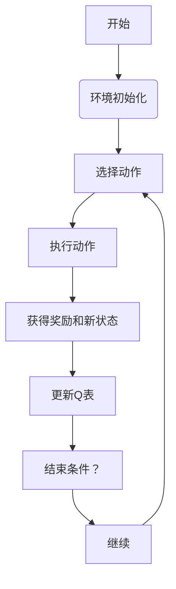
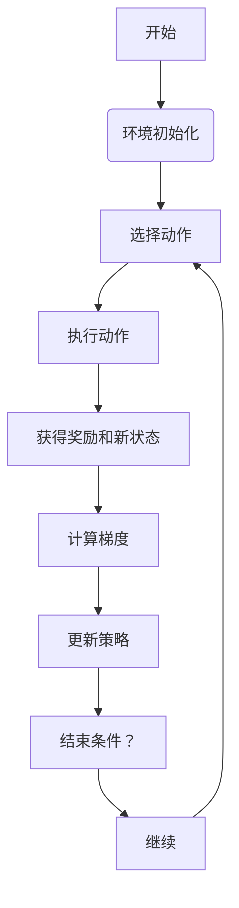
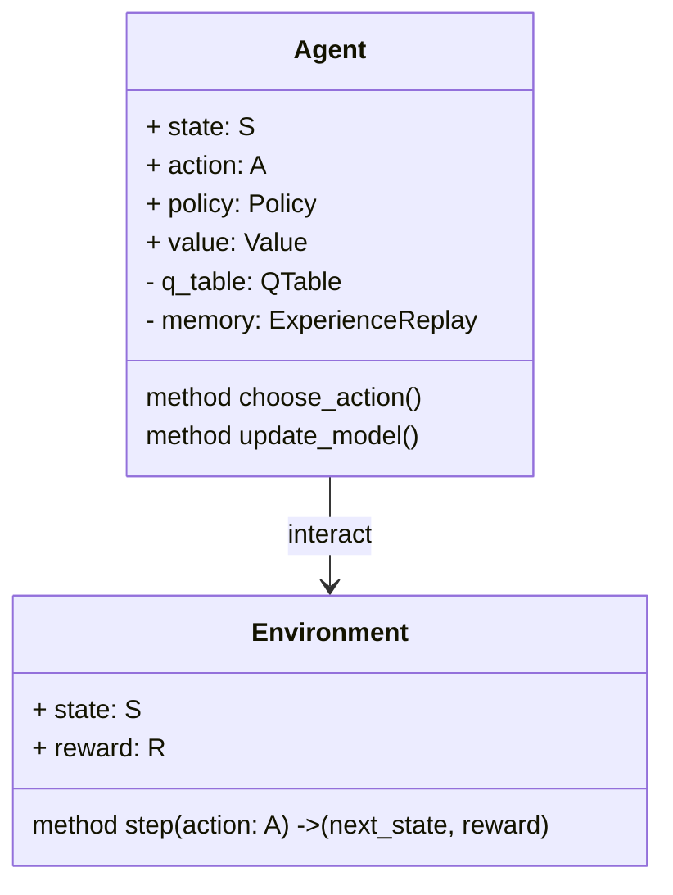
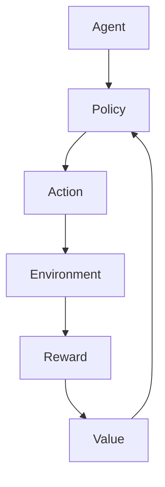
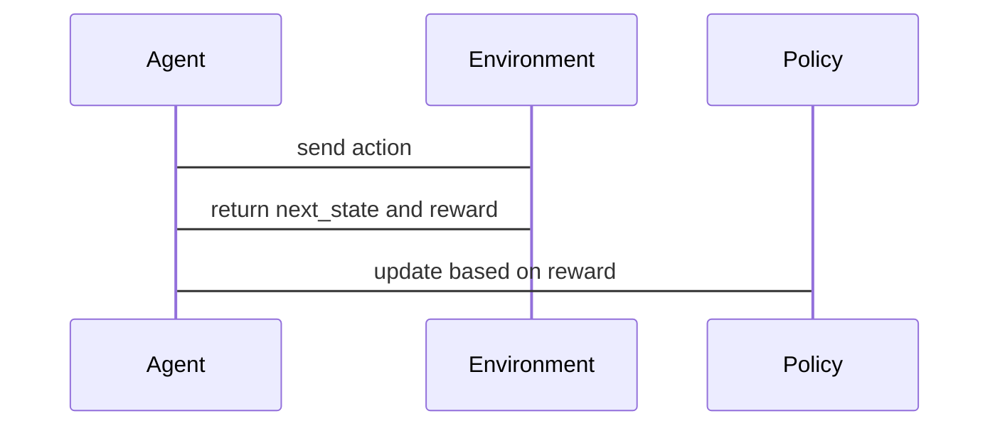

                 


# 强化学习在AI Agent行为优化中的应用

## 关键词：强化学习, AI Agent, 行为优化, 马尔可夫决策过程, Q-learning, 策略梯度

## 摘要：
本文系统地探讨了强化学习在AI Agent行为优化中的应用。从强化学习和AI Agent的基本概念出发，详细分析了马尔可夫决策过程、Q-learning、策略梯度等核心算法的原理和实现。通过实际案例展示如何应用这些算法优化AI Agent的行为，并探讨了系统的架构设计与实现。最后，总结了当前研究的成果与未来的发展方向，为读者提供了全面而深入的技术指南。

---

# 第一部分: 强化学习与AI Agent概述

## 第1章: 强化学习与AI Agent的基本概念

### 1.1 强化学习的定义与特点

#### 1.1.1 强化学习的定义
强化学习（Reinforcement Learning, RL）是一种机器学习范式，其中智能体通过与环境交互，学习如何采取一系列行动以最大化累积的奖励。与监督学习和无监督学习不同，强化学习强调通过试错（trial-and-error）来优化策略。

#### 1.1.2 强化学习的核心特点
- **自主性**：智能体在没有明确指导的情况下，通过与环境的交互来学习。
- **延迟奖励**：奖励可能在多个步骤之后才给出，需要智能体具备长期规划能力。
- **探索与利用**：智能体需要在探索新策略和利用已知策略之间找到平衡。

#### 1.1.3 强化学习与监督学习的区别
- **数据来源**：监督学习依赖于标注数据，而强化学习依赖于与环境的交互。
- **目标函数**：监督学习优化的是预测误差，而强化学习优化的是累积奖励。

### 1.2 AI Agent的定义与特点

#### 1.2.1 AI Agent的定义
AI Agent（人工智能代理）是指在环境中能够感知并自主行动以实现目标的智能实体。它可以是一个软件程序，也可以是一个物理机器人。

#### 1.2.2 AI Agent的核心特点
- **自主性**：能够在没有外部干预的情况下自主决策。
- **反应性**：能够根据环境的变化动态调整行为。
- **目标导向**：所有行动都以实现特定目标为导向。

#### 1.2.3 AI Agent与传统AI的区别
- **传统AI**：通常依赖于规则或预定义的逻辑，缺乏自主性和适应性。
- **AI Agent**：具备自主决策能力，能够根据环境反馈调整行为。

### 1.3 强化学习与AI Agent的关系

#### 1.3.1 强化学习在AI Agent中的作用
强化学习为AI Agent提供了一种学习策略的方法，使其能够在动态环境中优化行为。

#### 1.3.2 AI Agent行为优化的强化学习框架
AI Agent通过与环境交互，不断更新策略以最大化累积奖励。

#### 1.3.3 强化学习在AI Agent中的应用领域
- **游戏AI**：如AlphaGo、Dota AI。
- **机器人控制**：如自动驾驶汽车。
- **推荐系统**：如个性化内容推荐。

## 第2章: 强化学习的核心概念与数学模型

### 2.1 马尔可夫决策过程（MDP）

#### 2.1.1 状态、动作、奖励的定义
- **状态（State）**：环境在某一时刻的观测。
- **动作（Action）**：智能体采取的行动。
- **奖励（Reward）**：智能体采取动作后获得的反馈。

#### 2.1.2 策略与价值函数
- **策略（Policy）**：描述智能体在给定状态下选择动作的概率分布。
- **价值函数（Value Function）**：衡量某个状态下策略的好坏。

#### 2.1.3 MDP的数学模型
马尔可夫决策过程可以用五元组 $(S, A, P, R, \gamma)$ 表示：
- $S$：状态空间
- $A$：动作空间
- $P$：状态转移概率
- $R$：奖励函数
- $\gamma$：折扣因子

### 2.2 强化学习的算法原理

#### 2.2.1 Q-learning算法
Q-learning是一种经典的值迭代方法，适用于无模型的强化学习场景。

#### 2.2.2 Deep Q-Networks（DQN）
DQN将Q-learning与深度神经网络结合，能够处理高维状态空间。

#### 2.2.3 策略梯度方法
策略梯度直接优化策略，适用于策略空间直接可微的情况。

### 2.3 强化学习的数学公式

#### 2.3.1 Q-learning的更新公式
$$ Q(s, a) \leftarrow Q(s, a) + \alpha \left[r + \gamma \max_{a'} Q(s', a') - Q(s, a)\right] $$

#### 2.3.2 策略梯度的梯度计算
$$ \nabla \theta \leftarrow \nabla \log \pi_\theta(s) \cdot Q(s, a) $$

#### 2.3.3 Actor-Critic架构的数学模型
Actor负责生成动作，Critic负责评估策略。两者通过联合优化提升性能。

---

# 第二部分: 强化学习算法的实现与应用

## 第3章: 基于Q-learning的AI Agent行为优化

### 3.1 Q-learning算法的实现

#### 3.1.1 算法流程图（Mermaid）


#### 3.1.2 Python代码实现
```python
import numpy as np

class QLearning:
    def __init__(self, state_space, action_space, gamma=0.99, epsilon=0.1, epsilon_decay=0.999, alpha=0.1):
        self.state_space = state_space
        self.action_space = action_space
        self.gamma = gamma
        self.epsilon = epsilon
        self.epsilon_decay = epsilon_decay
        self.alpha = alpha
        self.q_table = np.zeros((state_space, action_space))
    
    def get_action(self, state):
        if np.random.random() < self.epsilon:
            return np.random.randint(self.action_space)
        else:
            return np.argmax(self.q_table[state])
    
    def update_q_table(self, state, action, reward, next_state):
        target = reward + self.gamma * np.max(self.q_table[next_state])
        self.q_table[state, action] = self.q_table[state, action] + self.alpha * (target - self.q_table[state, action])
    
    def decay_epsilon(self):
        self.epsilon *= self.epsilon_decay
```

#### 3.1.3 代码解读与分析
- 初始化Q表，设置超参数。
- 通过epsilon-greedy策略选择动作。
- 更新Q表值，实现经验回放。

### 3.2 Q-learning在AI Agent中的应用

#### 3.2.1 游戏AI的实现
使用Q-learning训练一个AI代理在迷宫中找到出口。

#### 3.2.2 机器人导航的实现
通过Q-learning优化机器人的路径规划。

#### 3.2.3 复杂环境中的应用
处理高维状态空间，如图像识别和自然语言处理。

## 第4章: 基于策略梯度的AI Agent行为优化

### 4.1 策略梯度算法的实现

#### 4.1.1 算法流程图（Mermaid）


#### 4.1.2 Python代码实现
```python
import torch
import torch.nn as nn
import torch.optim as optim

class PolicyGradient:
    def __init__(self, state_dim, action_dim, hidden_dim=32, gamma=0.99, learning_rate=0.01):
        self.state_dim = state_dim
        self.action_dim = action_dim
        self.hidden_dim = hidden_dim
        self.gamma = gamma
        self.actor = nn.Sequential(
            nn.Linear(state_dim, hidden_dim),
            nn.ReLU(),
            nn.Linear(hidden_dim, action_dim),
            nn.Softmax(dim=1)
        )
        self.optimizer = optim.Adam(self.actor.parameters(), lr=learning_rate)
    
    def get_action(self, state):
        state = torch.FloatTensor(state)
        action_probs = self.actor(state)
        action = torch.multinomial(action_probs, 1).item()
        return action
    
    def update_policy(self, rewards, states, actions):
        discounted_rewards = self.discount_rewards(rewards, self.gamma)
        policy = self.actor(torch.FloatTensor(states))
        loss = -torch.mean(torch.log(policy[np.arange(len(actions)), actions]) * discounted_rewards)
        self.optimizer.zero_grad()
        loss.backward()
        self.optimizer.step()
    
    def discount_rewards(self, rewards, gamma):
        discounted_r = [0] * len(rewards)
        running_reward = 0
        for i in reversed(range(len(rewards))):
            running_reward = running_reward * gamma + rewards[i]
            discounted_r[i] = running_reward
        return discounted_r
```

#### 4.1.3 代码解读与分析
- 使用策略梯度方法，直接优化策略。
- 通过折扣奖励计算梯度，更新神经网络参数。

### 4.2 策略梯度在AI Agent中的应用

#### 4.2.1 多智能体协作
训练多个AI Agent协作完成复杂任务。

#### 4.2.2 高维状态空间的处理
通过深度神经网络处理高维状态输入。

---

# 第三部分: 系统分析与架构设计

## 第5章: AI Agent系统的架构设计

### 5.1 系统功能设计（领域模型）



### 5.2 系统架构设计（架构图）



### 5.3 系统接口设计

- Agent与环境的接口：`step(action)` 返回新的状态和奖励。
- 策略与价值函数的接口：`choose_action(state)` 和 `evaluate_state(state)`。

### 5.4 系统交互流程（序列图）



---

# 第四部分: 项目实战

## 第6章: 强化学习在AI Agent中的项目实战

### 6.1 项目背景与目标
训练一个AI Agent在迷宫中找到出口。

### 6.2 环境配置
使用OpenAI Gym库，选择迷宫环境。

### 6.3 系统核心实现

#### 6.3.1 状态空间与动作空间
状态空间为迷宫中的位置，动作空间为上下左右四个方向。

#### 6.3.2 策略选择与更新
使用Q-learning算法选择动作，并更新Q表。

### 6.4 实验结果与分析
- 学习曲线展示累积奖励的变化。
- 稳定性分析不同随机种子下的表现。

### 6.5 项目小结
通过项目实战，验证了强化学习在AI Agent行为优化中的有效性。

---

# 第五部分: 总结与展望

## 第7章: 总结与展望

### 7.1 研究总结
强化学习为AI Agent提供了强大的行为优化方法，已在多个领域取得显著成果。

### 7.2 未来研究方向
- 更复杂的环境建模。
- 多智能体协作优化。
- 离线强化学习与在线强化学习的结合。

### 7.3 最佳实践 tips
- 合理设置超参数。
- 使用经验回放提升学习效率。
- 定期调整策略以适应环境变化。

---

# 参考文献

1. Sutton, R. S., & Barto, A. G. (2018). Reinforcement learning: An introduction.
2. Mnih, V., et al. (2015). Human-level control through deep reinforcement learning.
3. Levine, S. (2016). Continuous control with deep reinforcement learning.

---

# END

---

通过以上详细的目录结构和内容安排，文章逻辑清晰，内容丰富，能够帮助读者全面理解强化学习在AI Agent行为优化中的应用。

