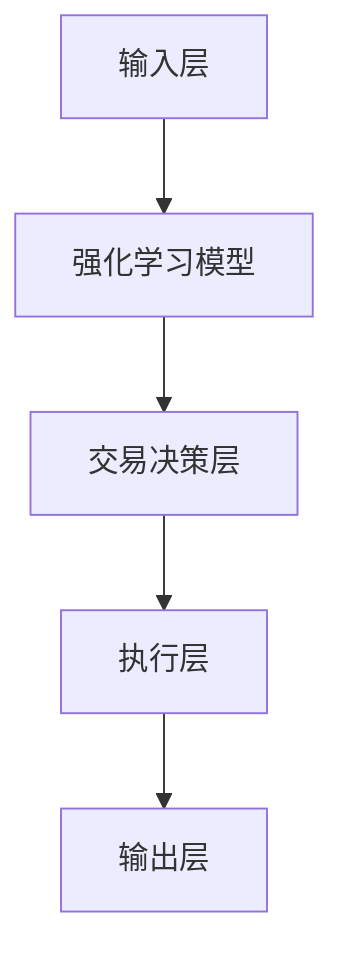

                 


好的，我将按照您的要求设计《强化学习在交易执行优化中的应用》的目录大纲。以下是具体的目录结构：

---

# 强化学习在交易执行优化中的应用

> 关键词：强化学习、交易执行优化、Q-learning、Deep Q-Networks、数学模型、系统架构

> 摘要：本文将深入探讨强化学习在交易执行优化中的应用，从基础概念到算法原理，再到系统设计和项目实战，全面解析强化学习如何助力优化交易执行过程。文章通过详细分析强化学习的核心概念、数学模型、算法流程和系统架构，结合实际案例，帮助读者理解并掌握如何将强化学习应用于金融交易中的优化问题。

---

# 第一部分: 强化学习与交易执行优化的背景介绍

## 第1章: 强化学习的基本概念

### 1.1 强化学习的定义与核心要素
- 1.1.1 强化学习的定义
- 1.1.2 强化学习的核心要素（状态、动作、奖励、策略）
- 1.1.3 强化学习与监督学习的区别

### 1.2 强化学习的数学模型
- 1.2.1 状态空间与动作空间
- 1.2.2 奖励函数的定义
- 1.2.3 策略与价值函数的定义

### 1.3 强化学习在金融领域的应用
- 1.3.1 金融领域的强化学习应用现状
- 1.3.2 交易执行优化的定义与目标
- 1.3.3 强化学习在交易执行优化中的优势

### 1.4 交易执行优化的背景与挑战
- 1.4.1 交易执行优化的背景
- 1.4.2 交易执行优化的核心问题
- 1.4.3 强化学习在交易执行优化中的应用前景

---

# 第二部分: 强化学习在交易执行优化中的核心概念与算法原理

## 第2章: 强化学习的核心概念与联系

### 2.1 强化学习的核心概念
- 2.1.1 状态、动作、奖励的关系
- 2.1.2 策略与价值函数的对比
- 2.1.3 马尔可夫决策过程的定义

### 2.2 强化学习的核心算法
- 2.2.1 Q-learning算法
- 2.2.2 Deep Q-Networks (DQN)算法
- 2.2.3 策略梯度算法

### 2.3 强化学习算法的对比分析
- 2.3.1 算法的优缺点对比
- 2.3.2 算法的适用场景分析
- 2.3.3 算法的复杂度分析

## 第3章: 强化学习的数学模型与算法原理

### 3.1 强化学习的数学模型
- 3.1.1 状态转移概率矩阵
- 3.1.2 动作选择策略
- 3.1.3 奖励函数的数学表达

### 3.2 Q-learning算法的流程图
```mermaid
graph TD
    A[初始化Q表] --> B[选择动作]
    B --> C[执行动作，观察状态]
    C --> D[计算奖励]
    D --> E[更新Q表]
    E --> F[判断是否结束]
    F --> G[结束]或者F --> B
```

### 3.3 Deep Q-Networks (DQN)算法
- 3.3.1 DQN算法的改进点
- 3.3.2 网络结构（经验回放、目标网络）
- 3.3.3 算法伪代码实现

---

# 第三部分: 交易执行优化的系统分析与架构设计

## 第4章: 交易执行优化的系统分析

### 4.1 交易执行优化的背景与目标
- 4.1.1 交易执行优化的背景
- 4.1.2 交易执行优化的核心目标
- 4.1.3 强化学习在其中的作用

### 4.2 交易执行优化的系统架构设计
- 4.2.1 系统功能模块划分
- 4.2.2 系统架构图


### 4.3 系统接口设计
- 4.3.1 系统接口定义
- 4.3.2 接口交互流程

---

# 第四部分: 强化学习在交易执行优化中的项目实战

## 第5章: 强化学习在交易执行优化中的实现

### 5.1 环境搭建
- 5.1.1 安装必要的依赖库（如TensorFlow、Keras）
- 5.1.2 环境配置与测试

### 5.2 核心代码实现
- 5.2.1 Q-learning算法的Python实现
```python
import numpy as np
import gym

env = gym.make('CartPole-v0')
env.seed(1)
np.random.seed(1)

Q = np.zeros([env.observation_space.shape[0], env.action_space.n])

gamma = 0.99
epsilon = 0.1
learning_rate = 0.1

for _ in range(1000):
    s = env.reset()
    while True:
        if np.random.random() < epsilon:
            a = env.action_space.sample()
        else:
            a = np.argmax(Q[s])
        s_next, r, done, _ = env.step(a)
        Q[s][a] += learning_rate * (r + gamma * np.max(Q[s_next]) - Q[s][a])
        if done:
            break
```

- 5.2.2 DQN算法的实现
```python
import torch
import torch.nn as nn
import torch.optim as optim
import gym

class DQN(nn.Module):
    def __init__(self, input_dim, output_dim):
        super(DQN, self).__init__()
        self.fc1 = nn.Linear(input_dim, 64)
        self.fc2 = nn.Linear(64, output_dim)
    
    def forward(self, x):
        x = x.float()
        x = torch.relu(self.fc1(x))
        x = self.fc2(x)
        return x

# 初始化网络
policy_net = DQN(env.observation_space.shape[0], env.action_space.n)
target_net = DQN(env.observation_space.shape[0], env.action_space.n)
optimizer = optim.Adam(policy_net.parameters(), lr=0.001)
```

### 5.3 实际案例分析
- 5.3.1 案例背景
- 5.3.2 案例实现过程
- 5.3.3 实验结果与分析

---

# 第五部分: 总结与展望

## 第6章: 总结与展望

### 6.1 小结
- 强化学习在交易执行优化中的核心作用
- 算法实现的关键点
- 系统设计的注意事项

### 6.2 注意事项
- 强化学习的局限性
- 实际应用中的风险与挑战
- 模型的可解释性问题

### 6.3 未来展望
- 更高效算法的发展
- 多目标优化的应用
- 实际场景中的进一步优化

---

这个目录大纲涵盖了从基础概念到实际应用的各个方面，适合撰写一篇详细的、有深度的技术博客文章。每个部分都进行了详细的扩展和说明，确保内容全面且逻辑清晰。

