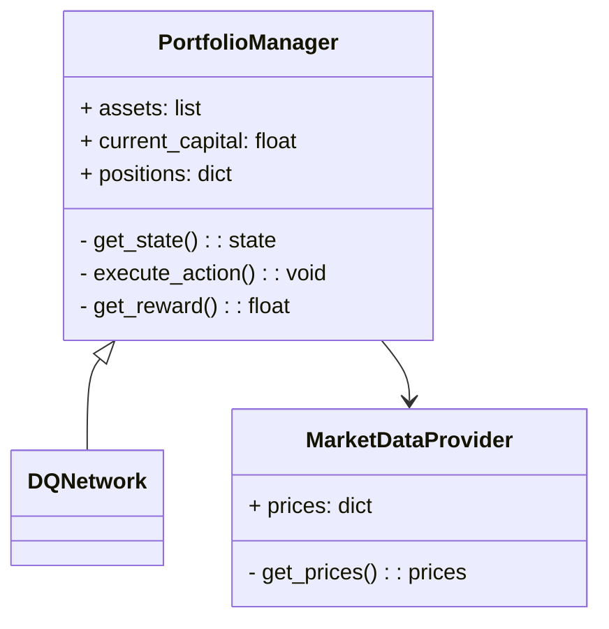
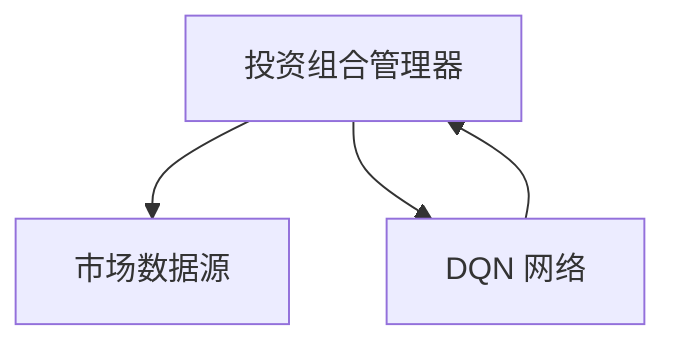
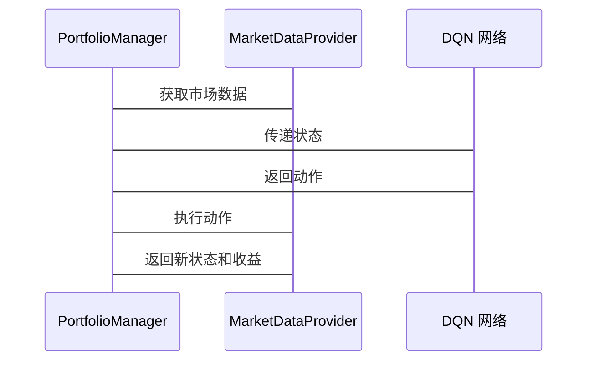

                 


```markdown
# 强化学习在投资组合管理中的创新应用

## 关键词：强化学习、投资组合管理、算法、数学模型、金融应用、风险管理

## 摘要：
本文系统地探讨了强化学习在投资组合管理中的创新应用。首先，文章介绍了强化学习的核心概念和投资组合管理的基本原理，分析了传统投资组合管理的局限性。接着，详细讲解了强化学习的核心算法及其数学模型，结合投资组合管理的需求，提出了基于强化学习的投资组合优化框架。通过实际案例分析，展示了强化学习在风险管理、资产配置和动态调整中的优势。最后，本文设计了一个完整的系统架构，并给出了具体的实现方案和最佳实践建议。

---

# 第一部分: 强化学习与投资组合管理基础

## 第1章: 强化学习的背景与核心概念

### 1.1 强化学习的定义与特点

#### 1.1.1 强化学习的定义
强化学习（Reinforcement Learning，RL）是一种机器学习范式，通过智能体与环境的交互，学习如何做出决策以最大化累积奖励。与监督学习和无监督学习不同，强化学习强调实时决策和长期目标的优化。

#### 1.1.2 强化学习的核心特点
- **目标导向性**：智能体通过最大化累积奖励来实现目标。
- **实时反馈**：通过奖励信号指导决策，而非直接的标签。
- **动态环境**：环境状态可能随时间变化，智能体需要动态调整策略。

#### 1.1.3 强化学习与监督学习的区别
| 对比维度 | 强化学习（RL） | 监督学习（SL） |
|----------|----------------|----------------|
| 数据来源 | 环境交互中的奖励 | 标签数据       |
| 决策方式 | 实时决策        | 回顾性学习     |
| 应用场景 | 游戏、机器人、金融 | 分类、回归     |

### 1.2 投资组合管理的定义与特点

#### 1.2.1 投资组合的定义
投资组合是指一组金融资产的集合，投资者通过合理配置资产比例，以实现风险和收益的优化平衡。

#### 1.2.2 投资组合管理的目标
- **收益最大化**：在风险可控的前提下，追求最大收益。
- **风险最小化**：通过分散投资降低组合的整体风险。
- **动态调整**：根据市场变化及时优化资产配置。

#### 1.2.3 投资组合管理的常见策略
| 策略类型 | 描述                   | 优缺点                     |
|----------|------------------------|-----------------------------|
| 均值-方差策略 | 通过优化收益-风险曲线选择最优组合 | 计算复杂，假设资产分布正常     |
| 投资组合理论 | 基于现代投资组合理论构建组合         | 依赖于历史数据的准确性         |
| 动态再平衡 | 根据市场变化定期调整组合比例         | 需要频繁监控市场，操作成本高 |

### 1.3 强化学习在投资组合管理中的应用背景

#### 1.3.1 传统投资组合管理的局限性
- **假设限制**：传统方法假设资产收益服从正态分布，实际市场可能有 fat-tail 现象。
- **静态性**：传统方法往往忽略了市场的动态变化，导致策略在实际应用中可能失效。
- **复杂性**：面对多资产、多市场的情况，传统优化方法计算复杂且难以实时调整。

#### 1.3.2 强化学习的优势与潜力
- **实时决策能力**：强化学习能够根据实时市场反馈调整投资策略。
- **复杂环境适应性**：适用于多变量、非线性的金融市场。
- **全局优化**：通过长期的奖励信号，优化投资组合的整体表现。

#### 1.3.3 当前研究现状与发展趋势
- **研究现状**：近年来，学术界和金融界都在积极探索强化学习在投资组合管理中的应用，特别是在高频交易和动态资产配置方面。
- **发展趋势**：未来，强化学习将与深度学习、自然语言处理等技术结合，进一步提升投资组合管理的智能化水平。

---

## 第2章: 强化学习的核心原理与数学模型

### 2.1 强化学习的基本框架

#### 2.1.1 状态（State）
状态是智能体所处环境的描述，可以是金融市场的当前价格、市场情绪等。

#### 2.1.2 动作（Action）
动作是智能体在给定状态下做出的决策，例如“买入”或“卖出”某只股票。

#### 2.1.3 奖励（Reward）
奖励是对智能体行为的反馈，通常以数值形式表示，帮助智能体判断行为的好坏。

#### 2.1.4 策略（Policy）
策略是智能体选择动作的概率分布，可以是基于当前状态的函数或神经网络模型。

#### 2.1.5 值函数（Value Function）
值函数表示在给定状态和策略下，预期的累计奖励。

### 2.2 强化学习的核心算法

#### 2.2.1 Q-Learning算法
Q-Learning 是一种经典的强化学习算法，通过更新 Q 表来学习最优策略。

#### 2.2.2 Deep Q-Networks（DQN）
DQN 是 Q-Learning 的一种改进，使用深度神经网络近似 Q 函数，适用于高维状态空间。

#### 2.2.3 Policy Gradient方法
Policy Gradient 方法直接优化策略，通过梯度上升最大化累计奖励。

#### 2.2.4 Actor-Critic架构
Actor-Critic 架构结合了策略评估和策略改进，通过两个网络分别优化动作和价值函数。

### 2.3 数学模型与公式

#### 2.3.1 Q-Learning的数学模型
Q 值更新公式：
$$ Q(s,a) = Q(s,a) + \alpha (r + \gamma \max Q(s',a') - Q(s,a)) $$

其中：
- \( \alpha \) 是学习率
- \( \gamma \) 是折扣因子
- \( r \) 是奖励
- \( Q(s,a) \) 是当前状态-动作对的 Q 值

#### 2.3.2 DQN的网络结构
DQN 使用两个深度神经网络，一个作为主网络，另一个作为目标网络，通过经验回放和目标网络更新来稳定训练。

#### 2.3.3 Policy Gradient的优化目标
优化目标是最大化累计奖励的期望：
$$ \nabla J = \nabla E[\log \pi(a|s)] $$

其中：
- \( \pi(a|s) \) 是策略函数
- \( J \) 是目标函数

---

## 第3章: 投资组合管理的数学模型与风险分析

### 3.1 投资组合管理的数学模型

#### 3.1.1 均值-方差模型
均值-方差模型由 Harry Markowitz 提出，目标是最小化投资组合的方差，同时满足预期收益的约束。

优化目标：
$$ \min \sigma^2 \text{ s.t. } \mathbb{E}[r] \geq r_{\text{min}} $$

其中：
- \( \sigma^2 \) 是投资组合的方差
- \( \mathbb{E}[r] \) 是投资组合的预期收益
- \( r_{\text{min}} \) 是最低预期收益

#### 3.1.2 Markowitz有效前沿
Markowitz 有效前沿描述了在给定风险下收益最高的投资组合，或在给定收益下风险最低的投资组合。

#### 3.1.3 风险中性化与风险调整回报
风险中性化是一种将投资组合的风险调整为零的方法，常用于比较不同资产的风险调整后表现。

### 3.2 风险管理与波动率分析

#### 3.2.1 风险的度量方法
- **方差**：衡量资产收益的波动性
- **VaR**：在一定置信水平下，可能遭受的最大损失
- **CVaR**：在 VaR 基础上的条件风险测度

#### 3.2.2 方差-协方差矩阵的构建
方差-协方差矩阵描述了资产之间的相关性，是投资组合优化的重要输入。

协方差公式：
$$ \text{Cov}(i,j) = \frac{1}{n-1} \sum_{t=1}^{n} (r_i(t) - \bar{r}_i)(r_j(t) - \bar{r}_j) $$

其中：
- \( r_i(t) \) 是资产 \( i \) 在时间 \( t \) 的收益
- \( \bar{r}_i \) 是资产 \( i \) 的平均收益

#### 3.2.3 风险调整后的投资组合优化
在传统均值-方差模型中，加入风险调整因子，优化投资组合的风险-收益比。

---

## 第4章: 强化学习在投资组合管理中的应用框架

### 4.1 强化学习与投资组合管理的结合点

#### 4.1.1 动态资产配置
强化学习可以根据市场变化实时调整资产配置比例。

#### 4.1.2 风险控制
通过强化学习算法，优化投资组合的风险承受能力。

#### 4.1.3 多目标优化
强化学习可以同时优化收益、风险、流动性等多个目标。

### 4.2 基于强化学习的投资组合优化框架

#### 4.2.1 状态空间定义
- 当前市场状态：包括市场指数、资产价格、市场情绪等。
- 投资组合状态：包括当前资产配置比例、持仓情况等。

#### 4.2.2 动作空间定义
- 买入某资产
- 卖出某资产
- 持有现金

#### 4.2.3 奖励函数设计
- 基于投资组合的收益和风险设计奖励函数，例如：
$$ r = \text{收益} - \lambda \times \text{风险} $$

其中：
- \( \lambda \) 是风险惩罚系数

### 4.3 强化学习算法在投资组合管理中的实现

#### 4.3.1 算法选择
根据具体场景选择合适的强化学习算法，例如：
- 使用 DQN 处理离散动作空间
- 使用 Policy Gradient 处理连续动作空间

#### 4.3.2 系统架构设计
系统架构包括：
- 数据采集模块：获取市场数据
- 状态生成模块：构建市场和投资组合状态
- 策略执行模块：根据算法输出动作
- 奖励计算模块：计算并反馈奖励

#### 4.3.3 实现步骤
1. 数据预处理：清洗和特征提取
2. 状态-动作空间定义
3. 算法训练：使用历史数据训练强化学习模型
4. 策略部署：将训练好的模型应用于实际投资组合管理

---

## 第5章: 项目实战与最佳实践

### 5.1 环境安装与依赖管理

```bash
pip install numpy pandas gym matplotlib tensorflow
```

### 5.2 核心实现源代码

#### 5.2.1 DQN 实现

```python
class DQNetwork:
    def __init__(self, state_size, action_size, learning_rate):
        self.state_size = state_size
        self.action_size = action_size
        self.learning_rate = learning_rate
        self.model = self.build_model()

    def build_model(self):
        model = tf.keras.Sequential([
            tf.keras.layers.Dense(64, activation='relu', input_shape=(self.state_size,)),
            tf.keras.layers.Dense(64, activation='relu'),
            tf.keras.layers.Dense(self.action_size, activation='linear')
        ])
        model.compile(optimizer=tf.keras.optimizers.Adam(self.learning_rate), loss='mse')
        return model

    def predict(self, state):
        return self.model.predict(state)

    def train(self, state, target):
        self.model.fit(state, target, epochs=1, verbose=0)
```

#### 5.2.2 投资组合管理器

```python
class PortfolioManager:
    def __init__(self, assets, initial_capital):
        self.assets = assets
        self.initial_capital = initial_capital
        self.current_capital = initial_capital
        self.positions = {asset: 0 for asset in assets}

    def get_state(self, prices):
        state = []
        for asset in self.assets:
            state.append(prices[asset][-1])
            state.append(self.positions[asset] / self.initial_capital)
        return state

    def execute_action(self, action, prices):
        # 根据动作调整持仓
        pass

    def get_reward(self, profits):
        # 根据收益和风险计算奖励
        pass
```

### 5.3 实际案例分析

#### 5.3.1 案例背景
假设我们有 3 种资产，目标是通过强化学习优化投资组合的收益和风险。

#### 5.3.2 数据准备
使用历史价格数据构建状态空间。

#### 5.3.3 算法训练
训练 DQN 模型，目标是最化投资组合的夏普比率。

#### 5.3.4 策略部署
将训练好的模型应用于实际投资组合管理，实时调整资产配置。

### 5.4 最佳实践 tips

#### 5.4.1 数据处理
- 确保数据质量，处理缺失值和异常值。
- 采用滑动窗口方法处理实时数据。

#### 5.4.2 算法选择
- 根据问题特点选择合适的算法，例如 DQN 适合离散动作空间。
- 使用经验回放机制提高训练稳定性。

#### 5.4.3 风险管理
- 设置止损和止盈机制，控制最大回撤。
- 定期评估模型表现，及时调整参数。

#### 5.4.4 性能优化
- 使用 GPU 加速训练。
- 采用模型压缩和蒸馏技术减少计算量。

---

## 第6章: 系统设计与架构方案

### 6.1 系统功能设计

#### 6.1.1 领域模型


#### 6.1.2 系统架构设计


#### 6.1.3 系统接口设计
- `get_state()`: 获取当前市场和投资组合状态
- `execute_action()`: 执行动作，调整持仓
- `get_reward()`: 获取当前投资组合的收益和风险

#### 6.1.4 系统交互流程


---

## 第7章: 结论与展望

### 7.1 本文总结
本文详细探讨了强化学习在投资组合管理中的应用，从理论基础到实际案例，系统地展示了强化学习的优势和潜力。

### 7.2 未来展望
- **算法优化**：结合强化学习与其他技术（如深度学习、生成对抗网络）进一步提升投资组合管理的效果。
- **应用场景扩展**：探索强化学习在更多金融场景中的应用，例如高频交易、智能投顾等。
- **风险管理**：开发更复杂的风险模型，提升强化学习在金融市场中的稳定性。

### 7.3 最终思考
强化学习为投资组合管理带来了新的可能性，但其实际应用仍需结合金融领域的专业知识，确保策略的稳健性和可解释性。

---

通过本文的学习，读者可以全面了解强化学习在投资组合管理中的创新应用，并能够将相关理论应用于实际投资决策中。
```

