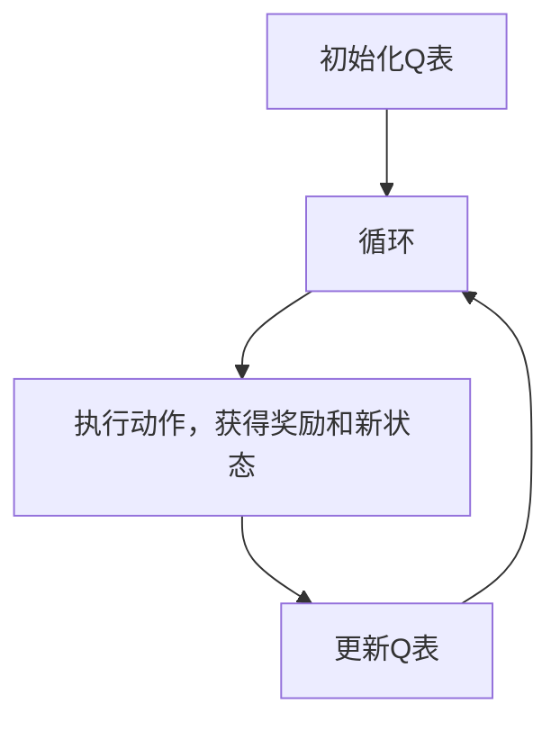
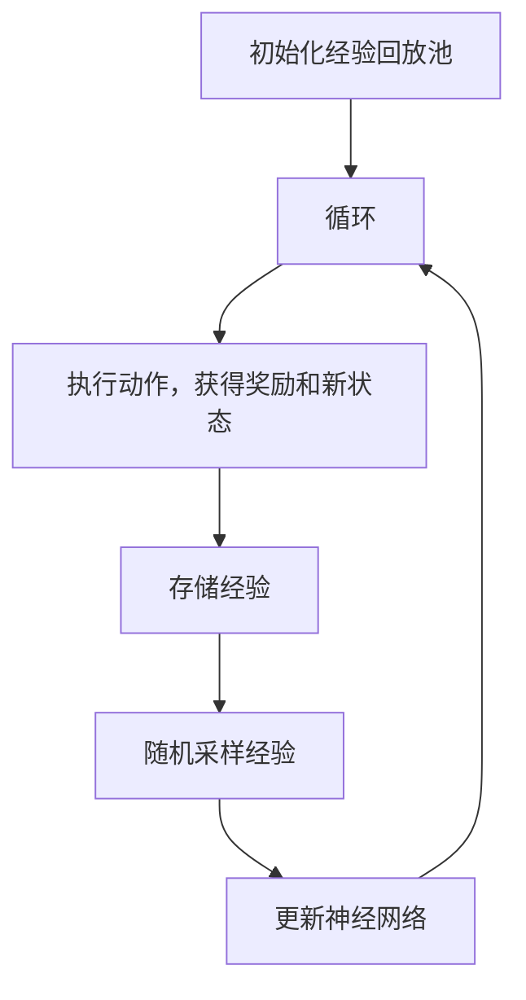
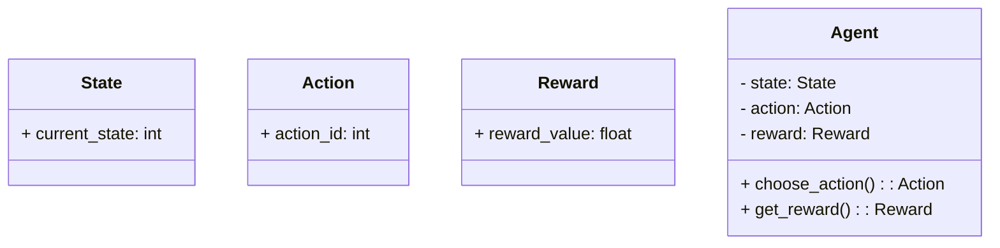
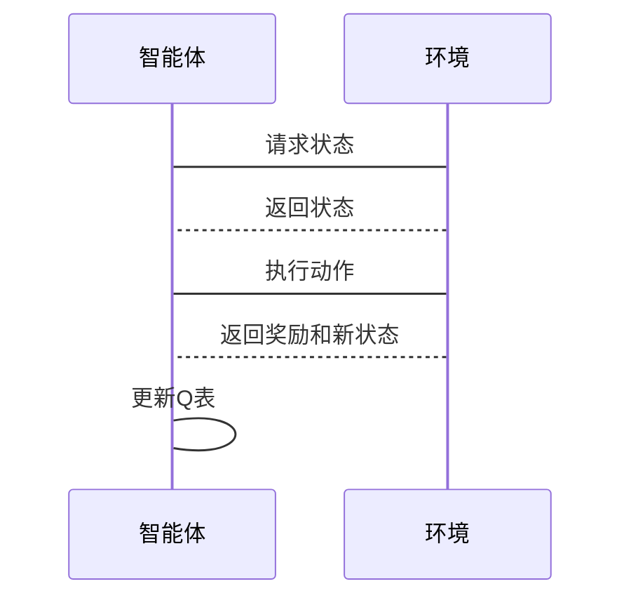

                 


# 强化学习：通过奖励机制改进AI Agent

> 关键词：强化学习，奖励机制，AI Agent，智能体，马尔可夫决策过程，Q-Learning，DQN

> 摘要：本文详细探讨了强化学习中奖励机制的核心作用，通过分析AI Agent与环境的交互过程，揭示了如何设计有效的奖励函数来优化智能体的决策策略。文章从基础概念到算法实现，再到系统设计，全面阐述了强化学习的理论与实践，并通过实际案例展示了奖励机制在不同场景中的应用。

---

# 第一部分: 强化学习基础

## 第1章: 强化学习概述

### 1.1 强化学习的起源与发展

#### 1.1.1 强化学习的定义
强化学习（Reinforcement Learning, RL）是一种机器学习范式，其中智能体（Agent）通过与环境（Environment）交互，学习如何采取一系列行动（Actions）以最大化累积的奖励（Rewards）。与监督学习不同，强化学习不需要明确的标签数据，而是通过试错（trial-and-error）机制来学习最优策略。

#### 1.1.2 强化学习的核心概念
- **智能体（Agent）**：智能体是强化学习的核心实体，负责感知环境并采取行动。
- **环境（Environment）**：环境是智能体所处的外部世界，能够对智能体的行动做出响应。
- **状态（State）**：环境在某一时间点的描述，表示智能体所处的情况。
- **动作（Action）**：智能体在给定状态下选择的行为。
- **奖励（Reward）**：智能体采取某个行动后，环境给予的反馈，用于评估该行动的好坏。

#### 1.1.3 强化学习的应用领域
强化学习在多个领域有广泛应用，包括机器人控制、游戏AI、资源管理、金融投资等。例如，AlphaGo通过强化学习在围棋领域取得了突破性进展。

### 1.2 奖励机制的作用

#### 1.2.1 奖励机制的基本原理
奖励机制是强化学习的核心，它通过数值反馈指导智能体的学习过程。智能体的目标是通过最大化累积奖励来优化其策略。

#### 1.2.2 奖励机制的设计原则
- **明确性**：奖励函数应清晰地定义智能体的目标。
- **及时性**：奖励应尽快传达给智能体，避免延迟。
- **一致性**：在相同状态下，奖励应保持一致。

#### 1.2.3 奖励机制的实现方式
奖励机制可以是基于规则的（如游戏中的得分）或基于目标的（如达到特定状态）。设计有效的奖励机制需要考虑任务的复杂性和智能体的决策空间。

---

## 第2章: 强化学习的核心概念

### 2.1 智能体与环境

#### 2.1.1 智能体的定义与角色
智能体是强化学习的主体，负责感知环境并采取行动。智能体的学习目标是找到最优策略，以最大化累积奖励。

#### 2.1.2 环境的定义与分类
环境是智能体所处的外部世界，可以是物理环境（如机器人）或抽象环境（如棋盘）。环境通过状态和奖励与智能体互动。

#### 2.1.3 智能体与环境的交互过程
智能体通过感知环境状态，选择一个动作，并根据环境的反馈（奖励）调整其策略。这个过程形成了强化学习的基本循环。

### 2.2 状态与动作

#### 2.2.1 状态空间的定义
状态空间是所有可能状态的集合。每个状态描述了环境在某一时间点的状况，例如在迷宫中的位置。

#### 2.2.2 动作空间的定义
动作空间是智能体在给定状态下所有可能采取的动作的集合。动作空间的大小和复杂性决定了智能体的选择难度。

#### 2.2.3 状态与动作的转换关系
状态和动作之间存在转换关系，即智能体采取某个动作后，环境会转移到一个新的状态，并给出奖励。

### 2.3 奖励与策略

#### 2.3.1 奖励函数的定义
奖励函数是一个函数，它根据当前状态和智能体采取的动作，返回一个数值奖励。奖励反映了智能体行为的好坏。

#### 2.3.2 策略的定义与分类
策略（Policy）是智能体选择动作的规则。策略可以是确定性的（如贪心策略）或概率性的（如随机策略）。

#### 2.3.3 策略优化的目标
策略优化的目标是找到能够最大化累积奖励的策略。这可以通过值函数或直接优化策略来实现。

---

## 第3章: 马尔可夫决策过程

### 3.1 马尔可夫决策过程的定义

#### 3.1.1 状态、动作、奖励的关系
马尔可夫决策过程（Markov Decision Process, MDP）假设当前状态和奖励仅依赖于当前的环境状态，而与过去的历史无关。

#### 3.1.2 状态转移概率矩阵
状态转移概率矩阵描述了从当前状态采取某个动作后，转移到下一个状态的概率。

#### 3.1.3 策略评估与优化
策略评估是计算策略在当前环境下的价值，策略优化则是找到最优策略。

### 3.2 基于马尔可夫决策过程的强化学习算法

#### 3.2.1 Q-Learning算法
Q-Learning是一种基于值函数的强化学习算法，通过更新Q表（Q-Table）来学习最优策略。

#### 3.2.2 Deep Q-Network（DQN）算法
DQN算法通过深度神经网络近似Q值函数，解决了Q-Learning在高维状态空间中的计算难题。

#### 3.2.3 其他经典算法简介
其他经典算法包括SARSA、Actor-Critic方法等，它们在不同的场景下具有各自的优势。

---

## 第4章: 强化学习的数学模型

### 4.1 贝尔曼方程

#### 4.1.1 贝尔曼方程的定义
贝尔曼方程（Bellman Equation）是强化学习的核心数学模型，描述了状态的价值与其后续状态价值之间的关系。

#### 4.1.2 贝尔曼方程的求解方法
贝尔曼方程可以通过动态规划或蒙特卡洛方法求解，是强化学习算法的理论基础。

#### 4.1.3 贝尔曼方程的应用
贝尔曼方程广泛应用于Q-Learning、DQN等算法中，用于计算状态的价值。

### 4.2 值函数与策略函数

#### 4.2.1 值函数的定义与性质
值函数（Value Function）描述了智能体在给定策略和环境下的预期累积奖励。

#### 4.2.2 策略函数的定义与性质
策略函数（Policy Function）描述了智能体在不同状态下选择动作的概率分布。

#### 4.2.3 值函数与策略函数的关系
值函数依赖于策略函数，策略函数通过优化值函数来选择最优动作。

### 4.3 动态规划与蒙特卡洛方法

#### 4.3.1 动态规划的基本原理
动态规划（Dynamic Programming）通过递归计算状态价值，是强化学习的重要技术。

#### 4.3.2 蒙特卡洛方法的基本原理
蒙特卡洛方法（Monte Carlo Methods）通过采样经验来估计状态价值，适用于复杂的环境。

#### 4.3.3 动态规划与蒙特卡洛方法的比较
动态规划适用于已知环境，而蒙特卡洛方法适用于未知环境。

---

## 第5章: 强化学习的算法实现

### 5.1 Q-Learning算法实现

#### 5.1.1 算法流程图（Mermaid）



#### 5.1.2 Python源代码实现

```python
import numpy as np

class QLearning:
    def __init__(self, state_space, action_space, learning_rate=0.1, gamma=0.9):
        self.state_space = state_space
        self.action_space = action_space
        self.lr = learning_rate
        self.gamma = gamma
        self.q_table = np.zeros((state_space, action_space))
    
    def choose_action(self, state):
        return np.argmax(self.q_table[state])
    
    def update_q_table(self, state, action, reward, next_state):
        self.q_table[state, action] += self.lr * (reward + self.gamma * np.max(self.q_table[next_state]) - self.q_table[state, action])
```

#### 5.1.3 算法的数学模型
Q-Learning的更新公式为：
$$ Q(s, a) = Q(s, a) + \alpha \times [r + \gamma \times \max Q(s', a') - Q(s, a)] $$

### 5.2 Deep Q-Network（DQN）算法实现

#### 5.2.1 算法流程图（Mermaid）



#### 5.2.2 Python源代码实现

```python
import tensorflow as tf
import numpy as np

class DQN:
    def __init__(self, state_space, action_space, hidden_units=16):
        self.state_space = state_space
        self.action_space = action_space
        self.hidden_units = hidden_units
        self.model = self.build_model()
    
    def build_model(self):
        model = tf.keras.Sequential([
            tf.keras.layers.Dense(self.hidden_units, activation='relu', input_shape=(self.state_space,)),
            tf.keras.layers.Dense(self.action_space)
        ])
        model.compile(optimizer='adam', loss='mean_squared_error')
        return model
    
    def get_action(self, state):
        prediction = self.model.predict(state)
        return np.argmax(prediction[0])
    
    def train(self, states, targets):
        self.model.fit(states, targets, epochs=1, verbose=0)
```

---

## 第6章: 系统分析与架构设计

### 6.1 问题场景介绍

#### 6.1.1 项目背景
假设我们正在开发一个智能客服系统，智能体需要通过与用户互动，提供最优的客户服务。

#### 6.1.2 项目目标
设计一个基于强化学习的智能客服系统，通过奖励机制优化客服代理的对话策略。

### 6.2 系统功能设计

#### 6.2.1 领域模型（Mermaid 类图）



#### 6.2.2 系统架构设计（Mermaid 架构图）

```mermaid
container 强化学习系统 {
    component 智能体
    component 环境
    component 奖励机制
}
```

#### 6.2.3 系统接口设计
智能体与环境之间的接口包括状态输入、动作输出和奖励反馈。

#### 6.2.4 系统交互流程（Mermaid 序列图）



---

## 第7章: 项目实战

### 7.1 环境安装

#### 7.1.1 强化学习框架
推荐使用TensorFlow或Keras框架进行强化学习的实现。

#### 7.1.2 环境配置
安装必要的库，如TensorFlow、NumPy、OpenAI Gym。

### 7.2 核心实现

#### 7.2.1 强化学习核心代码
以下是训练一个AI代理进行迷宫导航的代码示例：

```python
import gym
import numpy as np

env = gym.make('Maze-v0')
env.seed(42)

class Agent:
    def __init__(self, env):
        self.env = env
        self.state_space = env.observation_space.shape[0]
        self.action_space = env.action_space.n
        self.q_table = np.zeros((self.state_space, self.action_space))
    
    def choose_action(self, state):
        return np.argmax(self.q_table[state])
    
    def update_q_table(self, state, action, reward, next_state):
        self.q_table[state][action] += 0.1 * (reward + 0.9 * np.max(self.q_table[next_state]) - self.q_table[state][action])

agent = Agent(env)
for episode in range(1000):
    state = env.reset()
    for step in range(100):
        action = agent.choose_action(state)
        next_state, reward, done, _ = env.step(action)
        agent.update_q_table(state, action, reward, next_state)
        state = next_state
        if done:
            break
env.close()
```

#### 7.2.2 代码解读与分析
上述代码展示了如何使用Q-Learning算法训练一个AI代理在迷宫中找到出口。通过不断更新Q表，智能体学会了最优路径。

### 7.3 实际案例分析

#### 7.3.1 案例背景
我们训练一个AI代理在OpenAI Gym的迷宫环境中找到出口。

#### 7.3.2 实验结果
通过多次训练，智能体能够找到最优路径，减少探索时间，提高奖励。

#### 7.3.3 结果分析
奖励机制的设计直接影响智能体的探索和利用策略。适当的奖励可以加速学习过程，而过高的奖励可能导致策略不稳定。

### 7.4 项目小结
通过实际案例，我们展示了如何将强化学习应用于实际问题，并通过奖励机制优化智能体的行为。

---

## 第8章: 总结与展望

### 8.1 总结

#### 8.1.1 强化学习的核心概念
强化学习通过智能体与环境的交互，学习最优策略，奖励机制是核心驱动因素。

#### 8.1.2 常见算法的优缺点对比
Q-Learning适用于低维状态空间，而DQN适用于高维复杂环境。

#### 8.1.3 系统设计与实现的关键点
系统设计需要明确智能体、环境、状态、动作和奖励的关系，并通过有效的架构实现。

### 8.2 未来展望

#### 8.2.1 强化学习的研究热点
当前研究热点包括多智能体强化学习、连续控制、强化学习与博弈论的结合等。

#### 8.2.2 奖励机制的优化方向
未来研究可以探索自适应奖励机制、多目标优化和基于人类反馈的奖励学习。

### 8.3 最佳实践 tips

#### 8.3.1 设计奖励机制时的注意事项
确保奖励机制清晰、及时且一致，避免模糊的奖励定义。

#### 8.3.2 系统设计中的关键点
明确智能体与环境的交互接口，合理设计状态和动作空间。

#### 8.3.3 项目实施中的注意事项
在实际项目中，建议先从简单环境开始训练，逐步过渡到复杂环境。

---

# 结语

通过本文的详细讲解，我们了解了强化学习中奖励机制的核心作用，掌握了多种经典算法的实现方法，并通过实际案例展示了如何将理论应用于实践。希望本文能为AI Agent的设计和优化提供有价值的参考。

--- 

* 如果您觉得这篇文章对您有所帮助，欢迎关注我的公众号/博客，获取更多技术文章。

