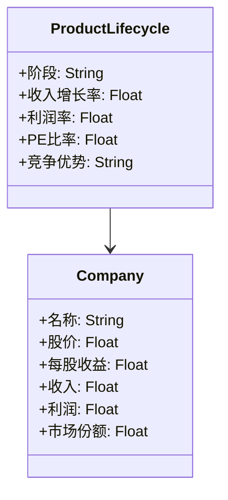
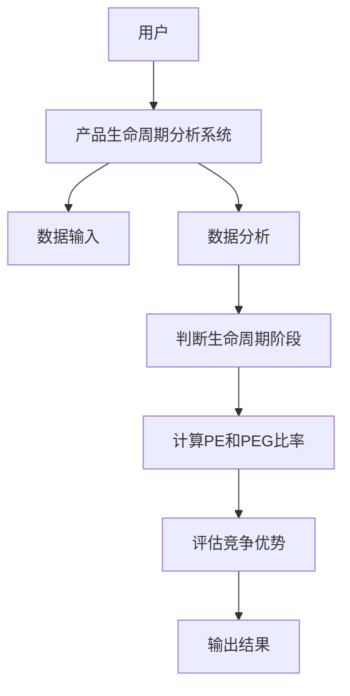
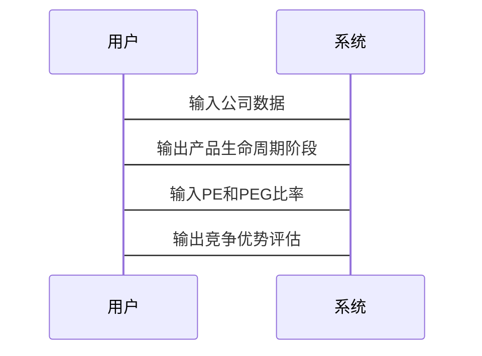

                 


# 彼得林奇如何分析公司的产品生命周期

## 关键词：产品生命周期，彼得·林奇，投资分析，PE比率，竞争优势，市场趋势

## 摘要：本文将详细探讨彼得·林奇如何通过分析公司产品生命周期来评估其投资价值。我们将从产品生命周期的基本概念入手，逐步分析彼得·林奇的独特方法，包括其分析框架、核心指标（如PE和PEG比率）以及如何通过这些指标预测公司未来表现。文章还结合实际案例，详细讲解如何在实际投资中应用这些分析方法。

---

## # 第1章: 产品生命周期概述

### ## 1.1 产品生命周期的基本概念

#### ### 1.1.1 产品生命周期的定义

- 产品生命周期是指产品从进入市场到退出市场的整个过程，通常分为导入期、成长期、成熟期和衰退期四个阶段。
- 通过分析产品生命周期的不同阶段，投资者可以更好地理解公司的市场地位和未来增长潜力。

#### ### 1.1.2 产品生命周期的阶段划分

- **导入期**：产品刚刚进入市场，市场需求较低，市场竞争较小，公司需要进行市场推广和品牌建设。
- **成长期**：产品市场需求迅速增长，公司收入和利润开始上升，市场竞争逐渐加剧。
- **成熟期**：产品市场需求趋于稳定，公司收入和利润达到峰值，市场竞争最为激烈。
- **衰退期**：产品市场需求开始下降，公司收入和利润逐渐减少，市场竞争减弱。

#### ### 1.1.3 产品生命周期对企业的影响

- 产品生命周期的不同阶段直接影响公司的收入、利润和市场份额。
- 通过分析产品生命周期，投资者可以更好地评估公司的短期和长期表现。

### ## 1.2 彼得·林奇的分析方法概述

#### ### 1.2.1 彼得·林奇的分析框架

- 彼得·林奇以其独特的“烟蒂”投资策略闻名，注重分析公司的基本面，尤其是公司的产品生命周期。
- 他通过分析产品的市场地位、竞争优势和财务表现，来判断公司的投资价值。

#### ### 1.2.2 彼得·林奇的核心投资理念

- **价值投资**：寻找被市场低估的公司，长期持有，等待其价值回归。
- **竞争优势**：关注那些具有强大竞争优势的公司，这些公司在产品生命周期的各个阶段都能保持领先地位。
- **财务数据**：通过分析公司的财务报表，尤其是收入和利润的变化趋势，来判断公司的产品生命周期所处阶段。

#### ### 1.2.3 彼得·林奇与其他分析师的不同之处

- **基本面分析**：彼得·林奇注重公司的基本面，尤其是产品生命周期和竞争优势，而其他分析师可能更关注市场趋势或技术分析。
- **长期投资**：彼得·林奇强调长期投资，寻找具有持续增长潜力的公司，而其他投资者可能更关注短期波动。

---

## # 第2章: 产品生命周期的核心概念与联系

### ## 2.1 产品生命周期的核心概念

#### ### 2.1.1 产品生命周期的四个阶段

- **导入期**：市场需求较低，公司需要进行市场推广和品牌建设。
- **成长期**：市场需求迅速增长，公司收入和利润开始上升。
- **成熟期**：市场需求趋于稳定，公司收入和利润达到峰值。
- **衰退期**：市场需求下降，公司收入和利润逐渐减少。

#### ### 2.1.2 每个阶段的特征与表现

- **导入期**：产品知名度低，市场竞争小，公司需要进行市场推广和品牌建设。
- **成长期**：产品知名度提高，市场需求增加，公司收入和利润增长。
- **成熟期**：产品知名度高，市场需求稳定，公司收入和利润达到峰值。
- **衰退期**：产品知名度下降，市场需求减少，公司收入和利润减少。

#### ### 2.1.3 彼得·林奇如何识别不同阶段的产品

- 彼得·林奇通过分析公司的财务数据和市场表现，判断产品所处的生命周期阶段。
- 他特别关注公司的收入增长率、利润率和市场份额的变化趋势。

### ## 2.2 核心概念的联系

#### ### 2.2.1 产品生命周期与企业战略的关系

- 产品生命周期的不同阶段直接影响公司的战略决策，例如市场推广、产品创新和成本控制。
- 彼得·林奇通过分析公司的战略调整，判断其产品生命周期所处阶段。

#### ### 2.2.2 产品生命周期与市场趋势的关联

- 产品生命周期与市场趋势密切相关，市场需求的变化直接影响产品的生命周期阶段。
- 彼得·林奇通过分析市场趋势，判断产品的生命周期阶段及其未来的市场表现。

#### ### 2.2.3 彼得·林奇如何通过产品生命周期预测企业未来表现

- 通过分析产品的生命周期阶段，彼得·林奇可以预测公司的未来收入和利润变化。
- 他特别关注那些处于成长期或成熟期的公司，这些公司具有较大的增长潜力。

---

## # 第3章: 彼得·林奇的分析框架与方法

### ## 3.1 彼得·林奇的分析框架

#### ### 3.1.1 产品生命周期的四个阶段分析

- 彼得·林奇通过分析产品的生命周期阶段，判断公司的市场地位和竞争优势。
- 他特别关注那些处于成长期或成熟期的公司，这些公司具有较大的增长潜力。

#### ### 3.1.2 彼得·林奇的PE比率分析

- **PE比率**：市盈率，计算公式为 $$ PE = \frac{\text{股价}}{\text{每股收益}} $$
- 彼得·林奇通过分析PE比率，判断公司的估值是否合理。
- 他特别关注那些PE比率低于行业平均水平的公司，认为这些公司具有较大的投资价值。

#### ### 3.1.3 彼得·林奇的竞争优势分析

- 彼得·林奇通过分析公司的竞争优势，判断其在市场中的地位。
- 他特别关注那些具有强大竞争优势的公司，这些公司在产品生命周期的各个阶段都能保持领先地位。

### ## 3.2 分析方法的详细步骤

#### ### 3.2.1 确定产品的生命周期阶段

- 通过分析公司的财务数据和市场表现，判断产品的生命周期阶段。
- 特别关注收入增长率、利润率和市场份额的变化趋势。

#### ### 3.2.2 分析公司的财务数据

- 计算公司的PE比率、PEG比率（ $$ PEG = \frac{PE}{\text{收入增长率}} $$）等指标。
- 通过这些指标，判断公司的估值是否合理。

#### ### 3.2.3 评估公司的竞争优势

- 分析公司的竞争优势，例如品牌、技术、成本控制等。
- 判断公司在市场中的地位和未来增长潜力。

---

## # 第4章: 产品生命周期的数学模型与公式

### ## 4.1 产品生命周期的数学模型

#### ### 4.1.1 产品生命周期的阶段划分模型

- 通过分析收入增长率和利润率的变化趋势，判断产品的生命周期阶段。
- 模型公式： $$ \text{阶段划分} = \begin{cases} 
\text{导入期} & \text{收入增长率 < 10\%} \\
\text{成长期} & \text{10\% < 收入增长率 < 20\%} \\
\text{成熟期} & \text{20\% < 收入增长率 < 30\%} \\
\text{衰退期} & \text{收入增长率 < 0\%} 
\end{cases} $$

#### ### 4.1.2 产品生命周期的市场增长模型

- 市场增长模型公式： $$ \text{市场增长} = \frac{\text{收入增长率} - \text{行业平均增长率}}{\text{行业平均增长率}} \times 100\% $$

#### ### 4.1.3 产品生命周期的市场渗透模型

- 市场渗透模型公式： $$ \text{市场渗透率} = \frac{\text{公司市场份额}}{\text{行业市场规模}} \times 100\% $$

### ## 4.2 彼得·林奇分析方法的数学模型

#### ### 4.2.1 PE比率分析

- PE比率公式： $$ PE = \frac{\text{股价}}{\text{每股收益}} $$

#### ### 4.2.2 PEG比率分析

- PEG比率公式： $$ PEG = \frac{PE}{\text{收入增长率}} $$

---

## # 第5章: 系统分析与架构设计方案

### ## 5.1 问题场景介绍

- 通过构建一个产品生命周期分析系统，帮助投资者快速判断公司的产品生命周期阶段及其投资价值。

### ## 5.2 系统功能设计

#### ### 5.2.1 领域模型



#### ### 5.2.2 系统架构设计



#### ### 5.2.3 系统接口设计

- 输入接口：公司名称、股价、每股收益、收入、利润、市场份额。
- 输出接口：产品生命周期阶段、PE比率、PEG比率、竞争优势评估。

#### ### 5.2.4 系统交互设计



---

## # 第6章: 项目实战

### ## 6.1 环境安装

- 需要安装Python和相关数据分析库（如Pandas、NumPy）。
- 安装步骤：
  1. 下载Python安装包并安装。
  2. 安装Pandas和NumPy： pip install pandas numpy

### ## 6.2 系统核心实现源代码

```python
import pandas as pd
import numpy as np

def calculate_pe(pe_ratio):
    return pe_ratio

def calculate_peg(pe_ratio, revenue_growth):
    return pe_ratio / revenue_growth

# 示例数据
data = {
    '公司名称': ['A', 'B', 'C'],
    '股价': [100, 80, 120],
    '每股收益': [10, 8, 12],
    '收入增长率': [20, 15, 25],
    '利润率': [20, 18, 22],
    '市场份额': [30, 25, 35]
}

df = pd.DataFrame(data)

# 计算PE和PEG比率
df['PE'] = df['股价'] / df['每股收益']
df['PEG'] = df['PE'] / df['收入增长率']

print(df)
```

### ## 6.3 代码应用解读与分析

- 通过上述代码，我们可以计算公司的PE和PEG比率，判断其投资价值。
- 示例数据中，公司C的PE为6（120/20），PEG为6/25=0.24，表明其估值较低，具有较大的投资潜力。

### ## 6.4 实际案例分析和详细讲解剖析

- 以苹果公司为例，分析其产品生命周期阶段及其投资价值。
- 计算苹果公司的PE和PEG比率，判断其估值是否合理。

### ## 6.5 项目小结

- 通过本项目，我们学会了如何利用Python进行产品生命周期分析，判断公司的投资价值。

---

## # 第7章: 最佳实践 tips、小结、注意事项、拓展阅读

### ## 7.1 最佳实践 tips

- 定期更新公司数据，保持分析结果的准确性。
- 结合市场趋势和行业分析，全面评估公司的投资价值。
- 注意财务数据的准确性，确保分析结果的可靠性。

### ## 7.2 小结

- 通过本文的分析，我们学会了如何利用产品生命周期理论，结合彼得·林奇的分析方法，判断公司的投资价值。
- 掌握PE和PEG比率的计算方法，能够更好地进行投资决策。

### ## 7.3 注意事项

- 财务数据的准确性直接影响分析结果，投资者需要选择可靠的财务数据来源。
- 注意市场风险，尤其是那些处于衰退期的公司，可能存在较大的投资风险。

### ## 7.4 拓展阅读

- 彼得·林奇的《投资最重要的事》
- 投资分析的其他方法，如技术分析和情绪分析。

---

## 结语

通过本文的学习，读者可以掌握彼得·林奇的产品生命周期分析方法，结合实际案例进行投资决策。希望本文能够为投资者提供有价值的参考和指导。

