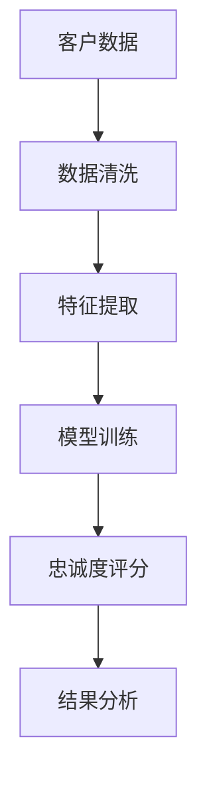
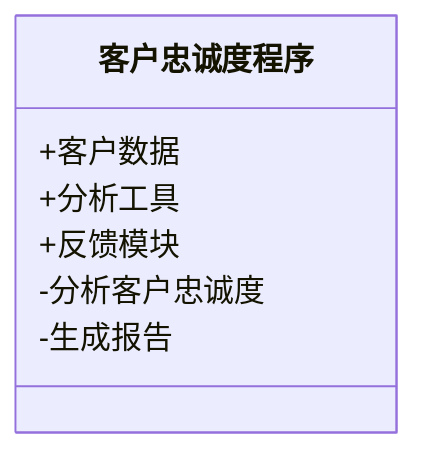
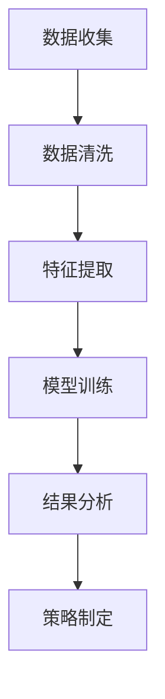
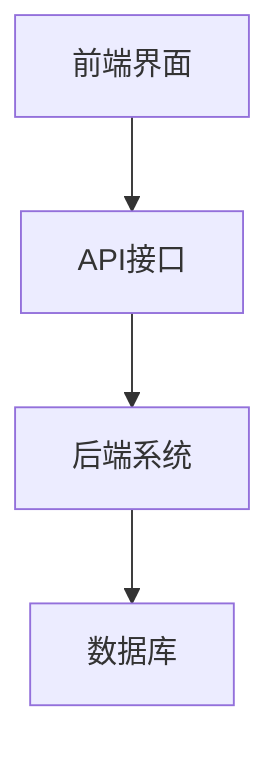

                 

# 彼得林奇如何分析公司的客户忠诚度程序

## 关键词：客户忠诚度、彼得林奇、分析方法、投资决策、程序评估

## 摘要：本文详细介绍了彼得林奇如何分析公司的客户忠诚度程序。通过定义和衡量客户忠诚度，分析客户忠诚度与企业财务表现的关系，探讨客户忠诚度程序的系统架构，并结合实际案例，展示如何通过客户忠诚度程序的分析来评估公司的投资价值。

---

## 第一部分: 客户忠诚度程序的背景与重要性

### 第1章: 客户忠诚度程序的定义与核心概念

#### 1.1 客户忠诚度程序的定义和演变

客户忠诚度程序是指企业通过各种手段和策略，增强客户对其品牌、产品或服务的忠诚度的一系列措施。这些措施可能包括会员计划、积分系统、个性化服务、忠诚度奖励等。客户忠诚度程序的演变经历了从简单的会员制度到复杂的数据分析驱动的个性化忠诚度管理的转变。

**核心概念：**
- **客户忠诚度**：客户对某一品牌或产品的长期支持和重复购买行为。
- **客户忠诚度程序**：企业通过系统化的方法和工具，提升客户忠诚度的策略和措施。

#### 1.2 客户忠诚度程序的重要性

客户忠诚度是企业长期成功的关键因素之一。 loyal customers为企业带来持续的收入和稳定的市场份额。此外，忠诚的客户通常愿意为产品支付更高的价格，推荐新客户，并在企业面临挑战时提供支持。

**关键点：**
- **客户忠诚度与企业绩效的关系**：忠诚客户通常为企业带来更高的利润和长期稳定性。
- **客户忠诚度程序的作用**：通过程序，企业可以系统地收集客户数据、分析客户行为，并制定针对性的营销策略。

### 第2章: 客户忠诚度的衡量与评估

#### 2.1 衡量客户忠诚度的指标

衡量客户忠诚度的关键指标包括：
1. **客户保留率**：客户在一段时间内继续购买产品或服务的比例。
2. **客户满意度（CSAT）**：客户对企业产品或服务的满意程度。
3. **净推荐值（NPS）**：客户推荐企业产品或服务给朋友或同事的意愿。
4. **客户生命周期价值（CLV）**：客户在其整个生命周期内为企业带来的总价值。

**公式：**
- 客户保留率 = （期初客户数 - 期末客户数） / 期初客户数
- 净推荐值 = 推荐客户的比例 - 指责客户的比例

#### 2.2 客户忠诚度的评估工具与方法

企业可以使用多种工具和方法来评估客户忠诚度，包括：
- **调查问卷**：通过收集客户反馈数据，分析客户满意度和忠诚度。
- **数据分析**：利用客户购买记录、浏览行为等数据，识别高忠诚度客户。
- **情感分析**：通过社交媒体和评论，分析客户对品牌的情感倾向。

**流程图：**

### 第3章: 客户忠诚度程序的系统架构

#### 3.1 系统构成

客户忠诚度程序的系统架构通常包括以下部分：
- **数据采集模块**：收集客户行为数据，如购买记录、浏览时间等。
- **数据分析模块**：对数据进行清洗、处理和分析，生成客户忠诚度评分。
- **反馈优化模块**：根据分析结果，制定提升客户忠诚度的策略。

**类图：**

---

## 第二部分: 客户忠诚度程序的分析框架

### 第4章: 客户忠诚度的分析框架

#### 4.1 分析步骤

1. **数据收集**：收集客户的基本信息、购买记录、反馈数据等。
2. **数据清洗**：处理缺失数据、异常值等，确保数据质量。
3. **特征提取**：提取关键特征，如购买频率、平均消费金额等。
4. **模型训练**：使用机器学习算法（如聚类分析、回归分析）预测客户忠诚度。
5. **结果分析**：根据模型输出，识别高忠诚度客户和潜在流失客户。

**流程图：**

### 第5章: 客户忠诚度程序的优化

#### 5.1 客户忠诚度程序的优化策略

1. **个性化服务**：根据客户特征，提供定制化的产品和服务。
2. **积分和奖励计划**：通过积分、折扣等方式，激励客户增加消费。
3. **客户反馈机制**：建立有效的客户反馈渠道，及时解决客户问题。

---

## 第三部分: 客户忠诚度程序的系统分析

### 第6章: 客户忠诚度程序的系统架构

#### 6.1 系统架构设计

客户忠诚度程序的系统架构通常包括以下组件：
- **前端界面**：客户访问的网页或移动应用。
- **后端系统**：处理数据存储、分析和计算。
- **数据库**：存储客户数据和交易记录。
- **API接口**：与其他系统（如CRM）集成。

**架构图：**

### 第7章: 客户忠诚度程序的优化与实施

#### 7.1 优化策略

1. **数据驱动的决策**：基于数据分析结果，制定精准的营销策略。
2. **技术驱动的创新**：利用人工智能和大数据技术，提升客户忠诚度分析的准确性。
3. **客户体验的提升**：通过个性化服务和高效的客户支持，增强客户满意度。

---

## 结论

通过本文的分析，我们可以看到，彼得林奇的客户忠诚度分析方法为企业提供了科学的工具和策略，帮助企业评估和提升客户忠诚度。这种方法不仅能够帮助企业在竞争激烈的市场中脱颖而出，还能为投资者提供可靠的投资决策依据。

---

## 参考文献

1. 彼得·林奇著，《彼得·林奇的成功投资法则》
2. 客户忠诚度相关学术论文和研究报告
3. 相关技术文档和工具说明

---

通过以上目录和内容的详细规划，我们可以系统地撰写出一篇高质量的技术博客文章，帮助读者深入理解彼得林奇如何分析公司的客户忠诚度程序，并将其应用于实际的投资分析中。

