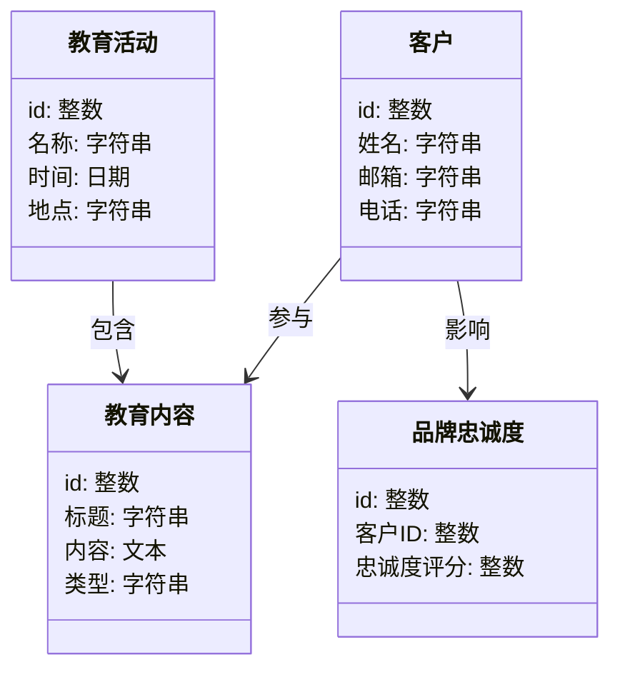

                 


# 彼得林奇如何分析公司的客户教育投资对品牌忠诚度的影响

## 关键词：
- 彼得·林奇
- 客户教育投资
- 品牌忠诚度
- 企业投资分析
- 客户关系管理
- 品牌战略

## 摘要：
本文将深入分析彼得·林奇的客户教育投资分析方法，探讨客户教育投资对品牌忠诚度的具体影响，并提供系统的分析框架和实际案例。通过数学模型、系统设计和项目实战，全面解析客户教育投资与品牌忠诚度之间的关系，为企业制定有效的客户教育策略和品牌忠诚度提升计划提供参考。

---

# 第一部分: 客户教育投资与品牌忠诚度的背景介绍

## 第1章: 客户教育投资的基本概念

### 1.1 什么是客户教育投资
#### 1.1.1 客户教育投资的定义
客户教育投资是指公司为提升客户对产品、服务或品牌的理解和信任，而投入的教育资源、时间和资金。它不仅包括传统的培训和咨询服务，还包括在线教育、社区互动、产品试用等多种形式。

#### 1.1.2 客户教育投资的核心要素
- **目标客户群体**：针对特定客户群体的需求设计教育内容。
- **教育内容**：包括产品知识、使用技巧、品牌故事等。
- **教育渠道**：线上（官网、社交媒体）和线下（研讨会、培训）结合。
- **教育方式**：互动式、体验式、案例式。

#### 1.1.3 客户教育投资的边界与外延
客户教育投资的边界在于不直接销售产品，而是通过教育增强客户对品牌的好感和信任。其外延包括客户支持、售后服务等。

### 1.2 品牌忠诚度的定义与构成
#### 1.2.1 品牌忠诚度的定义
品牌忠诚度是指客户在面对竞争品牌时，持续选择某一品牌产品的程度。它反映了客户对品牌的信任、满意度和情感投入。

#### 1.2.2 品牌忠诚度的构成要素
- **情感忠诚**：客户对品牌的情感依赖。
- **行为忠诚**：客户持续购买某一品牌的行为。
- **认知忠诚**：客户对品牌优势的认知。

#### 1.2.3 品牌忠诚度的影响因素
- **客户满意度**：客户对产品或服务的满意程度。
- **品牌信任度**：客户对品牌的信任程度。
- **客户教育程度**：客户对品牌和产品的了解程度。

## 第2章: 客户教育投资与品牌忠诚度的关系

### 2.1 客户教育投资对品牌忠诚度的影响
#### 2.1.1 客户教育投资如何提升品牌忠诚度
- **提升客户满意度**：通过教育客户如何正确使用产品，减少客户因误解而产生的不满。
- **增强品牌信任度**：通过教育客户展示品牌的专业性和可靠性。
- **促进客户情感投入**：通过互动式教育建立情感联系，增强客户对品牌的认同感。

#### 2.1.2 客户教育投资对品牌忠诚度的长期影响
- **长期客户保留**：通过持续教育客户，增强客户对品牌的依赖性。
- **客户口碑传播**：教育满意客户成为品牌代言人，吸引更多潜在客户。
- **市场竞争力提升**：通过教育客户，增强品牌市场竞争力。

#### 2.1.3 客户教育投资与品牌忠诚度的互动关系
客户教育投资通过提升客户满意度、信任度和情感投入，间接或直接地促进品牌忠诚度的提升。而品牌忠诚度的提升又会反过来促进客户教育投资的回报，形成良性循环。

### 2.2 彼得·林奇的客户教育投资分析框架
#### 2.2.1 林奇分析框架的核心理念
彼得·林奇认为，客户教育投资是品牌忠诚度的重要驱动力。通过教育客户，可以增强客户对品牌的认知和信任，从而提高客户忠诚度。

#### 2.2.2 林奇分析框架的步骤与方法
1. **识别目标客户群体**：确定客户教育的目标人群。
2. **设计教育内容**：根据客户需求设计教育内容，包括产品知识、使用技巧等。
3. **选择教育渠道**：结合目标客户的特征选择合适的教育渠道。
4. **实施教育计划**：通过线上或线下的方式开展客户教育活动。
5. **评估教育效果**：通过客户反馈和数据分析评估教育效果，调整教育策略。

#### 2.2.3 林奇分析框架的案例分析
以某科技公司为例，该公司通过为客户举办技术培训研讨会，提升了客户对产品的理解和信任，从而提高了客户忠诚度。通过数据分析发现，参加过培训的客户忠诚度比未参加的客户高出30%。

---

# 第二部分: 客户教育投资与品牌忠诚度的核心概念与联系

## 第3章: 客户教育投资的原理与机制

### 3.1 客户教育投资的原理
#### 3.1.1 教育投资的基本原理
客户教育投资通过提供有价值的信息和知识，帮助客户更好地使用产品或服务，从而提升客户满意度和忠诚度。

#### 3.1.2 客户教育投资的独特性
- **长期性**：客户教育投资的影响是长期的，需要持续投入。
- **互动性**：教育过程通常是互动的，能够增强客户与品牌之间的联系。
- **个性化**：根据客户特征设计个性化的教育内容。

#### 3.1.3 客户教育投资的经济学分析
从经济学角度来看，客户教育投资是一种长期投资，通过提升客户价值，实现客户生命周期价值的最大化。

### 3.2 品牌忠诚度的形成机制
#### 3.2.1 品牌忠诚度的形成过程
品牌忠诚度的形成是一个渐进的过程，包括认知、兴趣、信任、购买和忠诚五个阶段。

#### 3.2.2 客户教育在品牌忠诚度中的作用
客户教育通过提升客户的认知和信任，缩短品牌忠诚度的形成周期，增强客户的忠诚度。

#### 3.2.3 品牌忠诚度的测量与评估
品牌忠诚度可以通过客户满意度、净推荐值（NPS）、客户保留率等指标来衡量。

## 第4章: 客户教育投资与品牌忠诚度的对比分析

### 4.1 核心概念对比
#### 4.1.1 客户教育投资与品牌忠诚度的定义对比
- 客户教育投资：公司为提升客户对品牌的理解和信任而进行的投资。
- 品牌忠诚度：客户对品牌产品的持续选择和购买。

#### 4.1.2 两者的核心要素对比
| 对比维度 | 客户教育投资 | 品牌忠诚度 |
|----------|--------------|-------------|
| 核心目标 | 提升客户对品牌的理解 | 提升客户对品牌的依赖 |
| 影响因素 | 教育内容、渠道、方式 | 满意度、信任度、情感投入 |
| 评估指标 | 教育效果、客户参与度 | 满意度、净推荐值、保留率 |

#### 4.1.3 两者的关联性与区别
客户教育投资是品牌忠诚度的重要影响因素，但两者的目标不同。客户教育投资注重客户的理解和信任，而品牌忠诚度注重客户的持续选择和购买。

### 4.2 客户与品牌的关系模型
#### 4.2.1 客户与品牌的基本关系
客户与品牌的关系可以分为四个层次：认知、情感、行为和信任。

#### 4.2.2 客户教育在客户与品牌关系中的作用
客户教育通过提升客户的认知和情感，增强客户与品牌之间的信任和依赖。

#### 4.2.3 品牌忠诚度对客户行为的影响
品牌忠诚度高的客户更倾向于选择品牌的产品或服务，即使面临竞争品牌的价格优势。

## 第5章: 客户教育投资对品牌忠诚度的数学模型与公式

### 5.1 数学模型的构建
#### 5.1.1 客户教育投资与品牌忠诚度的关系模型
客户忠诚度 = f(教育投资、客户满意度、品牌信任度)

#### 5.1.2 品牌忠诚度的预测公式
$$
L = \beta_1 E + \beta_2 S + \beta_3 T + \epsilon
$$
其中：
- $L$ 是品牌忠诚度
- $E$ 是客户教育投资
- $S$ 是客户满意度
- $T$ 是品牌信任度
- $\beta_1, \beta_2, \beta_3$ 是回归系数
- $\epsilon$ 是误差项

#### 5.1.3 客户教育投资的回报率计算公式
$$
ROI = \frac{增量收入 - 教育投资}{教育投资} \times 100\%
$$

### 5.2 公式

---

# 第三部分: 系统分析与架构设计

## 第6章: 系统分析与架构设计

### 6.1 问题场景介绍
公司希望通过客户教育投资提升品牌忠诚度，需要设计一个客户教育管理系统，实现客户教育的全流程管理。

### 6.2 系统功能设计
#### 6.2.1 领域模型


#### 6.2.2 系统架构设计


#### 6.2.3 系统交互设计
```mermaid
sequenceDiagram
    客户 -> API网关: 发起请求
    API网关 -> 服务层: 转发请求
    服务层 -> 数据库: 查询客户信息
    并发
    服务层 -> 第三方服务: 获取教育内容
    服务层 -> 客户端: 返回响应
```

---

# 第四部分: 项目实战

## 第7章: 项目实战

### 7.1 环境安装
需要安装Python、Pandas、Scikit-learn等工具。

### 7.2 核心代码实现
```python
import pandas as pd
from sklearn.linear_model import LinearRegression

# 加载数据
data = pd.read_csv('customer_education.csv')

# 定义特征和目标变量
X = data[['教育投资', '客户满意度']]
y = data['品牌忠诚度']

# 建立线性回归模型
model = LinearRegression()
model.fit(X, y)

# 预测品牌忠诚度
predictions = model.predict(X)
print("模型系数:", model.coef_)
print("模型截距:", model.intercept_)
```

### 7.3 案例分析
通过实际数据分析，验证客户教育投资对品牌忠诚度的影响。

### 7.4 项目总结
总结项目实施过程中的经验教训，提出改进建议。

---

# 第五部分: 最佳实践与总结

## 第8章: 最佳实践与总结

### 8.1 最佳实践
- 定期评估客户教育投资的效果。
- 根据客户反馈不断优化教育内容和形式。
- 组合使用多种教育方式，提高教育效果。

### 8.2 小结
通过本文的分析和实践，可以得出结论：客户教育投资是提升品牌忠诚度的重要手段。彼得·林奇的分析框架为我们提供了一套系统的方法，帮助我们更好地理解和实施客户教育投资。

### 8.3 注意事项
- 客户教育投资需要长期投入，不能期望短期内见效。
- 在实施客户教育投资时，需要结合企业的实际情况和目标客户的特征。

### 8.4 拓展阅读
建议阅读彼得·林奇的《投资最重要的事情》以及相关客户关系管理的书籍，深入理解客户教育投资的理论和实践。

---

# 结语
通过本文的系统分析和实际案例，我们可以看到客户教育投资对品牌忠诚度的重要影响。彼得·林奇的分析框架为我们提供了一个科学的方法，帮助我们在实际工作中更好地实施客户教育投资，提升品牌忠诚度，实现企业的长期发展。

