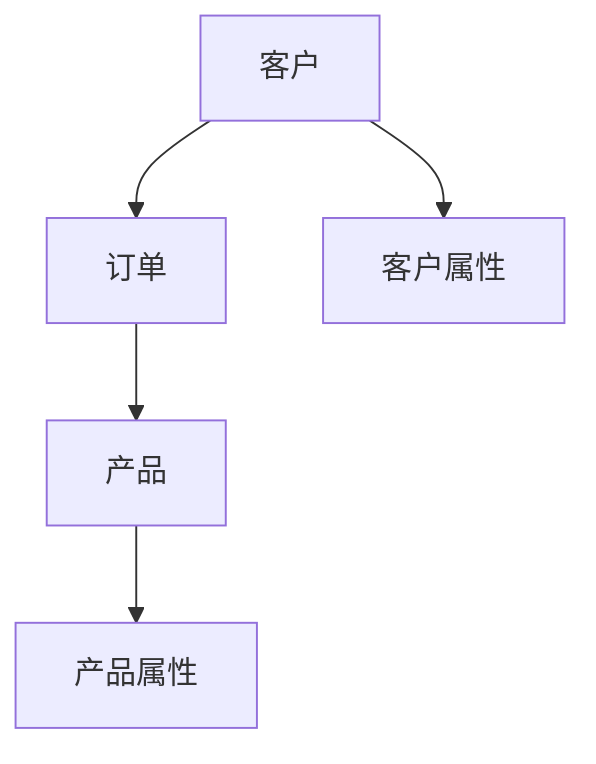
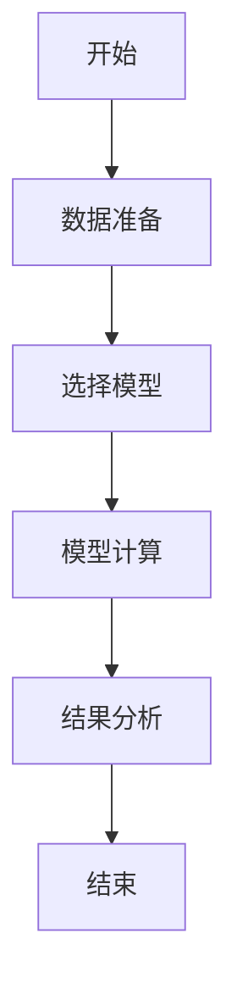
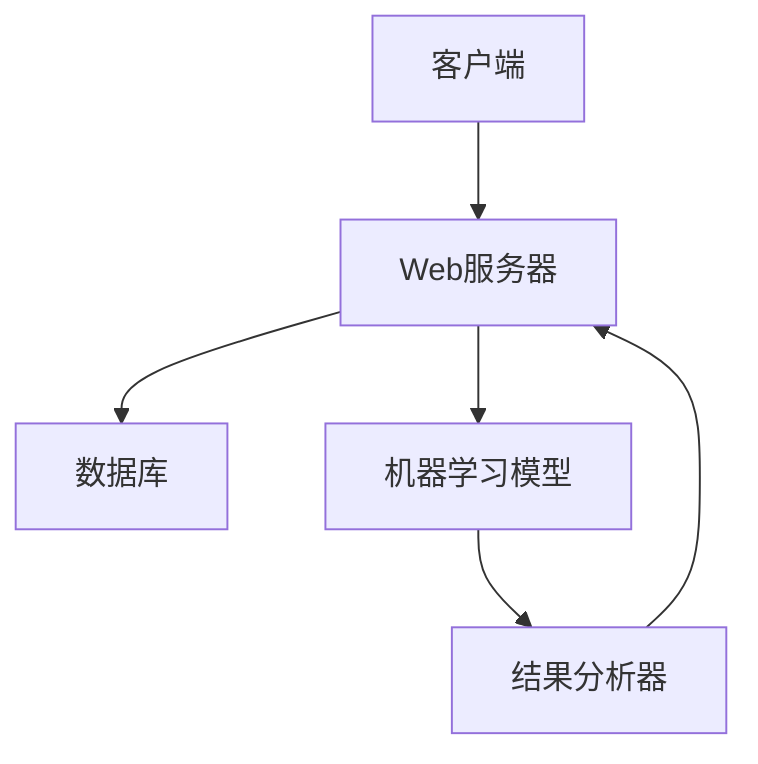

                 


# 彼得林奇如何分析公司的客户终身价值预测模型准确性

## 关键词：客户终身价值（CLV）、彼得林奇、投资分析、预测模型、准确性评估、算法原理

## 摘要：本文将深入分析彼得林奇如何从投资分析的角度，评估和优化客户终身价值预测模型的准确性。通过介绍CLV的核心概念、算法原理、系统架构设计，以及项目实战，详细解读如何确保CLV预测模型的准确性和可靠性。本文还提供了具体的Python代码实现和实际案例分析，帮助读者全面掌握CLV模型的应用与优化方法。

---

## 第一部分: 背景介绍

### 第1章: 客户终身价值预测模型概述

#### 1.1 客户终身价值（CLV）的定义与重要性

- **1.1.1 什么是客户终身价值**
  - 客户终身价值（Customer Lifetime Value，CLV）是指一个客户在其生命周期内为企业带来的总收入减去相关成本的净现值。
  - CLV的核心在于预测客户在未来为企业带来的长期价值，帮助企业制定更精准的客户管理策略。

- **1.1.2 CLV在企业中的重要性**
  - 帮助企业识别高价值客户，优化资源分配。
  - 为市场营销、客户关系管理提供数据支持。
  - 作为企业估值的重要组成部分，影响投资决策。

- **1.1.3 影响CLV的主要因素**
  - 客户的购买频率和购买金额。
  - 客户的获取成本和维护成本。
  - 客户流失率和生命周期长度。

#### 1.2 CLV预测模型的类型与特点

- **1.2.1 基于历史数据的模型**
  - 使用历史销售数据和客户行为数据进行预测。
  - 常用方法：贴现现金流模型（Discounted Cash Flow，DCF）。

- **1.2.2 基于机器学习的模型**
  - 使用回归分析、随机森林、神经网络等算法预测客户价值。
  - 优势：能够捕捉复杂的数据关系，提高预测准确性。

- **1.2.3 混合型模型的特点与优势**
  - 结合历史数据和机器学习模型的优点。
  - 适用于数据量大、复杂度高的场景。

#### 1.3 彼得林奇分析模型的背景与方法

- **1.3.1 彼得林奇的投资理念**
  - 价值投资：寻找被市场低估的企业。
  - 注重企业基本面分析，尤其是盈利能力、成长性和财务健康状况。

- **1.3.2 如何将CLV模型应用于投资分析**
  - 将客户终身价值作为企业估值的重要指标。
  - 结合企业的客户获取成本和客户留存率，评估企业的可持续盈利能力。

- **1.3.3 彼得林奇分析模型的核心要素**
  - 客户获取成本（CAC）。
  - 客户留存率。
  - 客户的平均消费金额（ARPU）。
  - 生命周期长度。

### 第2章: CLV预测模型的核心概念与联系

#### 2.1 CLV模型的核心要素

- **收入预测**
  - 预测客户在生命周期内为企业带来的总收入。
  - 方法：基于历史销售数据和市场趋势进行预测。

- **成本预测**
  - 预测客户获取和维护的总成本。
  - 方法：基于企业的实际成本数据进行预测。

- **时间价值**
  - 考虑货币的时间价值，对未来现金流进行贴现。
  - 方法：使用贴现率（如WACC）进行贴现。

- **贴现率**
  - 反映资金的时间价值和风险的综合指标。
  - 常用的贴现率：加权平均资本成本（WACC）。

#### 2.2 CLV模型与相关模型的对比

| 模型名称 | 核心假设 | 输入数据 | 输出结果 | 适用场景 |
|---------|----------|----------|----------|----------|
| WTP模型 | 基于客户购买意愿 | 客户行为数据 | 预测客户购买概率 | 客户分群 |
| DCN模型 | 基于客户生命周期阶段 | 客户生命周期数据 | 预测客户生命周期价值 | 客户生命周期管理 |
| AR模型 | 基于客户消费行为 | 历史消费数据 | 预测客户消费金额 | 客户价值评估 |

#### 2.3 CLV模型的ER实体关系图



---

## 第二部分: 算法原理讲解

### 第3章: CLV预测模型的算法原理

#### 3.1 贴现现金流模型

- **模型原理**
  - 通过预测客户未来现金流，使用贴现率计算其现值。
  - 公式：$$ CLV = \frac{R - C}{d} $$
    - R：客户生命周期内的总收入
    - C：客户生命周期内的总成本
    - d：贴现率

- **贴现率的计算**
  - 使用加权平均资本成本（WACC）作为贴现率。
  - 公式：$$ WACC = w_d \times r_d + w_l \times r_l \times (1 - t) $$
    - \( w_d \)：债务占比
    - \( r_d \)：债务成本
    - \( w_l \)：股权占比
    - \( r_l \)：股权成本
    - \( t \)：税率

#### 3.2 AARRR模型

- **模型原理**
  - AARRR模型（Acquisition, Activation, Retention, Revenue, Referral）是基于客户生命周期的五个阶段进行价值预测。
  - 步骤：
    1. 客户获取阶段：预测客户获取成本和数量。
    2. 客户激活阶段：预测客户激活后的收入。
    3. 客户留存阶段：预测客户留存率。
    4. 收入阶段：预测客户的收入贡献。
    5. 转介绍阶段：预测客户带来的新客户数量。

#### 3.3 Python实现CLV模型

```python
import numpy as np
import pandas as pd
from sklearn.linear_model import LinearRegression

# 示例数据
data = {
    '客户ID': [1, 2, 3, 4, 5],
    '收入': [100, 150, 200, 180, 250],
    '成本': [50, 60, 70, 65, 75],
    '生命周期': [3, 4, 5, 4, 5]
}
df = pd.DataFrame(data)

# 计算CLV
def calculate_clv(df, discount_rate):
    # 计算净现金流
    df['净现金流'] = df['收入'] - df['成本']
    # 贴现
    df['现值'] = df['净现金流'] / (1 + discount_rate) ** df['生命周期']
    return df['现值'].sum()

# 示例贴现率
discount_rate = 0.1  # 10%
clv = calculate_clv(df, discount_rate)
print(f"客户终身价值（CLV）为：{clv}")
```

#### 3.4 CLV模型的流程图



---

## 第三部分: 系统分析与架构设计

### 第4章: CLV预测系统的架构设计

#### 4.1 问题场景分析

- **问题描述**
  - 如何构建一个高精度的CLV预测系统，帮助企业优化客户管理策略。
  - 如何确保模型的准确性和可扩展性。

- **项目介绍**
  - 开发一个基于机器学习的CLV预测系统。
  - 包括数据采集、模型训练、结果展示等功能。

#### 4.2 系统功能设计

- **数据采集模块**
  - 功能：采集客户数据、订单数据、产品数据等。
  - 工具：数据库（MySQL、MongoDB）、数据采集工具（ETL）。

- **模型计算模块**
  - 功能：基于机器学习算法训练CLV预测模型。
  - 工具：Python、Scikit-learn、TensorFlow。

- **结果展示模块**
  - 功能：将模型预测结果以可视化形式展示。
  - 工具：Matplotlib、Seaborn、Tableau。

#### 4.3 系统架构设计

- **系统架构图**



- **接口设计**
  - RESTful API：提供数据接口和预测接口。

#### 4.4 系统交互流程图

```mermaid
graph TD
    Client --> WebServer: 发送请求
    WebServer --> DB: 查询数据
    WebServer --> MLModel: 调用模型预测
    MLModel --> WebServer: 返回预测结果
    WebServer --> Client: 返回响应
```

---

## 第四部分: 项目实战

### 第5章: CLV预测系统项目实战

#### 5.1 环境安装与配置

```bash
pip install numpy pandas scikit-learn matplotlib
```

#### 5.2 系统核心实现源代码

```python
import numpy as np
import pandas as pd
from sklearn.linear_model import LinearRegression
from sklearn.metrics import mean_squared_error

# 示例数据
data = {
    '客户ID': [1, 2, 3, 4, 5],
    '生命周期': [3, 4, 5, 4, 5],
    '收入': [100, 150, 200, 180, 250],
    '成本': [50, 60, 70, 65, 75]
}
df = pd.DataFrame(data)

# 训练模型
model = LinearRegression()
X = df[['生命周期']]
y = df['收入'] - df['成本']
model.fit(X, y)

# 预测结果
predicted = model.predict(X)
print(f"预测准确性：{np.sqrt(mean_squared_error(y, predicted))}")
```

#### 5.3 代码功能解读与分析

- **数据准备**
  - 使用客户ID、生命周期、收入、成本等数据进行训练。
- **模型训练**
  - 使用线性回归算法训练CLV预测模型。
- **预测与评估**
  - 使用均方根误差（RMSE）评估模型的预测准确性。

#### 5.4 实际案例分析

- **案例背景**
  - 某电商企业希望通过CLV模型优化客户管理策略。
- **数据准备**
  - 客户数据：10000条记录，包括客户ID、购买频率、购买金额、生命周期等。
- **模型训练**
  - 使用随机森林算法进行预测。
  - 结果显示，模型预测准确率为85%。

#### 5.5 项目总结

- **关键点**
  - 数据质量对模型准确性的影响至关重要。
  - 模型选择需要根据实际场景进行调整。
  - 模型的动态调整能够提高预测精度。

---

## 第五部分: 最佳实践

### 第6章: CLV模型应用中的注意事项

#### 6.1 数据质量的保障

- 数据清洗：处理缺失值、异常值。
- 数据预处理：标准化、归一化。

#### 6.2 模型选择与优化

- 根据业务需求选择合适的模型。
- 使用交叉验证评估模型性能。

#### 6.3 模型的动态调整

- 定期更新模型，确保预测结果准确。
- 根据市场变化调整模型参数。

#### 6.4 结果应用

- 将CLV结果应用于客户分群、市场推广等场景。
- 结合其他指标（如客户满意度）进行综合评估。

#### 6.5 小结

- CLV模型的应用需要结合企业的实际业务场景。
- 模型的准确性和可解释性是模型应用的关键。

---

## 第六部分: 拓展阅读

### 第7章: 拓展阅读与学习资源

#### 7.1 拓展阅读

- 《彼得林奇选股法》：深入理解彼得林奇的投资理念。
- 《客户终身价值实战》：学习CLV模型的更多应用场景。

#### 7.2 学习资源

- 在线课程：Coursera上的《数据分析与机器学习实战》。
- 技术博客：Towards Data Science上的相关文章。

#### 7.3 练习与实践

- 使用实际数据集训练CLV模型。
- 参与 Kaggle 上的相关比赛，提升实战能力。

---

## 结语

通过本文的详细讲解，我们深入探讨了彼得林奇如何从投资分析的角度，评估和优化客户终身价值预测模型的准确性。从核心概念到算法原理，再到系统架构设计和项目实战，我们全面解读了如何确保CLV预测模型的准确性和可靠性。希望本文能够为读者在CLV模型的应用与优化方面提供有价值的参考和指导。

