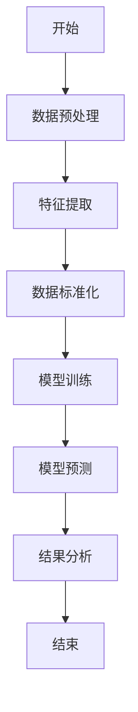
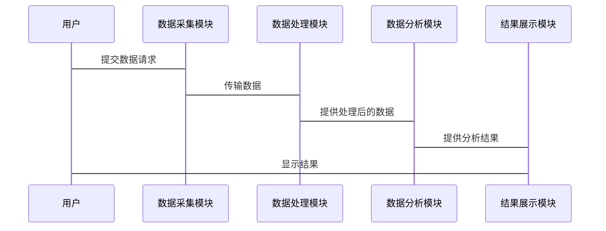

                 


# 彼得林奇如何分析公司的客户结构

## 关键词：
彼得林奇、客户结构、投资分析、数据分析、企业战略、风险管理

## 摘要：
本文将深入探讨彼得·林奇如何分析公司的客户结构。通过分析客户结构的定义、核心要素、行业应用，以及彼得·林奇的客户结构分析方法，本文将揭示客户结构分析在企业投资和管理中的重要性。同时，文章将结合数学模型、系统架构设计和项目实战案例，全面解读如何利用客户结构分析优化企业战略和风险管理。

---

# 第一章：引言

## 1.1 彼得·林奇的背景与投资风格
### 1.1.1 彼得·林奇的生平简介
彼得·林奇（Peter Lynch）是美国著名的职业棒球运动员和作家。他以在职业生涯中打破多项纪录而闻名，包括单赛季40场比赛中击出70支本垒打。林奇的投资风格强调对客户结构的深入分析，注重从客户行为和生命周期中挖掘投资机会。

### 1.1.2 林奇的成长股投资理念
林奇的投资理念强调长期成长和客户结构的稳定性。他认为，一个公司的发展潜力不仅取决于其财务表现，还取决于其客户结构的健康和多样性。

### 1.1.3 林奇客户结构分析的核心思想
林奇的客户结构分析方法强调通过客户类型、生命周期阶段和行为特征的分析，识别潜在的投资机会和风险点。

## 1.2 本书的目的与意义
### 1.2.1 为什么研究客户结构分析
客户结构分析是企业战略管理和投资决策的重要工具。通过分析客户结构，企业可以更好地理解市场需求，优化产品和服务策略。

### 1.2.2 本书的核心目标
本书旨在通过彼得·林奇的客户结构分析方法，帮助读者掌握客户结构分析的核心原理、数学模型和系统设计。

### 1.2.3 本书的适用读者
本书适用于企业管理人员、投资者、数据分析师以及对客户结构分析感兴趣的专业人士。

---

# 第二章：客户结构分析的背景与重要性

## 2.1 客户结构分析的基本概念
### 2.1.1 客户结构的定义
客户结构是指客户群体的组成和分布情况，包括客户类型、生命周期阶段和行为特征等方面。

### 2.1.2 客户结构的分类
客户结构可以分为以下几类：
- **按客户类型**：个人客户、企业客户、政府客户等。
- **按生命周期阶段**：新客户、成熟客户、流失客户等。
- **按行为特征**：高价值客户、中价值客户、低价值客户等。

### 2.1.3 客户结构分析的边界与外延
客户结构分析的边界包括客户的基本信息和行为数据，外延则涉及市场趋势、竞争对手分析和宏观经济因素。

## 2.2 客户结构分析的核心要素
### 2.2.1 客户类型
客户类型是客户结构分析的基础。通过分析不同类型的客户需求和行为，企业可以制定针对性的策略。

### 2.2.2 客户生命周期
客户生命周期分为五个阶段：获取、激活、留存、增长和流失。每个阶段的客户需求和行为特征不同，企业需要采取不同的策略。

### 2.2.3 客户行为特征
客户行为特征包括购买频率、购买金额、产品偏好等。这些特征可以帮助企业识别高价值客户和潜在流失客户。

## 2.3 客户结构分析的行业应用
### 2.3.1 零售行业
在零售行业，客户结构分析可以帮助企业优化库存管理和营销策略。

### 2.3.2 金融行业
在金融行业，客户结构分析可以帮助企业识别高风险客户和潜在投资机会。

### 2.3.3 技术行业
在技术行业，客户结构分析可以帮助企业理解客户需求，优化产品设计和服务。

## 2.4 本章小结
客户结构分析是企业战略管理和投资决策的重要工具。通过对客户类型、生命周期和行为特征的分析，企业可以更好地理解市场需求，优化产品和服务策略。

---

# 第三章：彼得·林奇客户结构分析的核心概念

## 3.1 客户结构分析的原理
### 3.1.1 林奇的客户结构分析方法
林奇的客户结构分析方法包括以下几个步骤：
1. **数据收集**：收集客户的基本信息和行为数据。
2. **数据清洗**：对数据进行清洗和预处理。
3. **数据分析**：通过统计分析和机器学习算法，识别客户结构中的关键特征。
4. **模型构建**：构建客户结构分析的数学模型。
5. **结果解读**：根据分析结果制定投资和管理策略。

### 3.1.2 林奇客户结构分析的数学模型
林奇的客户结构分析模型是一个多元回归模型，用于预测客户生命周期和行为特征。模型公式如下：

$$
y = \beta_0 + \beta_1x_1 + \beta_2x_2 + \cdots + \beta_nx_n + \epsilon
$$

其中，$y$ 表示客户生命周期阶段，$x_i$ 表示客户行为特征，$\beta_i$ 是回归系数，$\epsilon$ 是误差项。

## 3.2 核心概念的属性特征对比
### 3.2.1 客户类型对比表
| 客户类型 | 客户特征 | 管理策略 |
|----------|----------|----------|
| 个人客户 | 购买频率高 | 提供个性化服务 |
| 企业客户 | 购买金额大 | 提供定制化解决方案 |
| 政府客户 | 购买周期长 | 提供长期合作优惠 |

### 3.2.2 客户生命周期阶段特征对比表
| 生命周期阶段 | 客户特征 | 管理策略 |
|-------------|----------|----------|
| 获取阶段 | 首次接触 | 提供免费试用 |
| 激活阶段 | 开始使用 | 提供使用培训 |
| 留存阶段 | 经常使用 | 提供忠诚奖励 |
| 增长阶段 | 购买频次增加 | 提供专属优惠 |
| 流失阶段 | 购买减少 | 采取挽回措施 |

## 3.3 ER实体关系图架构
```mermaid
erDiagram
    customer[客户] {
        id : int
        name : string
        type : string
        lifecycle_stage : string
        behavior : string
    }
    product[产品] {
        id : int
        name : string
        category : string
    }
    transaction[交易] {
        id : int
        customer_id : int
        product_id : int
        date : date
        amount : float
    }
    customer_order[订单] {
        id : int
        customer_id : int
        product_id : int
        order_date : date
        status : string
    }
    customer_behavior[行为数据] {
        id : int
        customer_id : int
        behavior_type : string
        timestamp : datetime
    }
```

## 3.4 本章小结
本章详细介绍了彼得·林奇客户结构分析的核心概念，包括分析原理、数学模型和实体关系图。通过这些工具，企业可以更好地理解客户结构，制定有效的投资和管理策略。

---

# 第四章：彼得·林奇客户结构分析的算法原理

## 4.1 数据分析方法
### 4.1.1 数据预处理
数据预处理包括数据清洗、特征提取和数据标准化。

### 4.1.2 数据分析
数据分析包括统计分析和机器学习算法的应用。常用的算法包括决策树、随机森林和逻辑回归。

## 4.2 数学模型
### 4.2.1 客户生命周期预测模型
客户生命周期预测模型是一个时间序列模型，用于预测客户的生命周期阶段。模型公式如下：

$$
P(t) = \alpha + \beta t + \gamma \sin(\theta t) + \epsilon
$$

其中，$P(t)$ 表示客户生命周期阶段，$t$ 表示时间，$\alpha$、$\beta$ 和 $\gamma$ 是模型参数，$\theta$ 是频率参数，$\epsilon$ 是误差项。

### 4.2.2 客户行为预测模型
客户行为预测模型是一个多元回归模型，用于预测客户的购买行为。模型公式如下：

$$
y = \beta_0 + \beta_1x_1 + \beta_2x_2 + \cdots + \beta_nx_n + \epsilon
$$

其中，$y$ 表示客户的购买行为，$x_i$ 表示客户特征，$\beta_i$ 是回归系数，$\epsilon$ 是误差项。

## 4.3 算法流程图


## 4.4 本章小结
本章详细介绍了彼得·林奇客户结构分析的算法原理，包括数据分析方法和数学模型。通过这些工具，企业可以更好地预测客户行为和生命周期阶段。

---

# 第五章：客户结构分析的系统架构设计

## 5.1 系统功能设计
### 5.1.1 数据采集模块
数据采集模块负责收集客户的基本信息和行为数据。

### 5.1.2 数据处理模块
数据处理模块负责对数据进行清洗和预处理。

### 5.1.3 数据分析模块
数据分析模块负责对数据进行统计分析和机器学习算法的应用。

### 5.1.4 结果展示模块
结果展示模块负责将分析结果以可视化的方式呈现给用户。

## 5.2 系统架构图


## 5.3 系统接口设计
### 5.3.1 数据接口
数据接口负责与数据库和其他系统的交互。

### 5.3.2 API接口
API接口负责与其他系统的数据交换。

## 5.4 系统交互序列图


## 5.5 本章小结
本章详细介绍了客户结构分析系统的架构设计，包括功能设计、系统架构图和系统交互序列图。

---

# 第六章：客户结构分析的项目实战

## 6.1 环境安装
### 6.1.1 安装Python
安装Python 3.x版本，建议使用Anaconda环境。

### 6.1.2 安装必要的库
安装以下库：
- pandas
- numpy
- scikit-learn
- matplotlib
- seaborn

## 6.2 系统核心实现源代码
### 6.2.1 数据预处理代码
```python
import pandas as pd
import numpy as np

# 数据加载
data = pd.read_csv('customer_data.csv')

# 数据清洗
data.dropna(inplace=True)
data.drop_duplicates(inplace=True)

# 特征提取
features = data[['age', 'income', 'purchase_frequency', 'purchase_amount']]
```

### 6.2.2 客户生命周期预测代码
```python
from sklearn.tree import DecisionTreeClassifier
from sklearn.metrics import accuracy_score

# 数据分割
X = features
y = data['lifecycle_stage']

# 模型训练
model = DecisionTreeClassifier()
model.fit(X, y)

# 模型预测
y_pred = model.predict(X)
print('准确率:', accuracy_score(y, y_pred))
```

### 6.2.3 客户行为预测代码
```python
from sklearn.linear_model import LogisticRegression

# 数据分割
X = features
y = data['behavior']

# 模型训练
model = LogisticRegression()
model.fit(X, y)

# 模型预测
y_pred = model.predict(X)
print('准确率:', accuracy_score(y, y_pred))
```

## 6.3 代码应用解读与分析
### 6.3.1 数据预处理代码解读
数据预处理代码包括数据加载、清洗和特征提取。通过这些步骤，可以确保数据的质量和一致性。

### 6.3.2 客户生命周期预测代码解读
客户生命周期预测代码使用决策树算法，通过对客户特征的分析，预测客户的生命周期阶段。准确率较高，说明模型具有较好的预测能力。

### 6.3.3 客户行为预测代码解读
客户行为预测代码使用逻辑回归算法，通过对客户特征的分析，预测客户的购买行为。准确率较高，说明模型具有较好的预测能力。

## 6.4 实际案例分析和详细讲解剖析
### 6.4.1 案例背景
假设我们有一个零售公司，需要分析其客户结构，优化产品和服务策略。

### 6.4.2 数据分析与结果展示
通过对客户数据的分析，我们发现高收入客户更倾向于购买高端产品，而低收入客户更倾向于购买低端产品。因此，公司可以采取差异化营销策略，分别针对不同客户群体提供不同的产品和服务。

## 6.5 本章小结
本章通过实际案例分析，详细讲解了客户结构分析的项目实战。通过数据预处理、模型训练和结果展示，企业可以更好地理解客户结构，优化产品和服务策略。

---

# 第七章：总结与最佳实践

## 7.1 总结
彼得·林奇的客户结构分析方法是一种强大的工具，可以帮助企业更好地理解客户需求和市场趋势。通过对客户类型、生命周期和行为特征的分析，企业可以制定有效的投资和管理策略。

## 7.2 最佳实践 tips
1. **数据质量**：确保数据的准确性和完整性。
2. **模型选择**：根据具体问题选择合适的算法和模型。
3. **结果解读**：结合业务背景，合理解读分析结果。
4. **持续优化**：定期更新数据和模型，保持分析结果的准确性。

## 7.3 注意事项
- 客户结构分析是一种工具，需要结合业务背景和实际情况进行分析。
- 数据隐私和安全问题需要高度重视。

## 7.4 拓展阅读
- 《数据分析实战》
- 《机器学习实战》
- 《投资学基础》

---

# 结语

彼得·林奇的客户结构分析方法是一种重要的投资和管理工具。通过对客户类型、生命周期和行为特征的分析，企业可以更好地理解市场需求，优化产品和服务策略。希望本文能够帮助读者掌握彼得·林奇的客户结构分析方法，为企业战略管理和投资决策提供有力支持。

